```{r setup, include=FALSE}
options(htmltools.dir.version = FALSE)
```

# Introducción 


* El *Centro de Estudios de Conflicto y Cohesión Social (COES)*, es un centro financiado por el programa FONDAP de CONICYT, que tiene el propósito de generar investigación científica de punta, formar capital humano avanzado y contribuir al desarrollo de políticas públicas. 

---
# Introducción 

* Responde a 5ta convocatoria FONDAP 2013:

  #### *"El país exhibe índices de conflictividad social que son preocupantes para una sociedad que desea avanzar rápidamente hacia el desarrollo. Se propone conformar un grupo multidisciplinario de alcance nacional en el área de las ciencias sociales y humanidades que se aboque a la investigación de los conflictos sociales, sus formas y bases culturales, con miras a mejorar el clima de convivencia nacional. La investigación debiera contribuir a generar conocimiento y propuestas de acción que promuevan una mejor calidad de vida, la integración social y cultural de los ciudadanos y la generación de espacios para la búsqueda de diálogos y consensos. Se valorará la colaboración efectiva con centros internacionales en la temática".*

---
class: middle 

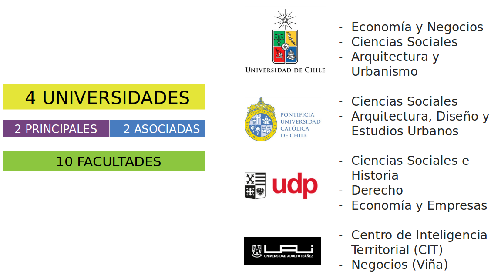
---
# Propuesta

<br>

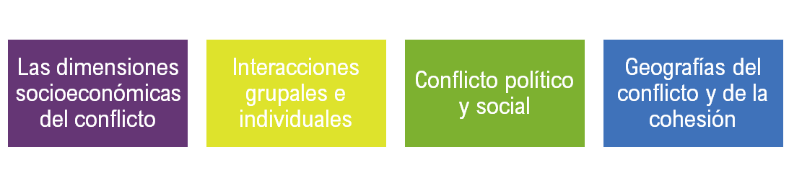

---
### Propuesta (2.0)

.center2[
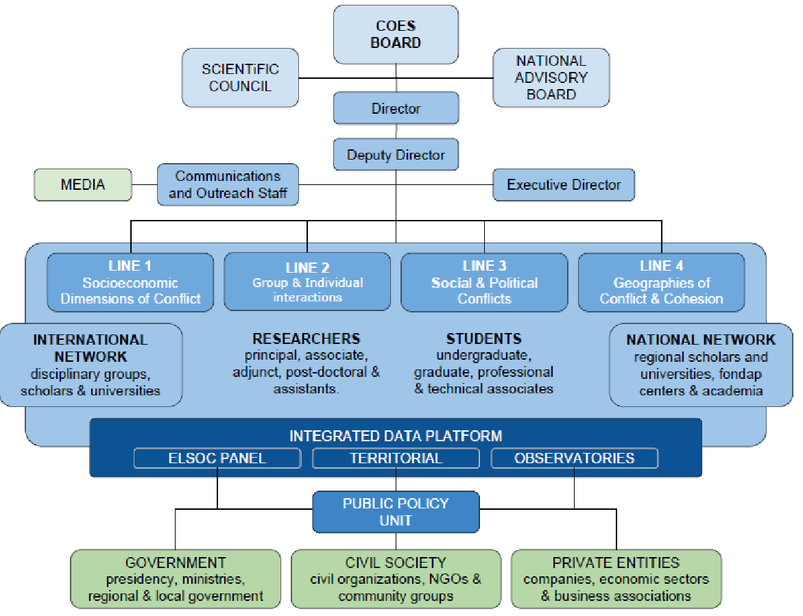

]

---
# Ciclo

<br>
<br>
<br>
.center[

]


---

## Diversas instancias para medicion de la cohesión y el conflicto social
 
 <br>
.center2[

]


Entre otros proyectos del Centro se encuentra el **Observatorio de Huelgas Laborales** y el Observatorio de Calidad del Empleo.

---
class:  middle, center

# **Midiendo cohesión y conflicto social** 

---
# Experiencias Internacionales

* Para la medición de la cohesión social en Chile se han revisado una serie de experiencias internacionales de tipo transnacional y a nivel país

.center2[

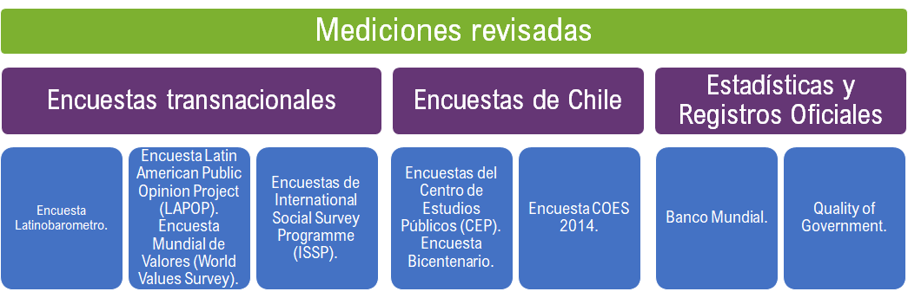 
]

---
## Experiencias internacionales 
.center2[

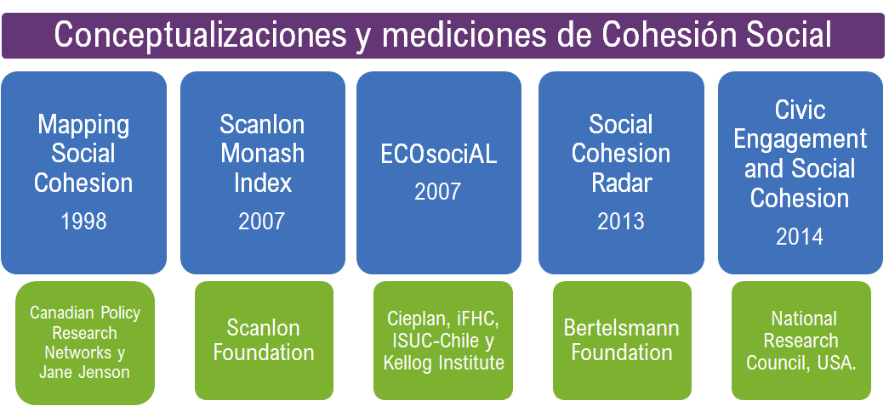
]
---
## Experiencias internacionales 

.pull-left[

.center2[#### Mapping Social Cohesion 

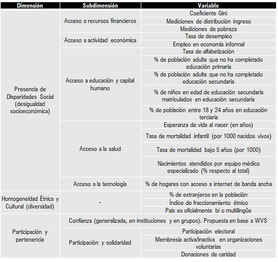]
]

.pull-right[

.center2[
#### Scanlon Monash Index
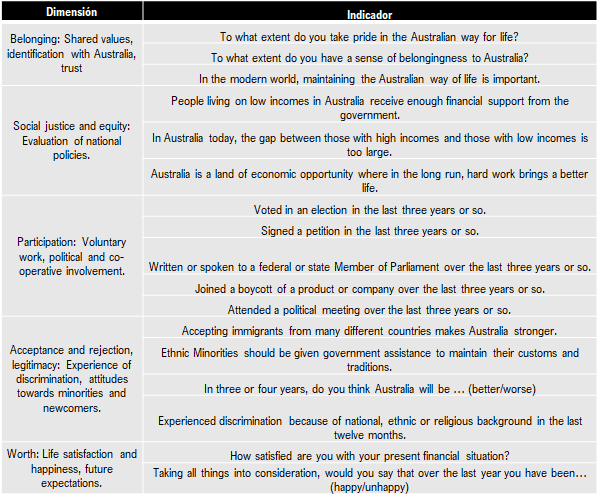
]

]
 
---
## Experiencias internacionales

.pull-left[
.center2[
#### Social Cohesion Radar
 

]]

.pull-right[

.center2[
#### Civic Engagement and Social Cohesion


]
]

---
## Experiencias internacionales

.center2[

#### ECOsociAL

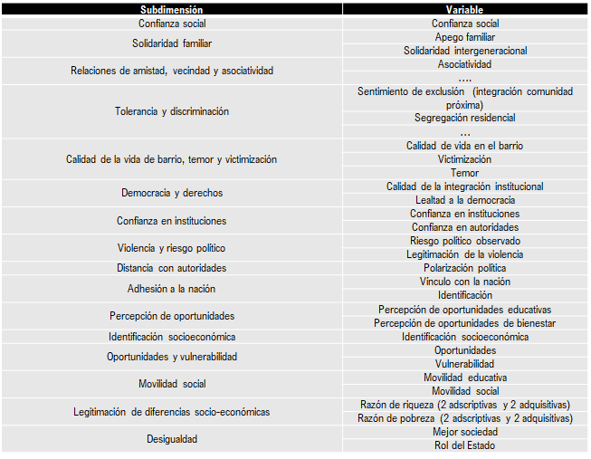
]
---
## Propuesta conceptual COES
.center2[
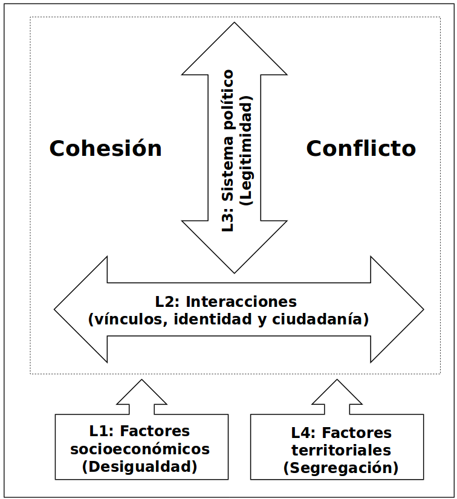
]

---
class: middle, center

# **Datos COES**

---
class: center, middle 

# Estudio Longitudinal Social de Chile


---

### Encuesta ELSOC
#### Propósito del estudio


.left-column[

* El Estudio Longitudinal Social de Chile (ELSOC) **es una encuesta panel y representativa de la población nacional urbana**. Ha sido diseñado para  evaluar **cómo piensan, sienten y se comportan casi 3000 chilenos a lo largo de una década.**

* Entre otros temas, se busca analizar la percepción que tienen las personas acerca del barrio o la comunidad en que habitan; las formas que adopta la participación ciudadana y la actividad política formal, las actitudes hacia la democracia, las conductas pro-sociales, las actitudes hacia los inmigrantes, desigualdad económica, empleo, caracterización socioeconómica, entre otros


]

.right-column[

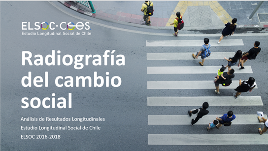

]

---

### Encuesta ELSOC
#### Aspectos Metodológios


* Encuesta de tipo **panel**.
* **Muestreo estratificado** (por tamaño de ciudades) y multietápico (aleatorio en todas sus etapas).
* **Aproximadamente 3000 entrevistados en primera ola**, hombres y mujeres de  18 a 75 años.
* Entrevistas cara a cara, con asistencia computacional (CAPI).
* Primera encuesta panel a nivel  nacional **georreferenciada** a una escala tan mínima como lo  es la manzana censal en la cual habitan las personas.

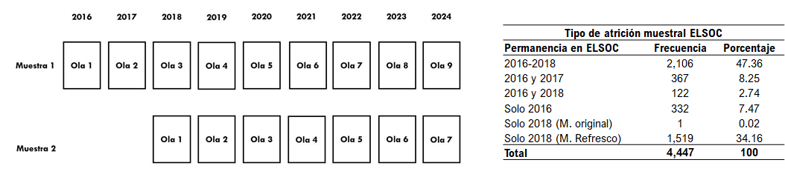

---

### Encuesta ELSOC
#### Propósito del estudio

* ELSOC no fue diseñado con una definición explícita de cohesión social, pero en el desarrollo de su cuestionario se buscó incorporar múltiples dimensiones de la cohesión social. 

* La definición de cohesión social propuesta por la Fundación Bertelsmann fue particularmente influyente. Aquí la cohesión social tiene que ver con la forma en que los miembros de una comunidad se definen en términos territoriales, su percepción sobre la vida y el trabajo en común (Bertelsmann, 2012).

* En términos ideales, una sociedad cohesionada debería estar caracterizada por relaciones sociales resilientes, conexión emocional positiva, y un pronunciado foco hacia el bien común.

---
### Encuesta ELSOC
#### Regiones consideradas

<br>
<br>

.center2[
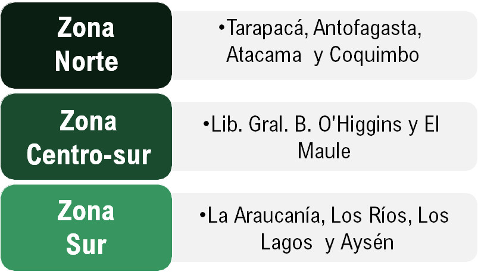
]


---

### Encuesta ELSOC
#### Tamaño de ciudades

<br>
<br>

.center2[
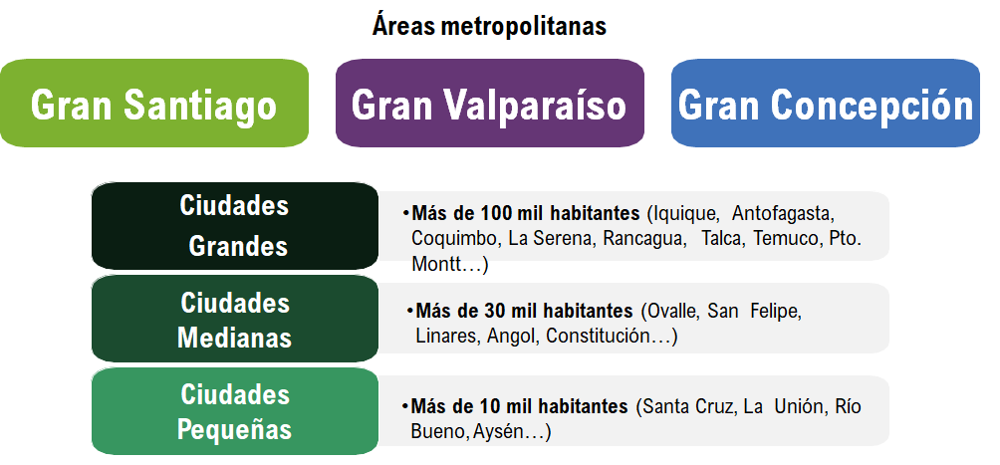
]


---
### Encuesta ELSOC
<br>
#### Dominios y dimensiones de la Cohesión Social

.center2[


]

---

### Encuesta ELSOC
#### Dominios y dimensiones de la Cohesión Social

.center2[

 

]

---

### Encuesta ELSOC
#### Módulos temáticos

.center2[

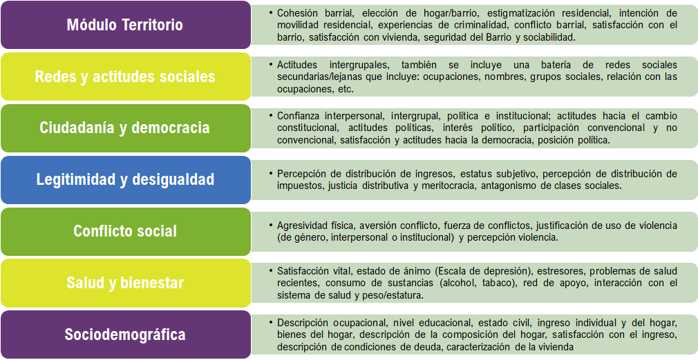

]


---
## Encuesta ELSOC

#### Algunos resultados: ¿Con qué frecuencia usted/alguien de su hogar se ha molestado o incomodado por problemas con sus vecinos? 

.center2[

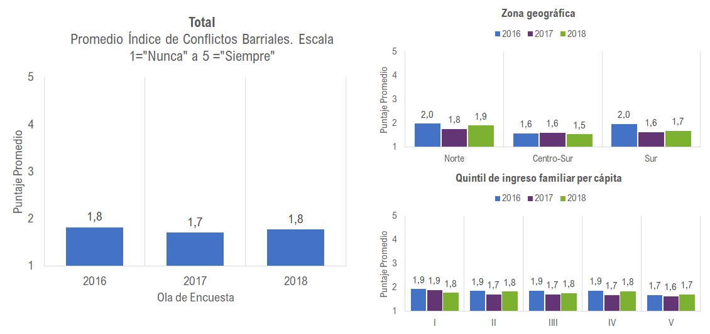

]

---

### Encuesta ELSOC
#### Algunos resultados: ¿Cómo cree que evalúan su barrio las personas que viven fuera de su barrio? 

.center2[

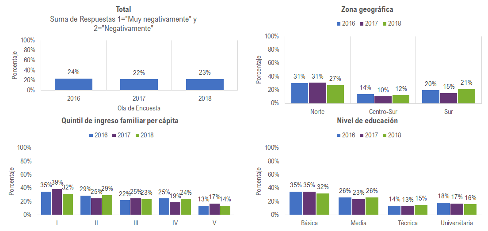

]

---

### Encuesta ELSOC
#### Algunos resultados: 
.center2[

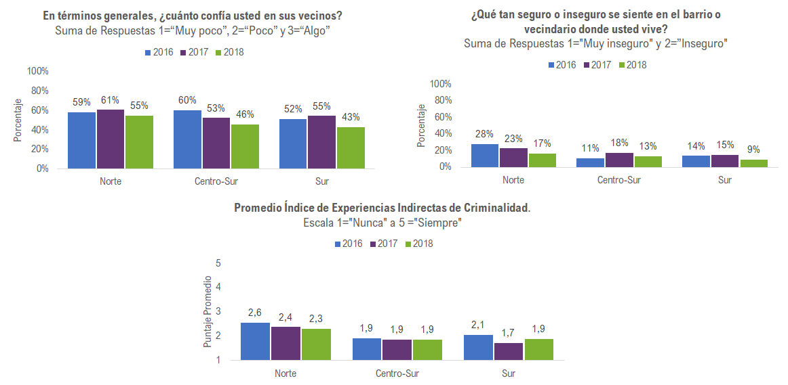

]


---
### Encuesta ELSOC
#### Estabilidad intertemporal para variables seleccionadas ELSOC

.center2[

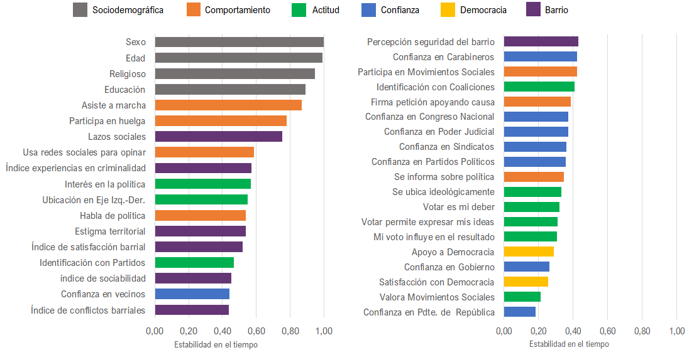

]

---
class: center, middle 

# Observatorio de Cohesión Social

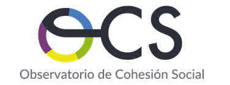

---
### Observatorio de Cohesión Social

* Necesidad de seguir aportando con datos sobre cohesión social en Chile y en América Latina, con una **perspectiva temporal** y **comparada**. 

* OCS: dedicado a **recopilar, sistematizar y poner a disposición información de indicadores de cohesión social.**

* Objetivo: **generar datos e indicadores de cohesión social y ponerlos a disposición de la comunidad académica nacional e internacional, la ciudadanía y los hacedores de políticas públicas.**


---
### Observatorio de Cohesión Social

Piloto: 24 indicadores para la encuesta LAPOP (Latin American Public Opinion Project) desde el año 2004 a 2014, con posibilidades de gráficos por país (transversal) y en el tiempo (serie de tiempo).

.center2[
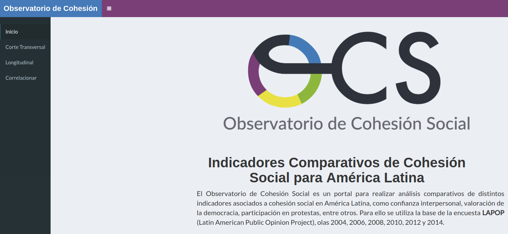

]

-> link [aquí](https://juitsa.shinyapps.io/ocs-coes/)

---

### Observatorio de Cohesión Social

#### Resultados descargables de sitio web


.center2[

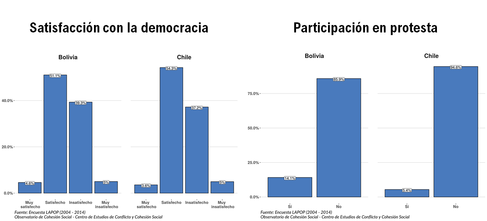

]

---

### Observatorio de Cohesión Social

#### Resultados descargables de sitio web


.center2[

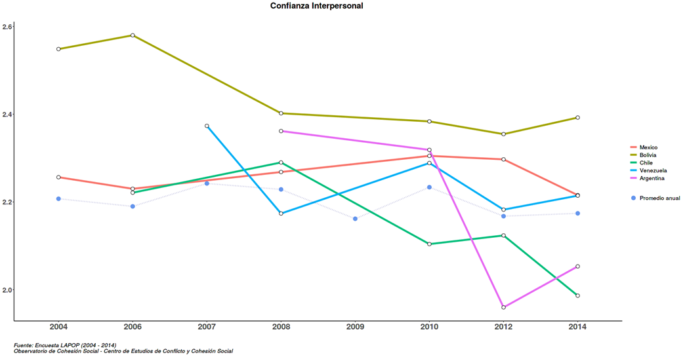

]

---
class: middle, center

# Observatorio de Conflictos - COES

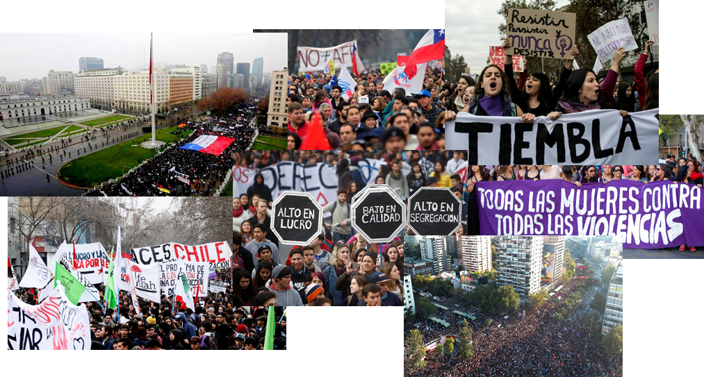


---
### Observatorio de Conflictos

.left-column[
* Inspirado en el informe “La Protesta Social en América Latina” (PNUD, 2012) y la fundación PAPEP, esta iniciativa utiliza medios de prensa nacional y regional (18 en total) para **identificar y describir la acción colectiva – en forma de protesta social – en Chile.** 

* Actualmente, el proyecto cuenta con una base de datos para el periodo 2012-2017 (**6 años y 11.500 acciones contenciosas**) y está siendo expandido al periodo 2009-2018 (10 años), conteniendo alrededor de 90 variables. 

* Innovación metodológica. Al incluir una **gran variedad de medios regionales, se da mayor visibilidad a los conflictos regionales.**

]

.right-column[

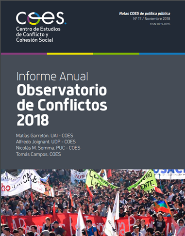

]

---
### Observatorio de Conflictos

* Para identificar el nivel de conflictividad social en el país, el Observatorio de Conflictos se apoya en una **definición propuesta por el PNUD**, entendiendo el conflicto como un _proceso de interacción contenciosa entre actores e instituciones, con diversos grados de organización, que actúan de manera colectiva buscando la mejora o defensa de sus intereses, y que se expresan en el espacio público de manera visible_. 


* Un conflicto surgiría cuando un actor, grupo o movimiento social expresa públicamente un malestar colectivo a través de demandas y medidas de presión contra alguna instancia pública o privada. Esta definición es conceptualmente próxima a la Agenda Teórica de COES y ha sido adaptada para efectos del trabajo a realizar

---
### Observatorio de Conflictos

#### ¿Qué datos contiene nuestra base de datos?

* **Reportes de medios, que corresponde a la aparición en prensa de la acción contenciosa.** Posteriormente, se identifican las **acciones individuales**, ya que una acción puede aparecer en distintos medios. Por último, se identifican los **episodios contenciosos**, que corresponden a dos o más expresiones territoriales de una movilización.
* El análisis de reportes de prensa considera 18 medios de comunicación:
    * 5 son de alcance nacional (La Tercera, El Mercurio, Diario Financiero, Radio Cooperativa, Bío-Bío Prensa Digital)
    * 13 de circulación regional 
    
* Esto permite ampliar la cobertura territorial del Observatorio y compensar sesgos editoriales de medios individuales gracias a la complementación y comparación de distintas fuentes

---
### ¿Cuáles han sido algunos resultados?

* Con este proyecto, ha sido posible **identificar focos y demandas de la protesta social en Chile**, como también el **repertorio de tácticas y grupos sociales participantes de la protesta**. 

---

### Observatorio de Conflictos
####Resultados generales

.center2[
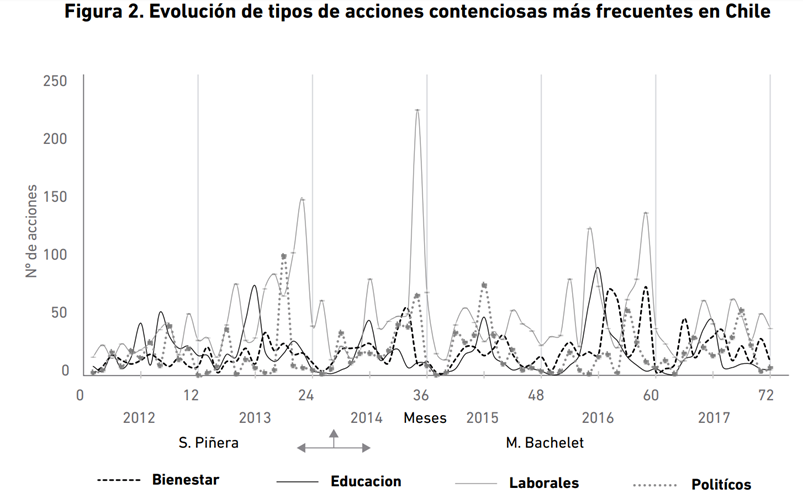
]

---

### Observatorio de Conflictos
####Resultados generales


.center2[
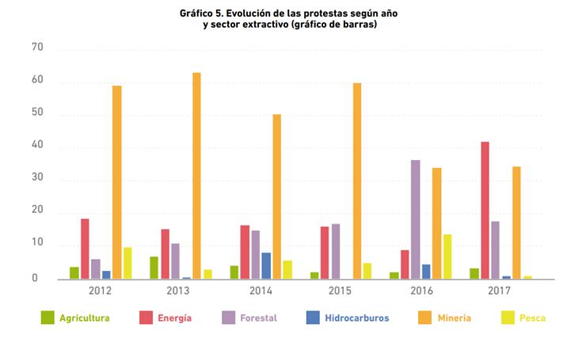
]

---
### Observatorio de Conflictos
####Resultados generales

.center2[
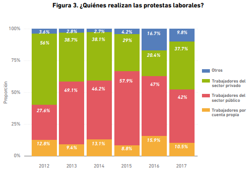

]

---
### Observatorio de Conflictos
.center2[
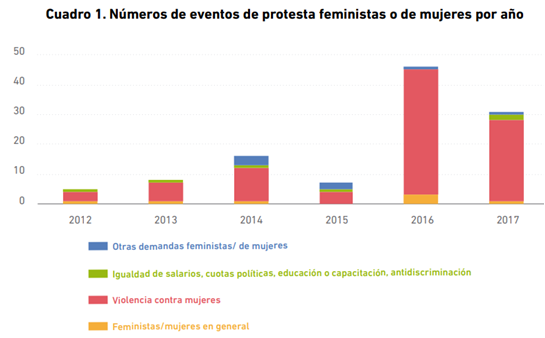

]


---

### Información disponible públicamente

#### Sitio Web: [bit.ly/dataverse_coes](bit.ly/dataverse_coes) 


* El repositorio Dataverse, Universidad de Harvard, con acceso expedito a datos y documentación 

.center2[

]


---
# Inputs para discusión

### - Cohesión social en América Latina: un concepto que se resiste a morir

###- Medición de cohesión social: subjetividades y elementos contextuales

###- Estudio conjunto de cohesión y conflicto

### - Medición y políticas de cohesión

---
class: center

<br>
<br>
<br>
<br>
<br>
<br>
<br>

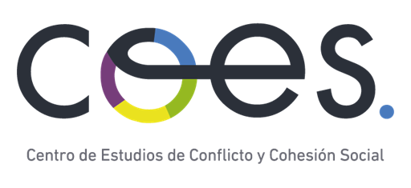


