---
output:
  xaringan::moon_reader:
    lib_dir: libs
    css: xaringan-coes.css
    nature:
      ratio: '16:9'
      beforeInit: "macros.js"
---
```{r setup, include=FALSE}
options(htmltools.dir.version = FALSE)
```

# Presentation Overview

<br>
<br>
<br>
<br>
<br>
.center2[
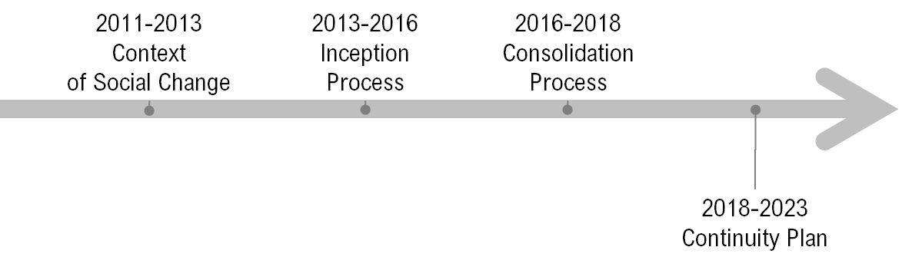
]

---

# Presentation Overview

<br>
<br>
<br>
<br>
<br>
.center2[
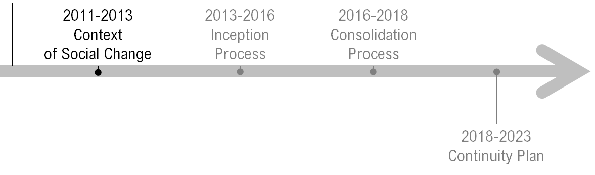
]

---
background-image: url(images/ima03.png)
class: middle, inverse
### Chilean Context

* **Now a high/middle income country**

    * **High inequality and segregation, low social mobility**
    
    * **Social, cultural and political transition after 1990**
    
    * **Accelerated social change after 2000**
    
* **Social movements, lack of trust in political institutions**

* **Prompt political and structural reforms**  

---
background-image: url(images/ima04.png)
class: inverse
### Chilean academic context

.left-column[
* **Social Sciences were repressed during dictatorship 1973-1990**

* **No tradition of publications in academic journals**

* **Incipient doctoral programmes**

* **Atomised academic communitites**

* **COES researchers have to continue with their regular academic activities**
]

<br>
<br>
<br>
<br>
<br>
<br>
<br>
<br>
<br>
<br>
<br>
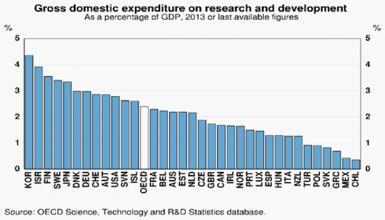


---
background-image: url(images/ima06.png)
class: inverse

---
# Presentation Overview

<br>
<br>
<br>
<br>
<br>
.center2[
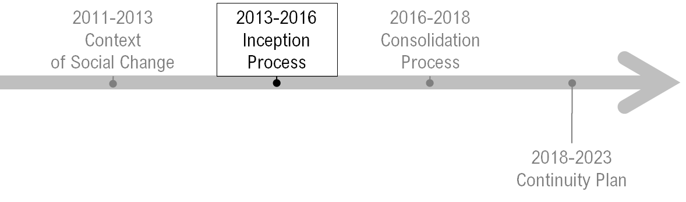
]

---
background-image: url(images/ima08.png)
class: inverse

# The Centre: Initial Conditions

* **Group of disconnected researchers**

* **Our group grew through new postdocs, new hires (in Universities)** 

* **As a result we built a more dense network of researchers. **

    * **First building up research lines.**
    * **Then across lines.**

---
background-image: url(images/ima09.png)
background-size: cover

---
background-image: url(images/ima10.png)  
background-size: cover
---
background-image: url(images/ima11.png)
background-size: cover
---
background-image: url(images/ima12.png)
background-size: cover
---
background-image: url(images/ima13.png)
background-size: cover

---
### The Centre: Internal Organization

<br>
#### - Academic board: balances academic disciplines and universities

<br>

#### - Mini COES projects.
    
* Promote internal interaction among COES researchers.

<br>

#### - Balance resource allocation and responsibilities.

<br>

#### Flexible approach to new projects.

---
background-image: url(images/ima14.png)
background-size: cover

---

### Leverage Strategy: Human and Financial resources

.center2[
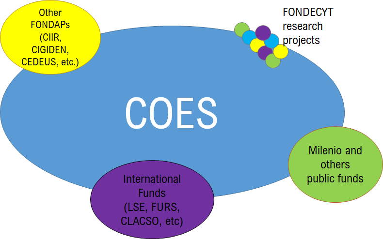
]

---

# Presentation Overview
<br>
<br>
<br>
<br>
.center2[
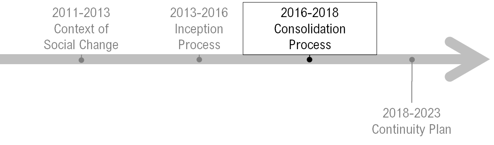
]


---

### We have a triple mandate

<br>

.center2[
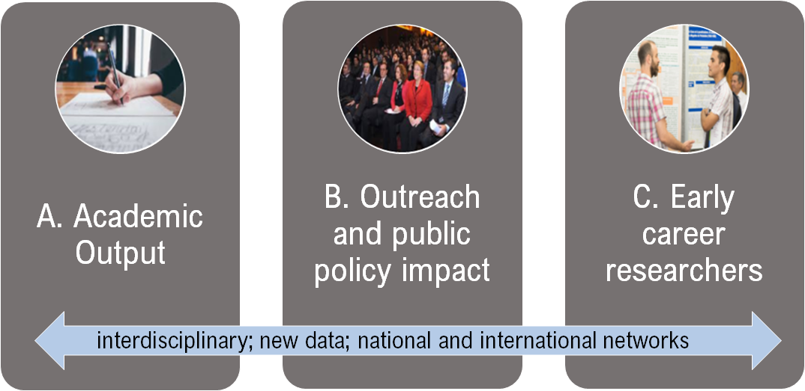
]

---

# A. Academic output

.center2[
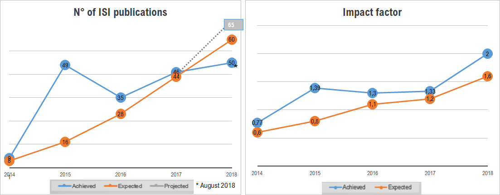
]

####  Sustained increase in publications. At the same time impact factor of those publications have also increased.

---

### Working Model


---
class: middle, center
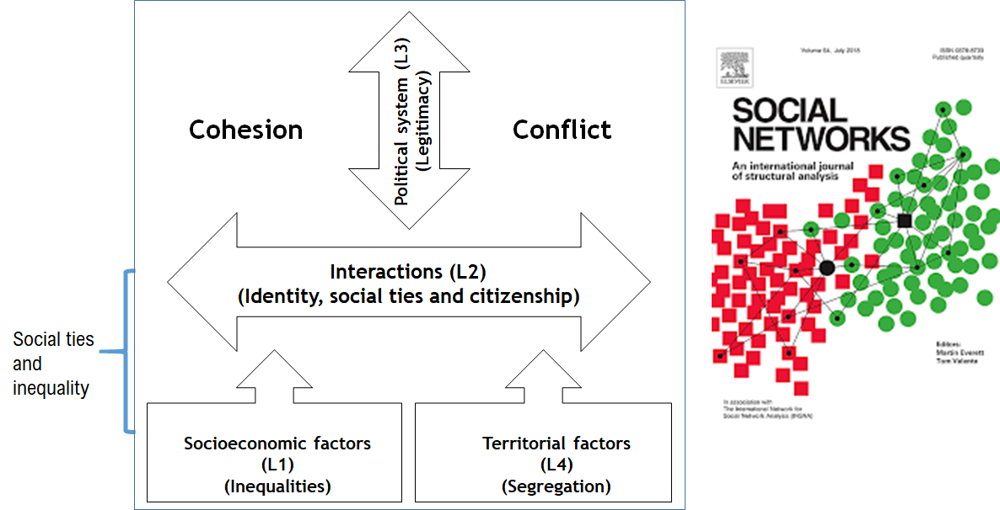
---
class: middle, center
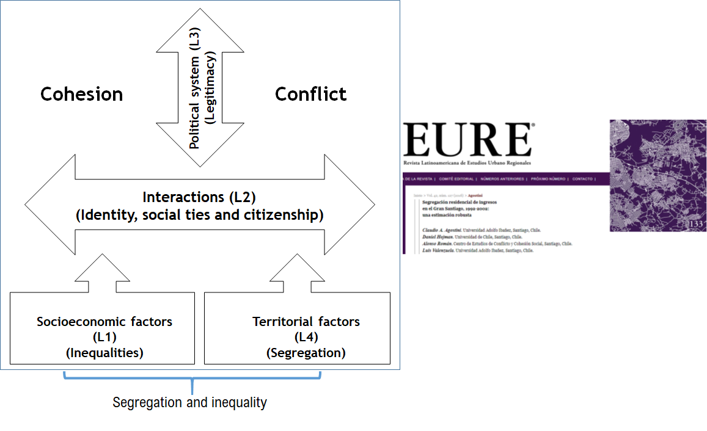 
---
class: middle, center
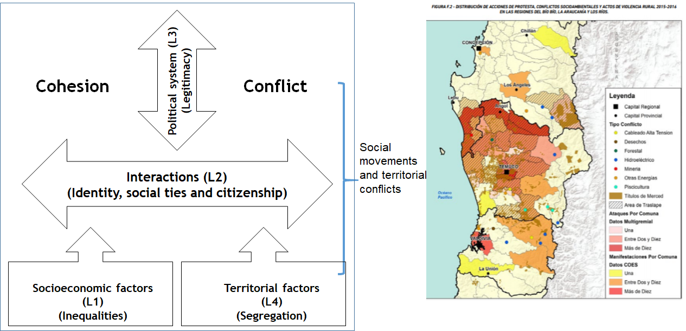

---
class: middle, center
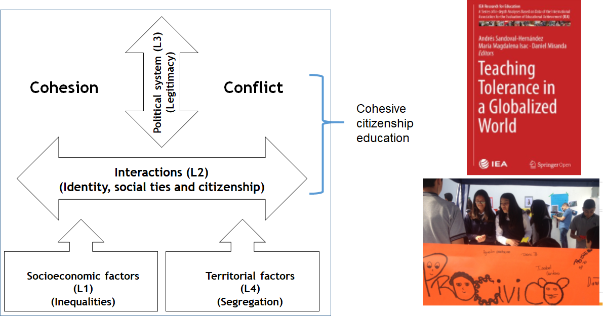 

---
class: middle, center
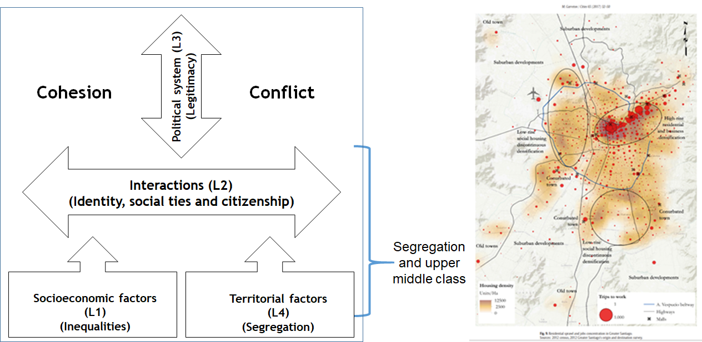 


---

# B. Outreach & Impact In Policy Discussion
#### Media – Social network, YouTube, web

.center2[
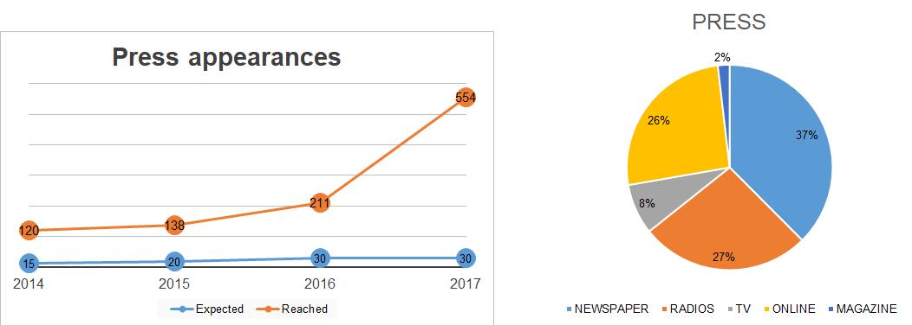 ]


* Social networks: we have about twice as many followers as others Fondap Centers on Facebook and Twitter (4.577 likes and 4.249 followers). 
* On Instagram we have twice as many followers as LSE (1.067) and our YouTube channel has more than 20.676 views.

---
# B. Outreach & Impact In Policy Discussion

.left-column[
.center2[
<br>
#### COLUNGA (HUB of NGOs)
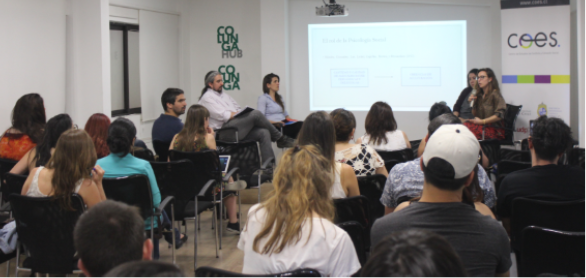 ]
]

.right-column[
.center2[
#### Museo de la Memoria y Los Derechos Humanos
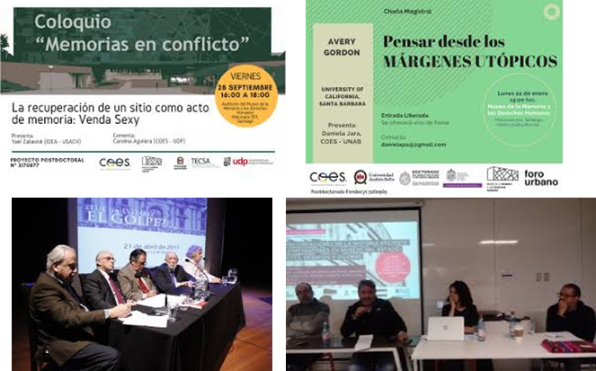 ]
]

    
---
# B. Outreach & Impact In Policy Discussion
#### Annual Conference
.center2[
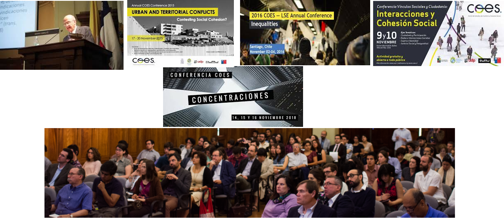 ]

---

# B. Outreach & Impact In Policy Discussion

* Work with Ministries, Municipal Administrations and Central Government

.left-column[
.center2[
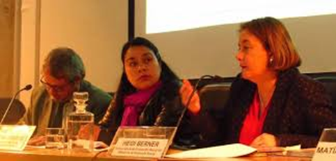
]
* Analysis of territorial politics in Municipalidad de Santiago
* Discussion about multidimensional poverty
* Analysis of Educational Reforms 
]

.right-column[
.center2[
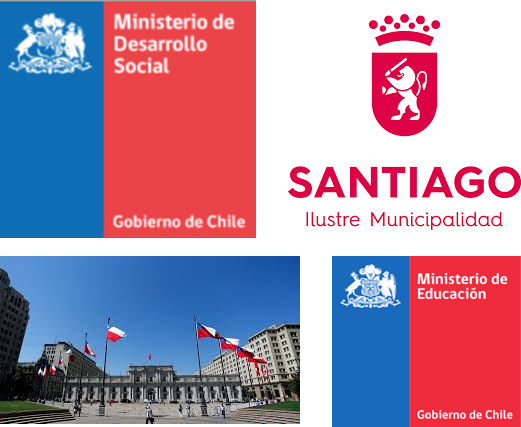
]
]

---

# B. Outreach & Impact In Policy Discussion

* Civil Society, UKAMAU, Workshop for social movements, COES in classrooms (Explora, Congreso del futuro, Impulso Docente)
.center2[
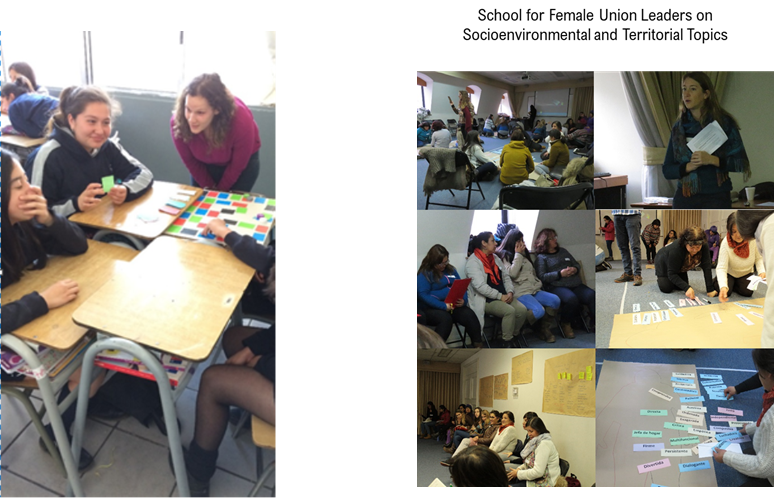
]

---
background-image: url(images/ima32.png)
background-size: cover
class: inverse

# C. **Early career researchers**

.left-column[
<br>
<br>
<br>
<br>
<br>
<br>
<br>
<br>
]

.right-column[
<br>

### Annually
* **12 MA and 3 PhD scholarships**
* **20 undergraduate students**
* **Training workshops, Summer courses, methodological skills, poster sessions **
]

### Dedicated resources for students (attend conferences and field work)
 
---
background-image: url(images/ima32.png)
background-size: cover
class: inverse

# C. **Early career researchers**

.left-column[
<br>
<br>
<br>
<br>
<br>
<br>
<br>
<br>
]

.right-column[
<br>
<br>

* **Carranza, PhD in LSE**
* **Otero, PhD in U. of Amsterdam**
* **Olivos, PhD in U. of Hong Kong**
* **Miranda, PhD in P. U. Católica de Chile**
* **Brito, PhD in Brown U.**

]

### Mentoring Programme 

---
background-image: url(images/ima32.png)
background-size: cover
class: inverse

# C. **Early career researchers**

.left-column[
<br>
<br>
<br>
<br>
<br>
<br>
<br>
<br>
]

.right-column[
<br>
<br>

* **Competitive Annual calls  for postdocs (4/70)**
* **35% foreigners**
* **Insertion into a network**
* **Access to different funds**
* **Future career development**


]

### Postdocs

---
background-image: url(images/ima33.png)
background-size: contain

# Relevance of Academic Network

.right-column[

#### Strategic Plan

* **Training **
* **Joint publications**
* **Several researchers engaged**


* **Harvard**
* **UMASS**
* **Zürich**
* **LSE**
* **INCASI**
* **NOPOOR**
* **Auckland U.**
* **Bertelsmann Foundation (Cohesion Radar)**


]

---
# Presentation Overview

<br>
<br>
<br>
<br>
<br>
.center2[
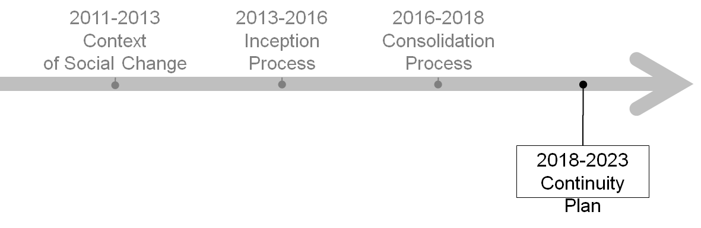
]

---
# New context… new social movements
.center2[
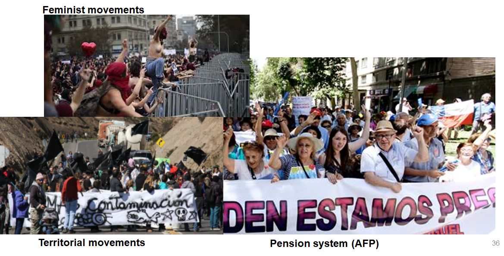
]

---
# Lack of trust in elites, corruption

.center2[
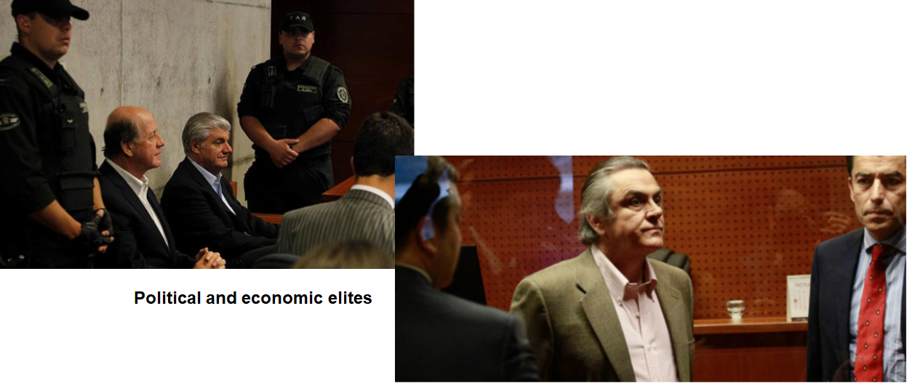
]


---
# Intense debate on migration… 

.center2[
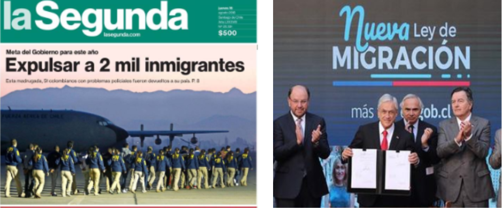
]

---
class: center, middle

# COES 2.0

---
# COES 2.0: Overview


### 1. New organization.
### 2. Integrated Data Platform.
### 3. Study of Social Change.
### 4. Research in action: application to public policies.
### 5. Improve our national and international networks.
### 6. Balance disciplinary and interdisciplinary publications.
### 7.Open Science.

---
background-image: url(images/ima38.png)
background-size: contain

---
background-image: url(images/ima39.png)
background-size: contain

---
# 2. Integrated Data Plataform

* An archipelago of data islands to be linked into a coherent whole

.left-column[

1. Quantitative data
2. Qualitative data
3. Spatial data
4. Longitudinal data

]

.left-column[

.center2[

]

]

---
# 2. Integrated Data Plataform

* Quantitative data from Observatories of Strikes, Conflicts and Cohesion

.center2[
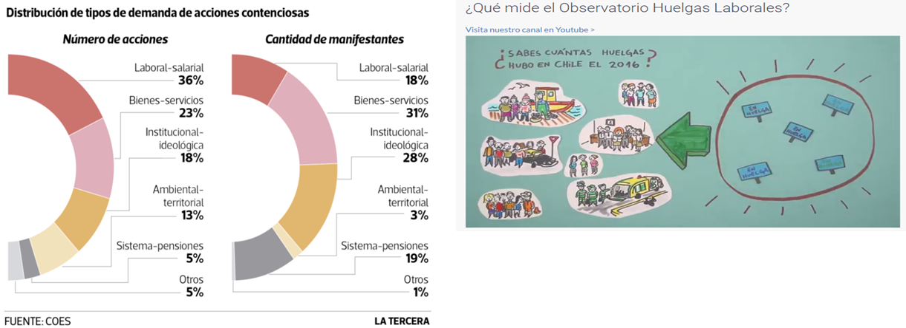
]

---
background-image: url(images/ima42.png)
background-size: contain

# 2. Integrated Data Plataform
---
# 2. Integrated Data Plataform

* Longitudinal data: ELSOC

.center2[
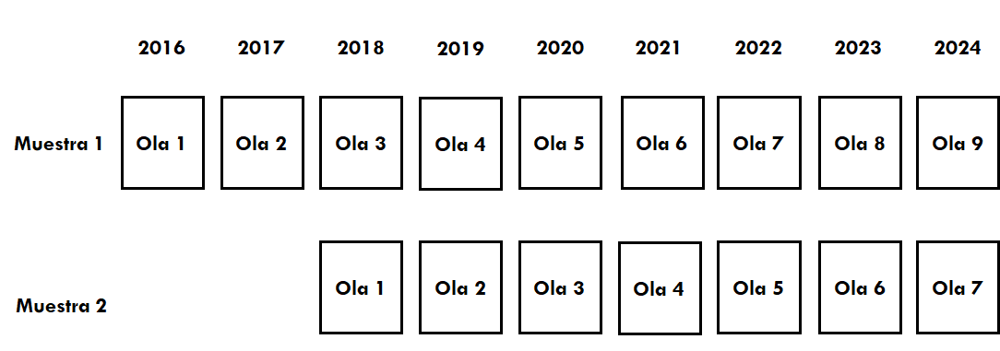
]

---
# 3. Dynamic Perspective of Social Change:

* How do (inequality), conflict and cohesion develop over time?

* What determines these changes?

* Goal $\to$ include dynamic aspects in our research lines to understand better complex aspects of social change.

* Examples: 
    * Using longitudinal and time series data: ELSOC, Observatories
    
    * Analysing socioeconomic administrative data over time and over the life-cycle
    
    * Analysing political changes: elites, perceptions of legitimacy, the impact of
    structural reforms

---
# 4. Research in Action: Application to Public Policies


.left-column[

* New unit of public policy $\to$ interaction with policy makers
    * CIT, GobLab-UAI, Gob. School UC


* Applied research projects:
    * ProCívico (interventions)
    * Migration, gender, education
]

.right-column[

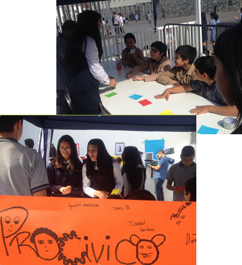

]
---
background-image: url(images/ima45.png)
background-size: contain

# 5. Improve our National/International Network

.left-column[
* Network of universities: 
    * Regional Universities (dissemination and collaboration)
    * LA: joint projects, Observatory of the quality of Employment in Latin America

.center2[

]
]

---
# 6. Disciplinary and Interdisciplinary excellence


* Maintain our mixed strategy defined in conjunction with the scientific committee:

    * Journals: disciplinary and multidisciplinary. 
    * Books.
    * English and Spanish.

* Increase the number of publications in Q1 of impact factors. 

---

# 7. Engage COES into Open Science

* Define and promote an internal policy for:
    
    * Reproducibility.
    * Access to data.
    * Transparency of analysis, coding.
    * Pre-prints publications.
    * Access via Web.
    
---
# COES beyond 10 years?

* Mixed strategy to fund COES going forwards:

    * Conicyt
    * Host universities: based on the strong institutional commitments
    * Regional Universities
    
    <br>
    * International comparative (and longitudinal) studies
    * Open to new contexts
    * Direct influence on public policy


 

