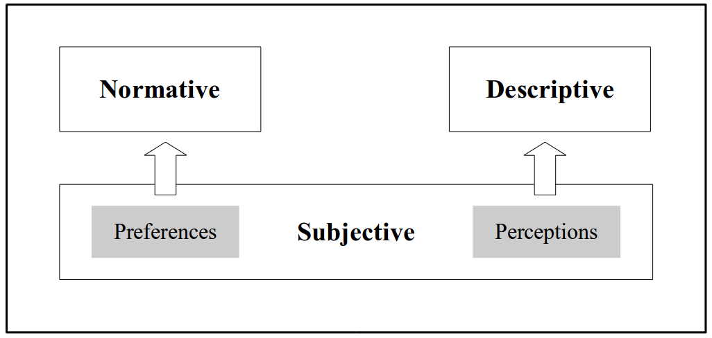
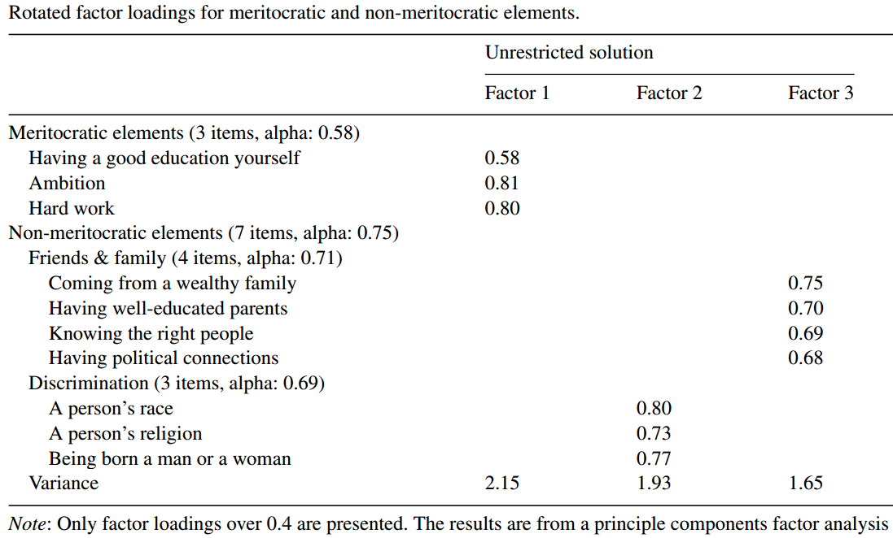
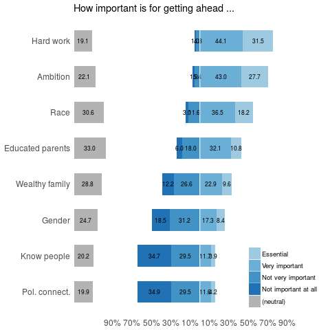
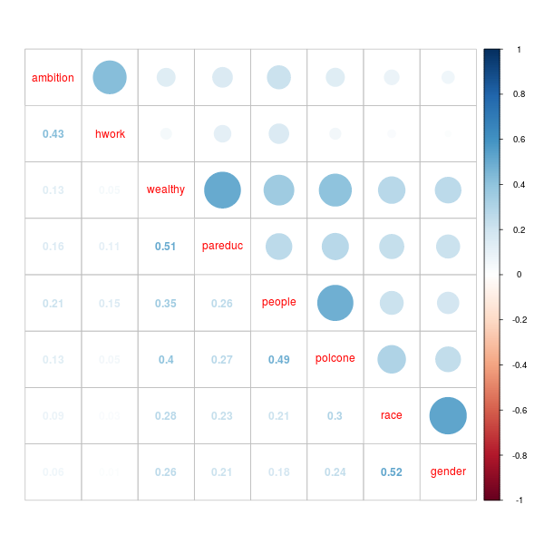
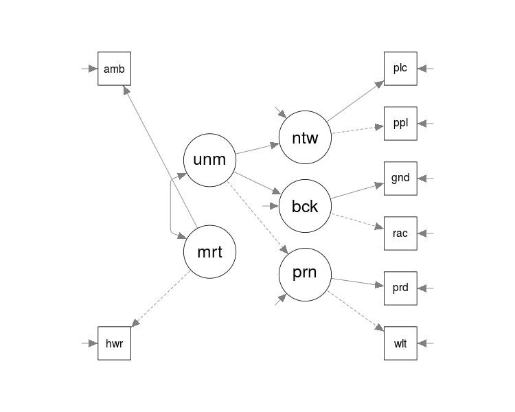
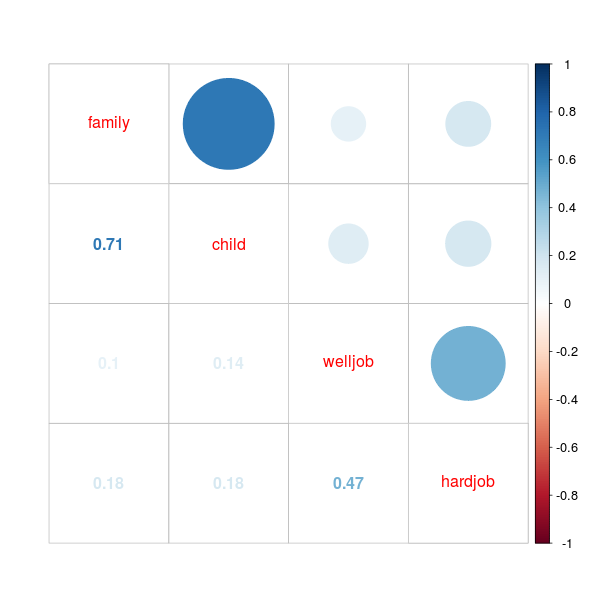
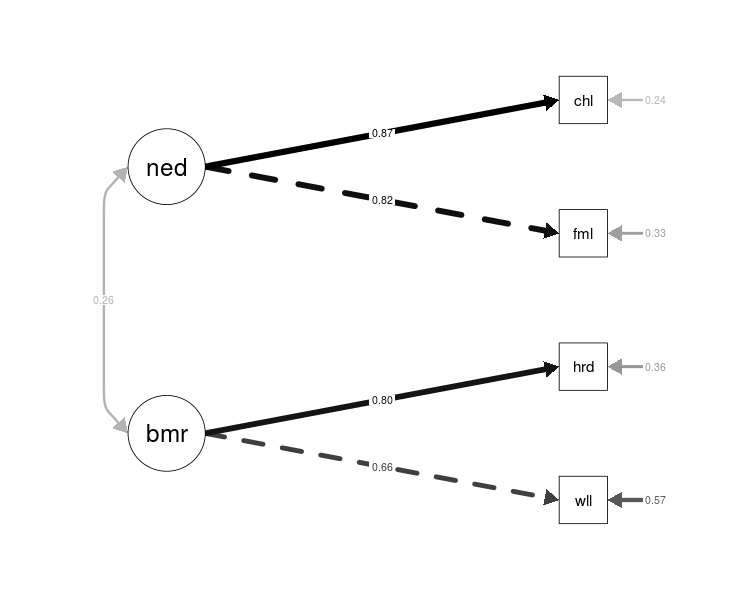
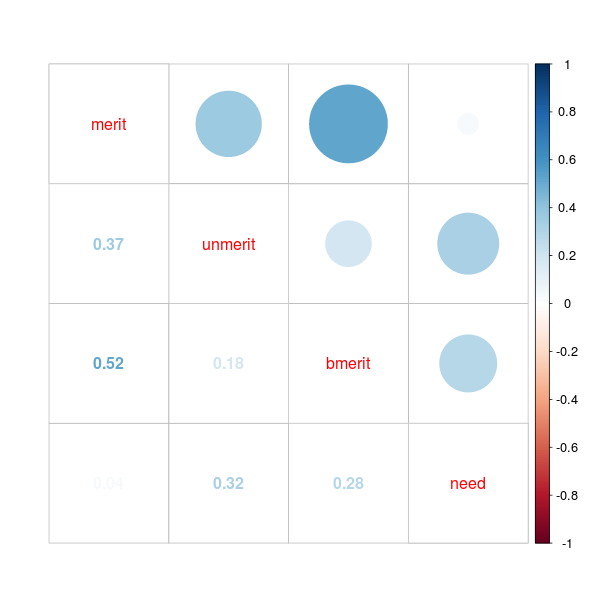
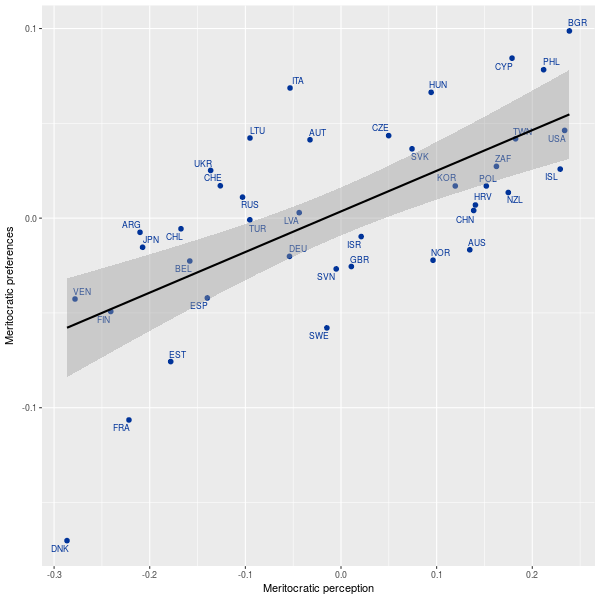
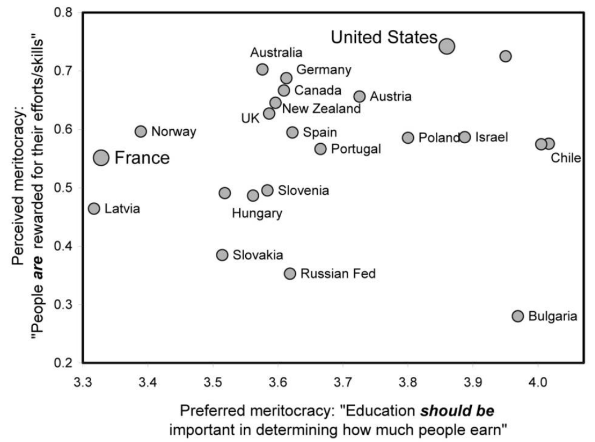

class: center

```{r setup, include=FALSE}
options(htmltools.dir.version = TRUE)
pacman::p_load(RefManageR)
bib <- ReadBib("merit_pref_int.bib", check = FALSE)
```

<!---
Para correr en ATOM
- open terminal, abrir R (simplemente, R y enter)
- rmarkdown::render('castillo2018meritocracyISA.Rmd', 'xaringan::moon_reader')

About macros.js: permite escalar las imágenes como [scale 50%](path to image), hay si que grabar ese archivo js en el directorio. 
--->

# The Meritocracy black box
<center>

</center>

<center>
"the idea of meritocracy may have many virtues, but clarity is not one of them” `r Cite(bib, "sen_merit_2000", after=", p.1")`
</center>


???
This slide:

- Meritocracy is a concept widely used in sociological research, mainly from a critical perspective related to the unfulfilled promises of social mobility in modern societies.
- Nevertheless, few research so far has addressed the concept itself, remaining in a closed black box. There is not clarity in  the literature about what  meritocracy is, and this lack of clarity has had a consequence a series of limitations for empirical research.

In this presentation
- I am going to summarize some empirical studies of meritocracy with a focus on survey research,
- then I am going to discuss some conceptual limitations of meritocracy studies
- Finally, I propose a conceptual framework for the empirical study of meritocracy, which I test with ISSP 2009 inequality module
---
# Background
- "The rise of meritocracy" `r Cite (bib, "young_rise_1962")`
  - Merit: Effort + Talent

- "Meritocracy and economic inequality" (Arrow, Bowles & Durlauf, 2000)

- "The meritocracy myth" (McNamee & Miller, 2004)

- "Meritokratie als Legitimationsprinzip" (Hadjar, 2008)

???

**Just a brief theoretical background**
- The main reference is Michael Young,who invented the term in his novel "The rise of meritocracy", not as an ideal but clearly as an irony of the dominant "meritocratic class" and finally the tragedy of the meritocratic society. He defined merit as a combination of effort and talent, a definition that prevails until today.

- Although for Young meritocracy actually was something negative, the use of the term until today has a positive value

- Then there are some few books on the topic, where it is possible to recognize three main focuses:

  - Normative: political philosophy, equity / proportionality theories
  - Descriptive: mainly stratification / educational research (Young)
  - Subjective: perceptions / beliefs / attitudes

---
# Conceptual links



???
**Summarizing the conceptual approaches to meritocracy**
- Here we can see the three described dimensions in the study of meritocracy: normative descriptive and subjective. From now on I am going to focus on the subjective dimension, which basically comprises perceptions (what is) and beliefs (what should be), and which are linked to the normative and descriptive dimensions.

---
## Studying the subjective dimension of meritocracy

.left-column[
  ### Research
]
<font size="3">
.right-column[


- Kunovich, S. and Slomczynski, K. M. (2007). Systems of Distribution and a Sense of Equity: A Multilevel Analysis	of Meritocratic Attitudes in Post-industrial Societies. European Sociological Review, 23(5):649–663

- Hadjar, A. (2008). Meritokratie Als Legitimationsprinzip. VS Verlag, Wiesbaden.

- Duru-Bellat, M. and Tenret, E. (2012). Who’s for Meritocracy? Individual and Contextual Variations in the Faith. Comparative Education Review, 56(2):223–247

- Reynolds, J. and Xian, H. (2014). Perceptions of meritocracy in the land of opportunity. Research in Social Stratification and Mobility, 36:121–137.

- Newman, B. J., Johnston, C. D., and Lown, P. L. (2015). False Consciousness or Class Awareness? Local Income Inequality, Personal Economic Position, and Belief in American Meritocracy. American Journal of Political Science, 59(2):326–340.

- Solt, F., Hu, Y., Hudson, K., Song, J., and Yu, D. E. (2016). Economic inequality and belief in meritocracy in the	United States. Research \& Politics, 3(4):2053168016672101.
]
</font>

???
**Papers studying meritocracy through survey research**

- There are a bunch of papers dealing with meritocracy and its determinats. 
- Although non of them deals with the measurement of meritocracy itself, still they make some operationalization choices with different consequences. 
- In my paper I review with more detail the operationalization of each of these papers, and next I am going to show you some few examples.

---
## Studying the subjective dimension of meritocracy

.left-column[
  ### Research
  ### Examples
]
.right-column[
- `r Citet (bib, "kunovich_systems_2007")`, ISSP 1992
  - 6 items of "reasons for pay" plus "the government should provide jobs for everyone who wants one" (reverse coded)

- `r Citet (bib, "duru-bellat_whos_2012")`, ISSP 2009
  - perceptions (what is) and beliefs (what should be), but use of single indicators and no measurement concerns

-  `r Citet (bib,"reynolds_perceptions_2014")`, GSS
  - Meritocratic and non-meritocratic perceptions (get ahead battery from GSS) "...how important you think it is for getting ahead in life"
]

???

- kunovich: uses reverse coded non-meritocratic items ... are the sa
- Duru-Bellat: single indicators
- Reynolds: substract merit from non merit, and they confuse beliefs with perception
]
---
## Studying the subjective dimension of meritocracy

.left-column[
  ### Research
  ### Examples
]
.right-column[
`r Citet (bib,"reynolds_perceptions_2014")`


]

---
## Studying the subjective dimension of meritocracy

.left-column[
  ### Research
  ### Examples
  ### Limitations
]
.right-column[

- Use of "beliefs" for perceptions / preferences

- Mostly focused in either perceptions or preferences

- Wide use of non-meritocratic items reverse coded as meritocratic

  - Except for `r Citet (bib,"reynolds_perceptions_2014")`, scarce discussion and empirical test about the measurement of meritocracy

  - Except for `r Citet (bib,"duru-bellat_whos_2012")`, links between perceptions and preferences are not addressed.
]
---
class: middle center


---
## A conceptual proposal for studying meritocracy


-*Meritocracy*:

  - perceptions (ej: effort is rewarded)

  - beliefs(ej: effort should be rewarded)

-*Non-meritocracy*

  - perceptions (ej: contacts for getting a job)

  - beliefs (ej: it is ok to use contacts for getting a job)

---
## A conceptual proposal for studying meritocracy

A bi-dimensional conceptualization of the subjective dimension of meritocracy
<br>
<br>
<br>
<center>

</center>

???
- In this table it is possible to clasify meritocratic research (in the subjective dimension), and also to propose new forms to tap the different dimensions. 
- I am not saying that it is necessary to cover all of them in one single research, but just that in order to move on in this agenda we need to be more preciseabout what we are doing. 
---
class:inverse center middle

#Testing the model

---
## Objective

- To propose and test an operationalization for the bi-dimensional conceptualizacion of the subjective dimension of meritocracy

- Data: ISSP 2009

- Variables

  - *perceived meritocracy*: getting ahead battery

  - *preferred meritocracy*: reasons for pay battery

---
## A. Meritocratic Perceptions: Descriptives
<center>


</center>
---
## A. Meritocratic Perceptions: Correlations
<center>

</center>

---
## A. Meritocratic Perceptions: Measurement Model
<center>

</center>

**Fit**: *Chi2=1,984.8 (16), CFI=.98, RMSEA=0.047*
---
## B. Meritocratic Preferences: Descriptives
<center>

</center>
---
## B. Meritocratic Preferences: Correlations
<center>

</center>
---
## B. Meritocratic Preferences: Measurement Model
<center>

</center>
**Fit**: *WLSMV, Chi2=27.45 (1), CFI=1.00, RMSEA=0.022*

---
## Perceptions and Preferences correlations
<center>

</center>

---
## Perceptions and preferences in international comparison
<center>

</center>
---
## Comparison with `r Citet (bib,"duru-bellat_whos_2012")`
<center>

</center>
---
class: inverse

# Discussion

- Fuzziness of merit

- Different and unconnected empirical approaches

- Comprehensive bi-dimensional framework

- Seems to work so far, but needs further research

---
class: inverse
# References

```{r, results='asis', echo=FALSE}
PrintBibliography(bib)
```

---
class: center, middle, inverse

## Comments most welcome!

###[jcastillov@uc.cl](mailto: jcastillov@uc.cl)  -   [jc-castillo.com](https://jc-castillo.com)

<br>
<br>
<br>
Presentation generated through [**xaringan**](https://github.com/yihui/xaringan) (Yihui Xie), through [remark.js](https://remarkjs.com), [**knitr**](http://yihui.name/knitr), y [R Markdown](https://rmarkdown.rstudio.com).
