class: inverse, bottom, right

```{r setup, include=FALSE, cache = FALSE}
require("knitr")
options(htmltools.dir.version = FALSE)
pacman::p_load(RefManageR)
bib <- ReadBib("meritocracy.bib", check = FALSE)
```

```{r eval=FALSE, echo=FALSE}
# Correr esta linea para ejecutar
rmarkdown::render('ispp2019lisboa.Rmd', 'xaringan::moon_reader')
```


<!---
About macros.js: permite escalar las imágenes como [:scale 50%](path to image), hay si que grabar ese archivo js en el directorio.
--->

# Conocimiento sobre desigualdad y pobreza: ¿Influye en la percepción de oportunidades y meritocracia?
## * Un experimento de encuesta *
<br>
<hr>
### Luis Maldonado, _Pontificia Universidad Católica de Chile_ - lmaldona@uc.cl
### Juan Carlos Castillo, _Universidad de Chile & COES_
### (Leslie McCall, _Stone Center of Economic Inequality_)
### Julio Iturra & Francisco Meneses 

<br>

.small[FONDECYT grant 1160921 - ISPP Lisboa 2019]

---

layout: true
class: animated, fadeIn

---

class: roja, middle, center, slideInRight

# Antecedentes

---
## Contexto de investigación

- FONDECYT grant 1160921: **La economía moral de la meritocracia y las preferencias redistributivas** (Juan Castillo, Luis Maldonado & Jorge Atria)


--

  - 2016-2020

  - Estudios cualitativos (entrevistas y grupos focales)

  - Análisis de datos secundarios (ISSP)

  - Encuesta de experimentos

--

- Más información y actualizaciones en el sitio web de nuestro proyecto en Researchgate: [https://www.researchgate.net/project/The-moral-economy-of-meritocracy-and-redistributive-preferences](https://www.researchgate.net/project/The-moral-economy-of-meritocracy-and-redistributive-preferences)

---
## Contexto del país

.center[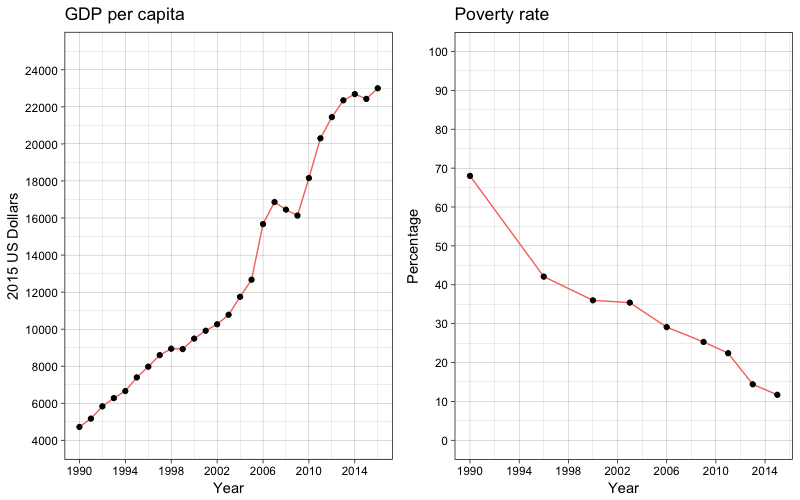]

.small[Fuente: OECD 2018 and PNUD 2017.]

---
## Contexto del país

.center[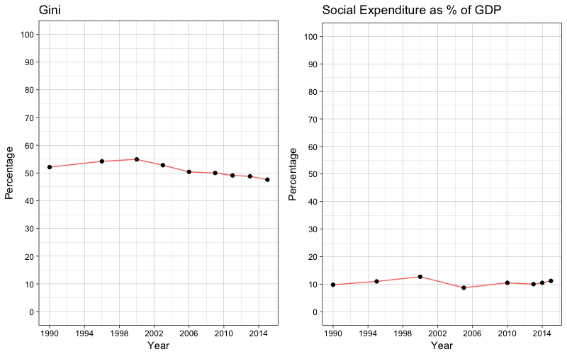]

.small[Fuente: OECD 2018 and PNUD 2017.]

---
## Contexto del país

.center[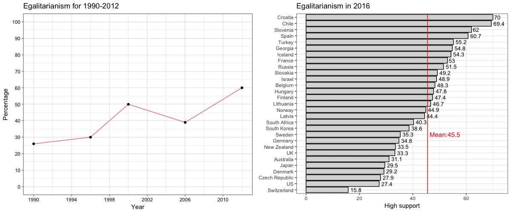]

.small[Fuente: WVS 1990-2012 and ISSP 2016.  La figura de la izquierda es el nivel de acuerdo con *Los ingresos deben hacerse más iguales* ; La figura de la derecha es la opción *Definitivamente debería ser responsabilidad del gobierno reducir las diferencias de ingresos entre los ricos y los pobres*] 
---
##  Contexto del país

.center[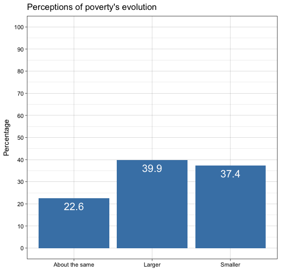]

.small[Fuente: estudio piloto (no representativo de la población chilena). La pregunta es: *¿Cree que la cantidad de personas pobres en Chile hoy en día es mayor, menor o casi la misma que hace 20 años?* ]

---
class: roja, middle, center, slideInRight

# Este estudio

---
## Concepto principal: Meritocracia

- Asignación de recompensas según el esfuerzo personal y el talento `r Cite (bib, c (" young_rise_1962 "))`

-  Considerado como un "mito" que legitima la desigualdad en las sociedades modernas `r Cite (bib, c (" young_rise_1962 "," hadjar_meritokratie_2008 "," kunovich_systems_2007 "," mcnamee_meritocracy_2004 "," arrow_meritocracy_2000 "," @ mijs_parado_) _ )_)rrow_meritocracy_2000","@mijs_paradox_2019"))`

- Diferentes dimensiones meritocráticas `r Cite(bib, "castillo_meritocracia_2018")`

  -  **percepción** de meritocracia (descriptiva)

  -  **preferencias** para la meritocracia (normativa)

---
class: middle, center

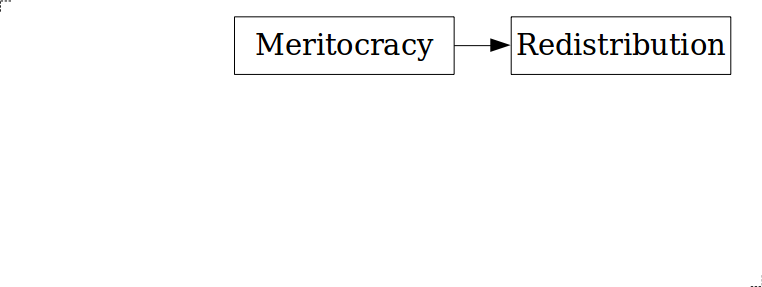

---
class: middle, center

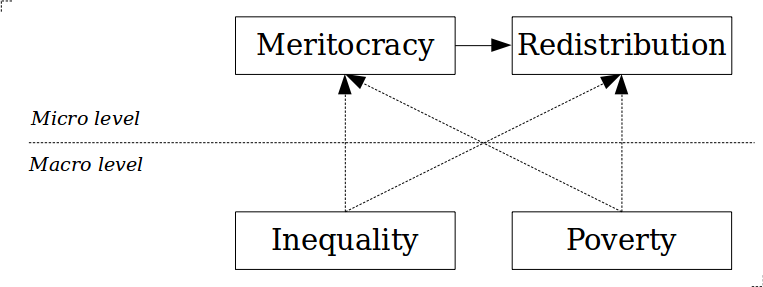

---
class: middle, center

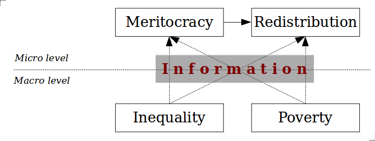

---
class: middle, center

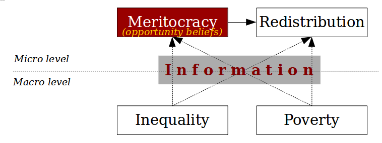

---
## `r Cite (bib, "mccall_Exposure_2017")`

- Información de desigualdad -> creencias de oportunidad (batería "get a head" GSS / ISSP)
  - Más peso para los factores estructurales (como familia adinerada)
  - Menos peso a factores individuales (como trabajo duro)


##  ... agregamos

- Tratamiento de la información sobre la pobreza.
- Elementos de oportunidad separados en lugar de factores estructurales e individuales.
- Ítem de educación.
- Verificación de conocimientos previos.

---
##  Objetivo e Hipotesis

-  ** Objetivo ** : Evaluar si la exposición a información objetiva sobre desigualdad económica y pobreza afecta las creencias de oportunidad

-  ** Hipótesis ** :

  - la información sobre la reducción de la pobreza refuerza el sueño meritocrático y, por lo tanto, lleva a creer más en factores individuales que estructurales.

  - la información sobre grandes desigualdades socava el sueño meritocrático y, por lo tanto, lleva a creer más en factores estructurales que individuales.

---
class: roja, middle, center, slideInRight

# Diseño de investigación

---
## Datos


1. _Nequest_ , una compañía de paneles en línea que trabaja en España, Portugal y América Latina   , recolectó una muestra de conveniencia para el estudio piloto en julio 2019 .

    -    N = 1,328 encuestados que viven en Santiago de Chile.

    -    Duración (mediana): 11 minutos.

    -    96% de los participantes terminan el cuestionario.

    -    La muestra efectiva tiene 794 encuestados.

    -    Usamos cuotas por género, educación y edad: 55% mujeres, 95% tiene secundaria o superior.

2.   Cuestionario y asignación aleatoria usando _Qualtrics_ .

---
##  Tratamientos

-    Tres condiciones

    1.   **Condición de pobreza** : Información sobre la evolución de la pobreza en Chile durante 1990-2015.

    2.   **Condición de control** : Información sobre el consumo de cigarrillos en Chile durante las últimas décadas.

    3.   **Condición de desigualdad** : Información sobre la desigualdad de ingresos en Chile en términos del índice 10/10 que muestra a Chile como uno de los países con mayor desigualdad de ingresos dentro de la OCDE.

- Diseñamos _comprobaciones de manipulación_ para cada una de estas tres condiciones.

---
###  1. Condición de pobreza: "Una serie de estudios muestran una disminución de la pobreza en Chile durante las últimas décadas ..."

.center[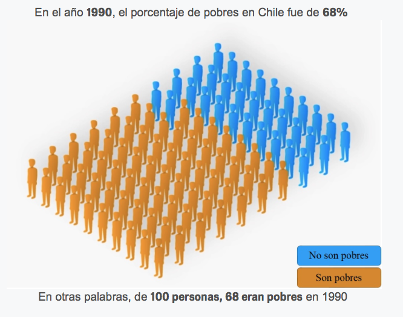]

---
###  1. Condición de pobreza: "Una serie de estudios muestran una disminución de la pobreza en Chile durante las últimas décadas ..."

.center[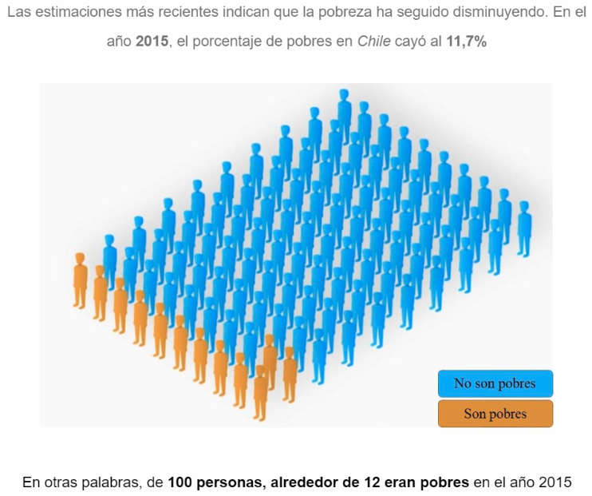]

---
###  2. Condición de control: "Una serie de estudios muestran una disminución en el consumo de cigarros en Chile durante las últimas décadas ..."

.center[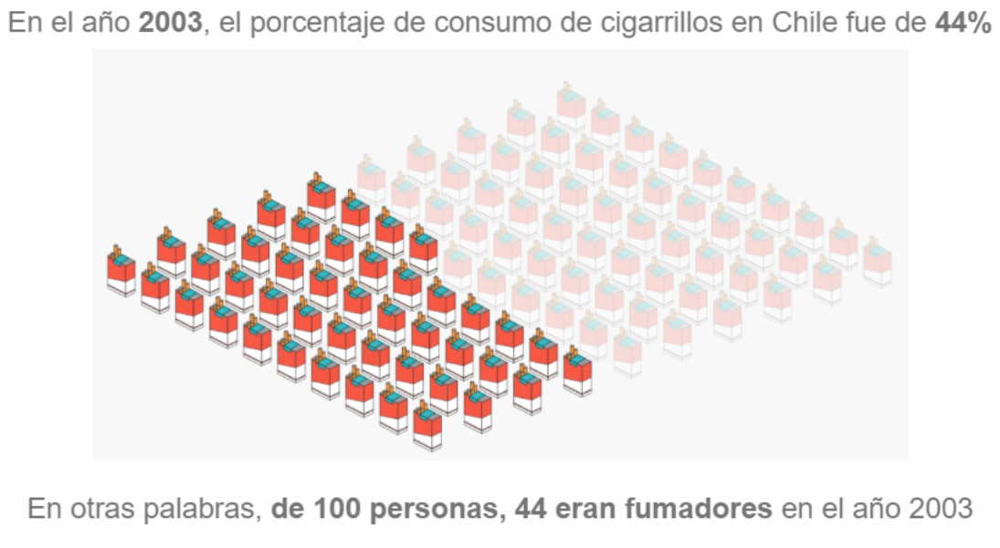]

---
###  3. Condición de desigualdad: "Una serie de estudios muestran que Chile presenta un alto nivel de desigualdad económica ..."

.center[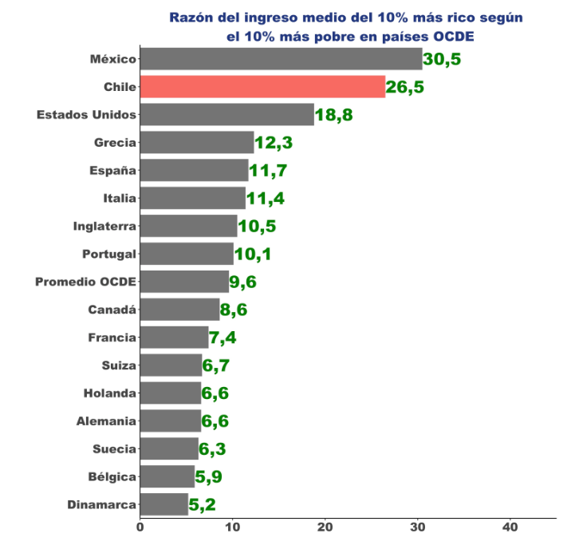]


---
##  Resultados y moderadores

-    Creencias de oportunidad (ISSP desigualdad social)

    -    ** Factores estructurales ** : a) provenir de una familia rica y b) tener padres bien educados.

    -    ** Factores individuales ** : c) trabajo duro y d) ambición.

    -    También e) tener una buena educación usted mismo.

-   Moderadores:

    -  **Igualitarismo** :"los ingresos deberían hacerse más iguales, aun cuando el esfuerzo individual no sea recompensado" (1), o "el esfuerzo individual debería ser recompensado a pesar de generar diferencias de ingresos" (10)

    -  **Percepción de la evolución de la pobreza** : mayor; lo mismo, disminuido.

---
##   Covariables y método

-    **Covariables** : características sociodemográficas.


-    **Métodos**

    -    Aleatorización: las covariables se equilibran entre las condiciones de tratamiento.

    - Las respuestas a los controles de manipulación están asociadas con variables sociodemográficas.

    -    Intent to treat effect (ITT) con regresiones para variables dependientes ordinales.

---
class: roja, middle, center, slideInRight

# Resultados

---
class: middle, center

<table cellspacing="0" align="center" style="border: none;">
<caption align="top" style="margin-bottom:0.3em;">Treatment effects: Ordinal logit, odds ratios</caption>
<tr>
<th style="text-align: left; border-top: 2px solid black; border-bottom: 1px solid black; padding-right: 12px;"><b></b></th>
<th style="text-align: left; border-top: 2px solid black; border-bottom: 1px solid black; padding-right: 12px;"><b>Family</b></th>
<th style="text-align: left; border-top: 2px solid black; border-bottom: 1px solid black; padding-right: 12px;"><b>Parent educ.</b></th>
<th style="text-align: left; border-top: 2px solid black; border-bottom: 1px solid black; padding-right: 12px;"><b>Education</b></th>
<th style="text-align: left; border-top: 2px solid black; border-bottom: 1px solid black; padding-right: 12px;"><b>Ambition</b></th>
<th style="text-align: left; border-top: 2px solid black; border-bottom: 1px solid black; padding-right: 12px;"><b>Hard work</b></th>
</tr>
<tr>
<td style="padding-right: 12px; border: none;">Poverty</td>
<td style="padding-right: 12px; border: none;">-0.98</td>
<td style="padding-right: 12px; border: none;">-0.91</td>
<td style="padding-right: 12px; border: none;">1.46<sup style="vertical-align: 0px;">**</sup></td>
<td style="padding-right: 12px; border: none;">1.16</td>
<td style="padding-right: 12px; border: none;">1.18</td>
</tr>
<tr>
<td style="padding-right: 12px; border: none;"></td>
<td style="padding-right: 12px; border: none;">(0.15)</td>
<td style="padding-right: 12px; border: none;">(0.14)</td>
<td style="padding-right: 12px; border: none;">(0.23)</td>
<td style="padding-right: 12px; border: none;">(0.18)</td>
<td style="padding-right: 12px; border: none;">(0.19)</td>
</tr>
<tr>
<td style="padding-right: 12px; border: none;">Inequality</td>
<td style="padding-right: 12px; border: none;">1.44<sup style="vertical-align: 0px;">**</sup></td>
<td style="padding-right: 12px; border: none;">1.15</td>
<td style="padding-right: 12px; border: none;">1.20</td>
<td style="padding-right: 12px; border: none;">1.04</td>
<td style="padding-right: 12px; border: none;">1.31<sup style="vertical-align: 0px;">*</sup></td>
</tr>
<tr>
<td style="padding-right: 12px; border: none;"></td>
<td style="padding-right: 12px; border: none;">(0.23)</td>
<td style="padding-right: 12px; border: none;">(0.18)</td>
<td style="padding-right: 12px; border: none;">(0.19)</td>
<td style="padding-right: 12px; border: none;">(0.16)</td>
<td style="padding-right: 12px; border: none;">(0.21)</td>
</tr>
<tr>
<td style="border-bottom: 2px solid black;">N</td>
<td style="border-bottom: 2px solid black;">794</td>
<td style="border-bottom: 2px solid black;">794</td>
<td style="border-bottom: 2px solid black;">794</td>
<td style="border-bottom: 2px solid black;">794</td>
<td style="border-bottom: 2px solid black;">794</td>
</tr>
<tr>
<td style="padding-right: 12px; border: none;" colspan="7"><span style="font-size:0.8em"><sup style="vertical-align: 0px;">***</sup>p &lt; 0.01, <sup style="vertical-align: 0px;">**</sup>p &lt; 0.05, <sup style="vertical-align: 0px;">*</sup>p &lt; 0.1</span></td>
</tr>
</table>
---
## El efecto de la condición de pobreza en **tener una buena educación usted mismo** por parte de los moderadores

.center[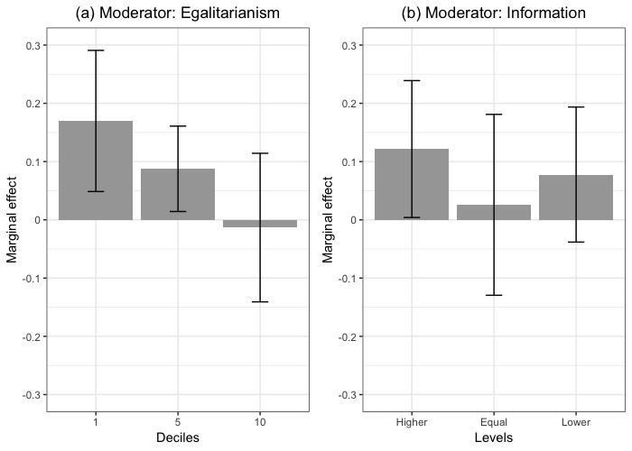]


---
class: roja, middle, center, slideInRight

# Discusión

---
class: inverse, middle

-    Papel crítico de los contextos: aumentar las oportunidades económicas versus a una mayor desigualdad económica.

-    Efecto significativo de la información de pobreza sobre * tener un buen
    educación tu mismo *.

-    Modelo de oportunidad de creencias sobre desigualdad económica

    1.   **Pregunta abierta I** : el análisis descriptivo sugiere una demanda creciente de redistribución en un contexto de oportunidades económicas crecientes.

    2.   **Pregunta abierta II** : Mecanismos explicativos del efecto de las percepciones de la desigualdad económica en las creencias de oportunidad.


---
class: inverse

##  Etapa actual: diseño del estudio final

1.  ** Efecto de la información sobre desigualdad y pobreza en las creencias de oportunidad **

    -    Panel en línea utilizando Netquest con tres olas: a) primero para recopilar información previa al tratamiento (covariables y moderadores); b) tratamientos y resultados; c) seguimiento para evaluar la persistencia de los efectos.

    -    Incluir todos los elementos relevantes para medir las creencias de oportunidad.

    -    Moderación: igualitarismo y percepción del desarrollo de la pobreza.

2.   Registro del plan de preanálisis en OSF.

---
class: inverse
#  Referencias

.small[
```{r, results='asis', echo=FALSE}
PrintBibliography(bib)
```
]
---
class: inverse, center

##  ¿La información sobre desigualdad y pobreza influye en las creencias de oportunidad?
<hr>
### Luis Maldonado, _Pontificia Universidad Católica de Chile_ - lmaldona@uc.cl
### Juan Carlos Castillo, _Universidad de Chile & COES_
### (Leslie McCall, _Stone Center of Economic Inequality_)

### ... ... también con la contribución de nuestros asistentes de investigación Julio Iturra y Francisco Meneses