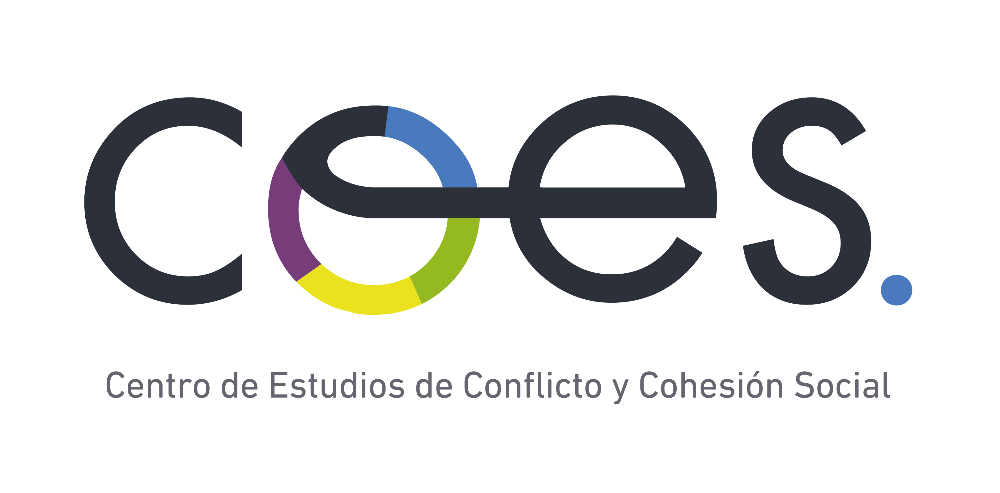
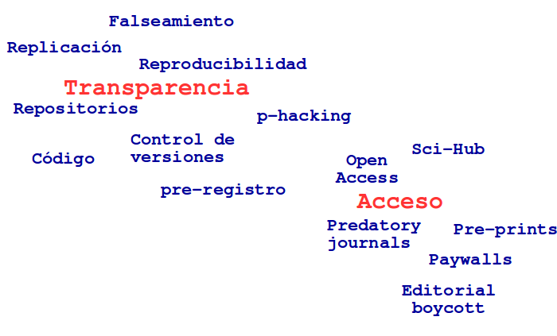
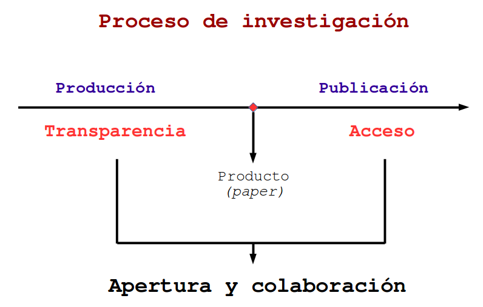
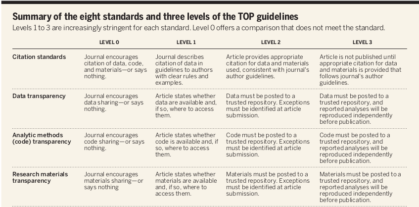
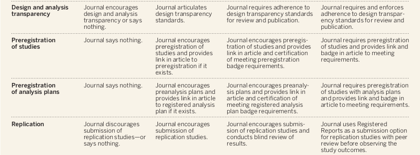

class: middle, center

```{r setup, include=FALSE, cache = FALSE}
require("knitr")
options(htmltools.dir.version = FALSE)
pacman::p_load(RefManageR)
# bib <- ReadBib("meritocracy.bib", check = FALSE)
```

<!---
About macros.js: permite escalar las imágenes como [:scale 50%](path to image), hay si que grabar ese archivo js en el directorio.
--->


## Colaboración y Ciencia Abierta
### Juan Carlos Castillo - Departamento de Sociología, Universidad de Chile
---
class: middle

# Ciencia Abierta: Crisis y Oportunidad



---
class: middle




---
# Estándares 1




---
# Estándares 2 





Nosek, B. A., Alter, G., Banks, G. C., Borsboom, D., Bowman, S. D., Breckler, S. J., … Yarkoni, T. (2015). Promoting an open research culture. _Science_, 348(6242), 1422–1425. https://doi.org/10.1126/science.aab2374


---
class: middle, center


## Colaboración y Ciencia Abierta
### Juan Carlos Castillo - Departamento de Sociología, Universidad de Chile