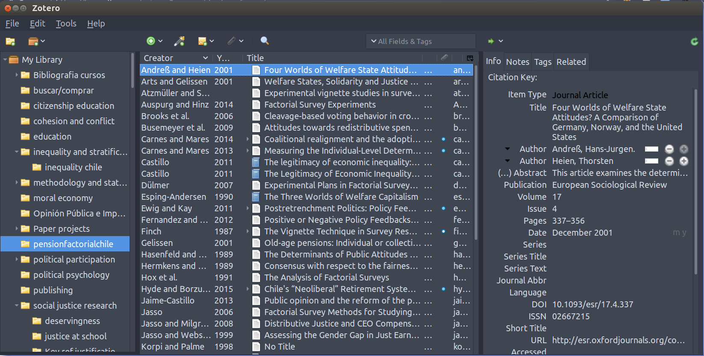
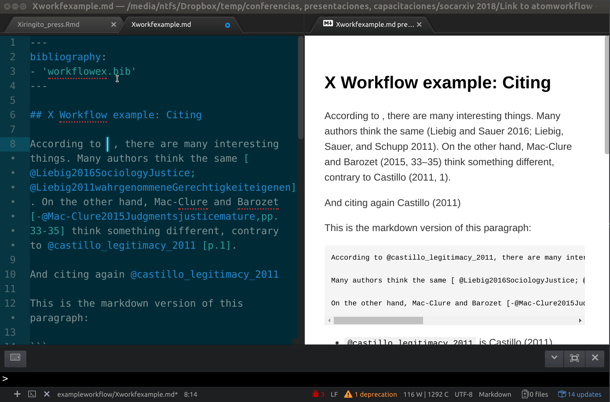
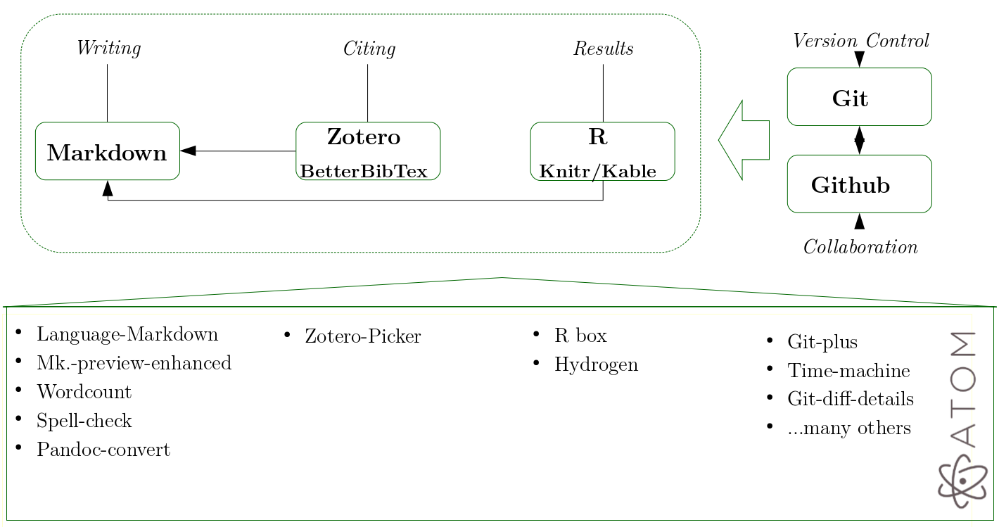

class: inverse, bottom, right

```{r setup, include=FALSE, cache = FALSE}
require("knitr")
options(htmltools.dir.version = FALSE)
# pacman::p_load(RefManageR)
# bib <- ReadBib("meritocracy.bib", check = FALSE)
```

```{r eval=FALSE, echo=FALSE}
# Correr esta linea para ejecutar
rmarkdown::render('ESRA2019_openwriting.Rmd', 'xaringan::moon_reader')
```

<!---
About macros.js: permite escalar las imágenes como [:scale 50%](path to image), hay si que grabar ese archivo js en el directorio.
--->

# Transparency in Open Academic Writing
<br>
<hr>
### Juan Carlos Castillo, _Universidad de Chile & COES_

<br>

.small[FONDECYT grant 1160921 - ESRA Zagreb 2019]

---

layout: true
class: animated, fadeIn

---

# Open science

--

  - Transparency
  - Reproducibility
  - Access
  - Collaboration
  - Communication ...

--

## - _... writing?_

  - Can be evaluated in terms of openness-closeness?
  - Should be open?

    - Normatively
    - Pragmatically

???
- Nowadays in the open science community there are several initiatives dealing with open access and reproducibility, which is mostly focused in the way in which we interact with the wider academic community. However, there is less discussion about how our day-to-day academic practices -as writing - are related to open science.

---
class: inverse

# This presentation

  ## - traditional writing workflow (W-workflow) and some limitations in terms of openness

  ## - proposal of an open-workflow (X-workflow)


---
class: roja, middle, center

# Writing workflows

---
# Components

  - text processor

  - reference management (software)

  - third-party components (figures, diagrams, tables)

  - collaboration

  - version control


---

# The **W**(ord) academic writing workflow


---

# Opening the W-Flow

- Is this writing format open?
--


--

- Is it accessible / editable for everyone (including myself in the future)?

???
Issues:
- Property of the contents (most important aspect related to openess)
- Contents vs. format
- Collaboration
- Version control

---
# Open writing alternative: (assisted) Plain Text

## Advantages

  - **Free**: several free alternatives
  - **Flexible**: not fixed to a single editor / programe
  - **Reproducibility**: allows combination of text and data analysis code in dynamic documents (no copy-paste)
  - **Version control**: rigorous and efficient via Git-Github
  - **Communication**: Flexible output possibilites (html, latex/pdf, word)

## Disadvantages ...

  - To move ...
  - No WYSIWYG
  - (some) coding

---
# Inspiration


---
# Healeys' workflow


---
# Healeys' workflow

Some drawbacks:

- departs from data analysis instead of writing

- weak integration of bibliographic references into the workflow

- based on editor _Emacs_ (... not very friendly)

???
This is Healeys' comprehensive proposal, which is expĺained in more detail in the Plain Persons' guide. I recommend it but ...

 - I think that it start from the wrong point (data analysis), the sequence is not the most clear one for the people not familiar with coding, actually it begins with an "Rmd" (R) file for writing the article, which is not really familiar for many social scientist.

- it is based on Emacs, which I find not very friendly ...

- and don't develop in detail an essential aspect: citations.  I think this can be made simpler and more close to writing and citing first.

My proposal starts from Healeys' work and aims at bridging some of what I see as shortcomings.

---
class: inverse, middle, center

# The X(irinGITo)-Workflow


???
- chiringuito is spanish slang for a food and beverages stand that is put toghether with very essential things, usually in the beach during the day. I like this image because it represents the basic things you need to start working, and because is very flexible.

- Besides, is because X come after W (from Word workflow), and also becase it has Git


---
# X-Workflow Building blocks

<br>

| **Components**              	| **Tools**              	|
|-----------------------------	|------------------------	|
| 0. Editor                   	| Atom    	              |
| 1. Writing                  	| Markdown / LaTeX       	|
| 2. Bibliographic references 	| Zotero / BetterBibTex  	|
| 3. Complements              	| R / Knitr / Kable     	|
| 4. Version control          	| Git                    	|
| 5. Collaboration            	| Github / Gitlab / etc. 	|

--

(This presentation covers the first three)

---
# Editors

.center[

]

Many alternatives: Emacs, Vim, Sublime, Atom ...


???
- An editor is a program to write and save plain text, this is, in a language for which you do not need an special software.
- But editors also incorporate some special features that help different types of jobs, specially programming. For instance: highlighting, generation of bullets, snippets.
- They are highly customizable, you can adapt them to your needs and taste.
- Classic editors are Emacs and Vim, lately also Sublime. And there are many, many others.
- They have different characteristics, I do not have time to describe each editor, I would just say that from my experience the most useful and friendly is Atom.

---
# Editors: Atom

.left-column[
  ### Why Atom?
]

.right-column[
- free & open source
- great Git integration (for version control)
- rapid development and solutions
- writing packages (spelling check, wordcount)
- highly customizable

Besides ...
- multiplatform (windows, mac, linux)
- multiple languages support (Latex, Markdown, R, Python)
- nice!
]

---
# Editors: Atom

.left-column[
  ### Why Atom?
  ### Installation
]

.right-column[

- follow instructions in [https://atom.io/](https://atom.io/)
- ... and open it


]
---
# Editors: Atom
.left-column[
  ### Why Atom?
  ### Installation
  ### Basics
]
.right-column[
- Packages -> Settings View -> Open: general settings and package management

.center[]

]

---
# Editors: Atom

.left-column[
  ### Why Atom?
  ### Installation
  ### Basics
  ### Package installation
]

.right-column[

.center[]
]
---
# Editors: Atom

.left-column[
  ### Why Atom?
  ### Installation
  ### Basics
  ### Package installation
  ### Tutorials
]

.right-column[

.center[
[Atom Flight Manual](https://flight-manual.atom.io)


]
]

---
# 1. Plain-text writing language

.left-column[
  ### Alternatives
]

.right-column[


|          	| **Format control** 	| **Code Marks** 	| **Output formats** 	|
|----------	|--------------------	|----------------	|--------------------	|
| LaTeX    	|          +         	|        +       	|          -         	|
| Markdown 	|          -         	|        -       	|          +         	|

]
???

---
# 1. Plain-text writing language

.left-column[
  ### Alternatives
  ### Markdown
]

.right-column[
- easy to write, easy to read
- easy conversion to other formats (specially html)
- support for headers, tables, images, table of contents, links, equations.
- idea: focus on the content first, format later.
{{content}}
]
--
- Examples:

  - If you want to make a word **bold**, you merely put two asterisks around it:

      - ``` like **this** ``` is  like **this**

  - To emphasize a word with *italics* you put one asterisk around it:

      - ``` like *this*``` is  like *this*

- Thousand of tutorials and cheatsheets
{{content}}
---
# 1. Plain-text writing language

.left-column[
  ### Alternatives
  ### Markdown
  ### Atom & Markdown
]

.right-column[
**Packages:**
- _markdown-preview-enhanced_: real time formatted html output

- _pandoc-convert_: for generating html / pdf / word output from Markdown
]


---
# 1. Plain-text writing language

.left-column[
  ### Alternatives
  ### Markdown
  ### Atom & Markdown
]

.right-column[

### Atom writing with markdown-preview-enhanced


]
---
# 2. Integrating bibliographic references

.left-column[
  ### Format

]

.right-column[

- Also plain-text (to integrate in Markdown)
- Standard: BibTex
- Not very friendly format for managing references...:

.small[
```
@article{sabbagh_dimension_2003,
  title = {The Dimension of Social Solidarity in Distributive Justice},
  volume = {42},
  timestamp = {2014-09-26T12:30:41Z},
  number = {2},
  urldate = {2014-09-26},
  journal = {Social science information},
  author = {Sabbagh, Clara},
  year = {2003},
  pages = {255--276},
  file = {Snapshot:/storage/V5R7I29W/255.html:text/html},
  groups = {social justice theory,social justice theory}
}
```
]
]
---
# 2. Integrating bibliographic references

.left-column[
  ### Format
  ### Reference manager

]

.right-column[

should be ...

- free and open source
- able to export references to a Bib file
- able to keep the Bib file synced
{{content}}
]
--

Best alternative: [Zotero](https://www.zotero.org/)

- Free and **open** source reference manager
- Friendly, easy to use, flexible
- Easy import / export references from other managers
{{content}}

---
# 2. Integrating bibliographic references

.left-column[
  ### Format
  ### Reference manager
  ### Zotero
]

.right-column[



]

---
# 2. Integrating bibliographic references

.left-column[
  ### Format
  ### Reference manager
  ### Zotero
  ### Z-flow
]

.right-column[
Generate an automated, self-synced BibTex collection from Zotero via **Better BibTex** in Zotero:

  - Instructions from the package creator [here](https://retorque.re/zotero-better-bibtex/installation/)
  - Basically, download and install.
  - Choose a collection (folder) to generate an updated Bib file
  - Generate a synced BibTex file and save it
]

---
# 2. Integrating bibliographic references

.left-column[
  ### Format
  ### Reference manager
  ### Zotero
  ### Z-flow
]

.right-column[


]
---
# 2. Integrating bibliographic references

.left-column[
  ### Format
  ### Reference manager
  ### Zotero
  ### Z-flow
]

.right-column[
### Connecting Bib file to the markdown file

```
---
bibliography:
- 'Path-to/MyLibrary.bib'
---
```
{{content}}
]

--
Where,

  - _MyLibrary.bib_ (or whathever name): your Zotero synced collection
  - _Path-to_ tells where to find the .bib file.
{{content}}

_**Now you are ready to start citing!**_


???
Alternatives to give the path:
  a.  when generating the bib from Zotero, save it in the same directory of the md (Markdown) file, no need for path
  b. paste the complete path to your bib file, wherever it is.
  c. make a link to your bib file (over your bib file, right button, make a link.) Then copy this link where the md folder is, then indicate the exact name of this file in the YAML header.

---

# 2. Integrating bibliographic references

.left-column[
  ### Format
  ### Reference manager
  ### Zotero
  ### Z-flow
  ### Citing
]

.right-column[
**Using Zotero Picker package:**



]

???
(_markdown-preview enhanced_, enable "Use Pandoc Parser" to see references)

---
# Summary



---
class: center, middle, inverse

## Comments most welcome!

###[juancastillov@uchile.cl](mailto: juancastillov@uchile.cl)  -   [jc-castillo.com](https://jc-castillo.com)

<br>
<br>
<br>
Presentation generated through [**xaringan**](https://github.com/yihui/xaringan) (Yihui Xie), through [remark.js](https://remarkjs.com), [**knitr**](http://yihui.name/knitr), y [R Markdown](https://rmarkdown.rstudio.com).
