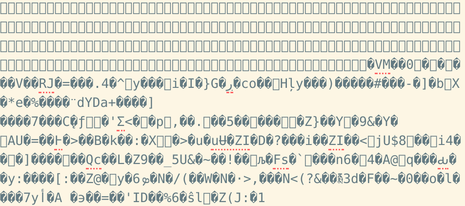
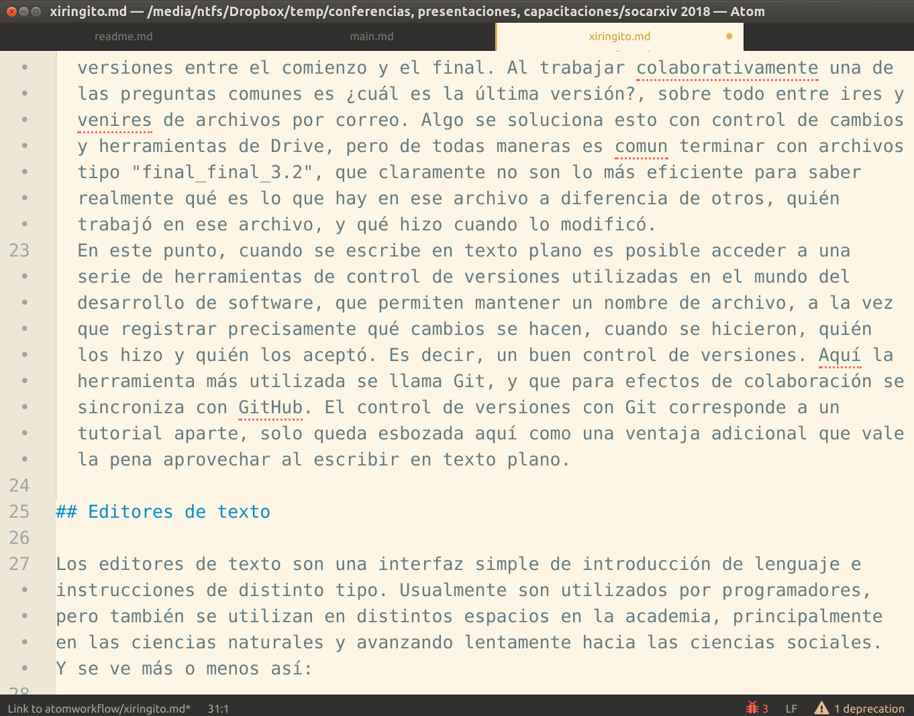
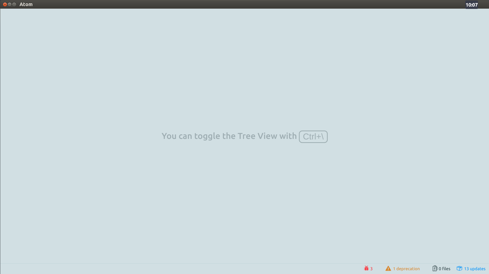
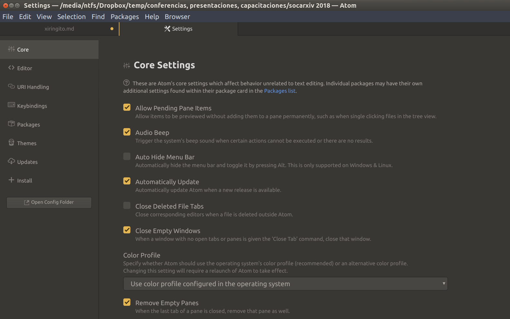
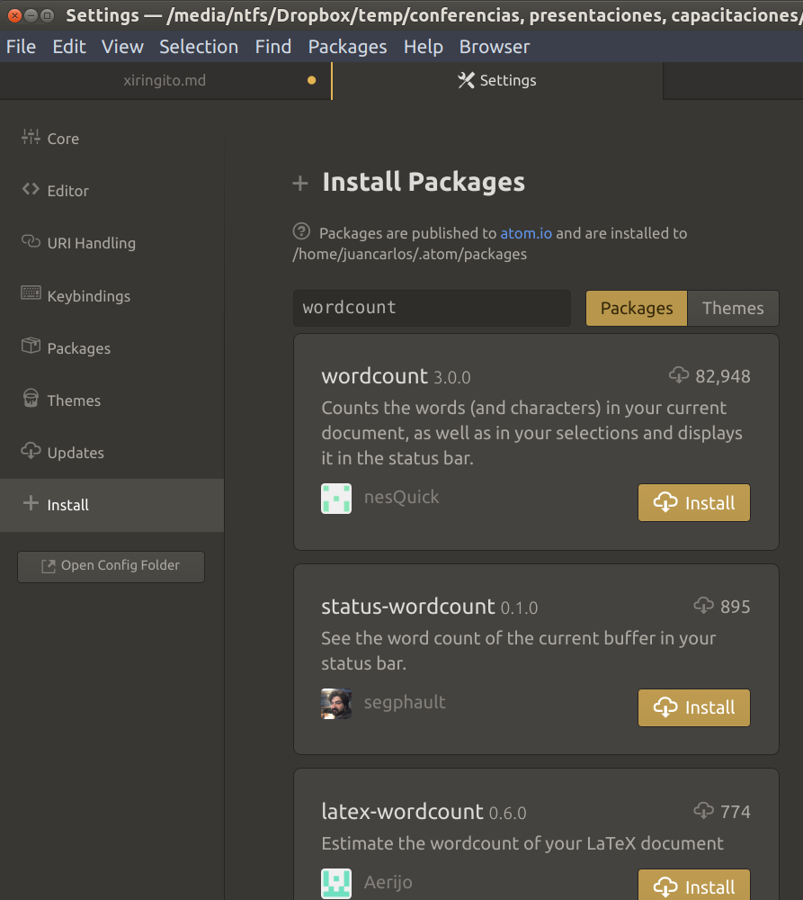

# Flujo de trabajo X(irinGITo): Escritura académica colaborativa en texto plano con Atom.

## Introducción

Todos tenemos un flujo de trabajo de escritura académica (aunque no lo identifiquemos como tal), que además incluye la colaboración con otros. Usualmente este consiste en escribir en Word, utilizar algún gestor de referencias (tipo Endnote o Mendeley), pegar tablas y gráficos producidos con otros programas como Excel/Spss/Stata, colaborar enviando archivos vía mail o por Dropbox, utilizar control de cambios, y también versionamiento (típicamente, archivo final.doc, luego final2, luego final_final, etc.)

En general, no existen incentivos para cambiar esta forma intuitiva y generalizada de trabajar. Además, tampoco parecen existir muchas alternativas. Entonces ¿Vale la pena pensar en alguna alternativa más eficiente y acorde al trabajo científico colaborativo? Si Ud. piensa que sería interesante, pero que siempre lo ha hecho así y le funciona bien, no necesita seguir leyendo. De lo contrario, si piensa darle una oportunidad a esto, le cuento como sigue. La idea central es armar un flujo de trabajo basada en texto plano, es decir, en archivos de texto que pueden ser leidos sin necesidad de un software específico. Es lo que conocemos de los archivos tipo .txt en Windows, que pueden verse en editores simples como "block de notas", o cualquier editor de texto. Uno de estos editores es Atom, que describiré con más detalle luego. A los más adultos, esto les parecerá volver al pasado si es que alguna vez previo a la era Word usaron algo así como Wordstar o Wordperfect. Y seguramente esta imagen terrible les haga pensar una vez más si vale la pena seguir leyendo: ¿No es esto volver al "pasado"?

Para poder fundamentar esta propuesta, primero voy a mencionar algunas limitaciones del flujo de trabajo intuitivo que mencioné anteriormente y que llamaré "W" (basado en "Word"). Y en segundo lugar, voy a abordar los diferentes aspectos que se requieren para montar un flujo de trabajo académico tipo "X"*, es decir: editor(es) de texto (plano), herramientas, referencias bibliográficas y colaboración.

Y por supuesto, esto no se construye sobre la nada sino que está basado en propuestas y criterios de otros autores. En primer lugar, la inspiración viene de las iniciativas actuales de Ciencia Abierta, que si bien se relacionan con temas de acceso y difusión, también se asocian a una forma de trabajo abierta y colaborativa. Y esto sin duda se asocia a reflexiones sobre la propiedad del conocimiento y la comprensión del conocimiento como algo común (Ostrom). Y en segundo lugar dos trabajos muy influyentes en temas de escritura y reproducibilidad. Uno es un artículo de Jake Bowers cuyo título es ["Six steps for a better relationship with your future self"](http://www.jakebowers.org/PAPERS/tpm_v18_n2.pdf), donde sugiere seis aspectos a tomar en cuenta en temas de reproducibilidad, no solo pensando en que otros puedan reproducir los análisis realizados sino que también uno mismo en el futuro. Si bien se enfoca en análisis de datos, el énfasis en reproducibilidad lo lleva también a la combinación de análisis y escritura en formato plano, basado en herramientas del software R como Knitr y Markdown que se comentan más adelante. Y el otro trabajo es ["The plain persons' guide to plain text in social sciences"](http://plain-text.co/), de Kieran Healey, que es bastante cercano a lo que yo propongo acá, pero con dos diferencias fundamentales: manejo de referencias y editor. Por alguna razón Healy no desarrolla con mucho detalle el manejo de referencias bibliográficas en texto plano, que según mi experiencia requiere ciertos ajustes para que funcione bien y que además es una de las principales barreras que desincentivan la escritura académica en texto plano. Y en relación al editor, Healy opta por el editor clásico Emacs, y yo propongo Atom. Las razones de esto se detallan abajo al momento de presentar los editores.

*La X es por varias cosas: por darle un carácter anónimo que cualquiera puede modificar y adaptar, por que es algo que sigue y evoluciona desde algo previo (la W), y por X de "XirinGIT-O". Un chiringito es un pequeño local montado de una manera algo incidental, usualmente en la playa. Esa imagen de algo flexible y básico, pero donde se intercambian(venden) muchas cosas, es bastante representativo de lo que pretendo mostrar acá. Lo de comenzar por X también es una parodia a Xaringan (un programa para generar presentaciones en texto plano), y lo de GIT ... es por Git, un software de control de versiones que se presenta más adelante.

## El flujo de trabajo W

La base de este flujo es el trabajo en un procesador de texto tipo Word. Conocemos sus ventajas: imita un "papel" con base en la idea de máquina de escribir, muchos botones para formato como negritas, espaciado, alineamiento de texto, y además es un formato prácticamente universal. ¿Hay algún problema con esto? Bueno, algunos:

  - Propiedad de los contenidos: ¿han tratado de abrir un archivo Word desde un editor simple, por ejemplo el "block de notas"? Lo que aparece es algo como esto:
  
  Esto es lo que el programa Word traduce para que lo veamos como un documento que simula una hoja blanca con letras. Pero, ¿qué pasa si no tenemos Word? Recordemos que Word es un programa de licencia pagada, y que seguramente no existirá por siempre. Bueno, podemos imprimir y también guardar como pdf, pero ¿con qué contenido editable nos quedaremos si en algún momento no podemos usar Word? ¿Qué pasa si trabajamos con alguien que no usa Word, tal vez por que no puede pagarlo? El lenguaje de almacenamiento de Word no es solo privativo en términos económicos, sino que hace que no seamos estrictamente los propietarios de los contenidos, sino de un código que debemos pagar (nosotros, nuestras universidades, el estado) para que sea traducido. Y entonces esto ya pasa del tema práctico a un tema más de base: si aspiramos a que la ciencia sea cada vez más abierta, colaborativa y democrática ¿es este el mejor lenguaje de trabajo?
  - Contenidos vs. formato: como en muchos productos tipo Office, hay un foco fuerte en el formato, y vamos formateando el texto a medida que vamos escribiendo. Es decir, el formato es una parte relevante del proceso de escritura. ¿Genera esto un buen flujo de trabajo? Mi impresión es que el trabajo intelectual que se plasma en la escritura debería ser principalmente de contenidos y muchas veces el formateo se convierte en una distracción que genera una distancia con los contenidos. ¿Cuántas veces hemos invertido tiempo en cambiar o reparar el formato de un texto, o de tablas que se desconfiguran, o imágenes que cambian de posición?
  - Colaboración: (PENDIENTE)
  - Control de versiones: nuestros archivos de trabajo poseen distintas versiones entre el comienzo y el final. Al trabajar colaborativamente una de las preguntas comunes es ¿cuál es la última versión?, sobre todo entre ires y venires de archivos por correo. Algo se soluciona esto con control de cambios y herramientas de Drive, pero de todas maneras es comun terminar con archivos tipo "final_final_3.2", que claramente no son lo más eficiente para saber realmente qué es lo que hay en ese archivo a diferencia de otros, quién trabajó en ese archivo, y qué hizo cuando lo modificó.
  En este punto, cuando se escribe en texto plano es posible acceder a una serie de herramientas de control de versiones utilizadas en el mundo del desarrollo de software, que permiten mantener un nombre de archivo, a la vez que registrar precisamente qué cambios se hacen, cuando se hicieron, quién los hizo y quién los aceptó. Es decir, un buen control de versiones. Aquí la herramienta más utilizada se llama Git, y que para efectos de colaboración se sincroniza con GitHub. El control de versiones con Git corresponde a un tutorial aparte, solo queda esbozada aquí como una ventaja adicional que vale la pena aprovechar al escribir en texto plano.

## Editores de texto

Los editores de texto son una interfaz simple de introducción de lenguaje e instrucciones de distinto tipo. Usualmente son utilizados por programadores, pero también se utilizan en distintos espacios en la academia, principalmente en las ciencias naturales y avanzando lentamente hacia las ciencias sociales.  Y se ve más o menos así:

El archivo que se guarda desde el editor puede tener cualquier extensión, ya que no pertenecen a alguna aplicación específica que necesite "traducir" lo que ahí esta: lo que vemos es lo que el archivo contiene.

Ahora bien, si se tiene en mente un editor como el "block de notas", probablemente no parezca muy atractivo desarrollar trabajo académico en ese entorno, ya que se requieren muchas funciones que ese editor no tiene. Por ello es que se recurre a editores especializados que ofrecen una serie de ventajas para el trabajo académico a través de aplicaciones que se pueden instalar según se requieran. A diferencia de Word, el entorno de trabajo en el editor es en gran parte diseñado en base a las necesidades que posea quien lo utiliza, lo que trae consigo gran libertad, pero también bastantes problemas al comenzar a navegar por un espacio nuevo y sin una estructura clara. Este tutorial pretende contribuir a alivianar la entrada a este mundo, proponiendo una estructura básica de trabajo que permita seguir operando sin tener que pasar meses acostumbrándose, y que sobre esta base luego permita ir adaptando el editor a sus necesidades.

### Editores

Cuando se trabaja en texto plano, muy cercano a la idea del software libre, hay multiplicidad de opciones de hacer las cosas. Es el costo de la libertad, ya que parece mucho más fácil que todos tengamos una sola manera de hacer las cosas, como en el flujo W. Sin embargo, es posible encontrar un punto intermedio, ya que finalmente personas trabajando en áreas similares terminan utilizando herramientas similares, y la complejidad se comienza a reducir.

Y esto nos lleva a una primera decisión relevante: ¿Qué editor vamos a usar? Si comenzamos a hacer una búsqueda lo más probable es toparse en primer lugar con [**Emacs**](https://www.gnu.org/software/emacs/), muy alabado y utilizado en el mundo del desarrollo de software a partir de sus inicios en 1975. Se ve más o menos así (aunque colores y letras son personalizables):

Sin duda Emacs es un referente para el resto de los editores. Sin embargo, bastante alejado a las ciencias sociales, aún cuando han existido y existen claros intentos por lograr generar un entorno de trabajo amigable y eficiente para el trabajo académico. Estos intentos se encuentran bajo el concepto de "starter kits", que establecen una configuración e instrucciones de trabajo a partir de la experiencia de usuarios. En el caso de ciencias sociales, Kieran Healey ha realizado una propuesta de un [Emacs starter kit for the social sciences](https://kieranhealy.org/resources/emacs-starter-kit/). Es una aproximación interesante, pero personalmente he intentado un par de veces utilizar Emacs y la entrada me parece un poco ruda, no está pensado en hacer la vida muy fácil para los que no somos programadores. Pero, como sucede en el mundo de software abierto, es una opción más que puede que acomode a algunos más que a otros, y que no impide para nada el trabajo colaborativo en los distintos flujos de trabajo académico que se puedan proponer. Es decir, como se trabaja en texto plano, los archivos pueden ser leídos por distintos editores y no hay obligación de usar uno en específico.

Además de Emacs, menciono un par de alternativas más antes de presentar mi editor de preferencia (actual), Atom. [Vim](https://www.vim.org/) es un editor basado en Unix, orientado a programación y de bastante preferencia para usuarios Mac. Y otro muy interesante y utilizado es [Sublime](http://www.sublimetext.com/), que me parece que por temas de estética y fácil operación ha permitido abrir el mundo de los editores a usuarios comunes y corrientes. ¿Mayor desventaja? Es pagado. Aún cuando el valor es bajo, de todas maneras me parece una barrera comercial y también de sentido en términos de ciencia abierta.

**Atom**

[Atom](https://atom.io/) es un editor que se lanza el 2014. Para quienes han trabajado en Sublime, es bastante parecido, con la diferencia fundamental que es totalmente libre. Además posee un foco en control de versiones, ya que fue desarrollado por los creadores de Github. Y si comparan las páginas web de Atom con las de Emacs o Vim inmediatamente se darán cuenta de una estética distinta. En simple: Atom es más bonito y amigable.

Otras características:

- multiplataforma (funciona en Windows, Mac y Linux)
- muy dinámico, ya que se desarrolla a partir de la colaboración de los usuarios, constantemente aparecen nuevas opciones, y hay posibilidad de preguntar y sugerir.
- muchas opciones estéticas de destacado de sintaxis (highlighting), colores, cursores, etc.
- soporte para lenguajes de escritura (como Markdown y Latex), así como también de análisis de datos (R, Stata)
- posibilidad de escritura colaborativa en tiempo real

_Instalación_

- Simplemente, bajar desde su [página principal](https://atom.io/) en el entorno que corresponda (Windows - Linux - Mac)
- Lo que veran al abrirlo es probablemente algo como esto:

- Por defecto, al abrir Atom aparece una pantalla vacía con sugerencias de combinaciones de teclas (atajos de teclado) que cumplen una función. Esto luego se puede desactivar en las opciones del programa.
- También debería aparecer un menú arriba con diferentes funciones, si no aparece se activa con la tecla Alt.
- Lo primero que vamos a hacer es abrir un documento en blanco con File -> New File (o con el atajo Ctrl + n). Lo que veremos es que aparece una nueva pestaña que dice "untitled" (sin título). Y en este espacio se puede comenzar a escribir y luego guardar el archivo Con File -> Save (o ctrl + s).
- En general muchas operaciones con Atom se pueden hacer vía menú activado con mouse, pero para ser más eficiente se recomienda acostumbrarse a los atajos de teclado.
- Los menues de Atom son enfocados principalmente en el manejo de los contenidos de la hoja (documento), como por ejemplo el menu Selection que se refiere a distintas maneras de seleccionar texto, o la función View -> "Toggle soft wrap" que es para activar que las lineas se adapten a un margen dentro de la pantalla para facilitar la visualización.
- De todos estos, el menú más interesante es "Packages", ya que ahí se iran incorporando los diferentes complementos que se instalen. Desde este menú también se puede acceder a la configuración general con Packages -> Settings View -> Open

En Core hay varias opciones generales que en principio no se requieren modificar, al igual que en varias de las otras pestañas. De aquí las mas interesantes son
- "Packages": muestra los paquetes pre-instalados (core packages) y también los que se van instalando.
- "Themes": es la configuración de aspecto del editor (UI Theme) y de la sintaxis (Syntax theme). Es un tema principalmente estético, se puede configurar totalmente a gusto o optar por alguna de las alternativas que otros han desarrollado y que se pueden instalar..
- "Install": buscar e instalar nuevos paquetes. Atom viene con muy pocas opciones por defecto, y la idea es que mediante la instalación de paquetes se va adaptando a las necesidades del usuario. Los paquetes son gratuitos y libres (de fuente abierta), muchos de ellos generados por usuarios que luego ponen a disposición de otros en el espíritu de la generosidad y del trabajo colaborativo.

Vamos a dar un ejemplo de instalación de un paquete: Wordcount. Atom no tiene por defecto un contador de palabras, pero puede resultar útil tenerlo para escritura académica. Para ello vamos a Settings (ctrl + ,) y la pestaña Install. En la ventana de búsqueda escribimos wordcount y luego tecla Enter (asumiendo que se está conectado a internet). Abajo de la ventana aparecen una serie de cajas que contienen elementos relacionados con la búsqueda:

En la imagen aparecen tres resultados en distintas "cajas" (wordcount, status-wordcount, latex-wordcount) y la lista continúa. Este es un buen ejemplo de las opciones que ofrece el editor: hay distintas alternativas que cumplen la misma función. ¿Cuál elegir? Se puede tomar como criterio la referencia de alguien más, o también el número de personas que han bajado la librería (número aparece arriba a la derecha en cada caja), y /o se puede hacer click sobre el nombre de cada uno que lleva a la página donde se explica con mayor detalle lo que la librería hace. Por ahora, vamos a instalar la primera haciendo click en "Install". El botón comienza a simular un movimiento, que indica que está en proceso de instalación, y luego cuando está instalado aparecen los botones Settings, Uninstall y Disable.

En Settings se accede a las distintas opciones del paquete y también a las instrucciones, que en general son variables en su detalle según el programador. En general vienen opciones por defecto que permiten un funcionamiento adecuado para la mayoría. Como ejemplo de funciones específicas que se pueden activar en este paquete podemos ver una que se llama "Do you get paid per word?" que está orientada principalmente a traductores que cobran por palabra. Activando esta opción y poniendo el precio cobrado por palabra pueden ver en tiempo real cuánto han ganado. Ahora que el paquete ya está instalado, volvemos a la pestaña del documento en que estamos trabajando y en la barra de abajo hacia la derecha aparece sutilmente el contador de palabras (W) y caracteres (C). Si por alguna razón esta opción se desea desactivar sin tener que desinstalar la librería, entonces volver al menú de configuración, en Installed Packages buscar wordcount y proceder con el botón correspondiente.

[aquí pendiente ejemplos de personalización del editor]()

Con esto termina la presentación de los básicos del editor, para mayores detalles existen una serie de materiales y cursos en línea que permiten explorar otras funciones. De aquí en adelante me voy a centrar en los paquetes necesarios para establecer el flujo de trabajo de escritura académica.

## Flujo X parte 1: Escritura

Cuando comencé a escribir esto me encontré con el blog de [Scott Selisker](http://u.arizona.edu/~selisker/post/workflow/), quien también realiza una propuesta de flujo de trabajo en texto plano en Atom. O sea, prácticamente lo mismo que estaba haciendo yo ... sin embargo, queda al nivel de una buena introducción pero creo que no alcanza a hacer realmente el puente para que los que trabajan en el flujo W se pasen al X. De todas maneras, tomo varias ideas de aquí y también de un [hilo de discusión de Atom sobre escritura académica](https://discuss.atom.io/t/using-atom-for-academic-writing/19222/55). Y por supuesto, del [libro de Kieran Healey sobre texto plano para ciencias sociales](http://plain-text.co/).

### Markdown

### Paquetes para flujo X

- listado de paquetes esenciales

### Otros paquetes útiles

## Flujo X parte 2: Referencias bibliográficas

## Flujo X parte 3: Control de versiones
