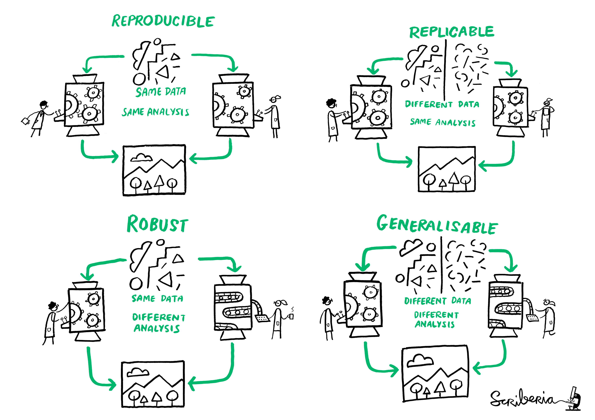
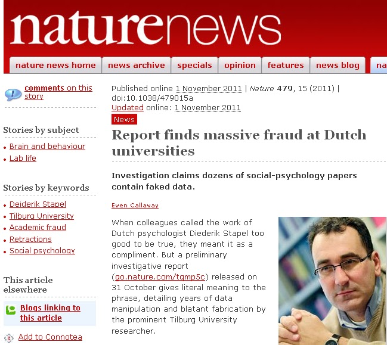
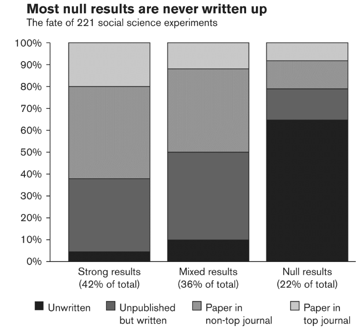

background-image: url("https://cutewallpaper.org/21/black-gif-background/Particles-Flying-Up-Free-HD-Animation-Black-Background-GIF.gif")
background-position: center
background-size: contain

class: inverse right


```{r setup, include=FALSE}
options(htmltools.dir.version = TRUE)
pacman::p_load(RefManageR)
# bib <- ReadBib("merit_pref_int.bib", check = FALSE)
```

```{r eval=FALSE, include=FALSE}
# Para que funcione el infinite moon reader, correr desde el root!
```

```{r setup2, include=FALSE, cache = FALSE}
require("knitr")
#options(htmltools.dir.version = FALSE)
pacman::p_load(RefManageR)
# bib <- ReadBib("../../bib/electivomultinivel.bib", check = FALSE)
opts_chunk$set(warning=FALSE,
             message=FALSE,
             echo=TRUE,
             cache = TRUE,fig.width=7, fig.height=5.2)
```

```{r xaringanExtra, echo=FALSE}
xaringanExtra::use_xaringan_extra(c("tile_view", "animate_css"))
```

```{r xaringanExtra-share-again, echo=FALSE}
xaringanExtra::use_share_again()
```


<!---
Para correr en ATOM
- open terminal, abrir R (simplemente, R y enter)
- rmarkdown::render('static/docpres/07_interacciones/7interacciones.Rmd', 'xaringan::moon_reader')

About macros.js: permite escalar las imágenes como [scale 50%](path to image), hay si que grabar ese archivo js en el directorio.
--->


## Reproducibilidad

<br>
<br>

Panel Ciencia Abierta 

Conferencia COES-DESOC Noviembre 2020
<br>
<br>

Juan Carlos Castillo

[jc-castillo.com](http://jc-castillo.com/)


---
class: roja right bottom

# ¿Existe una crisis de reproducibilidad?

---
class: center



---
class: center


.small[
Fuente: [Baker (2016) 1,500 scientists lift the lid on reproducibility - Nature](https://www.nature.com/news/1-500-scientists-lift-the-lid-on-reproducibility-1.19970)]

---
.pull-left[
]


---


---
## Franco et al (2014) Sesgo de publicaciones
.center[
]


---
# Cultura de "publica o perece" (publish or perish)

## Posibles correlatos:

- Temor a que "te roben la idea" -> evitar poner datos/código a disposición de terceros

- p-hacking : "presionar los datos" para rechazar hipótesis nula

- falseamiento de datos

---
## Ciencia abierta: Vuelta a los principios  de la ciencia (Merton)

- **Universalismo**: cualquier persona puede contribuir al conocimiento científico, independiente de su origen.

--

- **Comunalidad**: los hallazgos de la ciencia pertenecen a la comunidad y no a quién los descubrió.

--

- **Desinterés**: la conducta de investigadores debe estar orientada por la búsqueda de la verdad, no con intereses personales ni monetarios.

--

- **Escepticismo organizado**: los hallazgos no se aceptan porque sí, se requieren pruebas.

---
class: roja bottom right

# Hacia la reproducibilidad


---
# Herramientas que favorecen la reproducibilidad

**1. Escritura en texto plano/simple (Markdown / Latex)**

- libre de plataformas comerciales


- propiedad y transferencia de los contenidos


- foco en contenido en lugar de formato


---
# Herramientas que favorecen la reproducibilidad

**2. Flujo de trabajo reproducible**

- carpetas autocontenidas


- documentación


- accesibilidad vía repositorios abiertos (ej Github)

Ej:  protocolo [IPO](https://juancarloscastillo.github.io/ipo/index_es.html)

---
# Herramientas que favorecen la reproducibilidad

**3. Apertura en el proceso de investigación** 

- pre-registros

- proyectos abiertos en [Open Science Framework](https://osf.io/) o plataformas equivalentes


---
class: inverse
## Resumen (I)

- Crisis de acceso <-> crisis de reproducibilidad

- Publica (alto impacto) o perece -> fomento de la irreproducibilidad

- Escasa publicación de estudios con resultados nulos

- Dilemas de eficiencia y éticos

---
class: inverse

## Resumen (II): Hacia la  reproducibilidad
- Escritura abierta (texto simple/plano)

- Repositorio con datos y código de análisis abierto

- Flujo de trabajo documentado y reproducible 

- Publicación abierta y oportuna

---
class: middle center
Más información: sitio del curso .red[Investigación Social Abierta] - Pregrado Sociología FACSO 2020

# [https://cienciasocialabierta.netlify.app/](https://cienciasocialabierta.netlify.app/)


---
class: inverse center middle

¡Muchas gracias!
---
background-image: url("https://cutewallpaper.org/21/black-gif-background/Particles-Flying-Up-Free-HD-Animation-Black-Background-GIF.gif")
background-position: center
background-size: contain

class: inverse right


## Reproducibilidad

<br>
<br>

Panel Ciencia Abierta 

Conferencia COES-DESOC Noviembre 2020
<br>
<br>

Juan Carlos Castillo

[jc-castillo.com](http://jc-castillo.com/)

