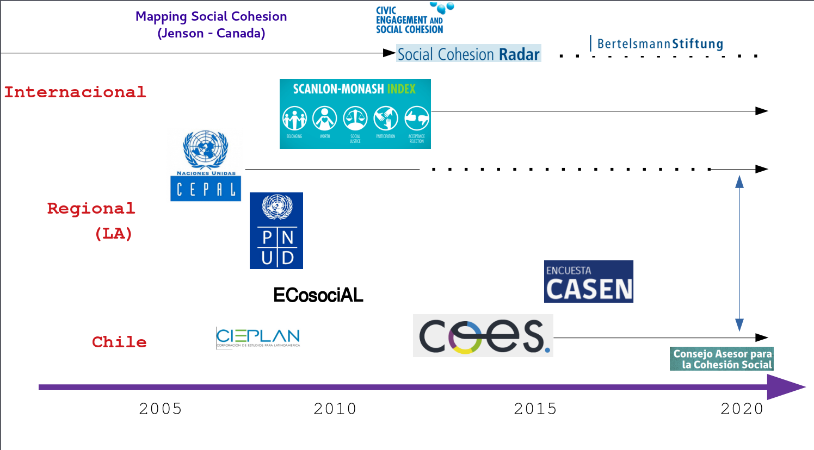
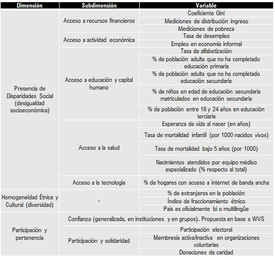
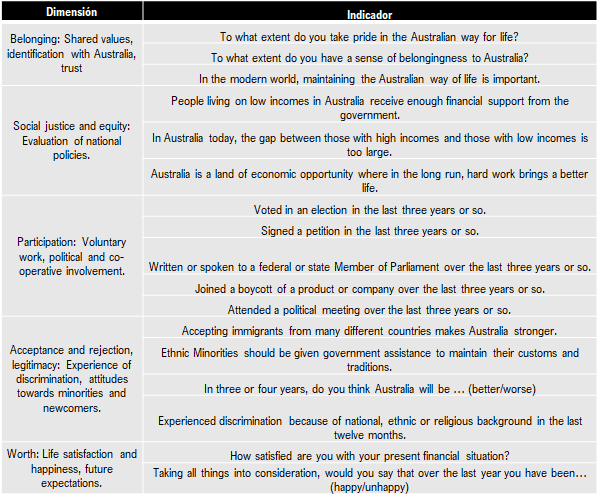
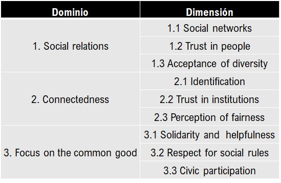
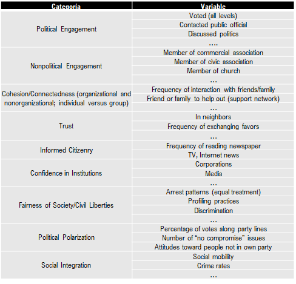
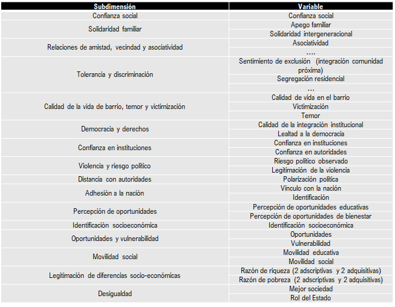
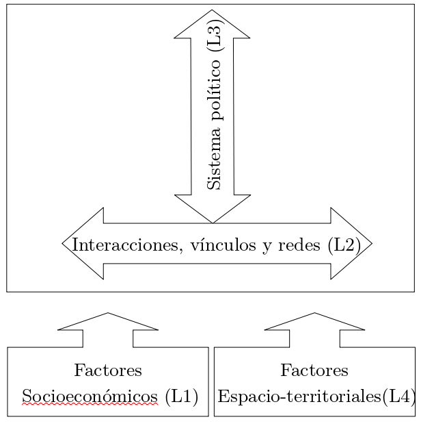

class: middle hide-logo title

```{r setup, include=FALSE}
options(htmltools.dir.version = TRUE)
pacman::p_load(RefManageR)
# bib <- ReadBib("merit_pref_int.bib", check = FALSE)
```

```{r eval=FALSE, include=FALSE}
# Para que funcione el infinite moon reader, correr desde el root!
```

```{r setup2, include=FALSE, cache = FALSE}
require("knitr")
#options(htmltools.dir.version = FALSE)
pacman::p_load(RefManageR)
# bib <- ReadBib("../../bib/electivomultinivel.bib", check = FALSE)
opts_chunk$set(warning=FALSE,
             message=FALSE,
             echo=TRUE,
             cache = TRUE,fig.width=7, fig.height=5.2)
```

```{r xaringanExtra, echo=FALSE}
xaringanExtra::use_xaringan_extra(c("tile_view", "animate_css"))
```

```{r xaringanExtra-share-again, echo=FALSE}
xaringanExtra::use_share_again()
```


<!---
Para correr en ATOM
- open terminal, abrir R (simplemente, R y enter)
- rmarkdown::render('static/docpres/07_interacciones/7interacciones.Rmd', 'xaringan::moon_reader')

About macros.js: permite escalar las imágenes como [scale 50%](path to image), hay si que grabar ese archivo js en el directorio.
--->


.center[
### Jornada Cohesión Social COES - Enero 2021 
]

???

---
class: inverse bottom rigth

# El mapa


---




---
class: inverse 

## Resumen

<br>

- Década del 2000: Auge de trabajos empíricos y conceptuales a nivel nacional y regional (LA) en la década del 2000

- 2010 en adelante:
  - énfasis en medición con indicadores de encuestas
  - distintos modelos que tienden hacia variables subjetivas

---
class: roja bottom right

# Experiencias internacionales 
---

.pull-left[

.center2[#### Mapping Social Cohesion 

]
]

.pull-right[

.center2[
#### Scanlon Monash Index

]

]
 
---

.pull-left[
.center2[
#### Social Cohesion Radar
 

]]

.pull-right[

.center2[
#### Civic Engagement and Social Cohesion


]
]

---
.center2[

#### ECOsociAL


]

---
# Detalles:


Detalles: Documento **"Conceptos y medición de cohesión social en proyectos internacionales"** [https://ocscoes.github.io/concepto-medicion/](https://ocscoes.github.io/concepto-medicion/)


---
class: inverse, middle, center

# Dilemas
---
## Dilemas

1. Inclusión de conceptos e indicadores **"objetivos"** dentro del concepto de cohesión social.

2. **Número** y **estructura** de indicadores: versiones maximalistas vs minimalistas y consecuencias comunicacionales

3. **Definiciones** conceptuales vs análisis ("informes de cohesión social)


---
# Propuesta de orientación minimalista

Cohesión social: 

“a state of affairs concerning both the .red[vertical and horizontal]
interactions of society as characterized by a set of attitudes and norms that includes trust, a sense of belonging and the willingness to participate and help, as well as their behavioral manifestations” (Chan et al., 2006: 290)

<br>

.tiny[Chan, J., To, H.-P., & Chan, E. (2006). Reconsidering Social Cohesion: Developing a Definition and Analytical Framework for Empirical Research. Social Indicators Research, 75(2), 273–302. https://doi.org/10.1007/s11205-005-2118-1
]

---
.pull-left-narrow[
<br>
## Un modelo .blue[bidimensional] para el estudio del conflicto y la cohesión social
]

.pull-right-wide[
.right[
]
]


???

- Distinción entre lo que queremos explicar y lo que se explica (explanandum y explanans)
- Una cosa es el concepto de cohesión, otra cosa son los factores asociados. No incluir  hipótesis en la definición de objetos de estudio.
- por lo tanto, esto es un marco de estudio / acción para el estudio y las políticas de cohesión social.

---
class:middle hide-logo title


