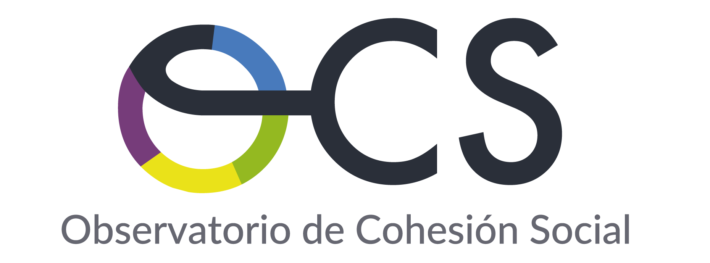
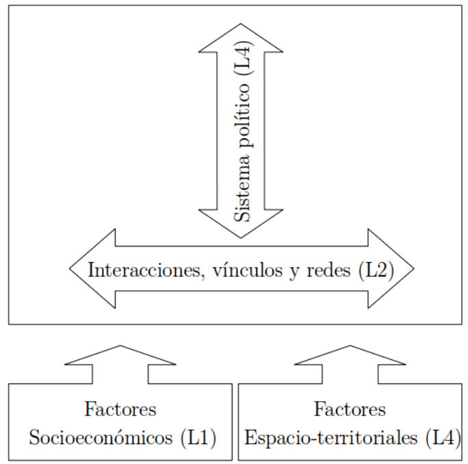
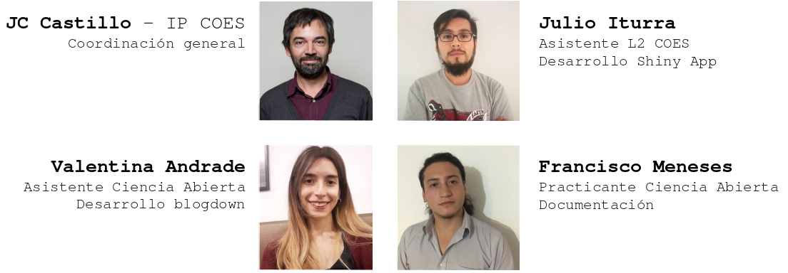

class: middle hide-logo title

```{r setup, include=FALSE}
options(htmltools.dir.version = TRUE)
pacman::p_load(RefManageR)
# bib <- ReadBib("merit_pref_int.bib", check = FALSE)
```

```{r eval=FALSE, include=FALSE}
# Para que funcione el infinite moon reader, correr desde el root!
```

```{r setup2, include=FALSE, cache = FALSE}
require("knitr")
#options(htmltools.dir.version = FALSE)
pacman::p_load(RefManageR)
# bib <- ReadBib("../../bib/electivomultinivel.bib", check = FALSE)
opts_chunk$set(warning=FALSE,
             message=FALSE,
             echo=TRUE,
             cache = TRUE,fig.width=7, fig.height=5.2)
```

```{r xaringanExtra, echo=FALSE}
xaringanExtra::use_xaringan_extra(c("tile_view", "animate_css"))
```

```{r xaringanExtra-share-again, echo=FALSE}
xaringanExtra::use_share_again()
```


<!---
Para correr en ATOM
- open terminal, abrir R (simplemente, R y enter)
- rmarkdown::render('static/docpres/07_interacciones/7interacciones.Rmd', 'xaringan::moon_reader')

About macros.js: permite escalar las imágenes como [scale 50%](path to image), hay si que grabar ese archivo js en el directorio.
--->



.center[
### Seminario CEPAL-COES, 11 Nov 2020 
]

---
class: inverse center

<br>

El **Observatorio de Cohesión Social** es un .red[portal interactivo] que permite  realizar análisis comparativos de distintos .red[indicadores] asociados a cohesión social con foco en .red[América Latina] entre 2004 y 2018.

--

<br>

Utiliza la base de la encuesta .red[LAPOP] (Latin American Public Opinion Project), olas 2004, 2006, 2008, 2010, 2012, 2014, 2016 y 2018. 


---
class: roja bottom right

# Bases conceptuales

---
class: middle right

# Cohesión social

<br>

“a state of affairs concerning both the .red[vertical and horizontal]
interactions of society as characterized by a set of attitudes and norms that
includes trust, a sense of belonging and the willingness to participate and help, as well as their behavioral manifestations” (Chan et al., 2006: 290)


---
.pull-left-narrow[
<br>
## Un modelo .blue[bidimensional] para el estudio del conflicto y la cohesión social
]

.pull-right-wide[
.right[
]
]


---

class: roja bottom right

# OCS

---
# Características (1)

- Selección de indicadores de cohesión social horizontal y vertical de la base agregada .blue[LAPOP]

- Indicadores .red[repetidos] en el tiempo

- Tipos de análisis:

  - Univariado
  - Longitudinal
  - Bivariado

---
# Características (2)

- Interactivo

- Simple y autoexplicativo

- Exploratorio

- .red[Abierto]

  - generado con herramientas de código abierto como [`blogdown`](https://github.com/rstudio/blogdown) y [`Shiny`](https://shiny.rstudio.com/)
  
  - código de programación abierto en [repositorio Github](https://github.com/ocscoes/)

---
# Equipo



---
class: inverse

## Acceso OCS

- Desde [www.coes.cl]() -> Investigación -> Observatorio de Cohesión Social

- Directo en [ocs-coes.netlify.app](https://ocs-coes.netlify.app/)

- Abreviado: [bit.ly/ocs-coes](https://bit.ly/ocs-coes)


---
class:middle hide-logo title


