class: inverse, right

```{r setup, include=FALSE, cache = FALSE}
require("knitr")
library("pacman")
p_load(xaringan)
options(htmltools.dir.version = FALSE)
```

<!---
Para correr en ATOM
- open terminal, abrir R (simplemente, R y enter)
- rmarkdown::render('demosal2019.Rmd', 'xaringan::moon_reader')

About macros.js: permite escalar las imágenes como [scale 50%](path to image), hay si que grabar ese archivo js en el directorio.
--->

<br>
<br>
<br>
<br>

# Preferencias redistributivas en contextos desiguales:<br> América Latina 2008 - 2014
<br>
## Gonzalo Franetovic & Juan Carlos Castillo
### FONDECYT 1160921 - COES - Universidad de Chile
Conferencia DEMOSAL - Santiago, Mayo 2019

---

layout: true
class: animated, fadeIn

---
# Marco general

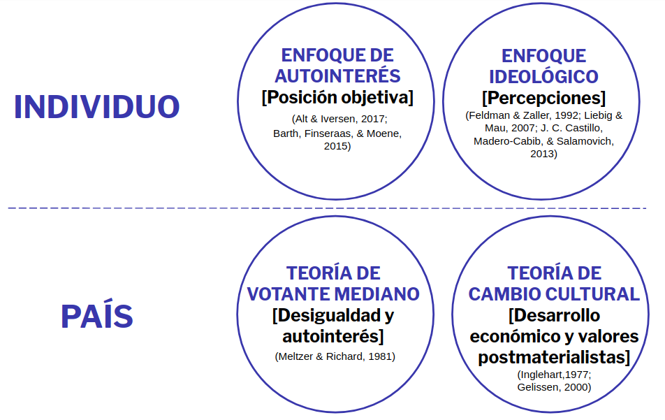

---
# Preguntas de investigación

--
## - ¿Cómo se relaciona el ingreso con el acuerdo individual por redistribución en América Latina?

--
## - ¿En qué medida la desigualdad y el desarrollo económico en América Latina afectan en la formación de las preferencias redistributivas?

--
## - ¿Cómo cambian las prefrencias redistributivas en América Latina?

---
# Modelo & hipótesis

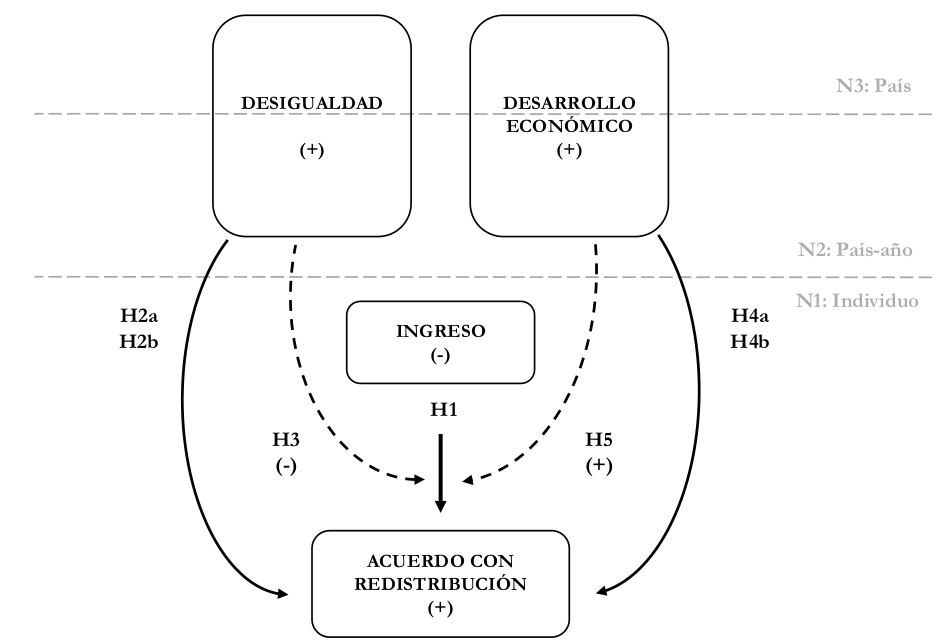
---
class: roja, middle, center,slideInRight

## Metodología
---
## Datos:

- Individual: Encuesta LAPOP 2008, 2010, 2012 y 2014

- Nacional: CEPALSTAT

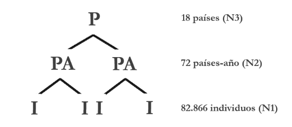

---
## Variables

### Dependiente: Acuerdo con la redistribución:

  - _"El Estado (gentilicio) debe implementar políticas firmes para reducir la desigualdad de ingresos entre ricos y pobres. ¿Hasta qué punto está de acuerdo o en desacuerdo con esta frase?"_ (1: muy en desacuerdo, 7: muy de acuerdo)

### Independientes:

- Individual: Ingreso, educación, confianza en instituciones, controles (sexo, edad, orientación política)

- País: Gini & PIB per cápita

---
## Variables

.center[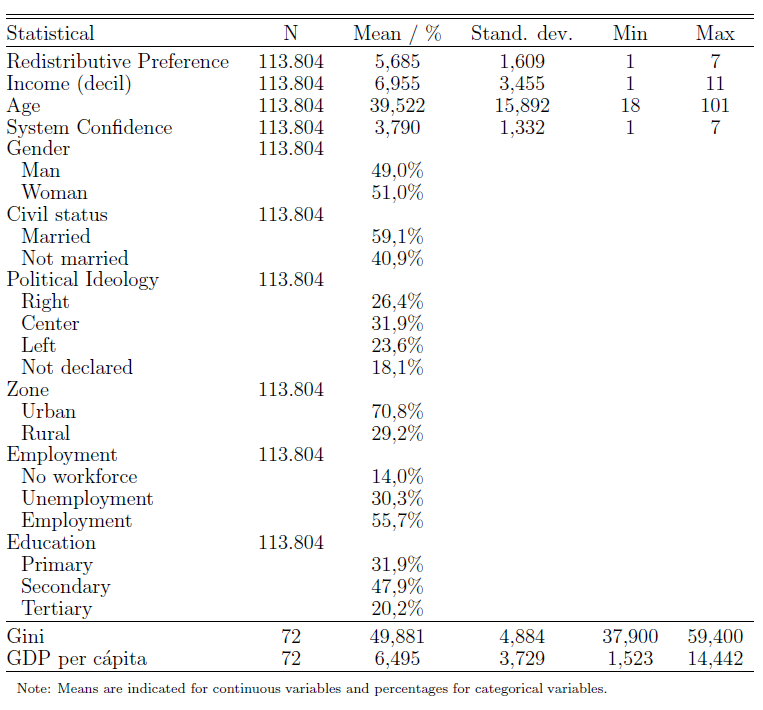]

---
## Método de análisis

Modelos de híbridos de regresión multinivel (Schmidt-Catran 2016).

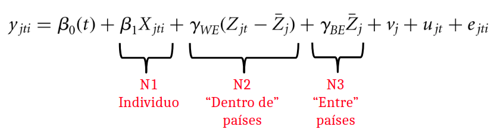
---
class: roja, middle, center,slideInRight
## Resultados
---
# Acuerdo con la redistribución
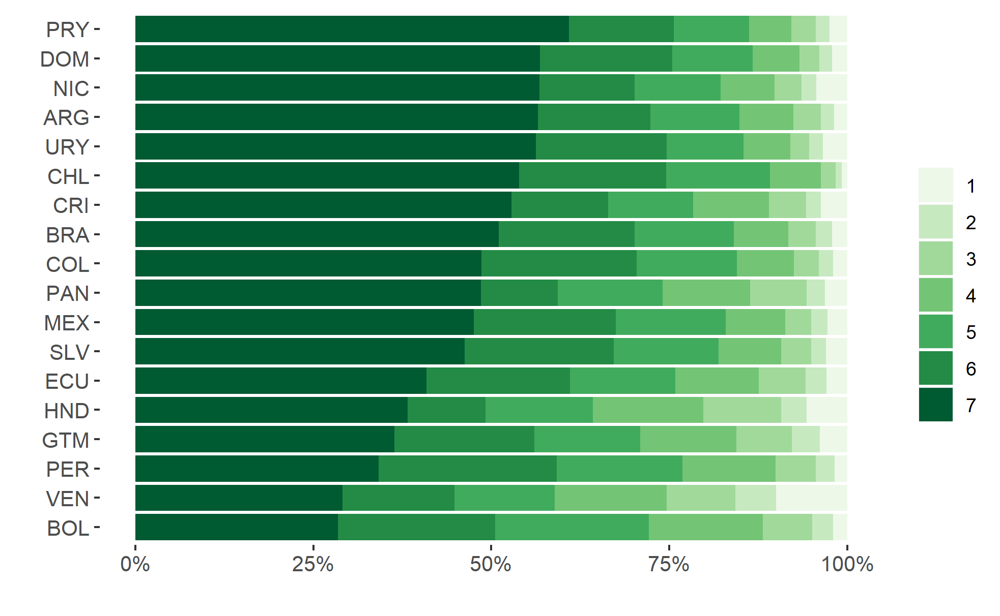

---
# Redistribución / tiempo
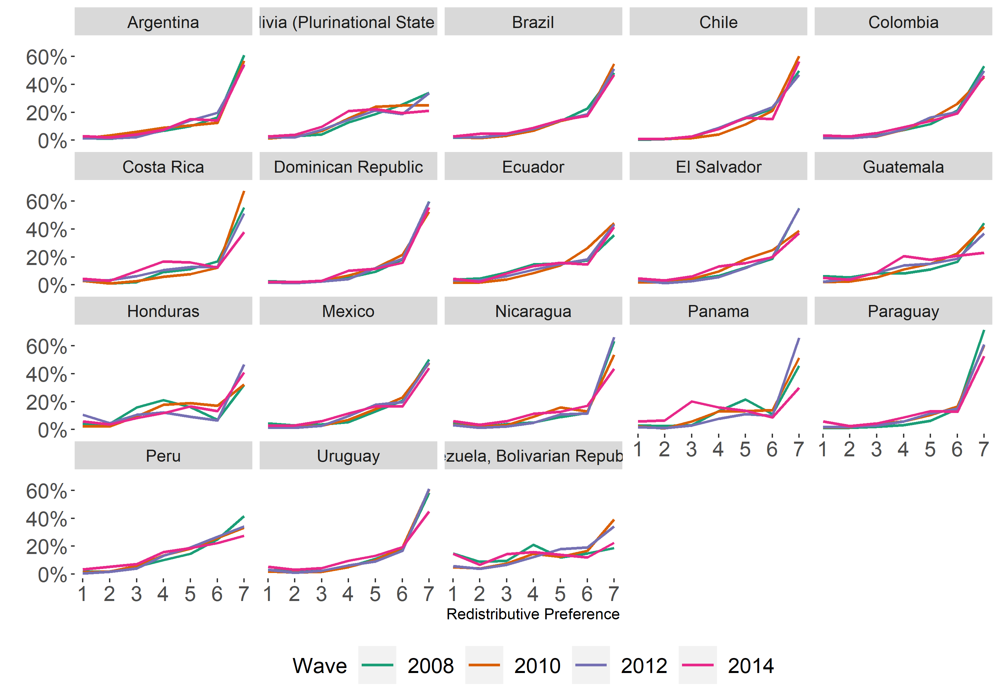

---
# Redistribucion y desigualdad por país
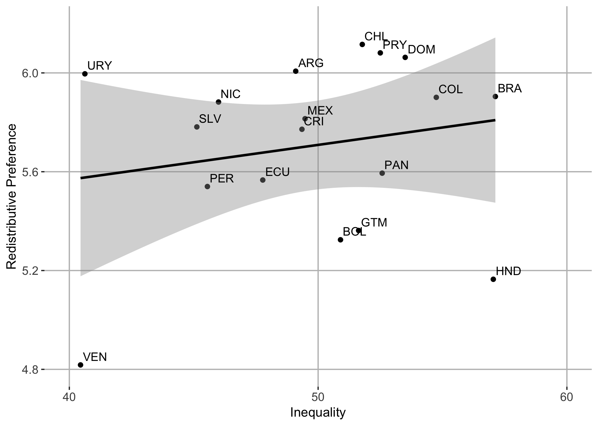
---
# Redistribucion y desigualdad por país-tiempo
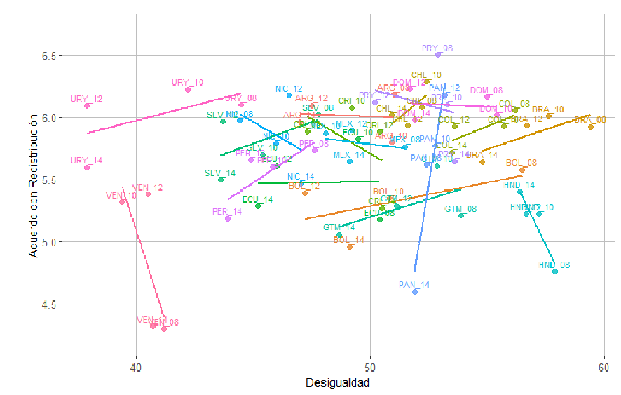
---
# Redistribucion y PIB por país
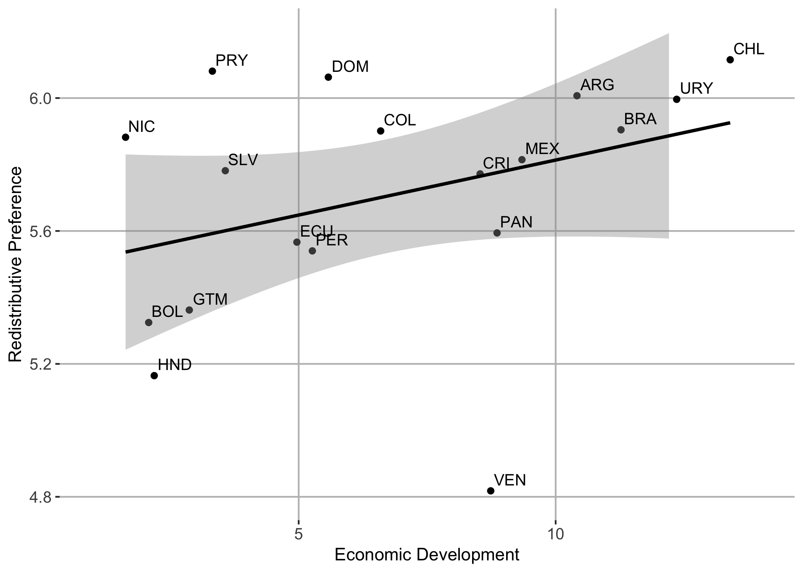
---
# Redistribucion y PIB por país-tiempo
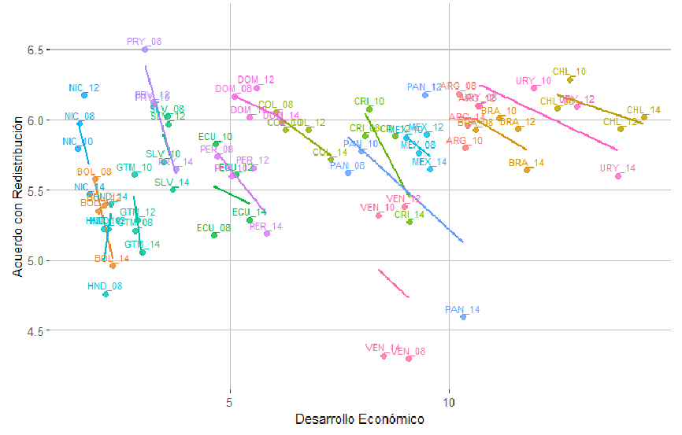
---
# Modelos: Variables individuales
.center[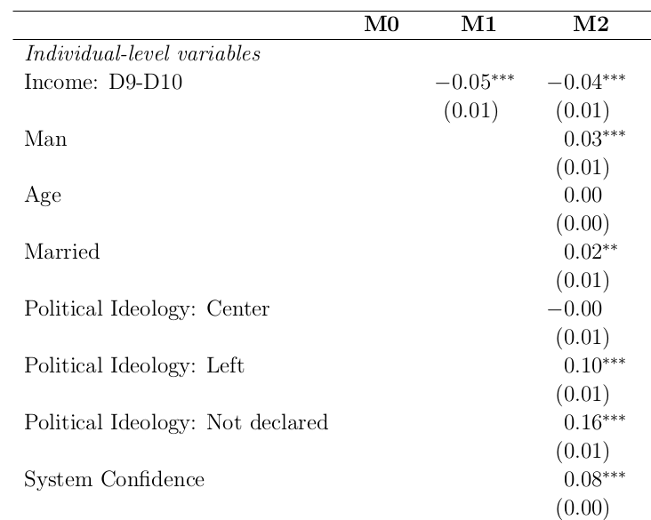]
---
# Modelos: Variables país y año-país
.center[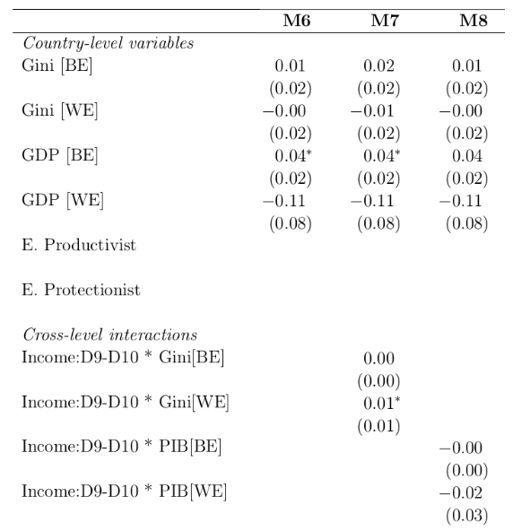]
---
# Interacciones
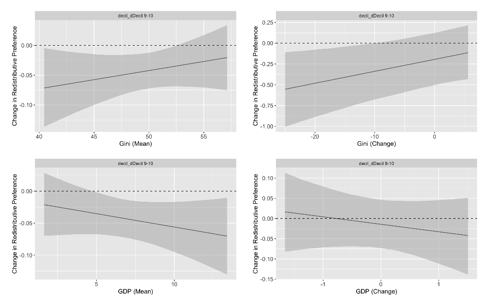
---
class:roja, middle, center,slideInRight

## Conclusiones

---
class:inverse

# Conclusiones

--

## 1. Ingreso y redistribución

--

## 2. Variables políticas: confianza e identificación

--

## 3. Consenso en A.Latina respecto de redistribución?

###   - patrones similares entre y dentro de países

###   - bajo efecto de variables contextuales

---
class: right, slideInRight
<br>
<br>
<br>
<br>

# Preferencias redistributivas en contextos desiguales:<br> América Latina 2008 - 2014
<br>
## Gonzalo Franetovic & Juan Carlos Castillo
### FONDECYT 1160921 - COES - Universidad de Chile
Conferencia DEMOSAL - Santiago, Mayo 2019
