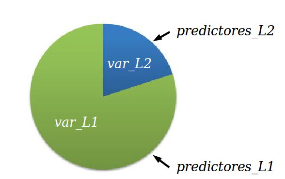
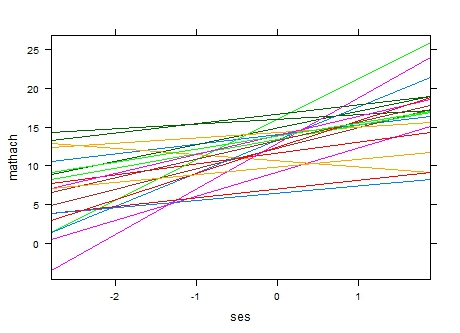

class: bottom, right, inverse

```{r eval=FALSE, include=FALSE}
# Correr esto para que funcione el infinite moonreader, el root folder debe ser static para si dirigir solo "bajndo" en directorios hacia el bib y otros

xaringan::inf_mr('/static/docpres/02_bases/2mlmbases.Rmd')
```

```{r setup, include=FALSE, cache = FALSE}
require("knitr")
options(htmltools.dir.version = FALSE)
pacman::p_load(RefManageR)
# bib <- ReadBib("../../bib/electivomultinivel.bib", check = FALSE)
opts_chunk$set(warning=FALSE,
             message=FALSE,
             echo=TRUE,
             cache = TRUE,fig.width=7, fig.height=5.2)
```

<!---
Para correr en ATOM
- open terminal, abrir R (simplemente, R y enter)
- rmarkdown::render('static/docpres/02_bases/2mlmbases.Rmd', 'xaringan::moon_reader')

About macros.js: permite escalar las imágenes como [scale 50%](path to image), hay si que grabar ese archivo js en el directorio.
--->

.pull-left[.center[
<br>
<br>
<br>
<br>
<br>
<br>
<br>
<br>
]]

.pull-right[
# Modelos Multinivel
### Juan Carlos Castillo
### Sociología FACSO - UChile
### 2do Sem 2019
### [multinivel.netlify.com](https://multinivel.netlify.com)

<br>

## Sesión 5: Efectos aleatorios
]

---
class: roja, middle, center

# Resumen sesión anterior
## (... y general)


---
## Parámetros


---
## Comparación Modelos

```{r echo=FALSE}
pacman::p_load(
haven,  # lectura de datos formato externo
car, # varias funciones, ej scatterplot
dplyr, # varios gestión de datos
stargazer, # tablas
corrplot, # correlaciones
ggplot2, # gráficos
lme4) # multilevel
```

```{r, echo=FALSE}
mlm <-read_dta("http://www.stata-press.com/data/mlmus3/hsb.dta")
mlm=mlm %>% select(minority,female,ses,mathach,size,
  sector,mnses,schoolid) %>% as.data.frame()
agg_mlm=mlm %>% group_by(schoolid) %>%
  summarise_all(funs(mean)) %>% as.data.frame()
reg<- lm(mathach~ses+female+sector, data=mlm)
reg_agg<- lm(mathach~ses+female+sector, data=agg_mlm)
```


.small[
```{r echo=FALSE}
stargazer(reg,reg_agg,
  column.labels=c("Individual","Agregado"),
  type ='text')
```
]

---
# Varianzas



---
class: roja, middle, center

# Correlación intra-clase

## "Proporción de la varianza de la variable dependiente que se asocia a la pertenencia a unidades de nivel 2"

---
# Pasos (usuales) en la estimación del modelo
 
 0  Modelo nulo

1.  Modelo con variables individuales

2.  Modelo con variables contextuales

3.  Modelo con variables individuales y contextuales

4.  Modelo con pendiente (individual) aleatoria

5.  Modelo con variables individuales, contextuales e interacción entre
    niveles (cross-level interaction)
---
## 3.Modelo con variable independiente individual y grupal


---
## 4.Modelo con pendiente aleatoria


---
## 4.Modelo con (intercepto y) pendiente aleatoria


---
## Componentes de la varianza


---
# Ejemplo Estimación en R

### librería lme4

-   función lmer (linear mixed effects)

-   forma general:

    -   `objeto <- lmer (depvar ~ predictor_1 + predictor_2 + predictor_n + (1 | cluster), data=data)`

    -   el objeto contiene la información de la estimación; para ver un
        resumen, `summary(objeto)`, y de manera más presentable,
        `screenreg(objeto)`

### -> Práctica B
---
class: inverse

# Resumen

- datos con estructura jerárquica

- descomposición de la varianza (de la variable dependiente) según niveles de análisis

- correlación intra-clase

- variables nivel 1 y nivel 2 (... y nivel _n_)

- coeficientes aleatorios (intercepto/pendiente)


---
class: roja, middle, center

## Esta sesión:


# Profundización efectos aleatorios


---
# Modelo con coeficientes aleatorios

-   El modelo permite la estimación de coeficientes fijos y aleatorios

-   Fijos: los mismos para todos los casos

-   Aleatorios: distintos, pero iguales para cada grupo

-   En general, se utiliza el termino “efectos aleatorios” para el
    modelo nulo, y coeficientes aleatorios para modelos con pendiente
    aleatoria.

-   En este curso, vamos a utilizar “efecto” para referirnos a las
    desviaciones de cada grupo, y “coeficientes” para la estimación
    total del grupo (coeficiente=efecto fijo + efecto aleatorio)

---
# Modelo con coeficienes aleatorios
<br>


---
# Modelo con coeficienes aleatorios

-   A partir de la estimación del modelo, es posible predecir el valor
    de los efectos aleatorios ( $\mu$ ) para cada unidad de nivel 2

-   Para el intercepto: $\mu_{01},\mu_{02},\mu_{03} ... \mu_{0N}$

-   Para la pendiente: $\mu_{11},\mu_{12},\mu_{13} ... \mu_{1N}$

---
## Notas sobre estimación

-   2 tipos de parámetros: fijos y aleatorios (varianzas)

-   Para poder conocer (estimar) el valor de uno, se requiere el otro, y
    viceversa

-   Las varianzas asumen distribución normal

-   La estimación se efectúa mediante un proceso iterativo, con valores
    iniciales para los componentes de la varianza, y luego se van
    ajustando a los datos hasta llegar a la mejor solución

---
## Notas sobre estimación

-   ¿Cuál es el valor de los componentes de la varianza que maximiza la
    verosimilitud de encontrar estos valores en la población
    (distribución normal)?

-   Los parámetros en multinivel en general se calculan con el método de
    máxima verosimilitud (**ML**)

-   Se recomienda la versión restringida (restricted maximum likelihood,
    **REML**) principalmente en el caso de las muestras pequeñas, produce
    estimadores menos sesgados para la parte aleatoria (ML es más
    sesgado hacia la estimación de los componentes de la varianza).

---
# (Post) estimación de efectos aleatorios

-   El valor de los efectos aleatorios se puede (pos)estimar mediante el
    método de **empirical bayes**, que produce las medias posteriores para
    cada efecto por unidad de nivel dos (ej:escuela, país)

-   **Bayesiano** quiere decir que utiliza conocimiento previo (prior) para
    la estimación, que se relaciona con los parámetros del modelo desde
    el cual se derivan las medias posteriores

-   El intercepto por grupo equivale a un promedio ponderado donde se
    consideran los componentes de la varianza, el N de la unidad 2 y el
    gran intercepto $\gamma_{00}$
---
## (Post) estimación de efectos aleatorios

-   $\hat{\beta}^{EB}_{0j}=\gamma_j\hat{\beta}_{0j}+(1-\gamma_j)\hat{\gamma}_{00}$

-   Donde:

    -   $\hat{\beta}^{EB}_{0j}$: estimador empirical bayes del
        intercepto para el grupo $j$

    -   $\gamma_j$ es un ponderador que se define como la confiabilidad
        del promedio del grupo, y que equivale a

        $$\gamma_j=\frac{\tau_{00}}{\tau_{00}+\sigma^2/n_j}$$

    -   $\hat{\beta}_{0j}$: es el promedio del grupo

    -   $\hat{\gamma}_{00}$: gran promedio (efecto fijo intercepto)

---
## (Post) estimación de efectos aleatorios

-   En esta estimación subyace la idea del **“shrinkage”** (reducción)

-   Los coeficientes de regresión OLS de cada grupo son reducidos en la
    dirección del coeficiente promedio para todos los grupos

-   El grado de “reducción” depende del tamaño del grupo y de la
    distancia entre el promedio del grupo y el promedio general, es
    decir, de la *confiabilidad* del promedio del grupo

-   **Grupos más pequeños y que distan más del promedio serán reducidos de
    mayor manera hacia el promedio del grupo**

---
## Ej.Estimación de intercepto aleatorio (medias posteriores)

.small[
```{r, echo=TRUE}
library(lme4)
mlm = read_dta("http://www.stata-press.com/data/mlmus3/hsb.dta")
results_3 = lmer(mathach ~ 1 + ses + female + mnses + sector +
                (1 | schoolid), data=mlm)
coef(results_3) # coef: comando que muestra coeficientes por grupo $id
```
]

---
## Ej.estimación de pendiente aleatoria (medias posteriores)
.small[
```{r}
results_4 = lmer(mathach ~ 1 + ses + female + mnses + sector + (1 + ses | schoolid), data=mlm)
coef(results_4) # coef: comando que muestra coeficientes por grupo $id
```
]

---
## Plots


---
## Plots



---
## Plots


---
# Resumen predicción efectos aleatorios

Usos

-   Pedagógico: para entender el sentido de la estimación con modelos
    mixtos (efectos fijos y aleatorios)

-   Diagnóstico: para analizar y visualizar la variación de unidades de
    nivel dos a nivel de intercepto y pendiente(s)

-   Informativo: para conocer los resultados de las unidades de nivel 2
    y sus variaciones

-   Contraste de hipótesis de investigación


---
class: inverse, bottom

.pull-left[.center[
<br>
<br>
<br>
<br>
<br>
<br>
<br>
<br>
]]

.pull-right[
# Modelos Multinivel
### Juan Carlos Castillo
### Sociología FACSO - UChile
### 2do Sem 2019
### [multinivel.netlify.com](https://multinivel.netlify.com)
]


