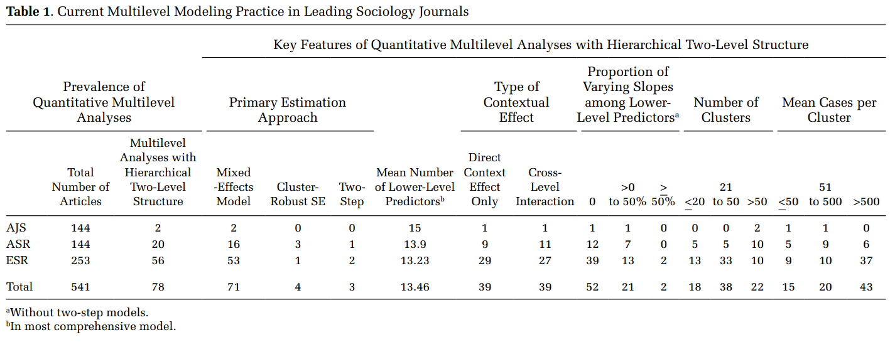
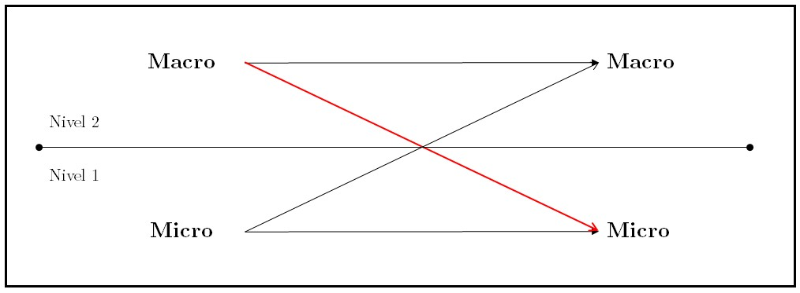
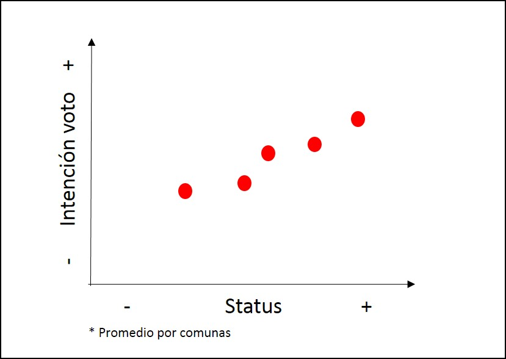
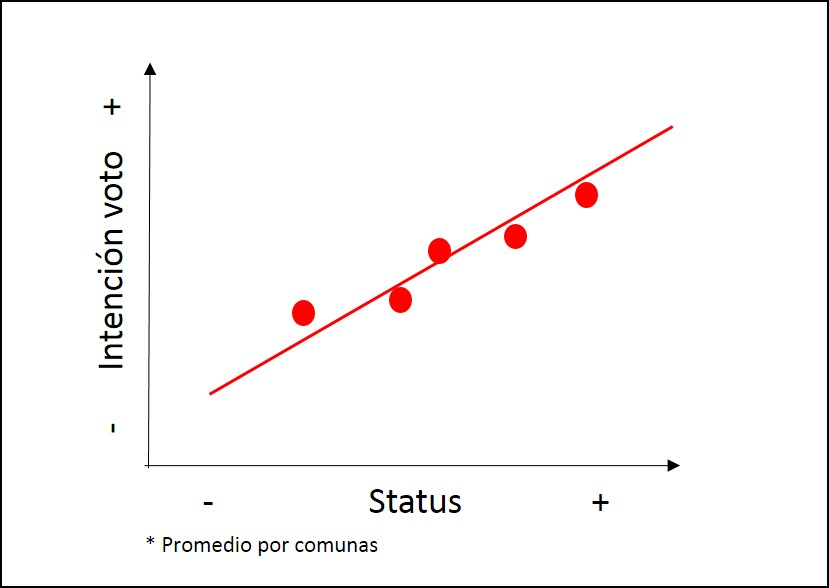
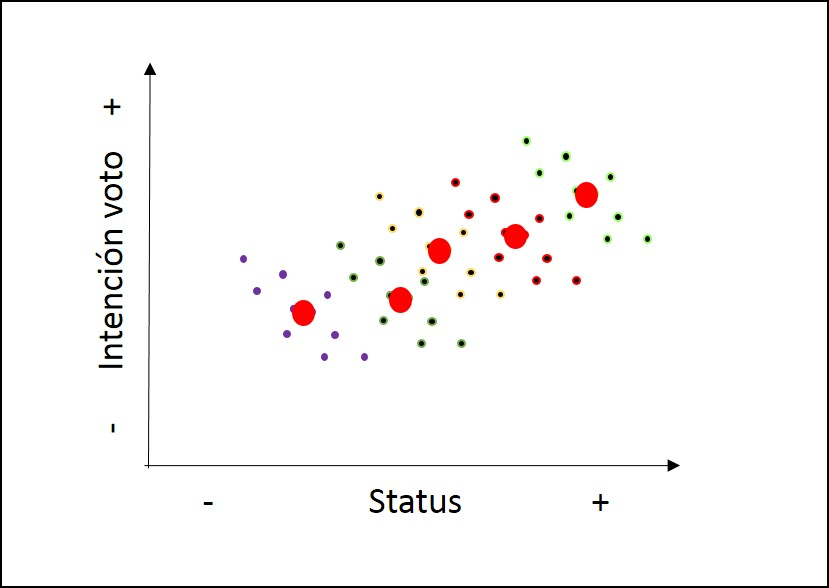
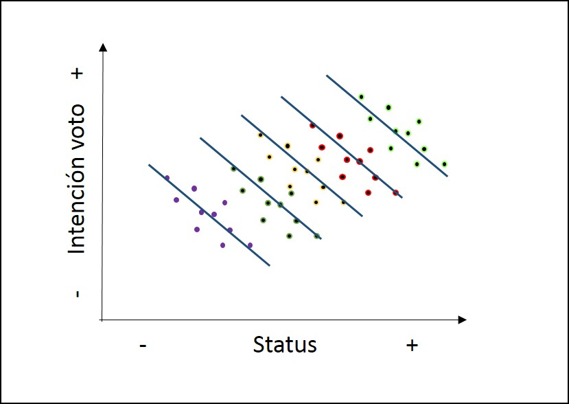

class: bottom, right, inverse

```{r setup, include=FALSE, cache = FALSE}
require("knitr")
options(htmltools.dir.version = FALSE)
pacman::p_load(RefManageR)
bib <- ReadBib("electivomultinivel.bib", check = FALSE)
opts_chunk$set(warning=FALSE,
             message=FALSE,
             echo=TRUE,
             cache = TRUE,fig.width=7, fig.height=5.2)
```

<!---
Para correr en ATOM
- open terminal, abrir R (simplemente, R y enter)
- rmarkdown::render('1mlmintro.Rmd', 'xaringan::moon_reader')

About macros.js: permite escalar las imágenes como [scale 50%](path to image), hay si que grabar ese archivo js en el directorio.
--->

.pull-left[.center[
<br>
<br>
<br>
<br>
<br>
<br>
<br>
<br>
]]

.pull-right[
# Modelos Multinivel
### Juan Carlos Castillo
### Sociología FACSO - UChile
### 2do Sem 2019
### [Diplomado Análisis Multivariable](mlm-dip.html)

<br>

## Sesión 1: Introducción y Bases
]

---
class: inverse

# Preguntas

## -   ¿Qué es un problema de investigación multinivel?

## -   ¿Cuál es la relación entre problemas multinivel y sociología?

## -   ¿Cómo modelar un problema de investigación multinivel?

---
class: middle, center, roja

# Marco general

---
# Concepto del curso/taller

-   Investigación social aplicada

-   Ciencia abierta: Reproducibilidad, colaboración, comunicación

-   Orientación práctica

-   Carácter introductorio

-   Basado en conocimientos previos (extensión de modelo de regresión   simple)

-   Relativa flexibilidad a ritmos, capacidades, intereses de alumnos

-   Mayor desafío: cognitivo (acomodación de esquemas)

---
# Software

1.  Análisis de datos: R

2.  Reporte: Knitr / Markdown / Rmarkdown (RStudio)

3.  Administración referencias: Zotero / Bibtex

4.  (Git / GitHub)

5.  (LaTeX)

---
class: middle, center, roja

# A. Introducción

## Problemas de investigación multinivel

---
# Investigación multinivel



`r Cite (bib, "heisig_Costs_2017")`

---
class:inverse, right, middle

### Multilevel models are used in sociology to specify the effect of social context on individual-level outcomes. The idea that individuals respond to their social context is a defining claim of the sociological discipline, which is found in Marx’s work on political  economy (1846), in Durkheim’s studies of the impact of community on anomia and suicide (1897), in Weber’s research on how religious communities shape economic behavior (1905), in Merton’s work on communities, relative deprivation, and social comparison theory (1968), and in Berelson et aI’s (1954) research into the effect of social context on voting.

`r Cite(bib, "diprete_Multilevel_1994")`

---
# Investigación sociológica y contexto



`r Cite (bib, "Coleman1986SocialTheorySocial")`

---
# Investigación sociológica y contexto

<br>

.center[

]

`r Cite (bib, "Coleman1986SocialTheorySocial")`


---
# Investigación sociológica y contexto


`r Cite (bib, "Coleman1986SocialTheorySocial")`

---
# Investigación sociológica y contexto

### Versiones del contexto

-   Variables macro - nivel 2 (Ejemplos: Países, comunas, escuelas, organizaciones)

-   Tiempo

---
# Investigación sociológica y contexto

## Datos anidados / con estructura jerárquica

| IDi | IDg | var_i1 | var_i2 | var_g1 | var_g2 |
|-----|-----|--------|--------|--------|--------|
| 1   | 1   | 8      | 7      | 4      | 1      |
| 2   | 1   | 5      | 5      | 4      | 1      |
| 3   | 1   | 3      | 1      | 4      | 1      |
| 4   | 2   | 3      | 2      | 6      | 8      |
| 5   | 2   | 1      | 4      | 6      | 8      |
| 6   | 2   | 7      | 5      | 6      | 8      |

---
# Investigación sociológica y contexto

## Tipos de datos macro

- idiosincráticos

- agregados

---
class: roja, middle, center

# Posibles problemas de inferencia con datos jerarquicos

---
# Falacia ecológica

## Problemas asociados a la (des)consideración del contexto:

### -   Conclusiones erradas acerca de individuos basados en datos de contexto (falacia ecológica)

### -   Conclusiones erradas acerca de contextos basados en datos de individuos (falacia individualista)

### -   Ejemplo (ficticio): relación entre estatus socioeconómico e intención de voto

---
# Falacia ecológica



---
# Falacia ecológica



---
# Falacia ecológica


---
# Falacia ecológica


---
# Falacia ecológica


---
# Implicancias falacia ecológica

-   Relaciones individuales y contextuales no necesariamente van en la misma dirección (lineal)

-   Falacias también pueden ocurrir en la otra dirección (falacia individualista)

-   Por lo tanto la inferencia ecológica (contextual) no se corresponde necesariamente con la inferencia individual

-   Distinguir ambos niveles es clave para estimación multinivel

---
# Falacia Ecológica


-   Blakely, T. A., & Woodward, A. J. (2000). Ecological effects in multi-level studies. Journal of Epidemiology and Community Health, 54(5), 367–374.

-   Robinson W S 1950. Ecological correlations and the behavior of individuals. American Sociological Review 15: 351–57

---
# Contexto e implicancias teóricas

En el planteamiento de una investigación con hipótesis multinivel, es
relevante definir:

-   Qué es el contexto

-   Cuáles son los elementos principales del contexto a considerar en las hipótesis

-   Cómo se relacionan variables del contexto con variables individuales (hipótesis)

---
## Ejemplos

-   Educación

-   Opinión pública

-   Participación política

---
# Contexto e implicancias estadísticas

-   Estructuras de datos jerárquicos: variables nivel 1 (micro) y nivel 2 (macro)

-   Implicancias estadísticas asociadas a incorporación de variables contextuales a modelos de regresión con datos individuales (dependencia contextual)

    1. viola los supuestos de independencia de los residuos del modelo de regresión OLS (dependencia como “ruido”)

    1. pero ... permite estudiar fenómenos que van más allá de hipótesis individuales (dependencia como fenómeno interesante)

---
# Contexto e implicancias estadísticas

-   Por lo tanto, los modelos multinivel tienen dos sentidos principales a nivel estadístico:

  - Corregir estimaciones con variables individuales cuando existe dependencia contextual (disminuye el error)

  - Hacen posible contrastar hipótesis que abarcan relaciones entre niveles, e incluir el contexto en el modelamiento estadístico

---
class:roja, center, middle

# Modelos multinivel

---
## Modelos multinivel

-   **Definición minimalista**: modelos de regresión que incluyen variables individuales y contextuales

-   Otras versiones: modelos jerárquicos, modelos mixtos, modelos contextuales, modelos con efectos aleatorios

---
## Tipos generales de problemas multinivel

Tres tipos de preguntas básicas, ejemplo educación:

1.  ¿Existen diferencias de rendimiento académico de los alumnos entre escuelas?

2.  ¿Tienen estas diferencias relación con variables de la escuela?

3.  Las características de los estudiantes, ¿poseen un efecto distinto en rendimiento de acuerdo a características de las escuelas?

---
# Formas de estimación multinivel

Base: modelo de regresión simple (no multinivel)


---
# Formas de estimación multinivel

Modelo multinivel con predictores individuales


---
# Formas de estimación multinivel

Modelo multinivel con predictores contextuales


---
# Formas de estimación multinivel

Modelo multinivel con predictores individuales y contextuales


---
# Formas de estimación multinivel

Modelo multinivel con interacción entre niveles


---
# Formas de estimación multinivel

1.  Correlación intra clase

2.  Estimación con predictores nivel 1 (ajustando por anidación)

3.  (múltiples) predictores nivel 2

4.  Variabilidad de parámetros de estimación nivel 1 (pendientes)

5.  Interacción entre niveles

---
class: inverse

# Resumen

-   Contexto en sociología

-   Extensión del modelo de regresión simple

-   Distintos problemas de investigación multinivel

-   Aplicaciones en distintos ámbitos y disciplinas

-   Diferencia entre nivel individual y contextual (witihin/between)

-   Extiende posibilidades de estimación, permitiendo contrastar hipótesis más complejas de relaciones micro/macro

---
class: roja, middle, center

#2. Bases

---
## Bases: Modelo de regresión

Objetivos centrales de la regresión:

--
1.  Conocer la variación de una variable (dependiente, Y) de acuerdo a
la variación de otra variable (independiente, X):

  -   Ej: En qué medida el puntaje PSU influye en el éxito académico
en la universidad? ...

--
2.  Estimar el valor de una variable de acuerdo al valor de otra
(predicción)

  -   Ej: Si una persona obtiene 600 puntos en la PSU, que promedio de notas en la universidad es probable que obtenga? (Atención: predicción no implica explicación)

--
3.  Establecer en que medida esta asociación es significativa (inferencia)


---
## Bases

-   varianza

$$\begin{aligned}
\sigma^2 = \frac{\sum_{i=1}^{n}(x_i - \bar{x})^2} {n-1}=\frac{\sum_{i=1}^{n}(x_i - \bar{x})(x_i - \bar{x})} {n-1}
\end{aligned}$$

-   covarianza

$$\begin{aligned}
cov(x,y) = \frac{\sum_{i=1}^{n}(x_i - \bar{x})(y_i - \bar{y})} {n-1}
\end{aligned}$$

-   correlación

$$\begin{aligned}
r= \frac{\sum_{i=1}^{n}(x_i - \bar{x})(y_i - \bar{y})} {(n-1)\sigma_x \sigma_y }
\end{aligned}$$


---
## Bases

.pull-left[
-   La (co) variación general de Y respecto a X se puede expresar en una
ecuación de la recta = modelo de regresión

-   Para estimar la “mejor recta” se utiliza la *recta de mínimos
cuadrados* (OLS – Ordinary Least Squares)

- OLS es un estimador que minimiza la suma de
los cuadrados de las distancias entre las observaciones y la recta
en el eje vertical
]

.pull-right[

]

---
## Bases

Donde ...

$$\begin{aligned}
Y=a+bX+e\end{aligned}$$

-   a= intercepto, el valor de Y cuando X es 0

-   b= pendiente (coeficiente de regresión), es el valor que me permite
estimar el puntaje de Y mediante el puntaje de X

-   e= residuo, da cuenta de las fuentes de variabilidad distintas de X
en la predicción de Y. O sea, es la parte de Y que no es explicada
por X.


---
# Bases

Estimación de los coeficientes de la ecuación:

$$\begin{aligned}
b=\frac{\Sigma xy}{\Sigma x^2}&=\frac{\Sigma((x-\bar{x})(y-\bar{y}))}{\Sigma (x-\bar{x})} \\
a&=\bar{Y}-b \bar{X} \\
{Y}^{\prime }&=a+bX
\end{aligned}$$


--
-   La ecuación de regresión permite predecir valores de Y para cada valor de X


---
# Bases

-   Tres piezas de información relevante:

--
  -   Valor observado de Y
  
--
  -   Estimación de Y a partir de X =( ${Y}^{\prime }$ )

--
  -   Promedio de Y ( $\bar{Y}$ )

.center[]

---
# Bases

$$\begin{aligned}
Y&=\bar{Y}+({Y}^{\prime}-\bar{Y})+(Y-{Y}^{\prime})\\
Y-\bar{Y}&=({Y}^{\prime}-\bar{Y}) + (Y-{Y}^{\prime}) \\
\Sigma(y_i - \bar{y})^2 &=\Sigma (\bar{y}-\hat{y}_i)^2 + \Sigma(y_i-\hat{y}_i)^2 \\
SS_{tot}&=SS_{reg}+SS_{error}
\end{aligned}$$

--


---
# Bases

Por lo tanto:

$$SS_{tot}=SS_{reg}+SS_{error}$$

$$\frac{SS_{tot}}{SS_{tot}}=\frac{SS_{reg}}{SS_{tot}}+\frac{SS_{error}}{SS_{tot}}$$

$$1= \frac{SS_{reg}}{SS_{tot}} + \frac{SS_{error}}{SS_{tot}} \\
\frac{SS_{reg}}{SS_{tot}}= ?$$

--
$$R^2$$

---
class: roja, middle, center

# Dependencia contextual


---
## Residuos y dependencia contextual


---
## Residuos y dependencia contextual


---
## Residuos y dependencia contextual


---
## Residuos y dependencia contextual


---
# Implicancias para el modelo de regresión:

-   Dependencia de los residuos

-   Pérdida de información, mayor error

-   Alternativas? Descomposición de la varianza de los residuos *entre* y
*dentro* los grupos= en distintos niveles = **multinivel**.

-   En concreto, se agrega un término de error adicional al modelo:
$\mu_{0j}$

-   Este término de error se expresa como un **efecto aleatorio** (como opuesto a *efecto fijo*)

---
class: roja, middle, center

# Modelo y parámetros


---
## Modelo con coeficientes aleatorios (RCM)

-   Random Coefficients Models (RCM) o Mixed (effects) Models

-   Forma de estimación de modelos multinivel

-   Idea base: se agrega un parámetro *aleatorio* al modelo, es decir, que posee variación en relación a unidades de nivel 2.

---
## Parámetros


---
## Parámetros

Detalles de la notación :

-   $_i$ es el índice asociado a los individuos
-   $_j$ es el índice asociado a la pertenencia a grupos ($_j=1 ..., N$)
-   $y_{ij}$ es la variable dependiente
-   $X_{i}$ es la variable independiente de nivel individual
-   $\beta$ y $\gamma$ son coeficientes de regresión
-   $Z_j$ es la variable independiente a nivel grupal
-   $r_{ij}$ es el residuo a nivel individual
-   $\mu_{j}$ es un residuo/desviación de nivel grupal
-   $\tau_{00}$ es la varianza de $\mu_{0j}$
-   $\sigma^2$ es la varianza de $r_{ij}$

---
class: inverse, right

# Resumen


## - Regresión y residuos

## - Residuos y dependencia contextual

## - Parametrizando la dependencia contextual a través de un efecto aleatorio


---
class: roja, middle, center

#  Práctica

---

## High School & Beyond (HSB) data

  -   High School & Beyond (HSB) es una muestra representativa nacional de
educación secundaria publica y católica de USA implementada por el
National Center for Education Statistics (NCES).

-   Más información en [https://nces.ed.gov/surveys/hsb/](http://nces.ed.gov/surveys/hsb)

-   Level 1 variables:

  -   minority, etnicidad (1 = minority, 0 =other)

  -   female, student gender (1 = female, 0 = male)

  -   ses, (medida estandarizada de nivel socioeconómico en base a variables como educación de los padres, ocupación e ingreso)

  -   mathach, logro en matemática

---
## High School & Beyond (HSB) data

-   Level 2 variables:

  -   size (matricula)

  -   sector (1 = Catholic, 0 = public)

  -   pracad (proportion of students in the academic track)

  -   disclim (a scale measuring disciplinary climate)

  -   himnty (1 = more than 40% minority enrollment, 0 = less than 40%)

  -   meanses (mean of the SES values for the students in this school who are included in the level-1 file)

-   Cluster variable= id (school id)


---
class: inverse

# Referencias

.small[
```{r, results='asis', echo=FALSE}
PrintBibliography(bib)
```
]

---
class: inverse, bottom, right

.pull-left[.center[
<br>
<br>
<br>
<br>
<br>
<br>
<br>
<br>
]]

.pull-right[
# Modelos Multinivel
### Juan Carlos Castillo
### Sociología FACSO - UChile
### 2do Sem 2019
### [Diplomado Análisis Multivariable]()
]


