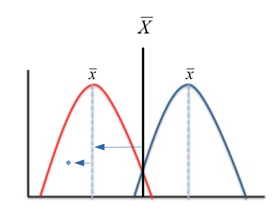
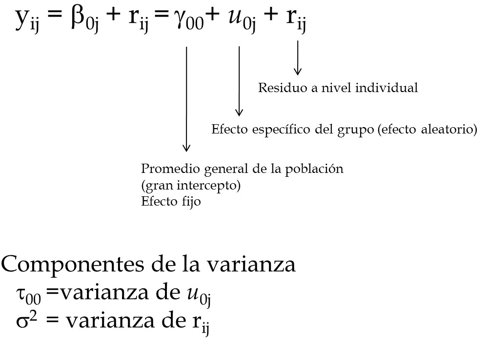
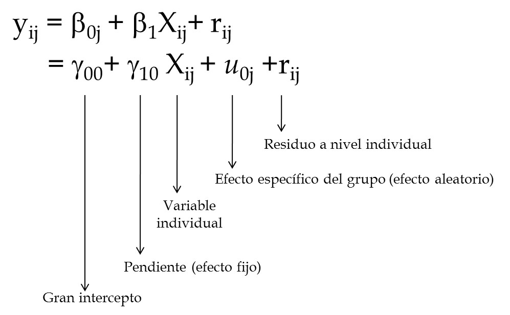
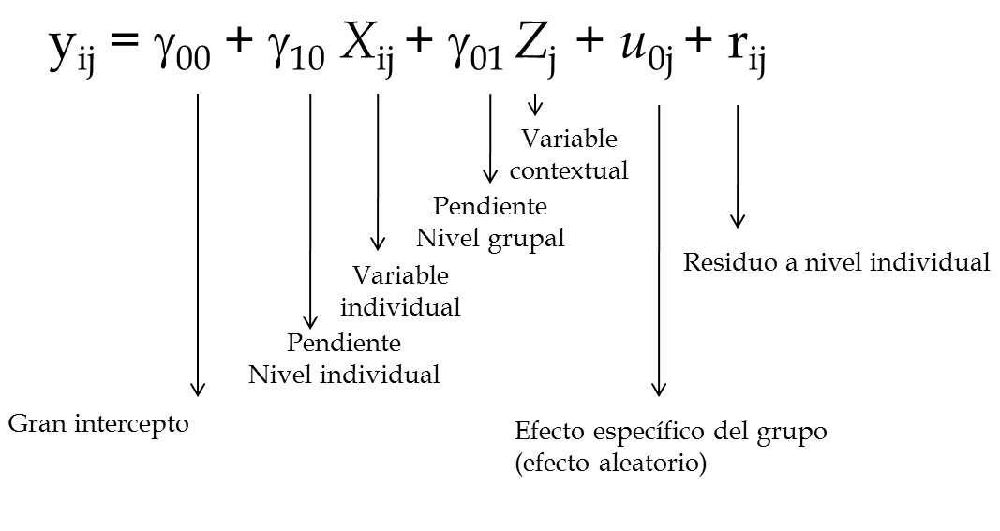
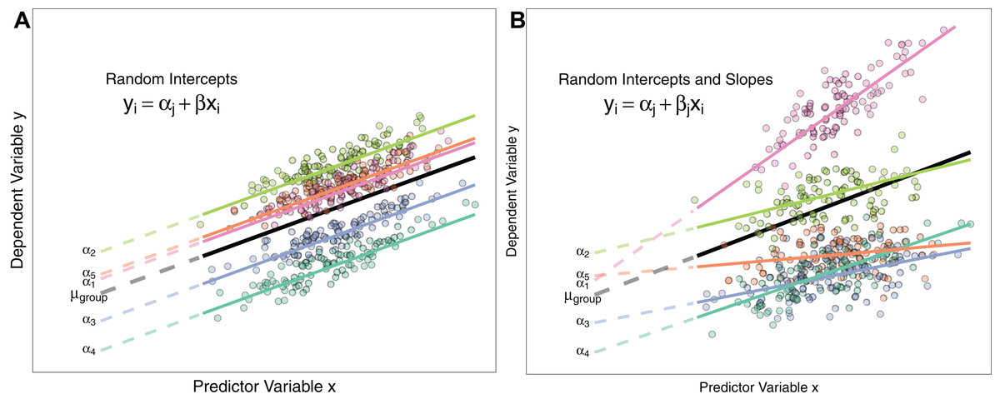
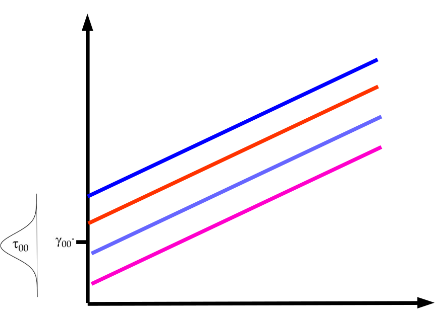

class: bottom, right, inverse

```{r eval=FALSE, include=FALSE}
# Correr esto para que funcione el infinite moonreader, el root folder debe ser static para si dirigir solo "bajndo" en directorios hacia el bib y otros

xaringan::inf_mr('/static/docpres/02_bases/2mlmbases.Rmd')
```

```{r setup, include=FALSE, cache = FALSE}
require("knitr")
options(htmltools.dir.version = FALSE)
pacman::p_load(RefManageR)
# bib <- ReadBib("../../bib/electivomultinivel.bib", check = FALSE)
opts_chunk$set(warning=FALSE,
             message=FALSE,
             echo=TRUE,
             cache = TRUE,fig.width=7, fig.height=5.2)
```

<!---
Para correr en ATOM
- open terminal, abrir R (simplemente, R y enter)
- rmarkdown::render('static/docpres/02_bases/2mlmbases.Rmd', 'xaringan::moon_reader')

About macros.js: permite escalar las imágenes como [scale 50%](path to image), hay si que grabar ese archivo js en el directorio.
--->

.pull-left[.center[
<br>
<br>
<br>
<br>
<br>
<br>
<br>
<br>
]]

.pull-right[
# Modelos Multinivel
### Juan Carlos Castillo
### Sociología FACSO - UChile
### 2do Sem 2019
### [Diplomado Análisis Multivariable ](https://multinivel.netlify.com)

<br>

## Sesión 3: Correlación intraclase y predictores en distintos niveles
]

---
class: roja, middle, center

# Resumen sesión anterior


---
## Parámetros


---
## Comparación Modelos

```{r echo=FALSE}
pacman::p_load(
haven,  # lectura de datos formato externo
car, # varias funciones, ej scatterplot
dplyr, # varios gestión de datos
stargazer, # tablas
corrplot, # correlaciones
ggplot2, # gráficos
lme4) # multilevel
```

```{r, echo=FALSE}
mlm <-read_dta("http://www.stata-press.com/data/mlmus3/hsb.dta")
mlm=mlm %>% select(minority,female,ses,mathach,size,
  sector,mnses,schoolid) %>% as.data.frame()
agg_mlm=mlm %>% group_by(schoolid) %>%
  summarise_all(funs(mean)) %>% as.data.frame()
reg<- lm(mathach~ses+female+sector, data=mlm)
reg_agg<- lm(mathach~ses+female+sector, data=agg_mlm)
```


.small[
```{r echo=FALSE}
stargazer(reg,reg_agg,
  column.labels=c("Individual","Agregado"),
  type ='text')
```
]

---
## Implicancias estimación individual/agregada

- diferencias entre los coeficientes: riesgo de falacia ecológica / individualista

- diferencias entre los errores estándar, recordar

$$ \sigma_{est} = \sqrt{\frac{sum(Y-Y')^{2}}{N}}  $$

  - inflación de errores estándar para variables nivel 1 estimadas como agregadas, ej: female agregado (riesgo error tipo II)

  - contracción de errores estándar para variables nivel 2 estimadas como individuales, ej: sector individual (error tipo I)
---
class: middle

## Solución: Modelo que ajuste errores estándar según el tipo de variable nivel 1 y nivel 2 = MULTINIVEL

---
### Idea base de modelos multinivel: la varianza de la variable dependiente se puede descomponer en distintos niveles

- Estas varianzas son:

  - varianza Nivel 1: dentro o "within", en relación al promedio individual

  - varianza Nivel 2: entre o "between", en relación al promedio de los grupos
  
  - varianza Nivel $j$ ...

---
# Descomposición de la varianza

.center[

]

$$var_{tot}=var_{dentro}+var_{entre}$$

---
# Varianzas


---
class: roja, middle, center

# Correlación intra-clase

## "Proporción de la varianza de la variable dependiente que se asocia a la pertenencia a unidades de nivel 2"

---
class: inverse, middle, right

# Esta clase: _Estimación modelo multinivel_

### librería `lme4` de `R`
### Componentes de la varianza

### Efectos fijos y aleatorios

---
# Pasos (usuales) en la estimación del modelo
 
 0  Modelo nulo

1.  Modelo con variables individuales

2.  Modelo con variables contextuales

3.  Modelo con variables individuales y contextuales

4.  Modelo con pendiente (individual) aleatoria

5.  Modelo con variables individuales, contextuales e interacción entre
    niveles (cross-level interaction)
---
## 0.Modelo nulo



---
## 1.Modelo con variable independiente individual



---
## 2.Modelo con variable independiente grupal


---
## 3.Modelo con variable independiente individual y grupal



---
## 4.Modelo con pendiente aleatoria


---
## 4.Modelo con pendiente aleatoria



---
## 5.Modelo con interacción entre niveles


"La relación entre X e Y varía entre contextos, y esta variación se asocia a una característica del contexto"

*Ej*: la influencia del nivel socioeconómico en rendimiento en lenguaje es moderada por la presencia de bibliotecas en las escuelas

---
## Componentes de la varianza

-   Los efectos aleatorios asumen una varianza (estimada) en base a una
    distribución normal

-   Permiten calcular la correlación intra-clase y distintas medidas de
    ajuste de los modelos

  -   $var \ r_{ij}=\sigma^2$ (varianza residuos nivel individual)
  
  -   $var \ \mu_{0j}= \tau_{00} = \tau_0^2$ (varianza asociada a
    intercepto aleatorio)
  
  -   $var \ \mu_{1j}= \tau_{11} = \tau_1^2$ (varianza asociada a
    pendiente aleatoria)
  
  -   $cov (\tau_{00},\tau_{11})= \tau_{01}$ (covarianza entre intercepto
    y pendiente)

---
## Componentes de la varianza


---
## Componentes de la varianza


  
---
## ICC

-   La correlación intra-clase ( $\rho$ ) indica qué porcentaje de la
    varianza de la variable dependiente se debe a pertenencia a unidades
    de nivel 2

-   Descomposición de la varianza en modelo nulo=
    $Var\ y=\tau_{00} + \sigma^2$

-   Es decir, parte de la varianza se debe a los individuos ( $\sigma^2$ )
    y parte al grupo ( $\tau_{00}$ )

-   Correlación intra-clase = ICC =
    $\rho=\frac{\tau_{00}}{\tau_{00}+\sigma^2}$

-   Una ICC **baja** indica baja variabilidad de la
    variable dependiente entre unidades de nivel 2
      - _por lo tanto_, menores posibilidades de dar cuenta (*explicar*) de esa varianza con
    predictores de nivel 2.

---
# Ejemplo Estimación en R

### librería lme4

-   función lmer (linear mixed effects)

-   forma general:

    -   `objeto <- lmer (depvar ~ predictor_1 + predictor_2 + predictor_n + (1 | cluster), data=data)`

    -   el objeto contiene la información de la estimación; para ver un
        resumen, `summary(objeto)`, y de manera más presentable,
        `screenreg(objeto)`


---
# Ejemplo Estimación en R


## -> Práctica B

---
class: inverse, bottom

.pull-left[.center[
<br>
<br>
<br>
<br>
<br>
<br>
<br>
<br>
]]

.pull-right[
# Modelos Multinivel
### Juan Carlos Castillo
### Sociología FACSO - UChile
### 2do Sem 2019
### [Diplomado Análisis Multivariable](https://multinivel.netlify.com)
]


