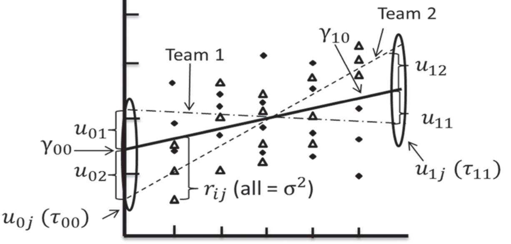
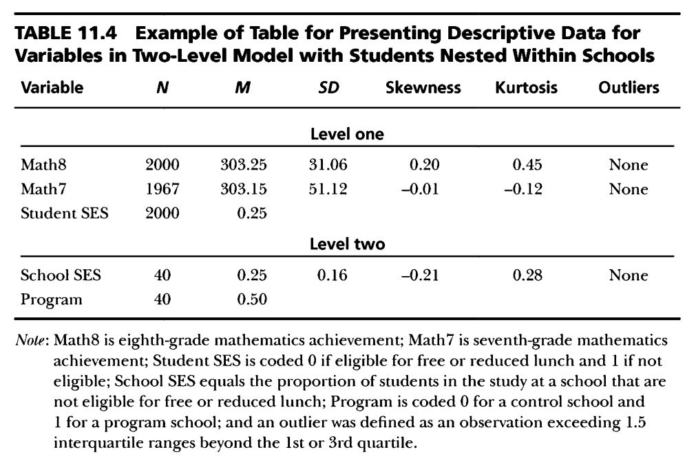
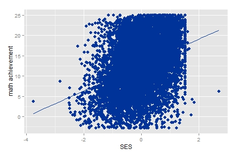
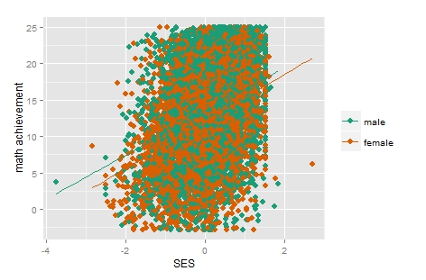
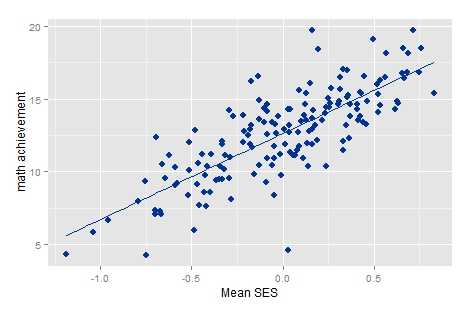
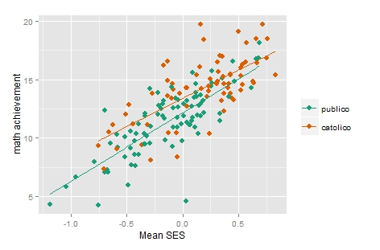
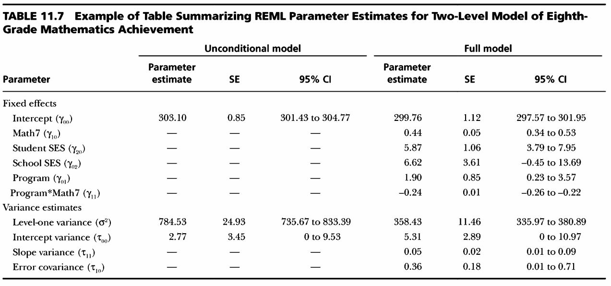
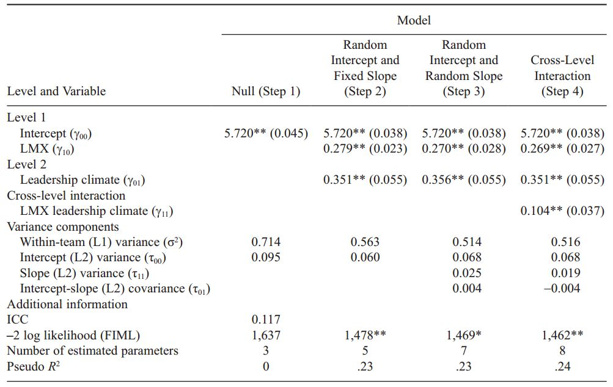

class: bottom, right, inverse

```{r eval=FALSE, include=FALSE}
# Correr esto para que funcione el infinite moonreader, el root folder debe ser static para si dirigir solo "bajando" en directorios hacia el bib y otros

xaringan::inf_mr('/static/docpres/06_fit&report/6fitrep.Rmd')
```

```{r setup, include=FALSE, cache = FALSE}
require("knitr")
options(htmltools.dir.version = FALSE)
pacman::p_load(RefManageR)
# bib <- ReadBib("../../bib/electivomultinivel.bib", check = FALSE)
opts_chunk$set(warning=FALSE,
             message=FALSE,
             echo=TRUE,
             cache = TRUE,
             fig.width=7, fig.height=5.2)
```

<!---
Para correr en ATOM
- open terminal, abrir R (simplemente, R y enter)
- rmarkdown::render('static/docpres/02_bases/2mlmbases.Rmd', 'xaringan::moon_reader')

About macros.js: permite escalar las imágenes como [scale 50%](path to image), hay si que grabar ese archivo js en el directorio.
--->

.pull-left[.center[
<br>
<br>
<br>
<br>
<br>
<br>
<br>
<br>
]]

.pull-right[
# Modelos Multinivel
### Juan Carlos Castillo
### Sociología FACSO - UChile
### 2do Sem 2019
### [Diplomado Análisis Multivariable](https://juancarloscastillo.github.io/jc-castillo/documents/diplomado_multinivel/mlm-dip.html)

<br>

## Sesión 5: Ajuste y reporte
]

---
class: roja, middle, center

# Resumen sesión anterior

---
# Modelo con coeficientes aleatorios
<br>



---
# Modelo con coeficientes aleatorios

-   A partir de la estimación del modelo, es posible predecir el valor
    de los efectos aleatorios ( $\mu$ ) para cada unidad de nivel 2

-   Para el intercepto $\gamma_{00}$: $\mu_{01},\mu_{02},\mu_{03} ... \mu_{0j}$

-   Para la pendiente $\gamma_{10}$ : $\mu_{11},\mu_{12},\mu_{13} ... \mu_{1j}$

-   Para la pendiente $\gamma_{20}$ : $\mu_{21},\mu_{22},\mu_{23} ... \mu_{2j}$

---
```{r echo=FALSE, results='hide'}
pacman::p_load(haven,lme4, texreg, dplyr)
mlm = read_dta("http://www.stata-press.com/data/mlmus3/hsb.dta")
results_4 = lmer(mathach ~ 1 + ses + female + mnses + sector + (1 + ses | schoolid), data=mlm)
```

.pull-left[
# Ej.estimación de pendiente aleatoria
]

.pull-right[
.small[
```{r results='asis', echo=FALSE}
htmlreg(results_4, doctype=FALSE, caption="Modelo con SES aleatorio", caption.above=TRUE,custom.note = "%stars. SE en paréntesis")
```
]
]
---
## Ej.estimación de coeficientes aleatorios (medias posteriores)

```{r}
coef(results_4)
```

---
class: roja, middle, center

## Esta clase


# Ajuste modelos multinivel

# Reporte de resultados (1)

---
# Tipos de medidas de ajuste

1. Medidas relativas a la varianza de efectos aleatorios (tipo $R^2$)

2. Medidas de fit comparativo (deviance)

---
## 1. Ajuste por proporción de varianzas


---
## 1. Ajuste por proporción de varianzas

### Características ajuste por varianzas

-   Se relacionan con el grado de varianza “explicada” (disminución en la(s) varianza(s) atribuida a la inclusión de predictores en el modelo de regresión)

-   Controversia en la literatura de multinivel, no existe una medida única

-   Las propuestas sugieren usualmente cálculos de $R^2$ para cada nivel

---
## 1. Ajuste por proporción de varianzas

### Bryk & Raudenbusch $R^2$ (1992, p.70)

$$\begin{split}
    R_{BR}^2 Nivel1&=[var_0(r_{ij})-var_f(r_{ij})]/var_0(r_{ij}) \\
    &=[\sigma^2(0)-\sigma^2(f)]/\sigma^2(0)
    \end{split}$$

--

$$\begin{split}
    R_{BR}^2 Nivel2&=[var_0(\mu_{0j})-var_f(\mu_{0j})]/var_0(\mu_{0j}) \\
    &=[\tau_{00}(0)-\tau_{00}(f)]/\tau_{00}(0)
    \end{split}$$

Donde:

-   $0$ se refiere al modelo nulo
-   $f$ se refiere a un modelo posterior

---
## 1. Ajuste por proporción de varianzas

### Ej. HSB Data

  | $\sigma^2$   | $\tau_{00}$ |  $R^2_{L1}$ |  $R^2_{L2}$
--|----------|-----|-----|--
Modelo 0                   |  39.148   | 8.614 |   |
Modelo 1 (predict.ind.)    |  36.148   |  3.93 | 0.076 |    |
Modelo 2 (predict.grup.)   |  39.161   |  2.31 |  0.00 |0.73 |

Ej: $R^2_{L2}=(8.614-2.31)/8.614=6.34/8.614=0.73$

-   Recordar interpretación en relación a correlación intra-clase (para
    el caso de HSB data= 0.18)

  -   Es decir, para el caso del R2 nivel 2 se está dando cuenta del 73%
    del 18%

---
## 2. Ajuste comparativo

### Deviance test

-   El test o estadístico de deviance **compara el ajuste** de dos modelos
    basado en la log verosimilitud de cada modelo

-   La hipótesis a contrastar es si predictores adicionales del modelo
    mejoran o no el ajuste

-   Asume que los **modelos son anidados**, es decir, que un modelo con
    menos predictores puede ser derivado del modelo mayor mediante la
    fijación de ciertos coeficientes como 0.

-   Deviance= $-2*LL$ (LL=Log Likelihood)

-   Deviance test= $deviance(anidado)-deviance(mayor)$

---
## 2. Ajuste comparativo

### Deviance test

-   La distribución del estadístico de devianza es $\chi^2$, y los
    grados de libertad para calcular el valor crítico equivalen al
    número de parámetros extra en el modelo mayor

-   Es decir, parámetros modelo mayor - parámetros modelo inicial (o
    anterior)

-   Se utiliza con estimación ML en lugar de REML (restricted maximum likelihood).

---
## 2. Ajuste comparativo
### Ejemplo deviance

```{r, echo=FALSE}
attach(mlm)
```

.small[
```{r, echo=FALSE, results='hide'}
results_0ml = lmer(mathach ~ 1 + (1 | schoolid), REML=FALSE)
results_1ml = lmer(mathach ~ 1 + minority + ses + (1 | schoolid), REML=FALSE)
```

  | LL  | deviance | Parámetros
--|---|---|
results_0ml  | -23557.91 | 47115.81 |
results_1ml  | -23221.82 | 46443.64 | 2
]
-   Deviance test= 47115.8-46443.64= 672.16, 2 DF (2 parámetros
    adicionales)

-   Valor crítico $\chi^2_{DF=2}$ para $p<0.95=5.99$

-   Por lo tanto, se rechaza $H_0$, es decir, las diferencias entre los
    modelos son distintas de 0 ( $p<0.05$ ). En otras palabras, el modelo
    con más parámetros presenta un mejor ajuste.

---
## 2. Ajuste comparativo
### Ejemplo deviance II

... de manera directa en R:

```{r eval=FALSE}
anova(results_0ml,results_1ml)
```

Y para reportar:

.small[
```{r, results='asis'}
print(xtable::xtable(anova(results_0ml,results_1ml)), type="html")

```
]
---
## 2. Ajuste comparativo
### Deviance y pendiente aleatoria

-  Los test de ajuste por proporción de varianza no son recomendados al momento de estimar modelos con pendiente aleatoria

-   El test de deviance se utiliza al momento de reportar la significancia de los efectos aleatorios (ej: con pendiente aleatorio,comparando el mismo modelo con y sin aleatorización)

-   Considerar que los componentes de la varianza son parámetros del modelo, es decir, se cuentan para la diferencia de grados de libertad


---
class: roja, middle, center

# Reporte

---
## Tablas y descriptivos

-   Tabla de descriptivos de variables L1 y L2

-   Descripción del número de casos por escuela y también de otras    variables relevantes por escuela (ej, dependiente e independientes comprometidas en hipótesis)

---
## Tablas y descriptivos

### Ejemplo tabla descriptiva (Ferron et al 2007, en O’Connell Cap.11)

.center[]

Alternativas en R: Stargazer, [summarytools](https://cran.r-project.org/web/packages/summarytools/vignettes/Introduction.html)

---
## Tablas/gráficos de correlaciones

```{r}
cormat=mlm %>% select(mathach,ses,sector,size) %>% cor()
corrplot::corrplot.mixed(cormat)
```


---
## Nubes de puntos




---
## Nubes de puntos



---
## Nubes de puntos



---
## Nubes de puntos




---

### Reporte modelos



(O’Connell, cap.11)
---
## Reporte modelos



---
## Reporte modelos

-   Efectos fijos, con valores t o se

-   Asteriscos para niveles de significación

-   Efectos aleatorios

-   Fit: log likelihood

-   Fit adicionales: AIC, BIC, deviance, R2

---
## Automatizando el reporte con RMarkdown

- Markdown es un lenguaje de escritura de texto simple, con pocas marcas de edición.

- RMarkdown es un formato que permite vincular escritura en Markdown y código de R, que luego son compilados en diferentes formatos de salida (pdf, html, word) mediante la librería knitr


- Este proceso se encuentra automatizado en RStudio, mediante el uso del boton "Knitr", que realiza la compilación y muestra el output.

---
## Automatizando el reporte con RMarkdown

### Ventajas

- permite generar tablas y gráficos automáticamente en el mismo documento, evitando el cortar / pegar

- escritura simple

### Desventajas

- acostumbrarse

- conformarse con un formato simple de texto (al menos inicialmente)

- ... igual es R

.center[
# DE TODAS MANERAS VALE LA PENA
]

---

## RMarkdown

Tres cosas básicas a aprender:

- Markdown

- Insertar trozos (chunks) de código

- Opciones generales en encabezado YAML


## Varios tutoriales ... revisar

- Sección R Markdown de R4DS: https://es.r4ds.hadley.nz/r-markdown.html

- Guía de documentos dinámicos: https://juancarloscastillo.github.io/metsoc-facsouchile/documents/trabajos/guia_rep_dinamico/reportedinamico.html


---
## ... y en RStudio


---
## Y en general para la entrega de trabajos

- De preferencia en (R)Markdown, facilita la apertura y colaboración.

- Preocuparse más del contenido que del formato

- Tip importante para generar tablas:

  - hay que decidir de antemano si el formato de presentación será pdf o html. De preferencia html

  - en este caso, tener en consideración que se debe dar la opción html en la función o argumentos del comando.
      - Por ejemplo, en el caso de la librería `texreg`, para tablas de regresión, la función que se utiliza es `screenreg`

 - y para que las tablas se puedan visualizar bien, en el chunk donde se genera la tabla dar la opción results=`'asis'`


---
class: inverse

# Resumen Reporte

- Descriptivos por nivel

- correlaciones

- Scatters

- Tablas modelos

- Gráficos interacción (más adelante)

---
class: bottom, right, inverse

.pull-left[.center[
<br>
<br>
<br>
<br>
<br>
<br>
<br>
<br>
]]

.pull-right[
# Modelos Multinivel
### Juan Carlos Castillo
### Sociología FACSO - UChile
### 2do Sem 2019
### [multinivel.netlify.com](https://multinivel.netlify.com)
]
