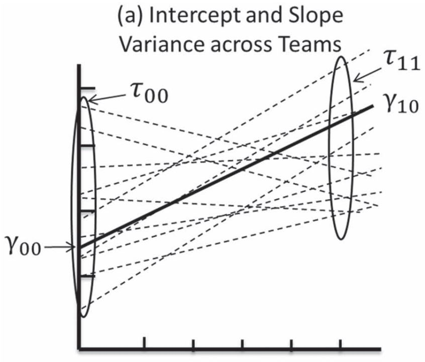
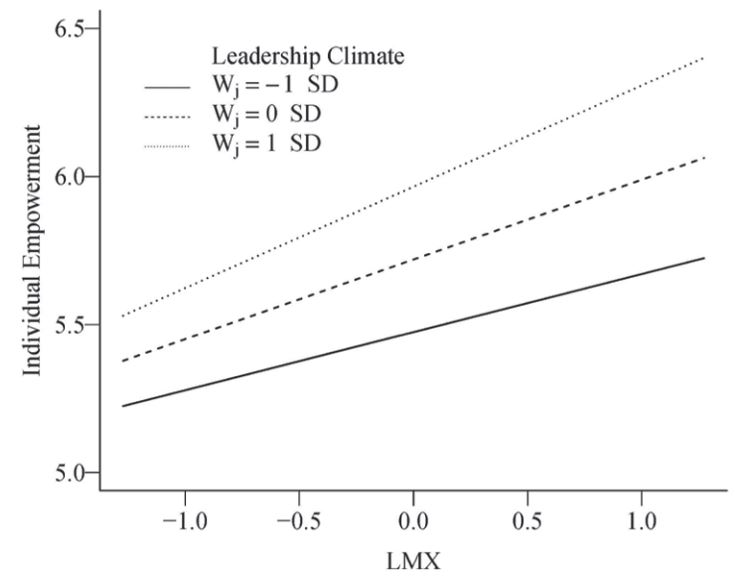

class: bottom, right, inverse

```{r eval=FALSE, include=FALSE}
# Correr esto para que funcione el infinite moonreader, el root folder debe ser static para si dirigir solo "bajndo" en directorios hacia el bib y otros

xaringan::inf_mr('/static/docpres/02_bases/2mlmbases.Rmd')
```

```{r setup, include=FALSE, cache = FALSE}
require("knitr")
options(htmltools.dir.version = FALSE)
pacman::p_load(RefManageR)
# bib <- ReadBib("../../bib/electivomultinivel.bib", check = FALSE)
opts_chunk$set(warning=FALSE,
             message=FALSE,
             echo=TRUE,
             cache = TRUE,fig.width=7, fig.height=5.2)
```

<!---
Para correr en ATOM
- open terminal, abrir R (simplemente, R y enter)
- rmarkdown::render('static/docpres/02_bases/2mlmbases.Rmd', 'xaringan::moon_reader')

About macros.js: permite escalar las imágenes como [scale 50%](path to image), hay si que grabar ese archivo js en el directorio.
--->

.pull-left[.center[
<br>
<br>
<br>
<br>
<br>
<br>
<br>
<br>
]]

.pull-right[
# Modelos Multinivel
### Juan Carlos Castillo
### Sociología FACSO - UChile
### 2do Sem 2019
### [multinivel.netlify.com](https://multinivel.netlify.com)

<br>

## Sesión 7: Interacciones entre niveles y centrado
]

---
class: roja, middle, center


# Interacción entre niveles


---
# Interacciones entre niveles: bases

- Modelo multinivel con predictores individuales y contextuales

.center[]

--
- 	Modelo multinivel con interacción entre niveles

.center[]


---
# Interacciones entre niveles: bases

Tipos de estimaciones (efectos) en multinivel

-   Nivel 1, individual (Y en X)

-   Directo entre niveles: Y en Z

-   Interacción entre niveles: Y en X\*Z: ¿Existen cambios en la relación entre Y y X en función de una variable Z?

-   Interpretación: por cada unidad de aumento en Z, la relación entre Y y X se modifica en $\gamma_{11}$

Por lo tanto, el objetivo es dar cuenta de la variabilidad de la pendiente ( $\tau_{11}$ ) en función de Z

---
# Interacciones entre niveles: bases

Ejemplo:

-   (Y,X) Efecto de nivel socioeconómico en intención de voto

-   (Y,Z) Efecto de la calidad de la democracia en intención de voto

-   (Y, X\*Z) Cambios en el efecto de nivel socioeconómico en voto según la calidad de la democracia de los países

---
# Interacciones entre niveles: bases

.center[

]
---
# Interacciones entre niveles: bases

-   La estimación de interacción entre niveles asume la existencia de **varianza** en la pendiente respectiva

-   Es decir, se requiere comprobar si esta varianza es distinta de 0

-   Diferentes métodos:

    -   Comparación de ajuste de modelos (ej: deviance)

    -   Bootstrap no paramétrico, dado que es difícil mantener el supuesto de distribución normal de las varianzas

-   Considerar temas de potencia: con bajo N nivel 2 es posible que no se detecte la diferencia (de 0) para $\tau_{11}$

---
# Interacciones entre niveles: Ejemplo 1 HSB data

```{r}
pacman::p_load(lme4,sjPlot)
mlm = read.dta("http://www.stata-press.com/data/mlmus3/hsb.dta")

mlm$sector_f=as.factor(mlm$sector) # Cambiar a factor

reg_mlm3c = lmer(mathach ~ 1 + ses + sector_f +
                   ses*sector_f + mnses +
                   (1 + ses | schoolid), data=mlm)

```

```{r}
# modelos para comparar
reg_mlm3a = lmer(mathach ~ 1 + ses + sector_f +
                   mnses + (1 | schoolid), data=mlm)

reg_mlm3b = lmer(mathach ~ 1 + ses + sector_f +
                   mnses + (1 + ses | schoolid), data=mlm)

```


---

.small[
```{r, results='asis', echo=FALSE}
htmlreg(c(reg_mlm3a,reg_mlm3b, reg_mlm3c), doctype = FALSE)

```
]

---
## Devianza

.medium[
```{r}
anova(reg_mlm3b,reg_mlm3c)
```
]


---
# Interacciones entre niveles: Ejemplo 1 HSB data

```{r, fig.width=8, fig.height=6}
plot_model(reg_mlm3c, type = "int")

```


---
# Interacciones entre niveles: Ejemplo 2

(Aguinis et al,2013)

-   Basado en paper de Chen et al 2007

-   Dependiente (Y): empoderamiento individual

-   Independiente (X): calidad de la relación lider-miembro (LMX - leader member exchange)

-   Independiente (Z): clima de liderazgo

---
# Interacciones entre niveles: Ejemplo 2

-   Hipotesis:

    -   La calidad de la relación líder-miembro (X) aumenta el         empoderamiento individual (Y)

    -   El clima de liderazgo (Z)aumenta el empoderamiento individual (Y)

    -   La relación ente empoderamiento (Y) y LMX (X) será más fuerte en      equipos con mejor clima de liderazgo (Z)

---


---

Interpretación:

-   $\gamma_{11}$ representa el cambio en la pendiente de empowerment en LMX a través de los grupos cuando el clima de liderazgo se incrementa en 1 punto.

-   Positivo: LMX (X) se encuentra relacionado más fuertemente a empowerment (Y) en grupos con clima más positivo en comparación a grupos con clima menos positivo.

-   “the slope of individual empowerment on LMX is expected to equal $\gamma_{10} = 0.269$ for teams with an average leadership climate.” (Ojo: porque el clima está centrado al promedio en el ejemplo, si no sería 0)

-   “However, the relationship between individual LMX and individual empowerment becomes stronger, by $\gamma_{11} = 0.104$ units, as a team’s leadership climate increases by one unit”.

(Aguinis et al 2013, p. 1504)

---



---

# A tener en cuenta ( ... best practices)

-   Análisis de potencia (principalmente cuando hay posibilidades de diseñar el estudio)

-   Significación del efecto aleatorio: comparación de ajuste con modelos previos


---

# Breve bonus-track

- Especificación modelo logístico

- Especificación modelo en 3 niveles


---
# Modelos para dependientes categóricas en R

- El principal comando de R para estimar modelos multinivel
para variables categóricas es `glmer`, que es parte de la
libreria lme4

- La sintaxis para glmer es similar a la del comando lmer,
agregando algunas opciones adicionales, por ejemplo para
logistica se agrega `family = binomial("logit")`.

```{r eval=FALSE}
fit2 <- glmer(antemed ~ magec + (1 | comm),
              family = binomial("logit"),
              data = mydata)
```

---
# Modelos con tres niveles

## Ejemplo: individuos anidados en cursos (class), cursos anidados en escuelas

```{r eval=FALSE}
Model4.7 <- lmer(geread~1+(1|school/class),
                 data = Achieve)
```

---
# Otras consideraciones varias

- centrado de variables (ver texto de [Enders & Tofighi 2007](https://www.dropbox.com/s/vw626uzlqos4t2z/enders%20tofighi%202007%20Centering%20Predictor%20Variables.pdf?dl=0))

- [Guía de incorporación de variables de nivel 2](https://multinivel.netlify.com/practicas/d_datosl2)

---

# Práctica

- En casa: replicar Aguinis, datos disponibles ([JOM.csv](https://www.dropbox.com/s/86amiu9fmnopcq7/JOM.csv?dl=0)), sintaxis en paper

- Guia E

---
class: inverse, bottom

.pull-left[.center[
<br>
<br>
<br>
<br>
<br>
<br>
<br>
<br>
]]

.pull-right[
# Modelos Multinivel
### Juan Carlos Castillo
### Sociología FACSO - UChile
### 2do Sem 2019
### [Diplomado Análisis Multivariable](https://juancarloscastillo.github.io/jc-castillo/documents/diplomado_multinivel/mlm-dip.html)
]
