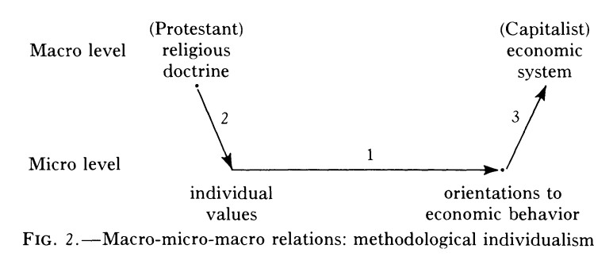

class: bottom, right

```{r setup, include=FALSE, cache = FALSE}
require("knitr")
options(htmltools.dir.version = FALSE)
```

```{r eval=FALSE, echo=FALSE}
# Correr esta linea para ejecutar
rmarkdown::render('1_regsimple.Rmd', 'xaringan::moon_reader')
```


<!---
About macros.js: permite escalar las imágenes como [:scale 50%](path to image), hay si que grabar ese archivo js en el directorio.
--->


.right[]

<br>
<br>
<br>

# Modelos de regresión - Doctorado en Psicología 2019
<br>
## Juan Carlos Castillo

## Sesión 1: Regresión simple

---
class: roja, middle, center

# ¿Cómo explicamos fenómenos sociales?

---
# Pedro, Juan ...

**Pedro** estudió en un colegio particular pagado del barrio alto de Santiago, y fue un buen alumno. En el Simce de 8º básico sacó más de 316 puntos, lo que lo situó en el 10% más alto entre todos los niños chilenos.

--

**Juan** también superó los 316 puntos. En su caso, el mérito fue doble, porque estudió en un colegio público: el capital cultural y el nivel socioeconómico de su familia eran muy inferiores a los de Pedro.
Citando una famosa metáfora, Pedro corrió con patines mientras Juan iba descalzo, y así y todo llegaron empatados a la meta.

--

.center[**¿Cómo premiará la sociedad el mérito de Pedro y el de Juan? ¿Reconocerá más a quien, contra todo pronóstico, logró destacarse pese a un entorno desfavorable?**]


---
# Pedro, Juan ...

Gracias a una investigación hasta ahora inédita, hoy podemos responder esa pregunta (Meneses, Blanco & Paredes): quienes tuvieron más de 316 puntos en el Simce 2004, y estudiaban en uno de nueve colegios de élite de Santiago (nuestros “Pedros”), en 2017 ganaron un sueldo bruto promedio de $1.471.115. Quienes tuvieron el mismo resultado en el Simce, pero estaban en un liceo público (nuestros “Juanes”), recibieron $716.665.

---
# Pedro, Juan ... & Diego

Hablemos ahora de **Diego**. Él, a diferencia de Pedro y Juan, fue un mal alumno. Pese a asistir a un colegio de elite, quedó por debajo del promedio nacional, con entre 217 y 251 puntos en el Simce. Pues bien, a pesar de sus malos resultados, en 2017 Diego ganaba $1.071.756.

--

Juan partió la carrera con todas las desventajas: menor nivel socioeconómico y capital cultural, y una inversión por alumno entre 5 y 6 veces inferior a la que recibió Diego. Así y todo, en una hazaña improbable, le sacó más de 100 puntos de ventaja en el Simce. Pero, lejos de ser premiado por su talento sobresaliente, ahora Juan tiene un trabajo peor pagado que Diego.

.small[(adaptado de columna de Daniel Matamala en La Tercera, ver original [aquí](https://www.latercera.com/opinion/noticia/pedro-juan-diego/502941/) )]

???

  - Anotar lo que les llame la atención.
  - Discutir en duplas (5 min), luego pequeño plenario

  - ¿Cómo se relaciona el mérito con rendimiento académwico?
  - ¿Qué teorías hay en contraste aquí?
  - ¿Cómo se podría investigar este tema?


---
class: inverse, middle

# La explicación en ciencias sociales

- En un principio: "Todo tiene que ver con todo", multicausal, multinivel

- PERO ... necesitamos teorías y modelos explicativos para hacer sentido de la complejidad

  - implican simplificación y renuncia

  - permiten avanzar en el conocimiento

---
# Teorías y explicación



---
# El concepto de explicación en ciencias sociales


  + Explanandum: el fenómeno que predentemos explicar (precisión, relevancia y variabilidad).

  + Explanans: lo que genera la aparición del fenómeno (lógica, eficacia y claridad.)

???
Explicación: relación entre hechos y "causas"
Algunos ejemplos:
- ideología de izquierda y participación política
- nivel socioeconómico y rendimiento académico

---
# Explicación y modelos estadísticos

¿Es posible lograr explicaciones desde el análisis de datos?

  - existen mejores y peores formas de aproximarse a la explicación

  - desde la regresión, una de las claves es el *control estadístico*, que permite lidiar con explicaciones alternativas

???
Ejemplos de Control.

- Si un investigador encuentra relación entre grupo etnico y actitudes hace el gasto publico. Se controlo por las diferencias de ingreso entre grupos?


---
# ...Volviendo a Pedro, Juan & Diego

.center[]


???
Modelo de transmisión intergeneracional de la desigualdad.

- Uno de los primeros modelos en sociología que utiliza el path analysis o analisis de sendero.

- En este modelo se puede apreciar la operacionalización de un fenomeno abstracto como la transmición intergeneracional de la desigualdad.

- Sinergia entre Teoría sociologíca y explicación por mecanismos.

---
class: inverse

# Este curso: modelos de regresión

.center[
## y <-- bx + e
]

- Una alternativa estadística para la explicación basada en análisis de datos cuantitativos.

--

## Sesiones:

1- Regresión simple

2- Regresión múltiple

3- Regresión logística


???

Por qué es importante este curso:

  - Todos tenemos teorías para muchas cosas, pero: ¿Qué es lo que diferencia a un cientista social? Sistematicidad y herramientas específicas teóricas y prácticas.
  - En este curso vamos a aprender una herramienta muy relevante para la investigación empírica en sociología: modelo de regresión. Este modelo estadístico nos va a permitir estimar relaciones de predicción entre variables, lo que se relaciona con la explicación en ciencias sociales. Es decir, en términos simples, en qué medida si conozco el valor de una(s) variable(s), puedo conocer el valor de la otra, lo que puede concebirse como una versión minimalista y estadística de una teoría.
  -  Hacer referencia a que la participación de sociólogas en este espacio es importante, que estos modelos son la base de muchos otros modelos en investigación cuantitativa y que además permite en diálogo interdisciplinario.
  - Ronda de presentación

---
# Definiciones y acuerdos básicos

- Estadística vs. investigación aplicada

- Orientación práctica: aprender haciendo

- Protagonismo en el proceso de aprendizaje

- Reproducibilidad, colaboración y ciencia abierta


???
  - Esto no es un curso de estadística, es un curso de herramientas de investigación sociológica aplicadas a datos cuantitativos.
  - En la lógica de herramienta, se aprende principalmente practicando, resolviendo problemas y dificultades.
  - Reproducibilidad y ciencia abierta
  - Protagonismo en su propio proceso de aprendizaje:
    - Roles: protagonista, actor secundario o espectador.
    - Decidir tempranamente qué rol se va a tomar evita frustraciones.

---
class: roja, middle, center

# 1. Regresión simple

## - Bases

## - Introducción regresión
---
class: inverse

# Bases

## - Datos

## - Variables

## - Correlación

---
class: inverse, center, middle

# Datos


---
# Datos y su representación

* Los datos miden al menos una *característica* de a los menos una *unidad*  en a lo menos *un punto en el tiempo*

 + Ejemplo: La tasa de natalidad en Chile el 2017 fue de 1,8 hijos (por mil habitantes)

   - Característica (variable) : Tasa de natalidad

   - Unidad: País

   - Punto en el tiempo: 2017

---
# Base de Datos

* Los datos se almacenan en una estructura de base de datos

* Base de datos:
  - cada fila representa una unidad o caso (ej: un entrevistado)
  - cada columna una variable (ej: edad)

<br>

.center[]


---
# Ejemplos

1. [Encuesta Centro de Estudios Públicos](https://www.cepchile.cl/cep/site/edic/base/port/encuestacep.html)

2. [Encuesta CASEN](http://observatorio.ministeriodesarrollosocial.gob.cl/casen-multidimensional/casen/casen_2017.php)

3. [Encuesta Lapop](https://www.vanderbilt.edu/lapop-espanol/)

---
class: inverse, middle, center

# Variables

---
# Definición

Una variable representa cualquier cosa o propiedad que varia y a la cuál se le asigna un valor. Es decir:

$$Variable \neq Constante$$

Pueden ser visibles o no visibles (latentes). Y además se pueden agrupar en:

  * Variables discretas (Rango finito de valores):

      - Dicotómicas
      - Politómicas

  * Variables continuas.

      - Rango (teóricamente) infinito de valores.

---

# Escalas de medición de variables

Escalas (Stevens, 1946): la asignación de medición se manifiesta en distintos niveles o escalas. (acrónimo clave: **NOIR**)

.center[]


???

  - Nominal: Números empleados como etiquetas (ej. sexo, raza)

  - Ordinales: Distintas categorías puede sen ordenados en serie. Posición, no distancia. (ej. cargos en una empresa)

  - Intervalares: Escalas de unidades iguales. Diferencia entre dos número consecuntivos refleja diferencia empírica. (ej. Horas del día)

  - Razón: caracterizados por la presencia de un cero absoluto. (ej. frecuencias de eventos)

---

# Escalas de Variables


.center[]

---

# Tipos de datos en relación a escalas de medición.

* Datos categóricos: pueden ser medidos sólo mediante escalas nominales, u ordinales en caso de orden de rango

* Datos continuos:
    - Medidos en escalas intervalares o de razón
    - Pueden ser transformados a datos categóricos

???
Conversión de continuo a categórico: estatura (cm) a categorías bajo – mediano – alto


---

# Tipos de análisis estadístico bivariado.

| Variable independiente x 	| Variable dependiente Categórica   	| Variable dependiente Continua        	|
|--------------------------	|-----------------------------------	|--------------------------------------	|
| Categórica               	| Análisis de tabla de Contigencia, Chi2	| Análisis de Varianza ANOVA, Prueba T 	|
| Continua                 	| Regresión Logística   (y probit)            	| Regresión Lineal                     	|

???

Ojo, técnicamente tambien podemos generalizar los modelos de regresión con variables independientes categoricas, pero esto requiere unas consideraciones menores, que veremos más adelante

---
class: inverse, center, middle

# Correlación

---
# Bases: Varianza

.pull-left[
- Suma de las diferencias al cuadrado de cada valor (x) y el promedio de la distribución divididos por el total menos 1. Formalmente:

$$\sigma^{2}={\sum_{i=1}^{N}(x_{i}-\bar{x})^{2}\over {N - 1}}$$

- Considerando N-1 para la varianza de la muestra.
]

.small[.pull-right[

| ID   | Pje (x) | $$x-\bar{x}$$ | $$(x-\bar{x})^{2}$$ |
|------|---------|----------|-----------|
| 1    | 6       | 0.4      | 0.16      |
| 2    | 4       | -1.6     | 2.56      |
| 3    | 7       | 1.4      | 1.96      |
| 4    | 2       | -3.6     | 12.96     |
| 5    | 9       | 3.4      | 11.56     |
| Sum  | 28      | 0        | 29.2      |
| Prom | 5.6     |          |           |


$$29.2/5-1$$

.center[**$$ = 7.3$$**]
]
]

---

#  Bases: Desviación Estándar

.pull-left[

  - Raiz Cuadrada de la varianza.

  - Se interpreta como la variabilidad promedio de los puntajes desde un punto de referencia común: el promedio de los datos.

  - Expresada  en la mismas unidades que los puntajes.
]

.pull-right[

$$\sigma=\sqrt{\sum_{i=1}^{N}(x_{i}-\bar{x})^{2}\over {N - 1}}$$

_En el ejemplo anterior:_

$$\sigma=\sqrt{(29.2)^{2}\over {5 - 1}}$$
.center[**$$ = 2.7$$**]

]


---
# Correlación

- Es una técnica estadística usada para medir y describir la relación entre dos variables numéricas (nivel de medición de intervalo o de razón)

- La medida más común de correlación es el coeficiente de correlación de Pearson ( $r$ ).

- Da cuenta de: Intensidad de la asociación y dirección

- Su rango de variación es entre **-1 y 1**

---

# Correlación: Positiva y Negativa

.center[]


---

# Nubes de puntos y correlaciones

.center[]


---

# Correlación de Pearson

Mide el grado y la dirección de una relación lineal entre dos variables (de nivel de medición intervalo/razón)


$$r= \frac{Cov(x,y)}{\sigma _{x} \sigma_{y}}$$

Para calcular la correlación necesitamos algo que llamaremos suma de productos de las desviaciones (SP) de X e Y

$$SP= \sum(x-\bar{x})(y-\bar{y})$$
Esto es análogo a la suma de cuadrados (SC), solo que ahora se mide la covarabilidad (COVARIANZA) entre dos variables en vez de la variación de una sola variable.

$$SC= \sum(x-\bar{x})$$


???

r de pearson = grado de variación conjunta entre x e Y partido por el grado en el cual x e y varian separadamente.

---

# Correlación de Pearson

La suma de productos (SP) se usa para calcular el coeficiente de correlación Pearson r junto con la suma de cuadrados de X y de Y


$$r= \frac{SP(xy)}{\sqrt{SC_{x} SC_{y}}}$$


o bien

$$r= \frac{\sum(x-\bar{x})(y-\bar{y})}{\sqrt{\sum(x-\bar{x})^{2} \sum(y-\bar{y})^{2}}}$$

---

# Consideraciones

### Correlación NO implica causalidad: x no es causa de y ni y es causa de x; solo están asociados.

--

### La correlación debería estar informada por teoría que haga inteligible la asociación entre X e Y.

--

### Que no exista correlación lineal no significa (necesariamente) que las variables no estén asociadas de otra forma (curvilínea, por ejemplo)

---
class: roja, middle, center

# Introducción regresión

---
## Objetivos centrales del modelo de regresión:

1.Conocer la variación de una variable (dependiente, Y) de acuerdo a la variación  valor de otra variable (independiente, X):

  - _Ej: En qué medida el puntaje PSU influye en el éxito académico en la universidad?_

--

2.Estimar el valor de una variable de acuerdo al valor de otra (predicción)

 - _Ej: Si una persona obtiene 600 puntos en la PSU, que promedio de notas en la universidad es probable que obtenga? (Atención: predicción no implica explicación)_

--

3.Establecer en que medida esta asociación es significativa (inferencia)

  - _¿Se puede generalizar a la población? ¿Con qué nivel de confianza?_

---
# Terminología

.center[]

---
# Ejemplo

### _¿En qué medida la experiencia previa jugando un juego predice el nivel de puntos (en juego posterior)?_

<br>
<br>

.center[]

```{r echo=FALSE, include=FALSE}
datos<- read.csv("practica/golf.txt", sep="")
library(stargazer)
```

---
# Datos
.pull-left[

]

.pull-right[
```{r, echo=FALSE}
pacman::p_load(ggplot2,plotly)
```

```{r, echo=FALSE, fig.height = 6, fig.width = 6}
ggplotly(ggplot(datos, aes(x=juegos, y=puntos)) +
  geom_point() +
  expand_limits(x=c(0,6), y=c(0,6)) + coord_fixed() +
  scale_x_continuous(breaks = seq(min(0), max(6), by = 1)) +
  scale_y_continuous(breaks = seq(min(0), max(6), by = 1)) )
```
]

---
# Descriptivos

<br>
<br>
<br>
<br>

```{r results='asis', echo=FALSE}
stargazer(datos, type = "html")
```


---
# Idea de distribución condicional

.center[]

???
Ejemplo para los sujetos con 1 en X hay 3 valores de Y: 2, 3 y 4. Por lo tanto, la media condicional de Y dado X=1 es 3

---
# Idea de distribución condicional

.center[]

---
# La recta de regresión

La (co) variación general de Y respecto a X se puede expresar en una  ecuación de la recta = modelo de regresión

.center[]

Para obtener la “mejor recta” se utiliza la estimación de mínimos cuadrados (EMC, o **OLS** – Ordinary Least Squares)


---
# Componentes de la ecuación de la recta de regresión

$$\widehat{Y}=b_{0} +b_{1}X$$

Donde

- $\widehat{Y}$ es el valor estimado de $Y$

- $b_{0}$ es el intercepto de la recta (el valor de Y cuando X es 0)

- $b_{1}$ es el coeficiente de regresión, que nos dice cuánto aumenta Y por cada punto que aumenta X

---
# Estimación de los coeficientes de la ecuación:

$$b_{1}=\frac{Cov(XY)}{VarX}$$

$$b_{1}=\frac{\frac{\sum_{i=1}^{n}(x_i - \bar{x})(y_i - \bar{y})} {n-1}}{\frac{\sum_{i=1}^{n}(x_i - \bar{x})(x_i - \bar{x})} {n-1}}$$

Y simplificando

$$b_{1}=\frac{\sum_{i=1}^{n}(x_i - \bar{x})(y_i - \bar{y})} {\sum_{i=1}^{n}(x_i - \bar{x})(x_i - \bar{x})}$$

Luego despejando el valor de $b_{0}$

$$b_{0}=\bar{Y}-b_{1}\bar{X}$$

---
# Cálculo basado en el ejemplo

la base para todos estos calculos es la diferencia de cada valor menos su promedio. Vamos a crear un vector en nuestra base de datos $difx=x-\bar{x}$ y $dify=y-\bar{y}$

```{r}
datos$difx=datos$juegos-mean(datos$juegos)
datos$dify=datos$puntos-mean(datos$puntos)
```

Y ahora con esto podemos obtener la diferencia de productos cruzados $dif_cru=(x-\bar{x})*(y-\bar{y})$, así como la suma de cuadrados de X $SSx=(x-\bar{x})^2$

```{r}
datos$dif_cru=datos$difx*datos$dify
datos$SSx=datos$difx^2
```

---
# Datos y vectores (columnas) adicionales

.small[
```{r}
datos
```
]

---
# Cálculo basado en el ejemplo

Y con esto podemos obtener la suma de productos cruzados y la suma de cuadrados de X

```{r}
sum(datos$dif_cru)
sum(datos$SSx)
```

Reemplazando en la fórmula

$$b_{1}=\frac{\sum_{i=1}^{n}(x_i - \bar{x})(y_i - \bar{y})} {\sum_{i=1}^{n}(x_i - \bar{x})(x_i - \bar{x})}=\frac{34}{68}=0.5$$

---
# Cálculo basado en el ejemplo

Reemplazando podemos obtener el valor de $b_{0}$

$$b_{0}=\bar{Y}-b_{1}\bar{X}$$
$$b_{0}=4-(3 * 0.5)=2.5$$

Completando la ecuación:

$$\widehat{Y}=2.5+0.5X$$

Esto nos permite estimar el valor de $Y$ (o su media condicional) basado en el puntaje $X$.
Por ejemplo, cuál es el valor estimado de $Y$ dado $X=3$?

--

$$\widehat{Y}=2.5+(0.5*3)$$

--


$$\widehat{Y}=2.5+(3*0.5)=4$$

---
# Cálculo basado en el ejemplo

.center[
```{r, fig.height = 5, fig.width = 5}
ggplot(datos, aes(x=juegos, y=puntos)) + geom_point() +
  geom_smooth(method=lm, se=FALSE)
```
]

---
class: inverse, middle, center

# Regresión simple en R

---
# Estimación del modelo de regresión simple en `R`

La función para estimar regresión en `R` es `lm` (linear model). Su forma general es:

```
objeto=lm(dependiente ~ independiente, data=datos)
```

Donde

- objeto: el nombre (cualquiera) que le damos al objeto donde se guardan los resultados de la estimación
- dependiente / independiente: los nombres de las variables en los datos
- data = el nombre del objeto de nuestros datos en R

---
# Estimación del modelo de regresión simple en `R`

En nuestro ejemplo:

```{r}
reg1 <-lm(puntos ~juegos, data = datos)
```

`reg1` es el objeto que almacena la información de nuestra estimación. Para un reporte simple:

```{r}
reg1
```

---
Y en formato más publicable
.small[
```{r, results='asis'}
stargazer(reg1, type = "html")
```
]

---
# Descomponiendo Y en base a regresión

-   Tres piezas de información relevante:

    - Valor observado de Y

    - Estimación de Y a partir de X =( ${Y}^{\prime}$ )

    - Promedio de Y: ( $\bar{Y}$ )

---
# Descomponiendo Y

.center[]

$$Y=\bar{Y}+({Y}^{\prime}-\bar{Y}) + (Y-{Y}^{\prime})$$

$$ \Sigma(y_i - \bar{y})^2=\Sigma (\bar{y}-\hat{y}_i)^2 + \Sigma(y_i-\hat{y}_i)^2
     $$

---
# Descomponiendo Y

Conceptualmente:

$$SS_{tot}=SS_{reg} + SS_{error}$$


---
# Descomponiendo Y

Por lo tanto:

$$SS_{tot}=SS_{reg} + SS_{error}$$

$$\frac{SS_{tot}}{SS_{tot}}=\frac{SS_{reg}}{SS_{tot}} + \frac{SS_{error}}{SS_{tot}}$$

$$1=\frac{SS_{reg}}{SS_{tot}}+\frac{SS_{error}}{SS_{tot}}$$

$$\frac{SS_{reg}}{SS_{tot}}=R^2$$

---
class: roja, middle, center

# RESUMEN

---
# Resumen

- explicación, modelos y estadística

- variables, varianza y covarianza

- modelo de regresión: explicar Y a partir de X

---
class: right, bottom

.right[]

<br>
<br>
<br>

# Modelos de regresión - Doctorado en Psicología 2019
<br>
## Juan Carlos Castillo

## Sesión 1: Regresión simple
