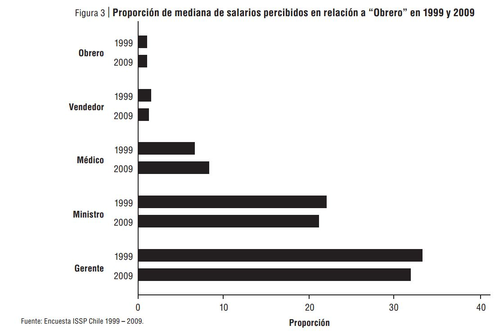
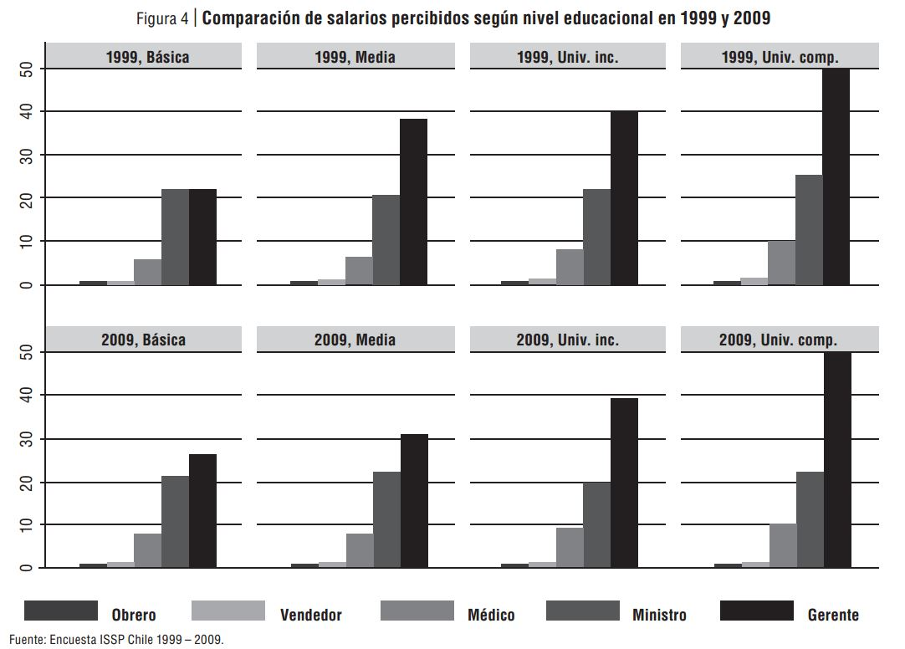
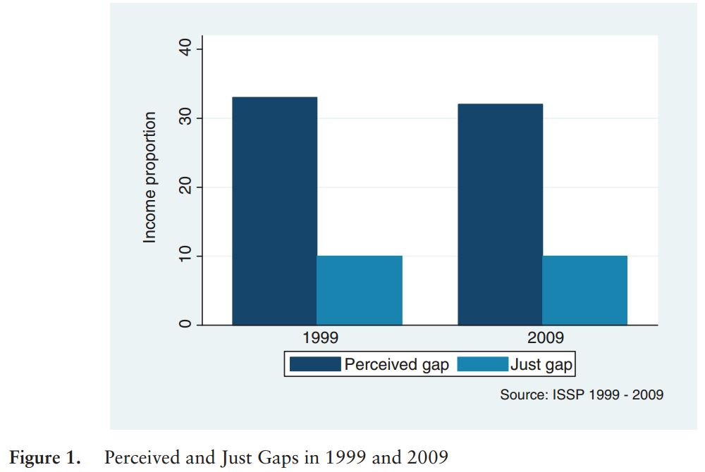

class: bottom, right, inverse

```{r eval=FALSE, include=FALSE}
# Correr esto para que funcione el infinite moonreader, el root folder debe ser static para si dirigir solo "bajndo" en directorios hacia el bib y otros

xaringan::inf_mr('/static/docpres/02_bases/2mlmbases.Rmd')
```

```{r setup, include=FALSE, cache = FALSE}
require("knitr")
options(htmltools.dir.version = FALSE)
pacman::p_load(RefManageR)
# bib <- ReadBib("../../bib/electivomultinivel.bib", check = FALSE)
opts_chunk$set(warning=FALSE,
             message=FALSE,
             echo=TRUE,
             cache = TRUE,fig.width=7, fig.height=5.2)
```

<!---
Para correr en ATOM
- open terminal, abrir R (simplemente, R y enter)
- rmarkdown::render('static/docpres/07_interacciones/7interacciones.Rmd', 'xaringan::moon_reader')

About macros.js: permite escalar las imágenes como [scale 50%](path to image), hay si que grabar ese archivo js en el directorio.
--->

<br>
<br>
<br>
<br>

# Desigualdad, justicia y redistribución
<br>
## Juan Carlos Castillo
### FONDECYT 1160921 - COES - Universidad de Chile
FACSO - Santiago, Noviembre 2019

---

layout: true
class: animated, fadeIn

---
# Marco general


---
class: roja, middle, center

# Desigualdad
---
class: middle


.small[
Maldonado, L., Castillo, J. C., Iturra, J. C., Atria, J., & Meneses, F. (2019, November 3). Meritocracia y redistribución en Chile: señales de la opinión pública. https://doi.org/10.17605/OSF.IO/G4EK8
]

---
class: roja, middle, center

# Percepción de desigualdad (salarial)
---



---



---
class: middle center


---


.small[
Castillo, Iturra, Moya & Maldonado (en elaboración) [https://juancarloscastillo.github.io/equal_pay/analysis.html](https://juancarloscastillo.github.io/equal_pay/analysis.html)
]
---


.small[
Schroeder & Castillo (submitted)
]


---
class: inverse

# Resumen percepción

<br>

## - Subpercepción en relación a salarios reales

## - Relativa estabilidad

## - Estratificación de la percepción


---
class: roja, middle, center

# Justificación

---


---
class: roja, middle, center

# Redistribución

---
class: middle center


.small[
Maldonado, L., Castillo, J. C., Iturra, J. C., Atria, J., & Meneses, F. (2019, November 3). Meritocracia y redistribución en Chile: señales de la opinión pública. https://doi.org/10.17605/OSF.IO/G4EK8
]

---
class: middle center


.small[
Maldonado, L., Castillo, J. C., Iturra, J. C., Atria, J., & Meneses, F. (2019, November 3). Meritocracia y redistribución en Chile: señales de la opinión pública. https://doi.org/10.17605/OSF.IO/G4EK8
]
---
class: middle center


.small[
Maldonado, L., Castillo, J. C., Iturra, J. C., Atria, J., & Meneses, F. (2019, November 3). Meritocracia y redistribución en Chile: señales de la opinión pública. https://doi.org/10.17605/OSF.IO/G4EK8
]
---
class: inverse

# Discusión

<br>
<br>

## - ¿Desigualdad o redistribución?

---
class: inverse right
<br>
<br>
<br>
<br>

# Desigualdad, justicia y redistribución
<br>
## Juan Carlos Castillo
### FONDECYT 1160921 - COES - Universidad de Chile

<br>
[jc-castillo.com](https://juancarloscastillo.github.io/jc-castillo/)

---

