class: bottom, right, inverse

```{r eval=FALSE, include=FALSE}
# Correr esto para que funcione el infinite moonreader, el root folder debe ser static para si dirigir solo "bajndo" en directorios hacia el bib y otros

xaringan::inf_mr('/static/docpres/02_bases/2mlmbases.Rmd')
```

```{r setup, include=FALSE, cache = FALSE}
require("knitr")
options(htmltools.dir.version = FALSE)
pacman::p_load(RefManageR)
# bib <- ReadBib("../../bib/electivomultinivel.bib", check = FALSE)
opts_chunk$set(warning=FALSE,
             message=FALSE,
             echo=TRUE,
             cache = TRUE,fig.width=7, fig.height=5.2)
```

<!---
Para correr en ATOM
- open terminal, abrir R (simplemente, R y enter)
- rmarkdown::render('static/docpres/07_interacciones/7interacciones.Rmd', 'xaringan::moon_reader')

About macros.js: permite escalar las imágenes como [scale 50%](path to image), hay si que grabar ese archivo js en el directorio.
--->

<br>
<br>
<br>
<br>

# Desigualdad, justicia y redistribución
<br>
## Juan Carlos Castillo
### FONDECYT 1160921 - COES - Universidad de Chile
Viña del Mar, Diciembre 2019

---

layout: true
class: animated, fadeIn

---
class: roja, middle, center

# CONTEXTO

---
## Contexto de investigación

- Proyecto **La economía moral de la meritocracia y las preferencias redistributivas** - FONDECYT grant 1160921 

--
  - Juan Castillo (UCH), Luis Maldonado (UC) & Jorge Atria (UDP)

  - 2016-2020

  - Estudios cualitativos (entrevistas y grupos focales)

  - Análisis de datos secundarios (ISSP)

  - Experimentos de encuestas

---
## Algunos resultados - artículos

.small[

- Maldonado,L., Olivos, F. Azar, A. Castillo, J. & Atria, J.(2019) Risk exposure, humanitarianism and willingness to pay for universal healthcare: A cross-national analysis of 28 countries. _Social Justice Research_

- Frei, R., Castillo, JC., Henríquez, R. & Suárez, J. (2018 - Forthcoming 2020) “¿Fruto del esfuerzo?”: los cambios en las atribuciones sobre pobreza y riqueza en Chile entre 1996 y 2015. _Latin American Research Review_.

- Castillo, JC. Olivos. F. & Azar, A. (2018) On the justice of pensions: A factorial survey approach (with Francisco Olivos & Ariel Azar). Accepted in Social Science Quarterly DOI: 10.1111/ssqu.12539.

- Castillo, JC. & Torres, A. , Atria, J & Maldonado, L. (2018) Meritocracia y desigualdad económica: Percepciones, preferencias e implicancias. Forthcoming in Revista Internacional de Sociología

- Castillo, JC & Rivera,M. (2018) Poverty and wealth attributions: A second order confirmatory factor analysis model. Forthcoming in Psykhe

- Azar, A., Maldonado, L., Castillo, JC & Atria, J. (2018) “Income, Egalitarianism, and Attitudes Towards Healthcare Policy: A Study on Public Attitudes in 29 Countries” Public Health 148:59-69

- Atria, J., Amenábar, J., Sanchez, J., Castillo, JC & Cociña, M. (2017) Investigando a la élite económica: Lecciones y desafíos a partir del caso de Chile. Cultura, Hombre y Sociedad 27(2)5-36 (Scielo)

---

## En elaboración

- García-Sánchez & Castillo, JC.- Taking from the rich or giving to the poor: The two faces of support for redistribution

- Franetovic & Castillo, JC - Redistributive preferences in unequal contexts: Changes in Latin America between 2008 and 2016

- Beck & Castillo, JC - About the stability of meritocratic beliefs: A longitudinal measurement invariance approach.
]

---
## Algunos resultados - tesis

.small[
- Plaza, A. (2018) Movilidad social y preferencias por la redistribución: Efectos individuales y contextuales. Magíster en Sociología, P. Universidad Católica de Chile.

- Franetovic, G. (2018) Desigualdad, desarrollo económico y preferencias redistributivas en América Latina. Magíster en Sociología, P. Universidad Católica de Chile.

- Muñoz, E. (2018) Evaluaciones de justicia distributiva sobre las pensiones de vejez en Chile. Magíster en Sociología, P. Universidad Católica de Chile.

- Sandoval, D. (2017) Merezco estar aquí: Un estudio multinivel sobre la relación entre meritocracia y educación. Magíster en Sociología, P. Universidad Católica de Chile.

- Montedónico, S. (2017) Contexto Polı́tico Institucional y Preferencias Redistributivas en América Latina. Magíster en Sociología, P. Universidad Católica de Chile.

- Beck, G. - Redes de contacto extensas y la justificación de la desigualdad social en Chile.

- Iturra, J. - Estatus Social Subjetivo y
percepción de meritocracia: el caso de Chile

- Rojas, S. La dimensión subjetiva de la desigualdad de género en ingresos: factores asociados a percepción de salarios y preferencias de justicia
]

---

## ... más información


- En el sitio web de nuestro proyecto en Researchgate: [https://www.researchgate.net/project/The-moral-economy-of-meritocracy-and-redistributive-preferences](https://www.researchgate.net/project/The-moral-economy-of-meritocracy-and-redistributive-preferences)

- en [jc-castillo.com](https://jc-castillo.com)


---
# Marco general agenda investigación


---
class: roja, middle, center

# Desigualdad
---
class: middle


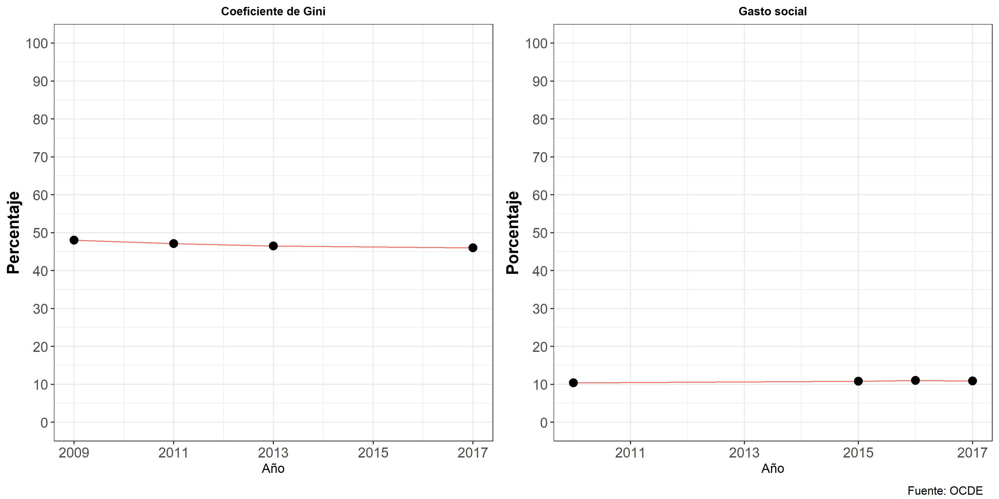

.small[
Maldonado, L., Castillo, J. C., Iturra, J. C., Atria, J., & Meneses, F. (2019, November 3). Meritocracia y redistribución en Chile: señales de la opinión pública. https://doi.org/10.17605/OSF.IO/G4EK8
]

---
class: roja, middle, center

# Percepción de desigualdad (salarial)
---

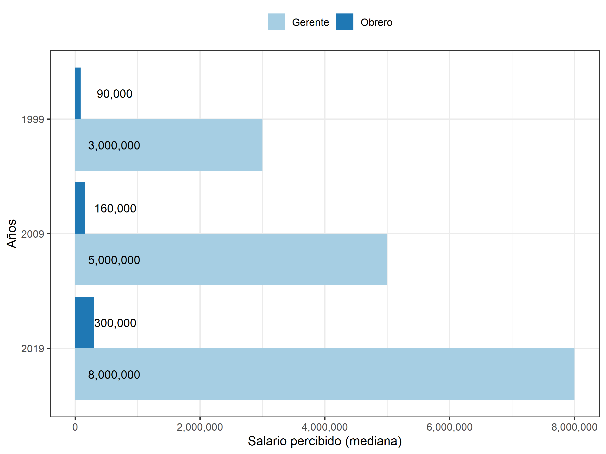

---


---
class: middle center

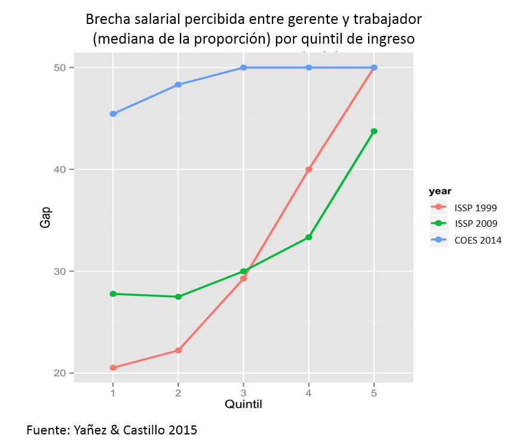

---

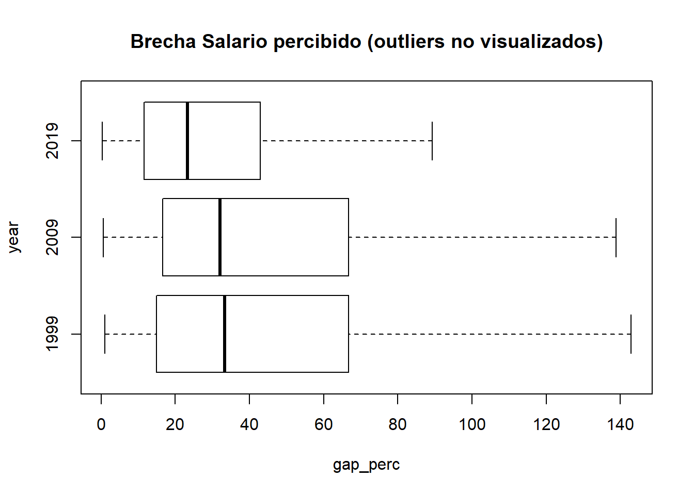
.small[
Castillo, Iturra, Moya & Maldonado (en elaboración) [https://juancarloscastillo.github.io/equal_pay/analysis.html](https://juancarloscastillo.github.io/equal_pay/analysis.html)
]
---

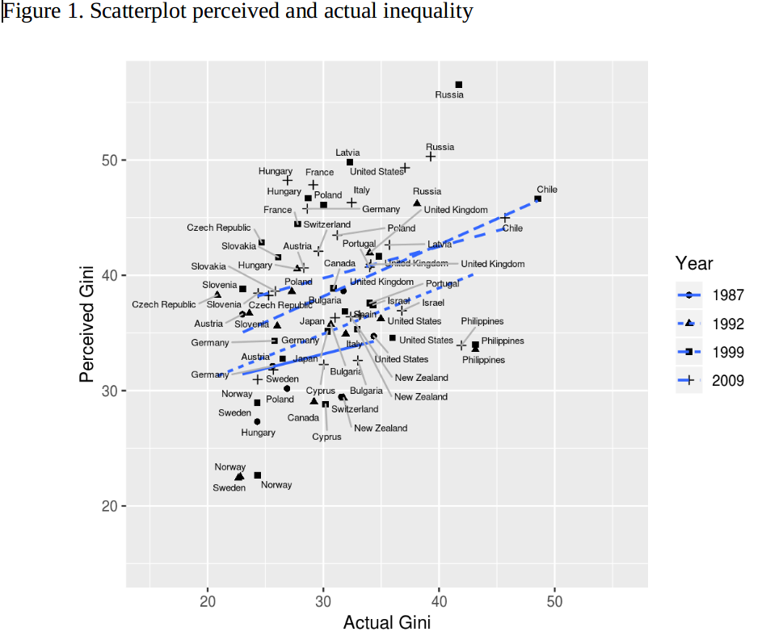
.small[
Schroeder & Castillo (submitted)
]


---
class: inverse

# Resumen percepción

<br>

## - Subpercepción en relación a salarios reales

## - Relativa estabilidad

## - Estratificación de la percepción


---
class: roja, middle, center

# Justificación

---

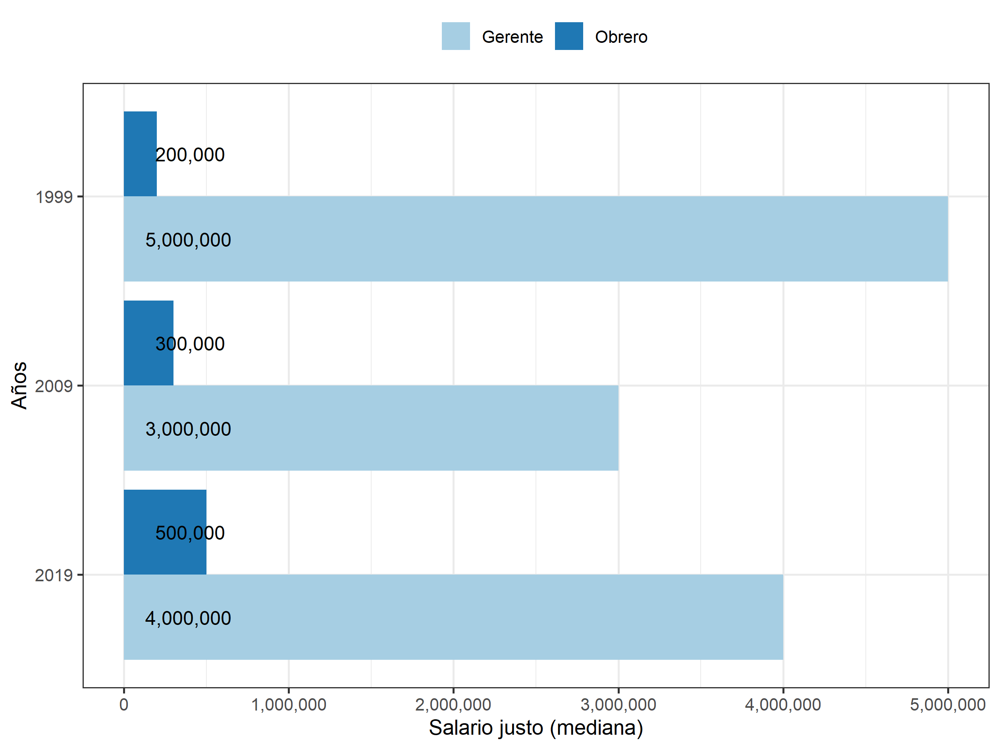

---

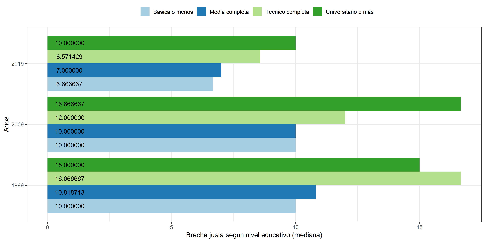

---
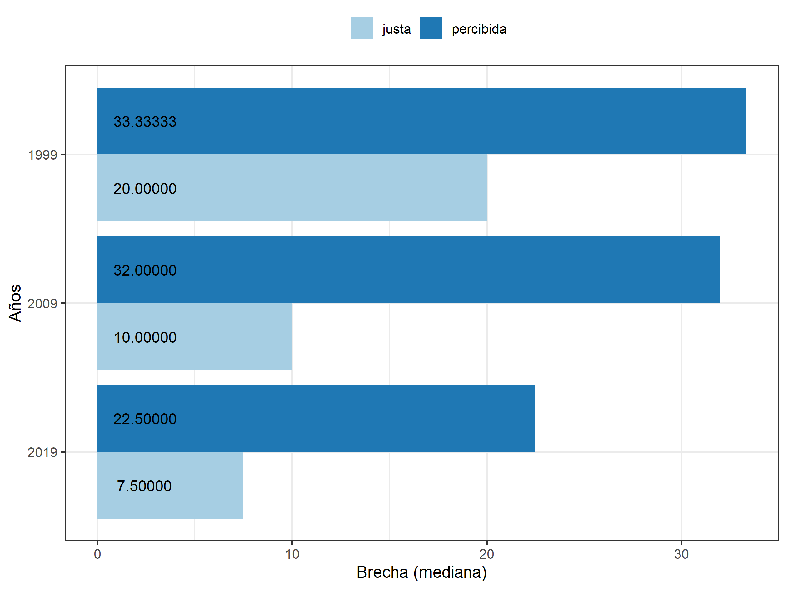


---
class: roja, middle, center

# Redistribución

---
class: middle center

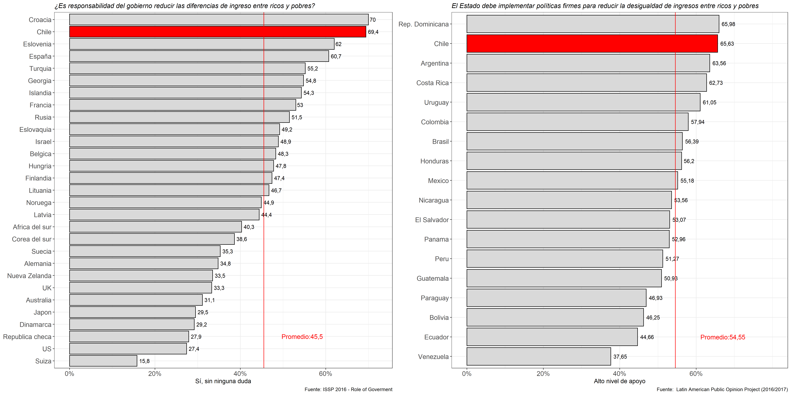
.small[
Maldonado, L., Castillo, J. C., Iturra, J. C., Atria, J., & Meneses, F. (2019, November 3). Meritocracia y redistribución en Chile: señales de la opinión pública. https://doi.org/10.17605/OSF.IO/G4EK8
]

---
class: middle center

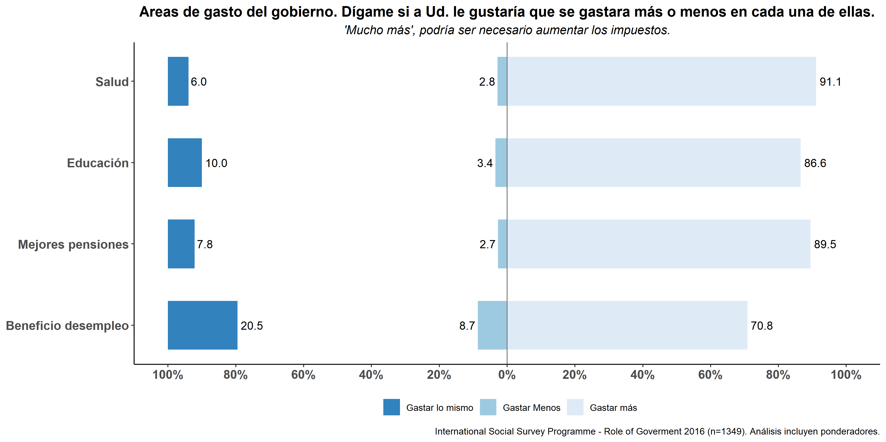

.small[
Maldonado, L., Castillo, J. C., Iturra, J. C., Atria, J., & Meneses, F. (2019, November 3). Meritocracia y redistribución en Chile: señales de la opinión pública. https://doi.org/10.17605/OSF.IO/G4EK8
]
---
class: middle center

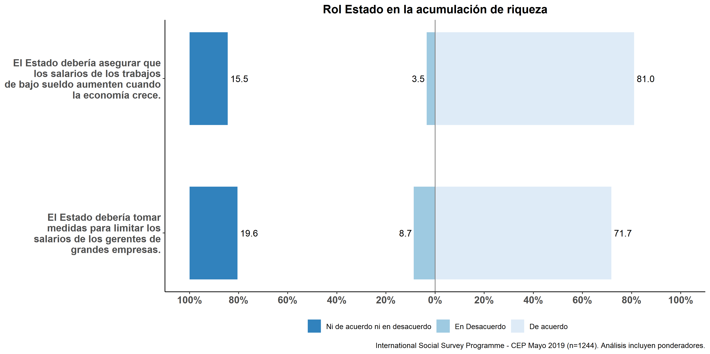
.small[
Maldonado, L., Castillo, J. C., Iturra, J. C., Atria, J., & Meneses, F. (2019, November 3). Meritocracia y redistribución en Chile: señales de la opinión pública. https://doi.org/10.17605/OSF.IO/G4EK8
]
---
class: inverse

# Discusión

<br>
<br>

## - ¿Desigualdad o redistribución?

---
class: inverse right
<br>
<br>
<br>
<br>

# Desigualdad, justicia y redistribución
<br>
## Juan Carlos Castillo
### FONDECYT 1160921 - COES - Universidad de Chile

<br>
[jc-castillo.com](https://juancarloscastillo.github.io/jc-castillo/)

