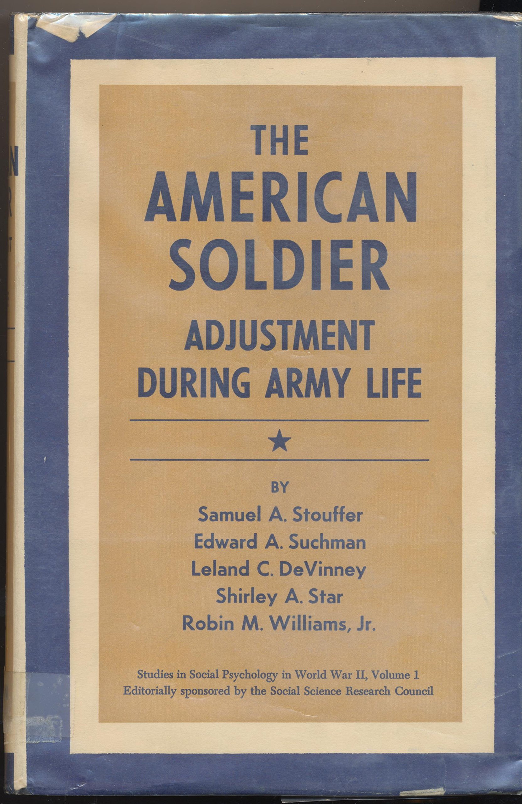
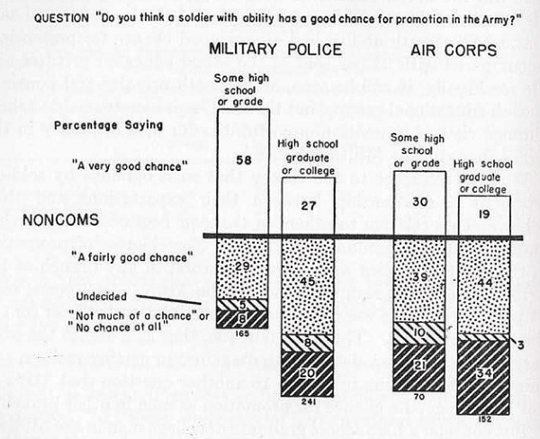
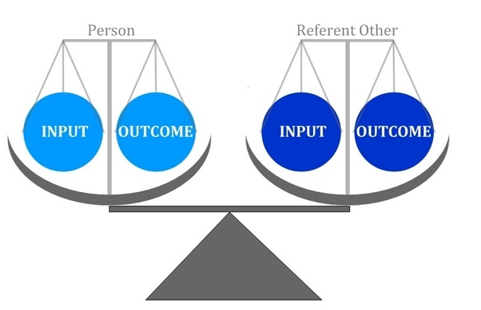
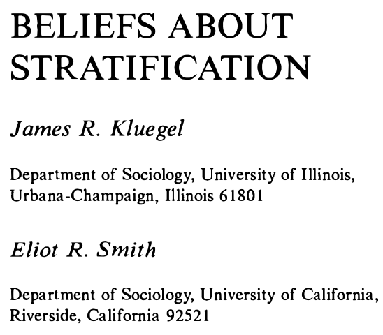
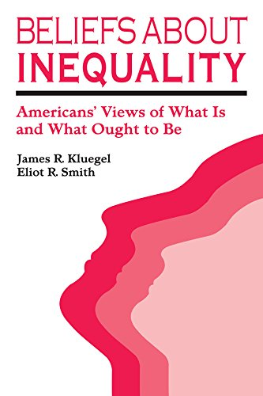
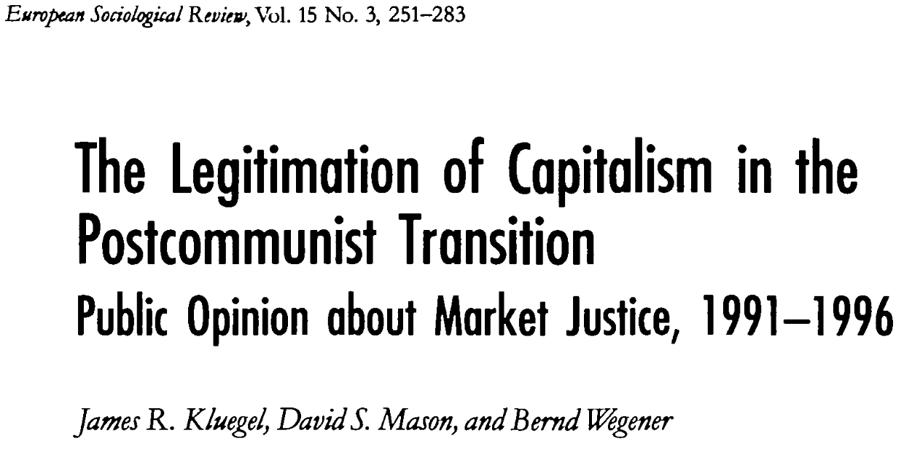

class: inverse right

```{r eval=FALSE, include=FALSE}
# Para que funcione el infinite moon reader, correr desde el root!
```

```{r setup, include=FALSE, cache = FALSE}
require("knitr")
options(htmltools.dir.version = FALSE)
pacman::p_load(RefManageR)
# bib <- ReadBib("../../bib/electivomultinivel.bib", check = FALSE)
opts_chunk$set(warning=FALSE,
             message=FALSE,
             echo=TRUE,
             cache = TRUE,fig.width=7, fig.height=5.2)
```

```{r xaringanExtra, echo=FALSE}
xaringanExtra::use_xaringan_extra(c("tile_view", "animate_css"))
```


<!---
Para correr en ATOM
- open terminal, abrir R (simplemente, R y enter)
- rmarkdown::render('static/docpres/07_interacciones/7interacciones.Rmd', 'xaringan::moon_reader')

About macros.js: permite escalar las imágenes como [scale 50%](path to image), hay si que grabar ese archivo js en el directorio.
--->

## Imaginarios sociológicos del régimen neoliberal chileno 

**Sesión 8** - Investigación empírica en aspectos subjetivos de la desigualdad y justicia distributiva.


Juan Carlos Castillo

[jc-castillo.com](http://jc-castillo.com/)

---
class: inverse

## 1. ¿Es importante lo que las personas piensan respecto de la desigualdad?

--

## 2. ¿Qué piensan las personas sobre la desigualdad?

--

## 3. ¿Qué relación existe entre justicia y desigualdad?


---
class: inverse

## ** 1. ¿Es importante lo que las personas piensan respecto de la desigualdad?**


## 2. ¿Qué piensan las personas sobre la desigualdad?


## 3. ¿Qué relación existe entre justicia y desigualdad?
 

---
# Antecedentes

.pull-left[



]

.pull-right[


]

???
Samuel Stouffer (Profesor de Sociología,U de Chicago - PhD supervisor: Herbert Blumer)
American Soldier: 1949
Deprivación relativa: Aircorps tenían mayor posibilidad real de promoción, pero tenían mayores expectativas y también ambiente más competitivo, lo que los hacia sentirse relativamente deprivados.
Relevante de deprivación relativa: no existe correspondencia exacta entre condiciones materiales reales y percepciones/creencias.
ENTONCES: no se puede inferir directamente lo que piensan las personas sobre la desigualdad desde la situación de desigualdad que enfrentan
Relacionado con el concepto de "conciencia falsa"

---
# Teoría de la equidad (Adams, 1960)

.center[

]


???
Percepción y acción.
ENTONCES: 2da razon de relevancia, agencia.

Es importante lo que las personas piensan sobre la desigualdad.

---
class: inverse

## 1. ¿Es importante lo que las personas piensan respecto de la desigualdad?


## **2. ¿Qué piensan las personas sobre la desigualdad?**


## 3. ¿Qué relación existe entre justicia y desigualdad?
---

.pull-left[
## Creencias acerca de la desigualdad (Kluegel & Smith 1981, 1986)


]

.pull-right[

]

???
primera investigación y reporte comprehensivo en la temática.

---

# Kluegel & Smith 1981

<br>

We use the term .red[belief] in a broad sense to refer to the information (veridical or non veridical) about a phenomenon that an individual uses as a basis both for inferring other information and for action. This usage encompasses such more specific social-psychological concepts as values, perceptions, and attitudes. (K&S 1981, p.30)

---
# Kluegel & Smith 1981

<br>

Concerning beliefs in these three areas, research has addressed four major questions: (a) .red[What] is believed? (b) What .red[principles] organize thought about social inequality? (c) What .red[determines] what is believed? (d) What are the .red[consequences] of the beliefs? (K&S 1981, p.30)


---
# Kluegel & Smith 1981

<br>

there is **little general support for complete equality of incomes**,
principally because it violates norms of equity. An unequal distribution of income based on education, occupation, marital status, and number of
children is generally believed fair (Jasso & Rossi 1977; Alves & Rossi
1978).(K&S 1981, p.31)

---
# Contexto y creencias sobre la desigualdad

.pull-left-narrow[
]

.pull-right-wide[

]

???

---
# Principales conceptos:

- "market justice / socialist justice"

- percepción de desigualdad

- ideologías de justicia

- evaluación de justicia salarial (Jasso, 1980)

- atribuciones de pobreza

---
# Principales proyectos de investigación comparativos internacionales

- [ISJP (International Social Justice Project)](https://www.sowi.hu-berlin.de/de/lehrbereiche/empisoz/forschung/archiv/isjp)

- [ISSP (International Social Survey Programme - Módulo desigualdad)](http://w.issp.org/data-download/by-topic/)

---
## Esquema conceptual (Janmaat, 2013)

- **Perceptions** refer to subjective estimates of existing inequality (i.e. thoughts about what is). - _En Chile existe mucha desigualdad_

--

- **Beliefs** are here defined as normative ideas about just inequality (i.e. thoughts about what should be).   - _En Chile no debería existir tanta desigualdad_

--

- **Judgements** are understood here as normative evaluations of existing inequality (i.e. thoughts about how desirable or good the current situation is). - _El nivel de desigualdad existente no es apropiado/está mal._
  

---
class: inverse

## 1. ¿Es importante lo que las personas piensan respecto de la desigualdad?


## 2. ¿Qué piensan las personas sobre la desigualdad?


## **3. ¿Qué relación existe entre justicia y desigualdad?**

---
class: middle

  


---
class: inverse right
  
## Imaginarios sociológicos del régimen neoliberal chileno 

**Sesión 8** - Investigación empírica en aspectos subjetivos de la desigualdad y justicia distributiva.


Juan Carlos Castillo

[jc-castillo.com](http://jc-castillo.com/)
