class: inverse right

```{r eval=FALSE, include=FALSE}
# Para que funcione el infinite moon reader, correr desde el root!
```

```{r setup, include=FALSE, cache = FALSE}
require("knitr")
options(htmltools.dir.version = FALSE)
pacman::p_load(RefManageR)
# bib <- ReadBib("../../bib/electivomultinivel.bib", check = FALSE)
opts_chunk$set(warning=FALSE,
             message=FALSE,
             echo=TRUE,
             cache = TRUE,fig.width=7, fig.height=5.2)
```

```{r xaringanExtra, echo=FALSE}
xaringanExtra::use_xaringan_extra(c("tile_view", "animate_css"))
```

```{r xaringanExtra-share-again, echo=FALSE}
xaringanExtra::use_share_again()
```


<!---
Para correr en ATOM
- open terminal, abrir R (simplemente, R y enter)
- rmarkdown::render('static/docpres/07_interacciones/7interacciones.Rmd', 'xaringan::moon_reader')

About macros.js: permite escalar las imágenes como [scale 50%](path to image), hay si que grabar ese archivo js en el directorio.
--->

## Imaginarios sociológicos del régimen neoliberal chileno 

<br>
<br>
**Sesión 9** - Percepciones de desigualdad y clase social subjetiva.

<br>
<br>
Juan Carlos Castillo

[jc-castillo.com](http://jc-castillo.com/)

---
class: inverse

## Resumen sesión anterior

1. ¿Es importante lo que las personas piensan respecto de la desigualdad?

2. ¿Qué piensan las personas sobre la desigualdad?

3. ¿Qué relación existe entre justicia y desigualdad?

---
class: middle

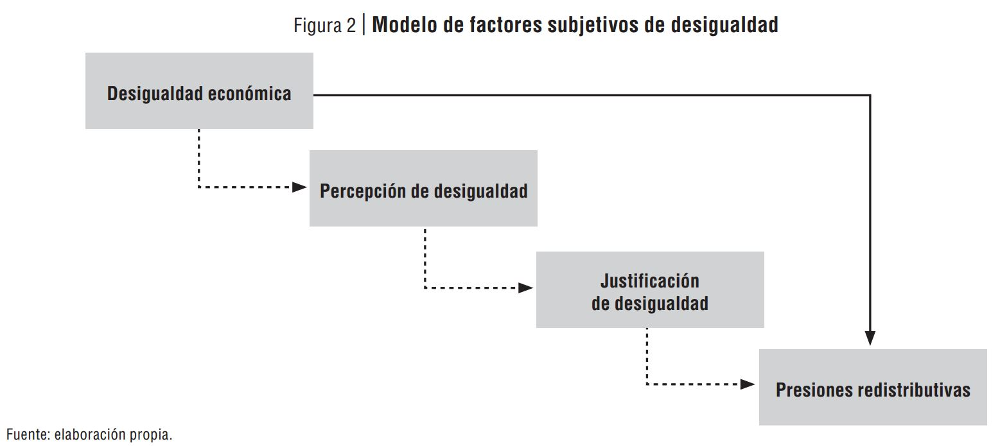

---
class: inverse right middle

## Hoy 

## .red[Percepciones de desigualdad y clase social subjetiva]


---

# Lecturas:

- Castillo, J. C., Miranda, D., & Cabib, I. M. (2013). Todos somos de clase media: Sobre el estatus social subjetivo en Chile. Latin American Research Review, 48(1), 155–173. https://doi.org/10.1353/lar.2013.0006

- Larrañaga, O., Frei, R., & Cociña, M. (2017). Desiguales: Orígenes, cambios y desafíos de la brecha social en Chile. Uqbar Editores. - Cap. 6: .red[Entre la molestia y la tolerancia]

---

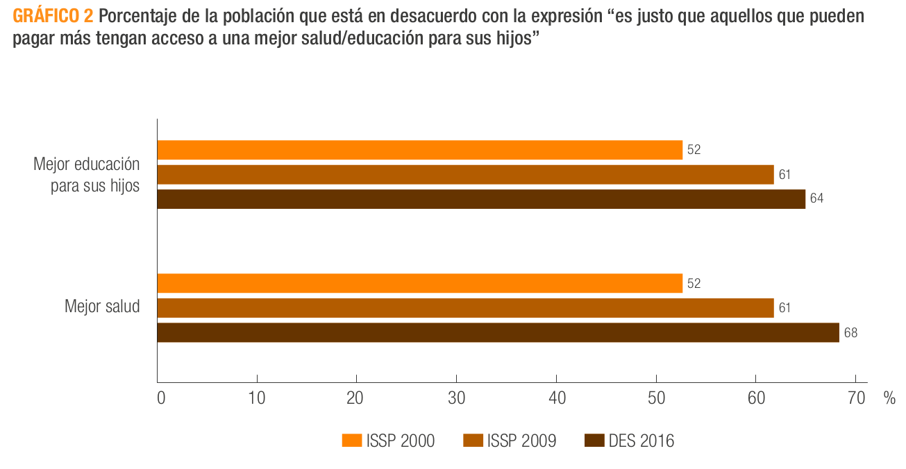

---

.center[
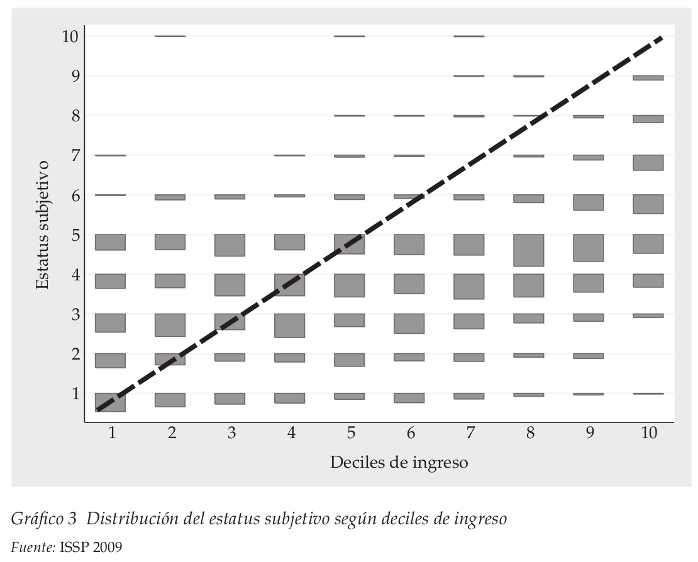]

---
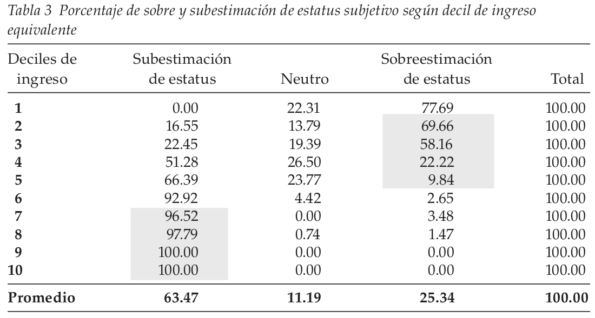

---

<div style="width: 100%; height: 600px; overflow: hidden;">
<video  style="width: 100%;" controls>
<source src="https://video.twimg.com/tweet_video/Ecf6mbaXgAIKa-W.mp4" type="video/mp4">
</video>
</div>

---
# Discusión:

- ¿Sesgos en la autoidentificación?

- ¿Consecuencias?


---
class: inverse middle right

# Percepción desigual de la desigualdad

---
# Evolución de crecimiento económico (PIB) y desigualdad en países de América Latina
<br>

<iframe width="400" height="325" frameborder="0" scrolling="no" marginwidth="0" marginheight="0" src="https://www.google.com/publicdata/embed?ds=d5bncppjof8f9_&amp;ctype=l&amp;strail=false&amp;bcs=d&amp;nselm=h&amp;met_y=ny_gdp_pcap_kd&amp;scale_y=lin&amp;ind_y=false&amp;rdim=region&amp;idim=country:CHL:COL:PER:ARG:MEX&amp;ifdim=region&amp;tstart=126932400000&amp;tend=1483930800000&amp;hl=es&amp;dl=es&amp;ind=false"></iframe>

<iframe width="400" height="325" frameborder="0" scrolling="no" marginwidth="0" marginheight="0" src="https://www.google.com/publicdata/embed?ds=d5bncppjof8f9_&amp;ctype=l&amp;strail=false&amp;bcs=d&amp;nselm=h&amp;met_y=si_pov_gini&amp;scale_y=lin&amp;ind_y=false&amp;rdim=region&amp;idim=country:CHL:COL:PER:ARG:MEX&amp;ifdim=region&amp;tstart=631854000000&amp;tend=1452308400000&amp;hl=es&amp;dl=es&amp;ind=false"></iframe>

<br>

---

.center[
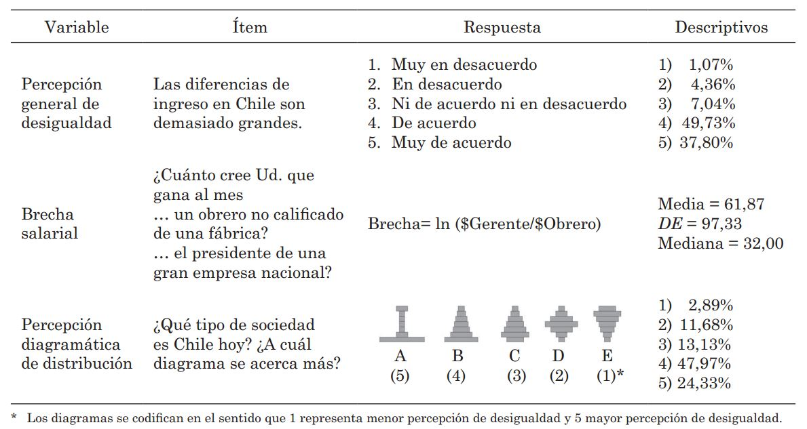
]
.small[(Castillo et al 2012)]
---
# Brechas

.center[
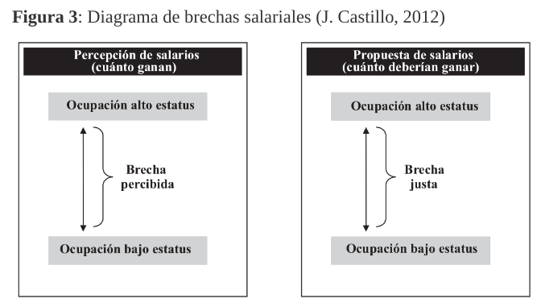
]
---
# Percepción salarial

.center[
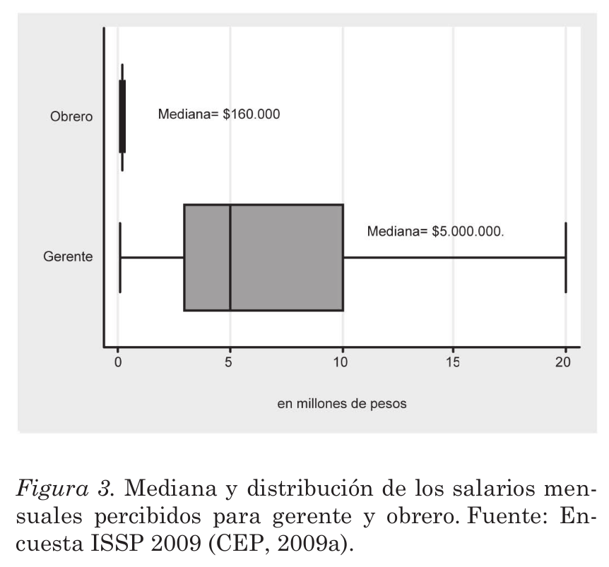
]
---

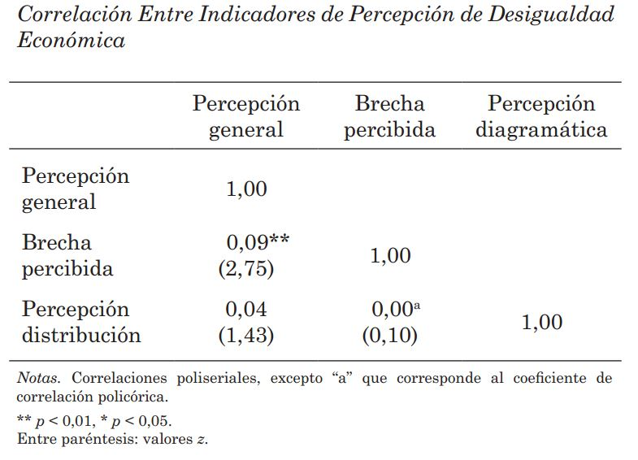


---

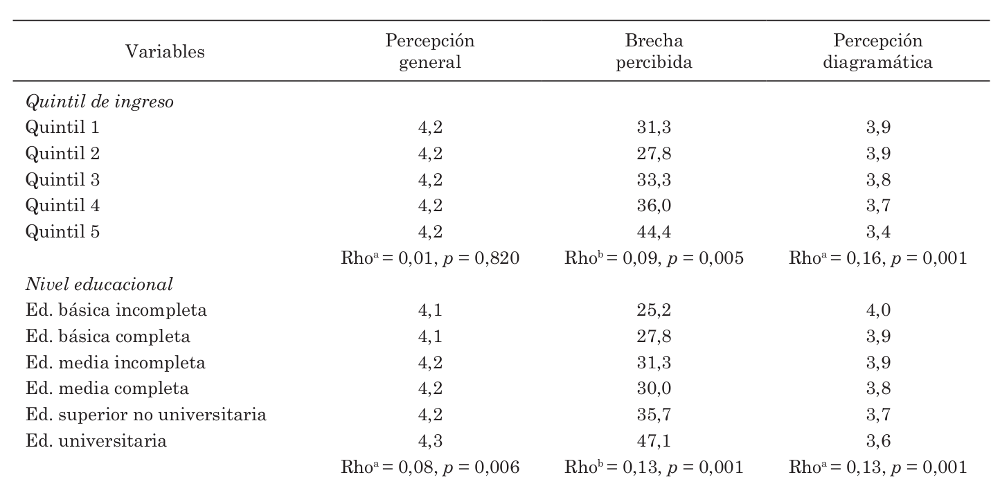

---

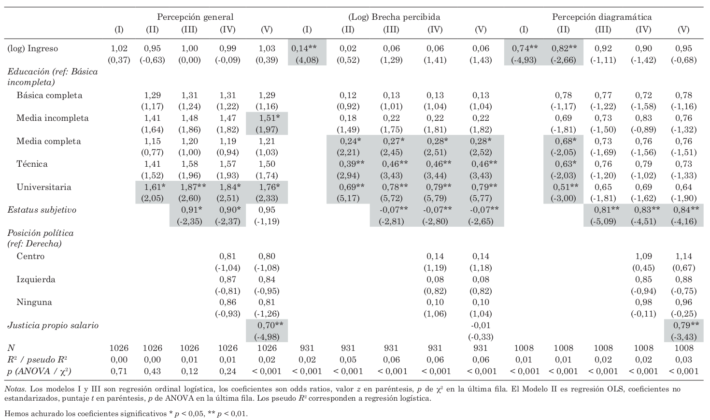

---
.center[

]

.small[Castillo et al (2019)]
---
.center[
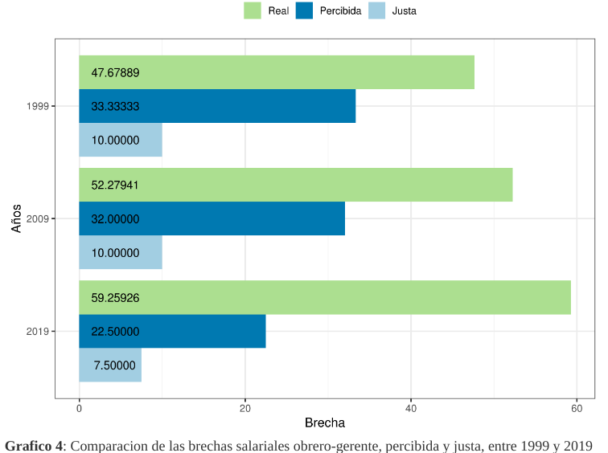
]
---

.center[
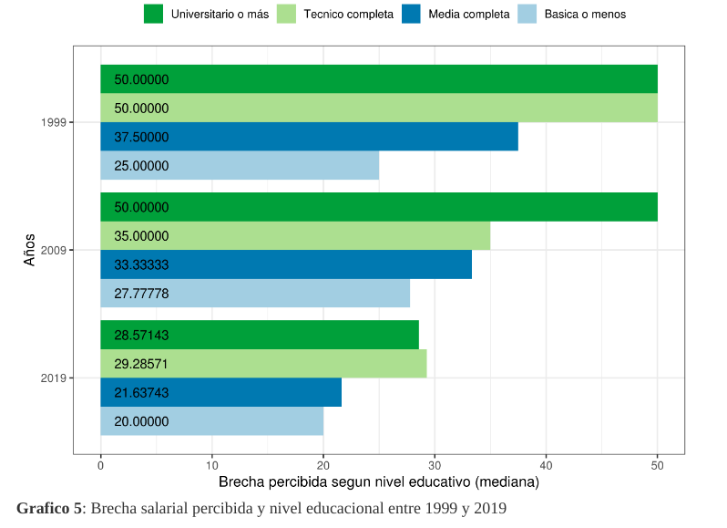
]
---
# Discusión

- Causas de sesgos en percepción de desigualdad

- Consecuencias de sesgos en la percepción de desigualdad


---

class: inverse right bottom
  
## Imaginarios sociológicos del régimen neoliberal chileno 

<br>
**Sesión 9** - Percepciones de desigualdad y clase social subjetiva.

Juan Carlos Castillo

[jc-castillo.com](http://jc-castillo.com/)
