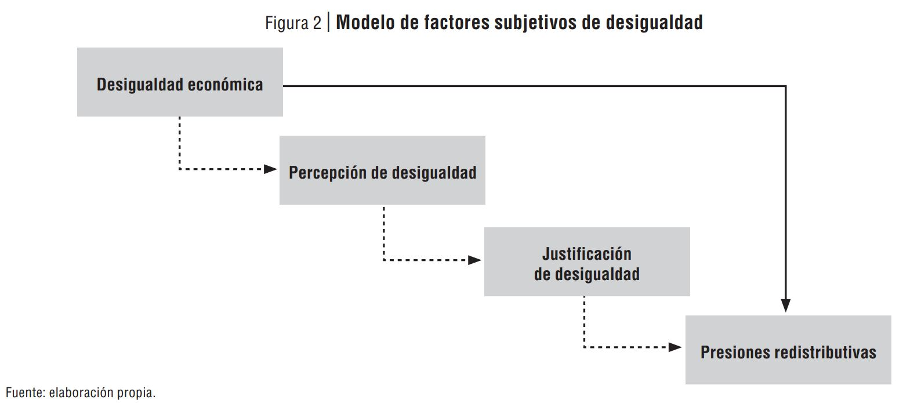
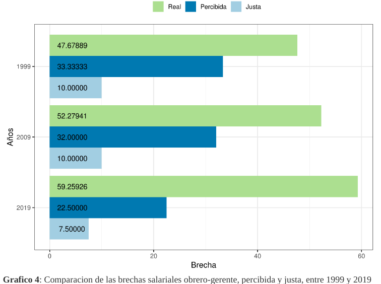
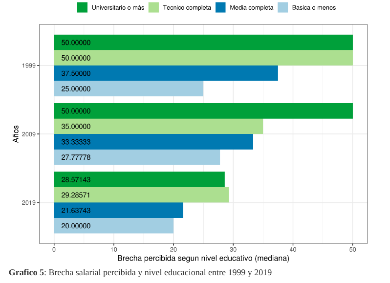
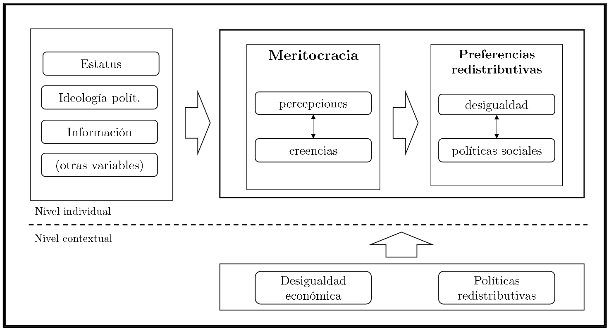
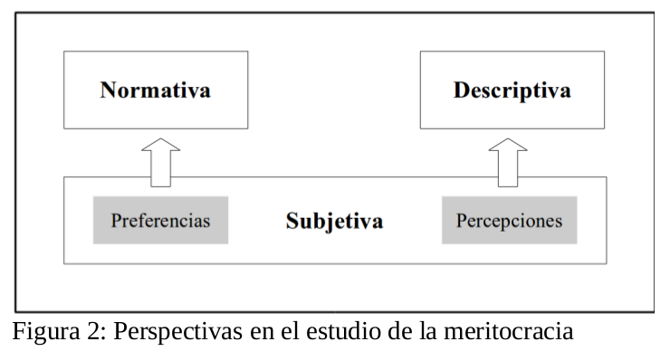
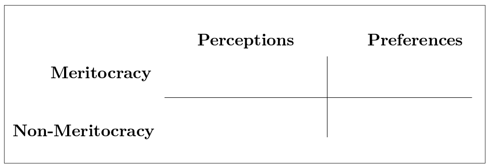
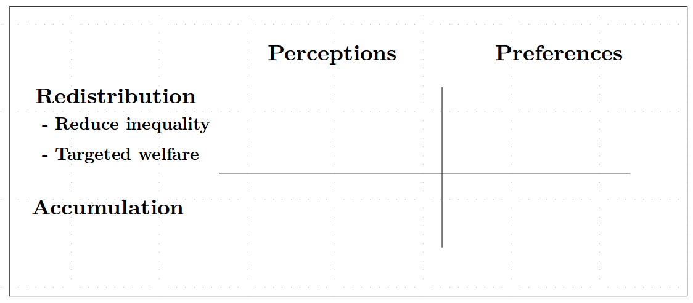

class: inverse right

```{r setup, include=FALSE}
options(htmltools.dir.version = TRUE)
pacman::p_load(RefManageR)
bib <- ReadBib("merit_pref_int.bib", check = FALSE)
```

```{r eval=FALSE, include=FALSE}
# Para que funcione el infinite moon reader, correr desde el root!
```

```{r setup2, include=FALSE, cache = FALSE}
require("knitr")
#options(htmltools.dir.version = FALSE)
pacman::p_load(RefManageR)
# bib <- ReadBib("../../bib/electivomultinivel.bib", check = FALSE)
opts_chunk$set(warning=FALSE,
             message=FALSE,
             echo=TRUE,
             cache = TRUE,fig.width=7, fig.height=5.2)
```

```{r xaringanExtra, echo=FALSE}
xaringanExtra::use_xaringan_extra(c("tile_view", "animate_css"))
```

```{r xaringanExtra-share-again, echo=FALSE}
xaringanExtra::use_share_again()
```


<!---
Para correr en ATOM
- open terminal, abrir R (simplemente, R y enter)
- rmarkdown::render('static/docpres/07_interacciones/7interacciones.Rmd', 'xaringan::moon_reader')

About macros.js: permite escalar las imágenes como [scale 50%](path to image), hay si que grabar ese archivo js en el directorio.
--->

## Imaginarios sociológicos del régimen neoliberal chileno 

<br>
<br>
**Sesión 10** - Meritocracia y las preferencias por la redistribución económica.


<br>
<br>
Juan Carlos Castillo

[jc-castillo.com](http://jc-castillo.com/)

---
class: inverse

## Las preguntas

1. ¿Es importante lo que las personas piensan respecto de la desigualdad?

2. ¿Qué piensan las personas sobre la desigualdad?

3. ¿Qué relación existe entre justicia y desigualdad?

---
class: middle



---
class: middle, right

### Algunas notas sobre percepción de desigualdad salarial ...

---
.center[

]
---

.center[

]

---
class: inverse right middle

## Hoy

## .red[Justicia, meritocracia y preferencias]


---

# Lecturas:

Dimick, M., Rueda, D., & Stegmueller, D. (2018). Models of Other-Regarding Preferences, Inequality, and Redistribution. Annual Review of Political Science, 21(1), 441–460. https://doi.org/10.1146/annurev-polisci-091515-030034

Castillo, J., Madero-Cabib, I., & Salamovich, A. (2013). Clivajes partidarios y cambios en preferencias distributivas en Chile. Revista de Ciencia Política, 33(2), 469–488. https://doi.org/10.4067/S0718-090X2013000200003


---
## Modelo de investigación

.center[

]

???
- Esta es la segunda presentación de nuestro proyecto FONDECYT en la conferencia COES. El año pasado en Viña presentamos los primeros avances de la conceptualización de meritocracia y del enfoque de economía moral para el estudio cualitativo.

- Este año seguimos avanzando en la relación entre meritocracia y redistribución en nuestras tres perspectivas metodológicas: encuestas, datos cualitativos y experimentos.

---
## Algunos resultados - artículos

.tiny[

- Frei, R., Castillo, JC., Henríquez, R. & Suárez, J. (2020) “¿Fruto del esfuerzo?”: los cambios en las atribuciones sobre pobreza y riqueza en Chile entre 1996 y 2015. _Latin American Research Review_.

- Atria, J., Castillo, J., Maldonado, L., & Ramirez, S. (2020). Economic Elites’ Attitudes Toward Meritocracy in Chile: A Moral Economy Perspective. American Behavioral Scientist. https://doi.org/10.1177/0002764220941214

- Maldonado,L., Olivos, F. Azar, A. Castillo, J. & Atria, J.(2019) Risk exposure, humanitarianism and willingness to pay for universal healthcare: A cross-national analysis of 28 countries. Social Justice Research

- Castillo, JC. Olivos. F. & Azar, A. (2018) On the justice of pensions: A factorial survey approach (with Francisco Olivos & Ariel Azar). Accepted in Social Science Quarterly DOI: 10.1111/ssqu.12539.

- Castillo, JC. & Torres, A. , Atria, J & Maldonado, L. (2018) Meritocracia y desigualdad económica: Percepciones, preferencias e implicancias. Forthcoming in Revista Internacional de Sociología

- Castillo, JC & Rivera,M. (2018) Poverty and wealth attributions: A second order confirmatory factor analysis model. Forthcoming in Psykhe

- Azar, A., Maldonado, L., Castillo, JC & Atria, J. (2018) “Income, Egalitarianism, and Attitudes Towards Healthcare Policy: A Study on Public Attitudes in 29 Countries” Public Health 148:59-69

- Atria, J., Amenábar, J., Sanchez, J., Castillo, JC & Cociña, M. (2017) Investigando a la élite económica: Lecciones y desafíos a partir del caso de Chile. Cultura, Hombre y Sociedad 27(2)5-36 (Scielo)
  
]

---
## Algunos resultados - tesis

.tiny[
- Beck, G. (2018) Redes de contacto extensas y la justificación de la desigualdad social en Chile.

- Iturra, J. (2018) Inconsistencia de estatus social y
percepción de meritocracia: el caso de Chile

- Rojas, S. (2018) La dimensión subjetiva de la desigualdad de género en ingresos: factores asociados a percepción de salarios y preferencias de justicia

- Plaza, A. (2018) Movilidad social y preferencias por la redistribución: Efectos individuales y contextuales. Magíster en Sociología, P. Universidad Católica de Chile.

- Franetovic, G. (2018) Desigualdad, desarrollo económico y preferencias redistributivas en América Latina. Magíster en Sociología, P. Universidad Católica de Chile.

- Muñoz, E. (2018) Evaluaciones de justicia distributiva sobre las pensiones de vejez en Chile. Magíster en Sociología, P. Universidad Católica de Chile.

- Sandoval, D. (2017) Merezco estar aquí: Un estudio multinivel sobre la relación entre meritocracia y educación. Magíster en Sociología, P. Universidad Católica de Chile.

- Montedónico, S. (2017) Contexto Polı́tico Institucional y Preferencias Redistributivas en América Latina. Magíster en Sociología, P. Universidad Católica de Chile.


]
---
class: inverse, middle, center

# Meritocracia y redistribución

---
## Meritocracia
.left-column[
  ### Bases
]
.right-column[

- "The rise of meritocracy" `r Cite (bib, "young_rise_1962")`

  - Merit= Effort + Talent

  - Mérito, desigualdades justas y legitimación

  
]

???

  **Just a brief theoretical background**
  - Young: inventa el término meritocracia en un sentido trágico, y al poco andar se utiliza ampliamente con una connotación positiva.
  - (def) Una sociedad meritocrática es aquella donde los bienes y recompensas son asignados principalmente en base a criterios de esfuerzo y talento individual. Ejemplo:
    - Nacer en cuna de oro: no legitimado, se debe legitimar mediante educación (privilege - MBAs)
    - sueldos, ej: ganar 10 millones, juicio en base a talentos y esfuerzos
    - comparación: ganar 5 millones.
  - Antagonismo entre meritocracia y redistribución, pero para esto antes tenemos que saber mejor qué es meritocracia y qué es redistribución.

---
## Meritocracia

.left-column[
  ### Bases
  ### Perspectivas de estudio
]

.right-column[

]

???

**Summarizing the conceptual approaches to meritocracy**
- Here we can see the three described dimensions in the study of meritocracy: normative descriptive and subjective. From now on I am going to focus on the subjective dimension, which basically comprises perceptions (what is) and beliefs (what should be), and which are linked to the normative and descriptive dimensions.

---
## Meritocracia

.left-column[
  ### Bases
  ### Perspectivas de estudio
  ### Estudiando la dimensión subjetiva
]

<font size="4">
.right-column[
- Kunovich, S. and Slomczynski, K. M. (2007). Systems of Distribution and a Sense of Equity: A Multilevel Analysis	of Meritocratic Attitudes in Post-industrial Societies. European Sociological Review, 23(5):649–663

- Hadjar, A. (2008). Meritokratie Als Legitimationsprinzip. VS Verlag, Wiesbaden.

- Duru-Bellat, M. and Tenret, E. (2012). Who’s for Meritocracy? Individual and Contextual Variations in the Faith. Comparative Education Review, 56(2):223–247

- Reynolds, J. and Xian, H. (2014). Perceptions of meritocracy in the land of opportunity. Research in Social Stratification and Mobility, 36:121–137.

- Newman, B. J., Johnston, C. D., and Lown, P. L. (2015). False Consciousness or Class Awareness? Local Income Inequality, Personal Economic Position, and Belief in American Meritocracy. American Journal of Political Science, 59(2):326–340.

- Solt, F., Hu, Y., Hudson, K., Song, J., and Yu, D. E. (2016). Economic inequality and belief in meritocracy in the	United States. Research \& Politics, 3(4):2053168016672101.

- Mijs, J. (2019). The paradox of inequality: Income inequality and belief in meritocracy go hand in hand. Socio-Economic Review. https://doi.org/10.1093/ser/mwy051

]
</font>

???
**Papers studying meritocracy through survey research**

- There are a bunch of papers dealing with meritocracy and its determinants.
- Although non of them deals with the measurement of meritocracy itself, still they make some operationalization choices with different consequences.
- In my paper I review with more detail the operationalization of each of these papers, and next I am going to show you some few examples.

---
## Meritocracia

.left-column[
  ### Bases
  ### Perspectivas de estudio
  ### Estudiando la dimensión subjetiva
  ### Propuesta conceptual
]
<font size="3">
.right-column[
<br>
<br>
<br>

]

???

-*Meritocracy*:

  - perceptions (ej: effort is rewarded)

  - beliefs(ej: effort should be rewarded)

-*Non-meritocracy*

  - perceptions (ej: contacts for getting a job)

  - beliefs (ej: it is ok to use contacts for getting a job)


---
## Redistribución

.left-column[
  ### Bases
]

.right-column[
- Homo economicus vs. Homo reciprocus/sociologicus `r Cite (bib, "mau_moral_2003")`

- Redistribución & desigualdad `r Cite (bib,"meltzer_rational_1981")`

- Modelos normativos `r Cite (bib, "Dimick_Models_2018")`: consideración de principios de justicia distributiva con la distribución actual.
]
---
## Redistribución

.left-column[
  ### Bases
  ### Midiendo redistribución
]

.right-column[
.small[
- Tradicionalmente: el gobierno debería implementar medidas para reducir la brecha entre pobres y ricos.

- Pero ...

  - reducción de diferencias no es lo mismo que mayor compensación para aquellos con mayor necesidad `r Cite (bib,"mccall_americans_2009")`, García-Sánchez & Castillo, 2019).

  - preferencias por la redistribución no son lo contrario que preferencias por la acumulación (uso reverse-coded equivocado)

  - confusión entre percepción de redistribución y preferencia por redistribución]
]

???
Estas confusiones hacen que la evidencia de distintos artículos no sea realmente comparable y no se puedan establecer conclusiones generales

---
## Redistribución

.left-column[
  ### Bases
  ### Midiendo redistribución
  ### Propuesta
]

.right-column[

]

---
## Meritocracia y redistribución

.medium[
.red[
¿En qué medida las percepciones y preferencias meritocráticas se asocian con percepciones y preferencias redistributivas?]

H1: Mayor preferencia por la meritocracia se asocia a una menor preferencia por la redistribución

H2: Contextos de mayor desigualdad conducen a mayores preferencias por la meritocracia, lo que a su vez disminuye las preferencias redistributivas 
]


---

# Discusión


- Meritocracia y justificación de la desigualdad

- Necesidad de precisiones conceptuales y empíricas

- Posibles aportes al debate contingente


---

class: inverse right bottom
  
## Imaginarios sociológicos del régimen neoliberal chileno 

<br>
**Sesión 10** - Meritocracia y las preferencias por la redistribución económica.


Juan Carlos Castillo

[jc-castillo.com](http://jc-castillo.com/)
