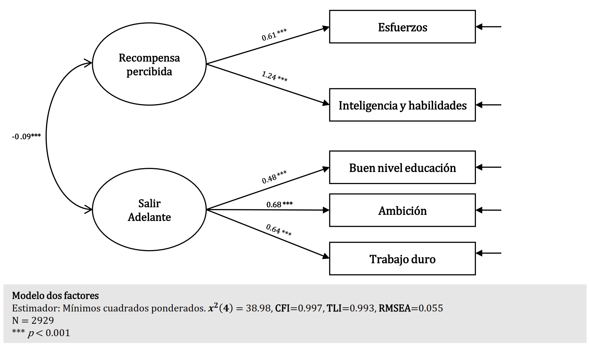
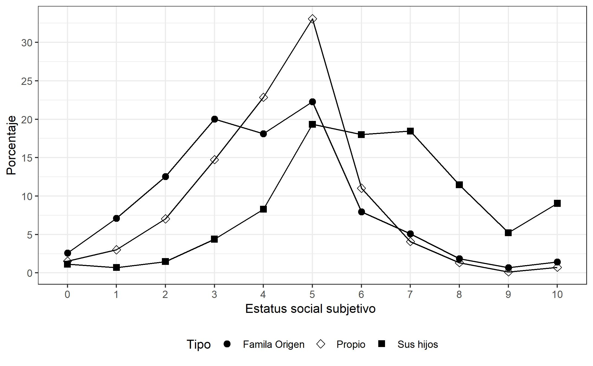
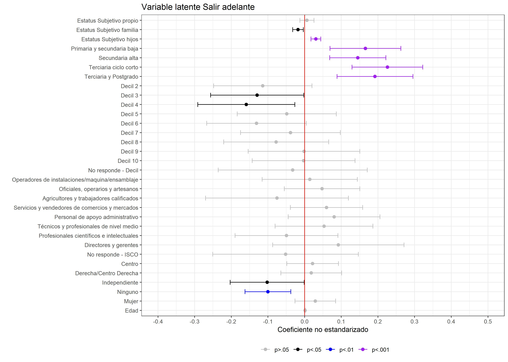
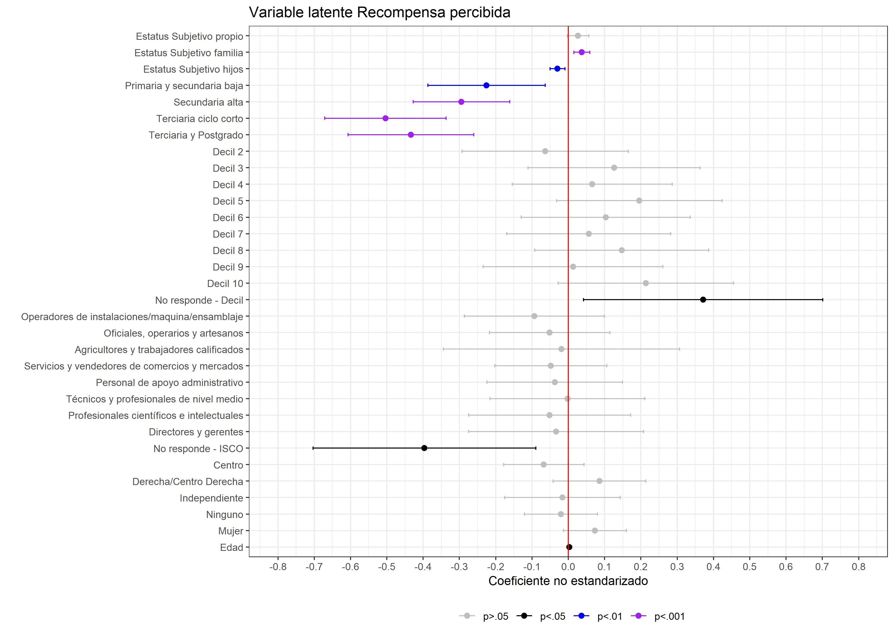
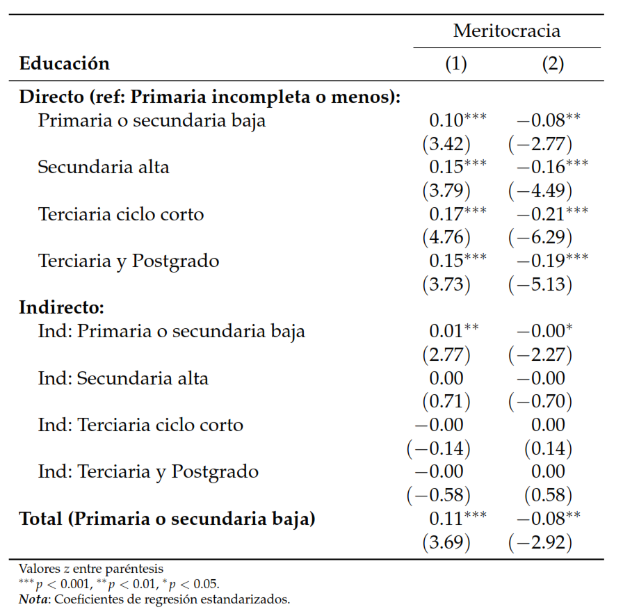
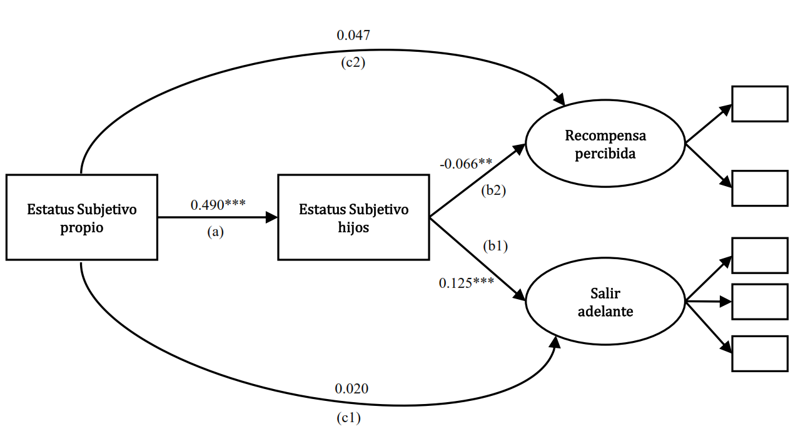
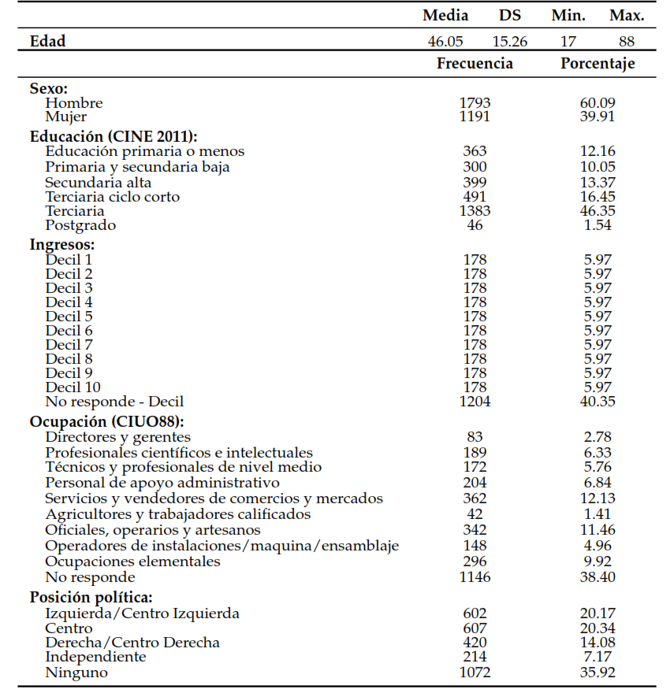

```{r message=FALSE, warning=FALSE, include=FALSE}
rm(list = ls())
library(haven)
library(lavaan)
library(dplyr)
library(psych)
library(sjPlot)
library(ggplot2)
library(knitr)
library(kableExtra)
setwd("C:/Users/JC/Google Drive/1.Magister/2. Segundo año/Tesis Magister/Primer Semestre/Presentaciones/presentacion-final")
load("C:/Users/JC/Google Drive/1.Magister/2. Segundo año/Tesis Magister/Primer Semestre/2. Base de Datos/merito_gini.RData")
```

##Antecedentes

* _**The Rise of Meritocracy**_ (Young, 1958)
  + Idea de Mérito como la combinación de **Esfuerzo** y **Talento**.

* Percepción de Meritocracia (García, 2001)

_**<center> "(...) el grado en que los individuos consideran que sus sociedad cumple con los principios de una meritocracia, es decir que funciona como un sistema que asigna recompensas en función del esfuerzo y las habilidades". </center>**_
  
* Relación entre mérito y estratificación 

  + "Beliefs about stratification", **creencias respecto a las causas de la desigualdad social** (Kluegel & Smith, 1981)
  
  + **Estatus social subjetivo** y percepción de meritocracia (Castillo et al., 2013; 2018) 
  
  + Logro educativo y mérito (Goldthorpe, 2003)
  
  + Hipótesis de Auto-interés (Meltzer & Richards, 1981)

---
class: inverse, middle, center

#En el contexto chileno, ¿Cómo se relacionan las características de estatus social objetivo y subjetivo con la percepción de meritocracia?

---
## Hipótesis

$H_{1}$: **Una posición superior en la distribución de ingresos se asocia positivamente con la percepción de meritocracia.**

$H_{2}$: **Pertenecer a grupos con mayor logro educativo, se asocia con una mayor percepción de meritocracia.**

$H_{3}$: **Desempeñarse en ocupaciones de alta cualificación en el mercado de trabajo, se asocia con una mayor percepción de meritocracia.**

$H_{4}$: **Individuos con un Estatus Social subjetivo más alto tenderían a percibir más meritocracia.**

???

Estas son las principales hipótesis guiadas por las teoría e investigaciones previas.
---
class: inverse, middle, center

#Medición Percepción de Meritocracia

---
class:middle
```{r, echo=FALSE, fig.align='center', message=FALSE, warning=FALSE, out.width="100%"}
 
```
???

**Estimación**: se realizó un CFA asumiendo que los indicadores con variables ordinales.

**Ajuste**: El ajuste es adecuado, se probó una correlación entre los errores de "Inteligencia y habilidades" con "Trabajo duro". El problema de varianza negativa desapareció, pero a falta de una justificación sustantiva se decide mantener el modelo original.

**Problemas**: Caso heywood; varianza negativas producto de diferencias entre la matriz real y predicha.
---
class: inverse, middle, center

#Estatus social subjetivo

---
class: middle

```{r, echo=FALSE, fig.align='center', message=FALSE, warning=FALSE, out.width="75%", results='asis'}


# a <- elsoc_gini %>% select(ess,essfam,esshijos)
# 
# b <- c("Propio", "Familia","Hijos")
# colnames(a) <- b
# stargazer::stargazer(a, type = "html",nobs = FALSE)
```

<table style="text-align:center"><tr><td colspan="5" style="border-bottom: 1px solid black"></td></tr><tr><td style="text-align:left"> </td><td>Media</td><td>DS</td><td>Min</td><td>Máx</td></tr>
<tr><td colspan="5" style="border-bottom: 1px solid black"></td></tr><tr><td style="text-align:left">Propio</td><td>4.34</td><td>1.58</td><td>0</td><td>10</td></tr>
<tr><td style="text-align:left">Familia</td><td>3.96</td><td>1.93</td><td>0</td><td>10</td></tr>
<tr><td style="text-align:left">Hijos</td><td>6.28</td><td>2.08</td><td>0</td><td>10</td></tr>
<tr><td colspan="5" style="border-bottom: 1px solid black"></td></tr></table>

???

- Propio: Sesgo hacia la media 35% aprox en (5) 22% en (4) 15% en (6) = `r 35+22+15`% 

- Familia: Respecto a el propio. Habría una tendencia a posicionarse sobre la familia de origen.

- Hijos: existe un sesgo hacia la parte superior de la distribución (movilidad social o expectativas de ello.)
---
class: inverse, middle, center

#Resultados modelos de regresión
---
class: middle
```{r, echo=FALSE, fig.align='right', message=FALSE, warning=FALSE, out.width="150%"}
 
```
???

---
class: middle

```{r, echo=FALSE, fig.align='right', message=FALSE, warning=FALSE, out.width="150%"}
 
```
???

---
class: inverse, middle, center

#Análisis de mediación

???

- Hay una suposición teórica que proviene de la evidencia sobre movilidad social y actitudes hacia la desigualdad.

- Que el coeficiente de Propio desaparezca, implica que hay algo con el estatus social de los hijos.

- Una movilidad ascendiente es la más importante respecto de la adscripción a meritocracia. 
---
class: center

**Educación**  $\overrightarrow{a}$  **ESS Hijos**  $\overrightarrow{b}$ **Percepción de Meritocracia** 


```{r, echo=FALSE, message=FALSE, warning=FALSE, out.width="50%"}
 
```

---
class: center
 **ESS propio** $\overrightarrow{a}$  **ESS Hijos**  $\overrightarrow{b}$ **Percepción de meritocracia** 

```{r, echo=FALSE, message=FALSE, warning=FALSE, out.width="75%", fig.cap="**Nota**: Coeficientes estandarizados entre Estatus social subjetivo propio y las variables *Salir adelante* y *Recompensa percibida* $^{***}p<$ 0.001, $^{**}p<$ 0.01."}
 
```
<!-- $^{***}p<$ 0.001, $^{**}p<$ 0.01 -->

| Efecto | Coef. |   SE  |    z   |   p   |  Beta  |
|:------:|:-----:|:-----:|:------:|:-----:|:------:|
| Indirecto (1)| 0.019 | 0.004 |  4.633 | 0.000 |  0.061 |
| Indirecto (2)| -0.018 | 0.006 | -2.975 | 0.003 | -0.032 |


---
## Evaluación de Hipótesis

**Estatus objetivo**:
1. La hipótesis referente a los ingresos no se cumple de manera sustancial. Es posible observar que pertenecer al Decil 3 y 4, implica diferencias respecto del Decil 1 ( $p<0.05$ )

2. La educación es la variable de estatus objetivo más importante. Existen diferencias significativas en todos los grupos de nivel educativo. Existe una asociación positiva con Salir adelante y negativa con Recompensa percibida.

3. La ocupación de los individuos no se encuentra asociada sustancialmente con la percepción de meritocracia.

** Estatus subjetivo **

* El estatus social subjetivo se asocia con la percepción de meritocracia. No obstante, el sentido de esta asociación es distinta según las medidas de estatus subjetivo.

* El estatus subjetivo propio es menos relevante que el estatus de la familia de origen y el de los hijos. 

???

1. Un estatus familiar más alto implica que se le atribuye **menor** importancia a los factores individuales (Educarse, esfuerzo y ambición.)
2. Un estatus de sus hijos más alto implica una mayor importancia sobre los factores individuales.
    
* Salir adelante: 
    + Familia (-) Meritocracia: Familia clase alta, menos meritocrático.

    + Hijos (+) Meritocracia: Expectativas de movilidad a través de los hijos, alto mérito. (Atribución de pobreza, hipótesis POUM)

    + Educación (+) Meritocracia: Intuitivo, mayor instrucción asociacio a mayor esfuerzo e inteligencia.

* Recompensa percibida

    + Familia (+) Meritocracia: "Estoy donde estoy, mis papás se esforzaron. También lo merezco"

    + Hijos (-) Meritocracia: Evaluación negativa del futuro, en función de la evaluación propia. Asociado a deprivación.

    + Educación (-) Meritocracia: Deprivación relativa "me esforcé harto, me recompensan poco (p.ej: Terciario ciclo corto)

---

class: center, middle

Slides created via the R package [**xaringan**](https://github.com/yihui/xaringan).

---
class: center
```{r, echo=FALSE, fig.align='center', message=FALSE, warning=FALSE, out.width="75%", results='asis'}

```

