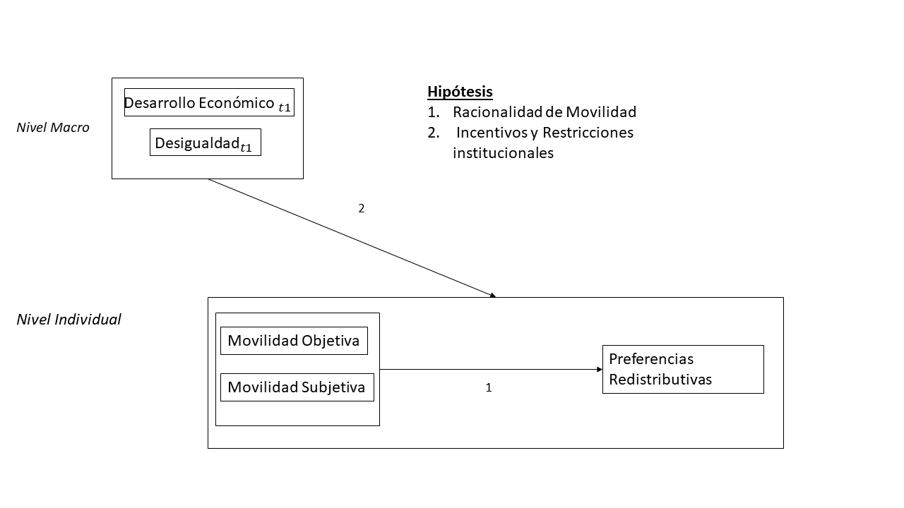
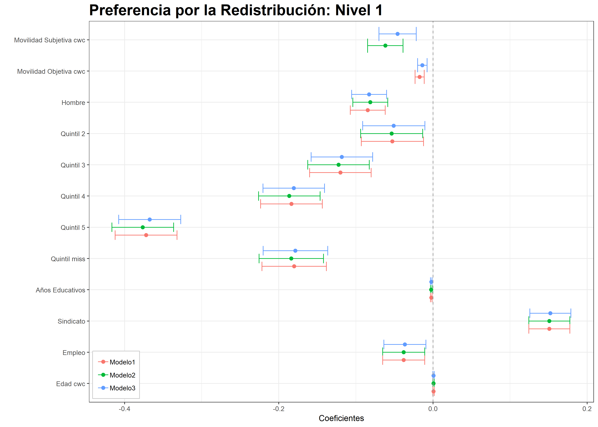
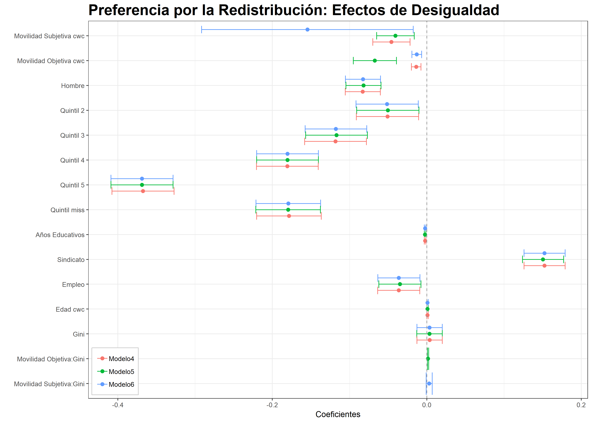
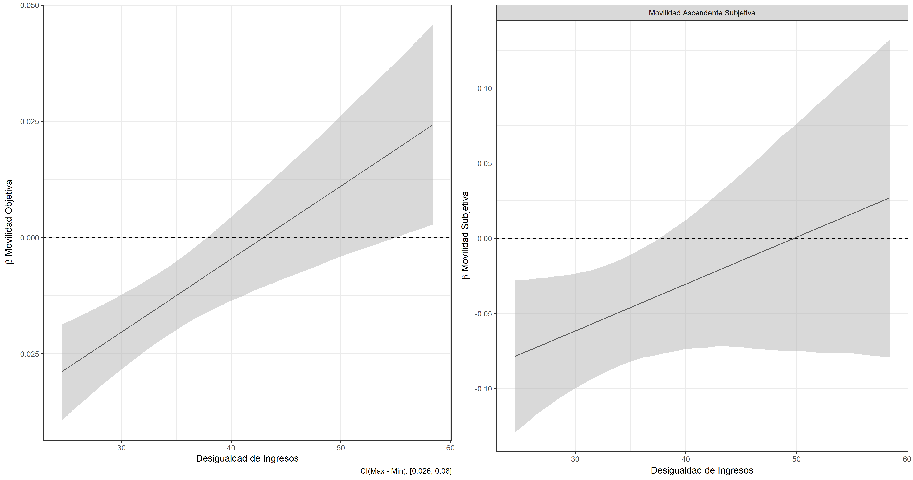
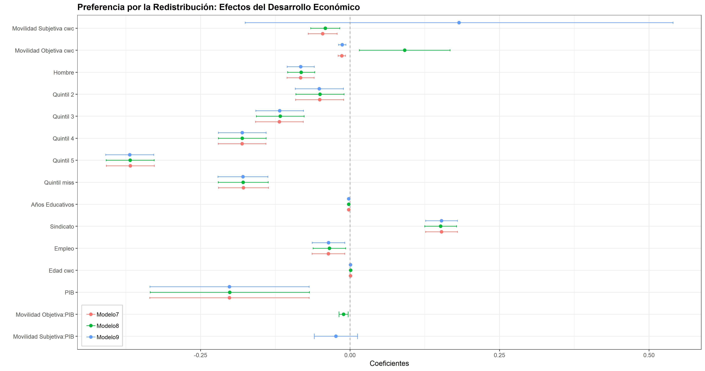
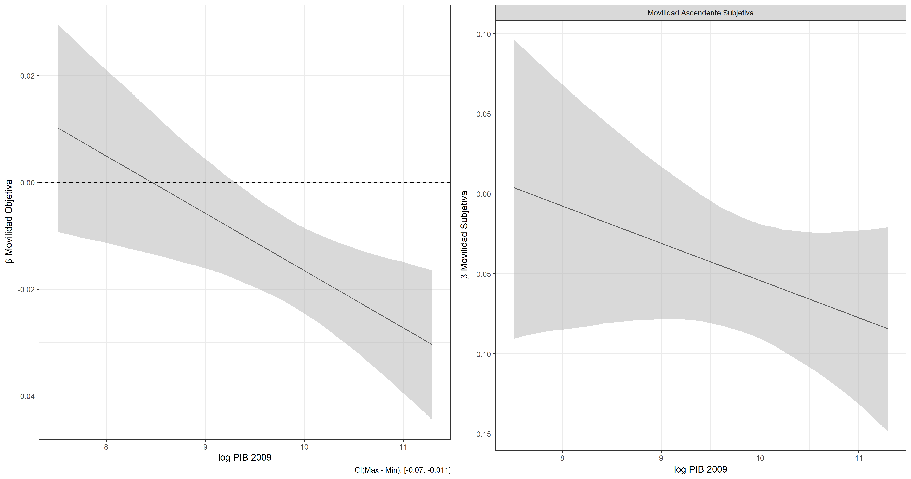

---
# Problema de investigación

¿Cómo se asocian la movilidad social objetiva y subjetiva con las preferencias redistributivas? 

¿Cómo las características institucionales y socioecnómicas de los países influyen en la relación entre movilidad objetiva y subjetiva con las preferencias redistributivas?
---
class:inverse, middle, center
#Marco Teórico

---
# Marco Teórico: Sobre las preferencias redistributivas

Dos grandes fuentes explicativas para entender las actitudes hacia la redistribución.

* __Acción Racional__: La demanda por redistribución es una función de
los niveles de ingreso de una persona: Personas bajo la mediana de
la distribución de ingreso tenderán a ser proclives a la redistribución,
mientras que las personas sobre la mediana tenderán a oponerse
(Meltzer y Richard, 1981).

* __Creencias de Justicia__: El apoyo a políticas redistributivas estaría
alojado a un sistema general de orientaciones ideológicas y de
creencias de justicia (Andress y Heien, 2001; Feldman y
Steenberger,2001)


---
# Marco Teórico: Movilidad Individual e interés propio.

__Expectativa de Movilidad Social__: La expectativa de ascender socialmente, reduciría la preferencia por la redistribución (Benabou y Ok, 2001;
Benabou y Tirole, 2006).
__Atribución Causal__: Personas que se mueven ascendentemente tolerarán más la desigualdad y prefieren menor redistribución (Schmidt-Catran, 2013;Gugushvili, 2016).


* __H1__: A mayor nivel de movilidad social intergeneracional y percepción de movilidad social (en relación a su padre) menores serán las preferencias hacia la redistribución

---
# Marco Teórico: Movilidad Social y Desigualdad

En consideración a la teoría del votante mediano se conjetura que:

* **H2a**: A mayor desigualdad de un país, mayores serán las preferencias hacia la redistribución por parte de las personas.

A partir de lo planteado por la hipótesis del Tunel (Hirschman y Rothschild, 1973) se establece que:

* **H2b**: En contextos más iguales, las personas que se mueven hacia arriba" tenderán a tener menores preferencias redistributivas que en aquellos contextos más desiguales.


---
# Marco Teórico: Movilidad Social y Desarrollo Económico

En países pobres existirían mayores incentivos para que las personas presionen por mayor redistribución para mejorar sus condiciones de vida 

* **H3a** A mayor desarrollo económico de un país, menor serán las preferencias hacia la redistribución por parte de las personas.

El desarrollo económico generaría condiciones en que la movilidad social sea más probable (en la medida de que existen más recursos disponibles) (Yaish y Andersen, 2012; Gugushvili, 2017). De esta forma no se necesitaría de la intervención del Estado para mejorar las condiciones de vida.

* **H3b** En países con mayor desarrollo económico, las personas que se mueven “hacia arriba” tenderán a preferir menos redistribución en comparación con los países de menos desarrollo económicos.


---
class:inverse, middle, center
#Metodología

---
# Modelo de análisis

.center[]

---
# Datos y Variables

* **Datos**:ISSP 2009, N=31.266, 37 países.
* **Variable dependiente**: Nivel de acuerdo con “Es responsabilidad del gobierno reducir la desigualdad de ingreso entre personas con altos y bajos ingresos”.
* **Variables Independientes N1**


$$Movilidad_{\text{objetiva}} = ISEI_{hijo}-ISEI_{padre}$$ 

Movilidad Subjetiva: "Por favor piense en su actual empleo (o en su último si usted no tiene uno ahora). Si usted compara este empleo con el empleo que su padre tenía cuando usted tenía [14/15/16] años, diría usted que su nivel o estatus es (o fue)… "

**Variables Independientes N2**
- Índice Gini.
- PIB pér cápita (logaritmo natural).
- Porcentaje del gasto público en educación en relación al total del gasto público.

---
# Datos y Variables
 Además se incluyeron las siguientes variables de control:

* Edad
* Sexo
* item Ingreso en quintiles
* item Miembro de sindicato
* item Empleados vs. Desempleados
* item Años de Educación

---
# Técnica de Análisis

Tomando en consideración la estructura multinivel de los datos de ISSP, se estima una serie de modelos multinivel

$y_{ij} = \gamma_{10}(x_{ij}-\hat{x_{ij}}) - \gamma_{20}(w_{ij}-\hat{w_{ij}}) + \gamma_{30}\delta_{ij} + \gamma_{01}z_{j} + \gamma_{11}z_{j}x_{ij} + \mu_{0j} + r_{ij}$

Las variables de movilidad social $x_{ij}$ y $w_{ij}$ son centradas a la media del pais _j_ . 

A partir del modelo nulo, se estimó la Correlación Intra-Clase a partir de la siguiente formula.


$ICC = \frac{\tau_{00}}{\tau_{00} + \sigma^{2}} = \frac{0.18}{1.03+0.18} = 0.15$

---
class:inverse, middle, center
#Resultados

---
class: center, middle 
```{r, echo=FALSE, fig.align='center', message=FALSE, warning=FALSE, out.width="100%"}

 

```

---

class: center, middle 
```{r, echo=FALSE, fig.align='center', message=FALSE, warning=FALSE, out.width="100%"}

 

```


---
# Efecto de interacción con Desigualdad
class: center, middle 
```{r, echo=FALSE, fig.align='center', message=FALSE, warning=FALSE, out.width="100%"}

 

```


---


class: center, middle 
```{r, echo=FALSE, fig.align='center', message=FALSE, warning=FALSE, out.width="100%"}

 

```


---
# Efecto de interacción con Desarrollo económico

class: center, middle 
```{r, echo=FALSE, fig.align='center', message=FALSE, warning=FALSE, out.width="100%"}

 

```


---
#Conclusiones

**H1**: Existiría una racionalidad asociada a la movilidad social, que repercutiría en menores preferencias por redistribución.
	
**H2a** La desigualdad no tiene un efecto sobre las preferencias por la redistribución. No obstante, **H2b** la igualdad de un país acentuaría el efecto de la movilidad social 

**H3a** El desarrollo económico de un país influenciaría negativamente la preferencia por la redistribución, y asimismo **H3b** el desarrollo económico acentuaría la menor preferencia por la redistribución de los "moviles ascendentes".


---
#Futuras Investigaciones

* Estudiar qué tipo de sistemas educativos gatillan movilidad social, lo cual podría afectar el apoyo por redustribución en un país.
* Estudiar cómo todo lo aquí presentado, puede llegar a afectar el nivel de redistribución real en un país, desde una perspectiva longitudinal.
* Concatenar estos resultados con otros procesos políticos-económicos importantes (aumento de incertidumbre y de inmigración).
* Consideración de revisar un diseño longitudinal


---
class: center, middle

# Agradecimientos!

Slides created via the R package [**xaringan**](https://github.com/yihui/xaringan).

The chakra comes from [remark.js](https://remarkjs.com), [**knitr**](http://yihui.name/knitr), and [R Markdown](https://rmarkdown.rstudio.com).
