```{r message=FALSE, warning=FALSE, include=FALSE}
library(haven)
library(lavaan)
library(dplyr)
library(psych)
library(sjPlot)
library(ggplot2)
library(knitr)
library(kableExtra)
```


### Introducción

¿Cómo distribuir recursos que son escasos al interior de una sociedad?

- Esta distribución debería ocurrir bajo principios de justicia, entendida como equidad, donde quien hace más recibe más (Walster et al.,1978; Deutsch, 1985). De este modo, existen injusticias que son consideradas justas. 

- Y que varían debido a características a) societales, b) institucionales y c) sociales que conforman estos ideales.

- Y que se conforma a partir de a) experiencias individuales y b) a experiencias grupales (Wippler & Lindenberg, de Liebig y Sauer, 2016; Barnea, 2003; Kullin y Svallfors, 2011).

Justicia Distributiva, el cual aborda la inquietud respecto a cómo los beneficios y las cargas colectivas deberían distribuirse entre los miembros de la sociedad (Aalberg, 2003). ¿Deberían ser guiadas por factores económicos, sociales, de género?.

- En el campo de las ciencias sociales, lo recién expuesto se ha abordado desde un enfoque de justificación de la desigualdad, respecto a cómo los aspectos subjetivos que poseen las personas colaboran en la conformación de ideales y creencias sobre justicia distributiva (Hadler, 2005; Kelley y Peoples, 2010; Castillo, 2012)

Pero ¿cómo la interacción grupal colabora en la conformación de estos aspectos subjetivos que dan paso a los ideales respecto de justicia distributiva?

---
### Introducción

La literatura señala que los valores, normas, creencias y actitudes que poseen las personas son conformados producto de la interacción con otras personas.

- Los sentimientos o justificaciones sobre justicia pueden estar condicionados por el contacto interpersonal de tal manera que las relaciones sociales moldean las creencias y percepciones de los individuos (Huckfeldt y Sprage, 1984; Gartrell, 1985; Melamed, et al., 2014)

- Un ejemplo de lo anterior lo entrega Thal (2016), quien, desde un argumento de aislamiento de clase, señala que las personas que viven en barrios con alto niveles de socioeconómico de Estados Unidos tienden a realizar generalizaciones de la realidad a partir de la situación de sus vecinos, motivo por el cual perciben que la situación del país en cuestión es mejor de lo que realmente es. 

Así, el vínculo social se torna relevante para conocer sobre cómo los individuos comparten sus decisiones, opiniones y cambios de vida en un contexto social de relaciones sociales, como una comunidad o un grupo social (Perry et al.,2018).

---
### Introducción

Un enfoque por el cual las ciencias sociales y la sociología han estudiado la interacción social es por medio de las redes de contacto.

- Así, los principios de justicia pueden ser afectados producto de la interacción social, es que se podría pensar que la justicia distributiva y la justificación de desigualdad podría variar según aspectos particulares de las redes de contacto que posee una persona.

La literatura en torno a redes de contacto identifica dos características que colaboran en la conformación y/o modificación de las actitudes, normas y valores que poseen las personas. 

1. Diversidad: diferencias o similitudes en las características (e.g. sociales, económicas, demográficas, educacionales) que pueden existir al interior de una red entre los miembros participantes. 

2. Composición: atributos prepondareantes compartidos por los miembros de la red, reflejando el contenido, los recursos materiales e inmateriales que posee la red. 

---
### Problema de investigación

¿En qué medida características como diversidad y composición de las redes de contacto se relacionan con la justificación de la desigualdad social en la sociedad chilena?

Objetivos

1. Identificar cómo se relaciona la diversidad de la red de contactos con la justificación de la desigualdad de las personas en Chile.

2. Identificar cómo se relaciona la composición de la red de contactos con la justificación de la desigualdad de las personas en Chile.

Hipótesis

- H1: Una mayor diversidad ISEI de la red de contacto se relaciona con una menor justificación de justificación de desigualdad social en Chile.

- H2: Una composición ISEI de la red de contacto asociada mayormente a ocupaciones de estatus e ingresos bajos se relaciona una menor justificación de justificación de desigualdad social en Chile.

---
### Datos, variables y método

Encuesta longitudinar COES, ELSOC 2016 (n=2984), con representatividad nacional. Específicamente de los módulos: a) Legitimidad  y desigualdad, b) Redes sociales e interacciones inter-grupales.

```{r, echo=FALSE, fig.align='center', message=FALSE, warning=FALSE, out.width="60%",fig.cap=""}
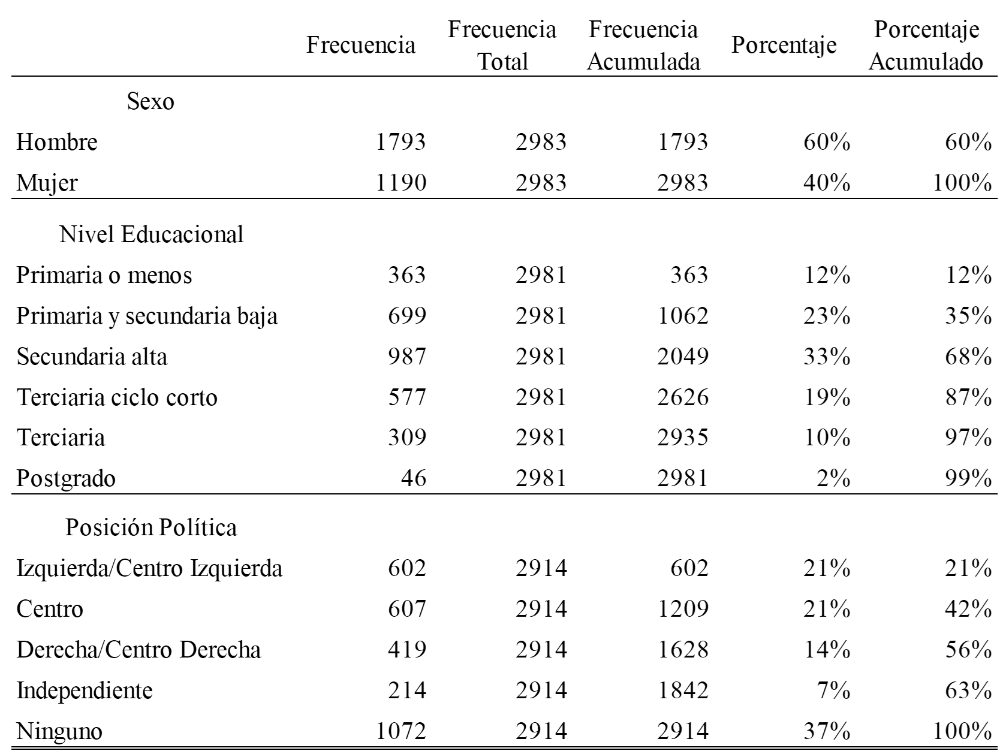 
```

Posteriormente, se realizó una depuración que consistió en eliminar aquellos casos que no reportaron conocidos en ninguna de las trece ocupaciones de las cuales se les consultó, lo que se tradujo en la pérdida de 152 casos (n=2831).

---
### Datos, variables y método

Variable dependiente
```{r, echo=FALSE, fig.align='center', message=FALSE, warning=FALSE, out.width="60%",fig.cap=""}
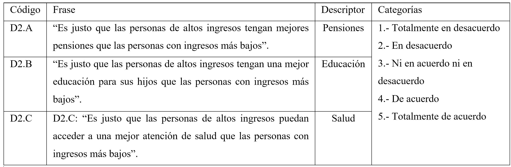 
```


Variable independiente
```{r, echo=FALSE, fig.align='center', message=FALSE, warning=FALSE, out.width="60%",fig.cap=""}
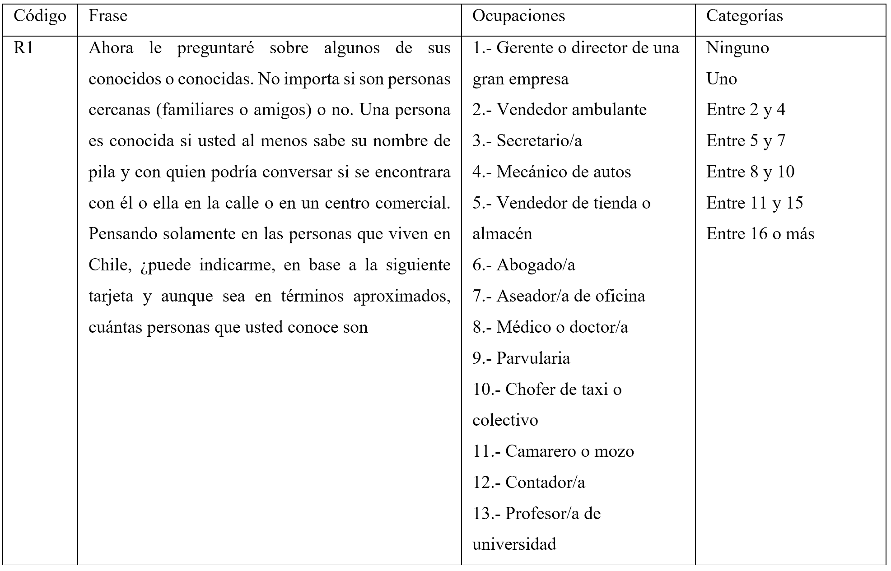 
```

---
### Datos, variables y método

Tamaño: Suma simple (a nivel de sujeto-ocupación) donde $n_i$  es el tamaño de la profesión en la i-esima posición.

$$T=\sum_{i=1}^{13} n_i$$

Diversidad ISEI: Índice D, Simpson (1949), donde a 1 se le resta la sumatoria de la proporción de sujetos en cada categoría elevada al cuadrado, como se ve en la siguiente ecuación (2), donde $p_i$  es la proporción en una determinadada categoría

$$D=1-\sum p_i^2$$

Composición: Proporción de la sumatoria de profesiones de bajo ISEI dividido la sumatoria de profesiones asociadas a un alto, medio y un bajo ISEI 

$$C=\frac{\sum_{ISEI_{bajo}}}{\sum_{ISEI_{bajo}}+\sum_{ISEI_{medio}}+\sum_{ISEI_{alto}}}$$

---
### Datos, variables y método

Se aplicaron una serie de modelos de regresión logísticos ordinales cada una de las variables independientes (pensiones, educación y salud). 

El primer modelo general es presentado de la siguiente forma:

$$logit[P(Y≤j)]=\alpha_j+\beta_1Diversidad_{ISEI},  j=1,…,5-1$$

El segundo modelo general es presentado de la siguiente forma:

$$logit[P(Y≤j)]=\alpha_j+\beta_2Composición_{ISEI},  j=1,…,5-1$$

Por último, el tercer modelo general es presentado por la siguiente fórmula:

$$logit[P(Y≤j)]=\alpha_j+\beta_1Diversidad_{ISEI}+\beta_2Composición_{ISEI},  j=1,…,5-1$$

En ambos modelos generales las variables control fueron: Género, Educación, Posición Política, Edad y Tamaño de la red

---
### Resultados Descriptivos: Variable dependientes 

```{r, echo=FALSE, fig.align='center', message=FALSE, warning=FALSE, out.width="80%",fig.cap=""}
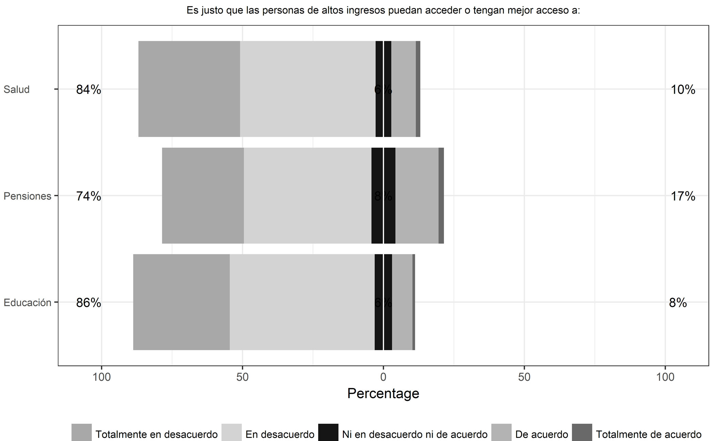 
```

```{r, echo=FALSE, fig.align='center', message=FALSE, warning=FALSE, out.width="40%",fig.cap=""}
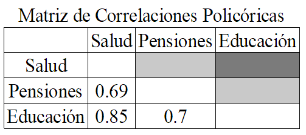 
```

---
### Resultados Descriptivos: Variables independientes Tamaño, Diversidad ISEI y Composición ISEI

```{r, echo=FALSE, fig.align='center', message=FALSE, warning=FALSE, out.width="100%",fig.cap=""}
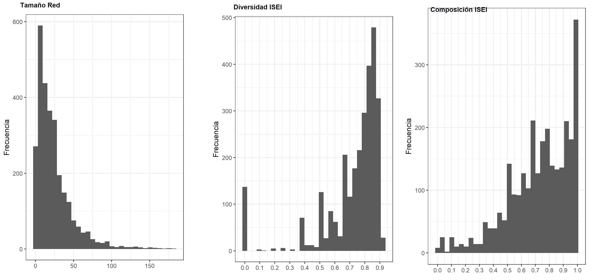 
```

---
### Resultados Descriptivos

Baja justifcación de la desigualdad, especialmente en educación y salud, mientras que pensiones posee la mayor concentración en categorías de acuerdo y muy de acuerdo.

Para los chilenos y chilenas encuestadas, el factor económico no debería ser un aspecto que diferencie la calidad al ingreso de los aspectos mencionados.

Las personas encuestadas presentan redes ocupacionales extensas de, en promedio, 24 personas conocidas. 

En términos de diversidad, presentan una alta heterogeneidad cuando se les pregunta en función de las 13 ocupaciones.

En términos de composición, se evidencia que las redes –a pesar de ser altamente heterogéneas- en términos de diversidad ISEI, presentan una composición asociada hacia rubros ocupaciones asociados a un bajo ISEI.  

---
### Resultados de Regresión: Modelo cero. Tamaño de la red (TMÑ)

```{r, echo=FALSE, fig.align='center', message=FALSE, warning=FALSE, out.width="70%",fig.cap=""}
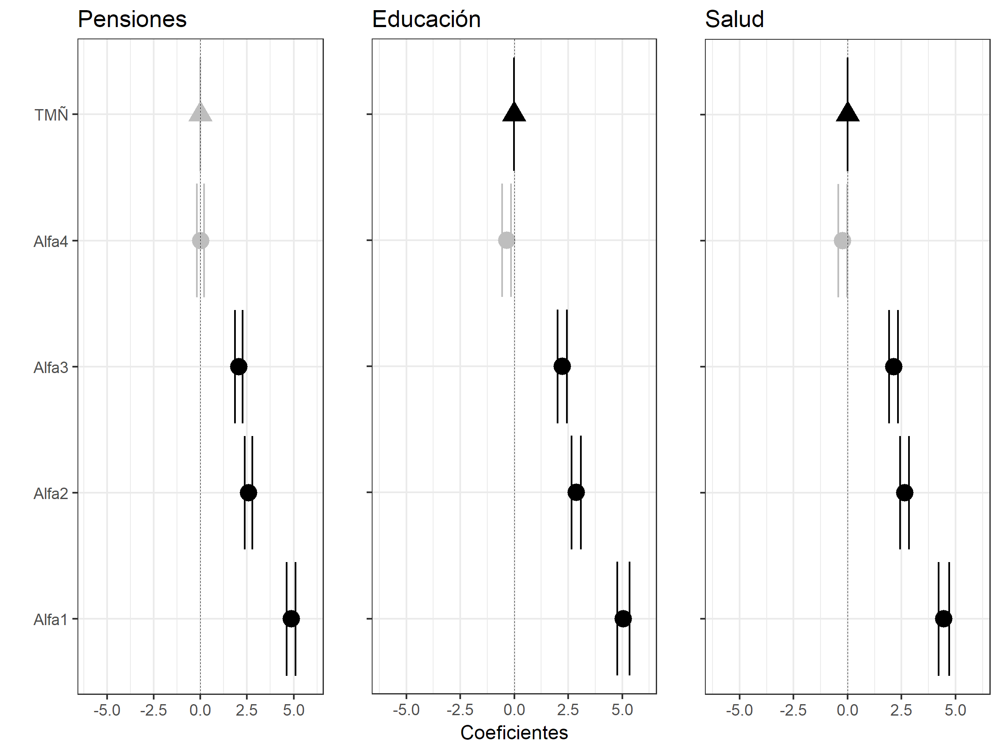 
```

```{r, echo=FALSE, fig.align='right', message=FALSE, warning=FALSE, out.width="30%",fig.cap=""}
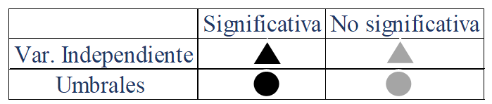 
```

---
### Resultados de Regresión: Modelo uno. Diversidad ISEI de la red (DVS)

```{r, echo=FALSE, fig.align='center', message=FALSE, warning=FALSE, out.width="70%",fig.cap=""}
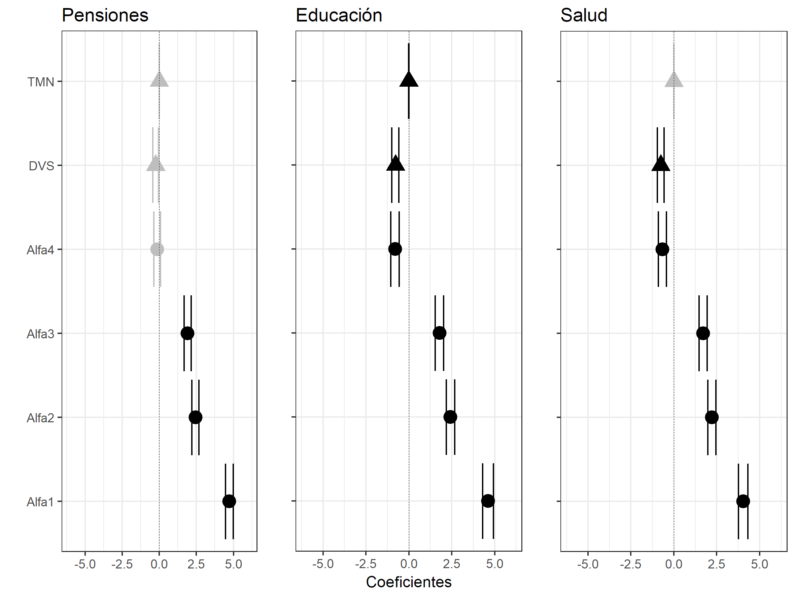 
```

```{r, echo=FALSE, fig.align='right', message=FALSE, warning=FALSE, out.width="30%",fig.cap=""}
 
```

---
### Resultados de Regresión: Modelo dos. Composición ISEI de la red (CPN)

```{r, echo=FALSE, fig.align='center', message=FALSE, warning=FALSE, out.width="70%",fig.cap=""}
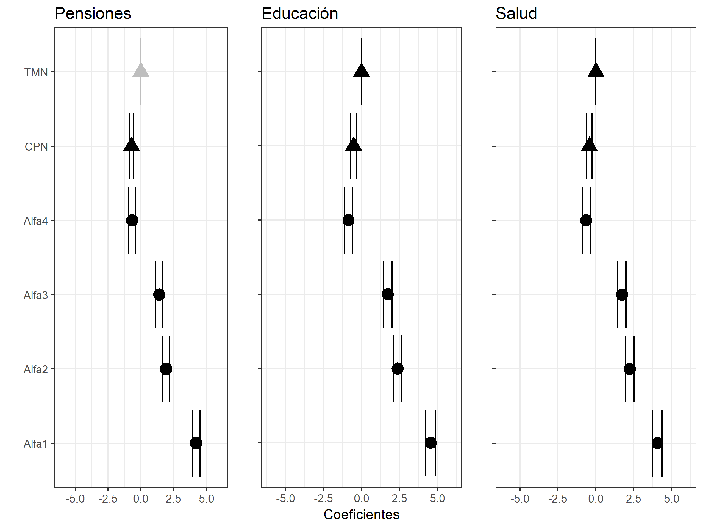 
```

```{r, echo=FALSE, fig.align='right', message=FALSE, warning=FALSE, out.width="30%",fig.cap=""}
 
```

---
### Resultados de Regresió: Modelo tres. Diversidad ISEI de la red (DVS) y Composición ISEI de la red (CPN)

```{r, echo=FALSE, fig.align='center', message=FALSE, warning=FALSE, out.width="70%",fig.cap=""}
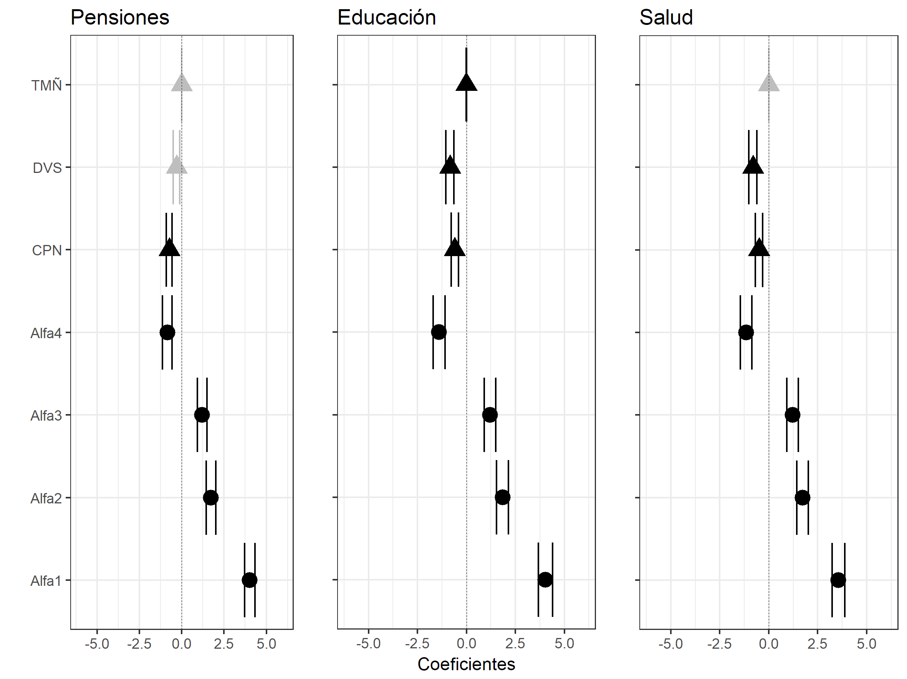 
```

```{r, echo=FALSE, fig.align='right', message=FALSE, warning=FALSE, out.width="30%",fig.cap=""}
 
```

---
### Discusión y conclusiones

Los resultados de la presente investigación señalan que los y las chilenas encuestados poseen una baja justificación de la desigualdad social en Chile cuando se les pregunta si en términos de pensiones, educación y salud.

Aunque para, pensiones existiría una mayor justificación de la desigualdad social en Chile producto de diferencias socioeconómicas. Lo cual podría sostenerse bajo ideales meritocráticos. 

Respecto de diversidad ISEI, redes ocupacionales más heterogéneas colaboran en que las personas posean un espectro social más amplio, presentando una menor justificación de la desigualdad. 

Redes ocupacionales de contacto están compuestas por ocupaciones de bajo o medio ISEI tenderán a tener una mayor adscripción hacia ideales sobre justicia distributiva y, por ende, justificarán menos la desigualdad en matería de salud, pensiones y educación.

El con quien interactúan las persona es relevante, debido a que la conformación de ideales sobre justicia distributiva y justificación de la desigualdad poseen un componente que es individual y grupal.

---
class: center, middle

### Agradecimientos!

Slides created via the R package [**xaringan**](https://github.com/yihui/xaringan).

The chakra comes from [remark.js](https://remarkjs.com), [**knitr**](http://yihui.name/knitr), and [R Markdown](https://rmarkdown.rstudio.com).
