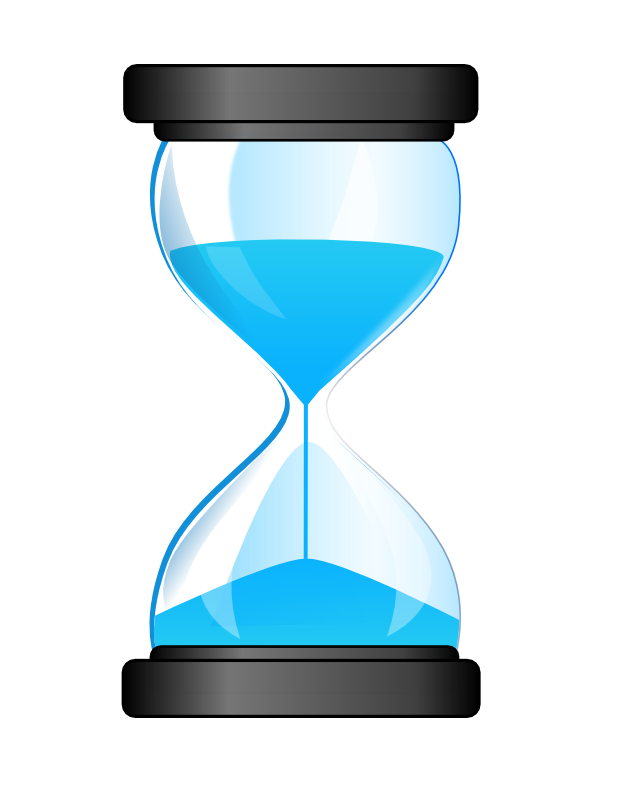

class: front right hide-logo

background-image: url(background.png)
background-size: cover

<br>
<br>
<br>

# .grey[Algunas Notas y Recomendaciones sobre] .purple[Escritura Académica]

.white[Juan Carlos Castillo]

[.purple[jc-castillo.com]](https://juancarloscastillo.github.io/jc-castillo/)

.small[Abril 2021]

???

```{r xaringanExtra, echo=FALSE}

xaringanExtra::use_xaringan_extra(c("tile_view", "animate_css"))
xaringanExtra::use_animate_all("fade")
xaringanExtra::use_share_again()
xaringanExtra::use_scribble()
xaringanExtra::style_share_again(
  share_buttons = c("none")
)

```

---
class: inverse middle center

# La escritura académica es un tipo particular de escritura, orientada a una .yellow[audiencia] específica y con normas claras de .yellow[formato].

---
# Tipos de productos

- libros 

- artículos (_"papers"_)

- capítulos de libro

- documentos de trabajo (working papers)

- tesis

- notas breves

---
class: inverse middle center

# En adelante nos centraremos en productos que conlleven un .yellow[componente empírico] o de contraste con la realidad.

---
class: inverse middle center

### Típicamente, las secciones de un trabajo (empírico) son: abstract, introducción, antecedentes conceptuales y empíricos , datos variables y métodos, resultados/discusión, conclusiones

---
class: inverse

## Abstract

- 250-300 palabras

- tiene .yellow[cinco] partes: 
    - problema/pregunta 
    - argumento central/hipótesis
    - datos (incluye N)
    - principales resultados
    - conclusión principal

---
class: inverse

## Introducción: 

- presenta problema, relevancia, pregunta, hipótesis / argumento central.
	
--

# .center[.red[PIEZA CLAVE]]	

---
# Introducción
.center[

]

---
# Introducción

- Primer párrafo: se plantea el tema, el problema y luego el problema de investigación. Esto también se puede hacer en 2 párrafos: uno que abre y el otro que cierra

- Enmarque disciplinar del problema de investigación (mencionar en algún momento a la disciplina), permite identificar audiencia.

- Lanzar tempranamente la pregunta de investigación, ayuda al foco. 

- Atención que la **NOVEDAD** no es la única ni principal fuente de relevancia ("no se ha hecho").

---
# Sobre la relevancia del problema 

.left-column[
## Hombros de gigante
]

.right-column[
.right[

]
]

---
# Sobre la relevancia del problema

.left-column[
## Hombros de gigantes
## Brecha
]

.right-column[
.right[

]
]

---
# Sobre la relevancia del problema

.left-column[
## Hombros de gigantes
## Brecha
## Ell_s dicen, yo digo
]

.right-column[
.right[

]
]


---
# ... siguiendo con la Introducción

- Párrafos siguientes: 

  - definición del objeto de estudio. 
  
  - descripción de argumentos centrales para responder la pregunta, en general se relaciona con una o más variables independientes.
  
- Una vez presentados todos los argumentos, se puede mencionar el objetivo general del estudio/hipótesis y enumerar claramente las contribuciones del artículo. 

---
class: center 

.purple[Al final de la introducción tiene que quedar claramente delimitado cuál va a ser el "ring" en el que se va a pelear ]

.center[

]


---
## links

- Pensar la introducción como un guión: [http://blogs.lse.ac.uk/impactofsocialsciences/2018/05/21/writing-a-page-turner-how-to-tell-a-story-in-your-scientific-paper/](http://blogs.lse.ac.uk/impactofsocialsciences/2018/05/21/writing-a-page-turner-how-to-tell-a-story-in-your-scientific-paper/)

-  	Sandberg, J., & Alvesson, M. (2011). Ways of constructing research questions: gap-spotting or problematization? Organization, 18(1), 23–44. [https://doi.org/10.1177/1350508410372151](https://doi.org/10.1177/1350508410372151)

---
class: inverse, middle, center

# Antecedentes conceptuales y empíricos

---
# Antecedentes conceptuales y empíricos

.pull-left[
- No repetir ni relevancia, ni contexto histórico, eso ya fue parte de la introducción. 

- Desde aquí en adelante se presenta evidencia y argumentos en el tema de estudio, sin perder el FOCO y guiando al lector/a.
]

.pull-right[
<br>
<br>
.right[

]]

---
# Antecedentes conceptuales y empíricos

.pull-left[

]

.pull-right[
**Construcción en bloques** (_building blocks_): 
- el argumento se cuenta por partes, algunas van primero y una vez que están bien armadas, dan sustento a lo que viene después.
- Si esto no sucede, todo lo que viene luego tambalea.
]

---
# Antecedentes conceptuales y empíricos

- en general corresponde a **dos secciones**: la primera relacionada con la variable dependiente (objeto de estudio), y la segunda con la(s) independientes

- en cada sección se comienza con precisiones conceptuales, y luego se presenta resumen de evidencia empírica

- una vez presentados los argumentos, se pueden señalar las hipótesis específicas.

---
# Antecedentes conceptuales y empíricos

- luego de esta sección al lector le debe ser posible imaginar qué viene en términos de diseño de investigación. 

- de aquí hacia abajo no deberían aparecer conceptos nuevos (o sea, conejos sacados del sombrero)

.pull-right[]


---
class: inverse middle 

## Datos, variables y métodos: 

- basta un párrafo para los datos, 

- ordenar la presentación de variables en dependientes e independientes, 

- tabla de variables con descriptivos básicos.

<br>
.red[*Nota: antes de esta sección evitar jerga metodológica] (_ej: el objetivo de la investigación es estimar la moderación mediada_ ...)

---
class: inverse middle 

# Análisis: 

- comenzar con descriptivos bivariados  y luego los modelos. 

- Avanzar respondiendo aspectos parciales referidos a la pregunta de investigación (construyendo la "historia" del paper), y guiado por las hipótesis.

---
class: inverse middle 


.pull-left-narrow[
.left[
<br>
<br>
] 
]

###.orange[Conclusiones]
- Resumir principales resultados (1 párrafo)

- Volver desde los resultados hacia el planteamiento inicial de la pregunta (conversar con la introducción)

- Aportes específicos y generales en el campo de estudios / disciplinar. 

- Limitaciones e ideas para futuras investigaciones.


---
class: inverse middle center

# Algunas recomendaciones generales

---
# Párrafos

- Máxima de escritura: una idea por párrafo. Si comienza una idea nueva, pasar a otro párrafo. Al revés, si el párrafo siguiente habla de lo mismo, sumarlo al párrafo anterior. 

- Párrafos deben ser autocontenidos, entendibles por si mismos

- La idea del párrafo se resume en la primera parte del párrafo, lo que en inglés se llama "topic sentence". 

- Para favorecer la continuidad de la lectura, incluir en la topic sentence algún concepto del párrafo anterior. 

---
# Literatura

- Para la revisión de conceptos principales, partir por fuentes generales: Annual Reviews, Handbooks, etc.

- También ayuda si se encuentra un paper (reciente) relacionado, buscar citas y también citaciones, para esto lo más útil en términos mainstream es WOS (web of science), y también las citas en researchgate en caso de estar ahí. 

- Usar algún software de gestión de referencias bibliográficas (Ej. Zotero)

---
# Siempre presente: identificar AUDIENCIA 

- El proceso general de escritura implica ponerse constantemente en el lugar del lector. Identificar a quién se le está escribiendo:

  - ¿para quién sería interesante leer este trabajo? 
  - ¿quién podría citarlo?
  
- También se puede explicitar en la introducción: este trabajo es relevante para ...


---
class: front right hide-logo

background-image: url(background.png)
background-size: cover

<br>
<br>
<br>

# .grey[Algunas Notas y Recomendaciones sobre] .purple[Escritura Académica]

.white[Juan Carlos Castillo]

[.purple[jc-castillo.com]](https://juancarloscastillo.github.io/jc-castillo/)

.small[Abril 2021]


