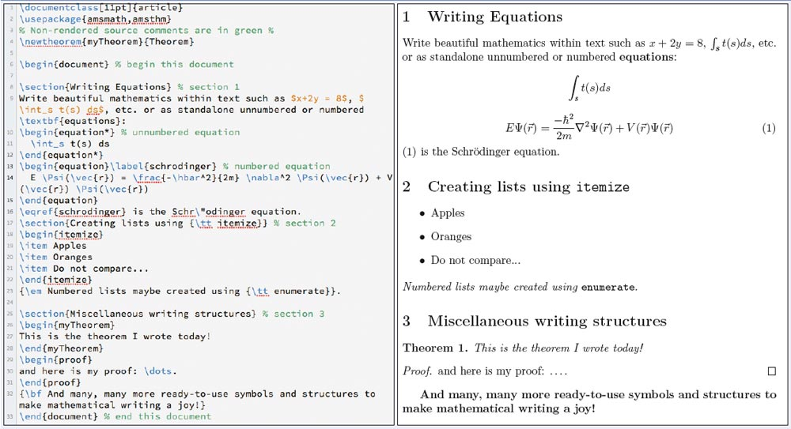

class: front

```{r eval=FALSE, include=FALSE}
# Para que funcione el infinite moon reader:
-  poner root en slides (todos los paths del css hacen referencia a esta estructura)


```

```{r setup, include=FALSE, cache = FALSE}
require("knitr")
options(htmltools.dir.version = FALSE)
pacman::p_load(RefManageR)
# bib <- ReadBib("../../bib/electivomultinivel.bib", check = FALSE)
opts_chunk$set(warning=FALSE,
             message=FALSE,
             echo=TRUE,
             cache = TRUE,fig.width=7, fig.height=5.2)
```

<!---
Para correr en ATOM
- open terminal, abrir R (simplemente, R y enter)
- 

rmarkdown::render('01-textosimple/01_textosimple.Rmd','xaringan::moon_reader')

About macros.js: permite escalar las imágenes como [scale 50%01_](path to image), hay si que grabar ese archivo js en el directorio.
--->


.pull-left[
# Markdown y herramientas de escritura abierta
## [.medium[.black[bit.ly/markdown-herramientas]]]()
----
## [.white[Juan Carlos Castillo]](https://juancarloscastillo.github.io/jc-castillo/)
## .small[Agosto 2021      ]
]


.pull-right[
.right[
<br>
<br>
<br>
<br>
<br>
<br>

]
.right[
## .grey[Sesión 1: *Introducción a la escritura en texto simple*]
]]

---

layout: true
class: animated, fadeIn

---
class: inverse, bottom, right

# .green[Fundamentos de escritura simple]

## 1. Motivación. Ciencia abierta
## 2. Herramientas tradicionales de escritura
## 3. Escritura abierta
## 4. Edición en Markdown

---
class: inverse, bottom, right

# .green[Fundamentos de escritura simple]

## 1. .yellow[Motivación. Ciencia abierta]
## 2. Herramientas tradicionales de escritura
## 3. Escritura abierta
## 4. Edición en Markdown


---
# Motivación: Ciencia Abierta

--

- Crisis de **acceso**

--

- Crisis de **reproducibilidad**

--

.center[
# .green[¿Qué herramientas facilitan o entorpecen la reproducibilidad?]
]

--

.center[
# .green[¿Qué tan abierto es el proceso de escritura?]
]

---
# Dimensiones de escritura y apertura

<br>

- **Eficiencia**: ¿Son las herramientas de escritura que utilizamos eficientes para el trabajo académico?

--

- **Ética**: ¿Facilitan el cumplimiento de los principios normativos de la ciencia?

--

- **Propiedad**: ¿A quién pertenece lo que escribimos?


---
class: inverse, bottom, right

# .green[Fundamentos de escritura simple]

## 1. Motivación. Ciencia abierta
## 2. .yellow[Herramientas tradicionales de escritura]
## 3. Escritura abierta
## 4. Edición en Markdown


---
# Flujo de trabajo con procesador de texto tradicional

.center[

]

---
# Abriendo el archivo de escritura tradicional


---
# Desventajas del procesador tradicional


.pull-left-wide[

- Barrera de **pago/licencia** para acceder a contenidos (propiedad)

- Difícil **versionamiento** y llevar registro de quién hizo qué cambio, barrera a la reproducibilidad y colaboración 

- No permite un documento enteramente **reproducible** que combine texto y código de análisis (en caso de utilizarlo) 
]

.pull-right-narrow[
<br>
<br>


]


---
class: inverse, bottom, right

# .green[Fundamentos de escritura simple]

## 1. Motivación. Ciencia abierta
## 2. Herramientas tradicionales de escritura
## 3. .yellow[Escritura abierta]
## 4. Edición en Markdown

---
# Inspiración

.center[
]


---
# Escritura libre y abierta

- independiente de programa comercial

- independiente de plataformas específicas

- que permita combinar texto y análisis en un mismo documento

- foco en los contenidos en lugar del formato

- que permita distintas opciones de formato final


---
# Funcionamiento de escritura simple / plana

- entorno: editor de texto

- separación entre texto de entrada (input) y texto de salida (output)

- foco en el input/contenido vs output/formato

- marcas de edición: vínculo entre formato de input y output
 

---
# Marcas de edición

- Vínculo entre escritura en texto simple (input) y output


---
# Principales Alternativas escritura simple

.left-column[
# .green[Latex]

# Markdown
]

.right-column[

- sistema de escritura simple de amplio uso en la academia

- alta calidad en salida a pdf

- creado a comienzos de los 80 (Donald Knuth, Leslie Lamport)


]

---
# Principales Alternativas escritura simple

.left-column[
# .green[Latex]

# Markdown
]

.right-column[




]

---
# Principales Alternativas escritura simple

.left-column[
# Latex

# .green[Markdown]
]

.right-column[

- creado por John Gruber y Aaron Swartz en 2004

- forma de escritura simple con pocas marcas de formato

- conversión a distintos formatos de salida (html, pdf)

- Soporta encabezados, tablas, imágenes, tablas de contenidos, ecuaciones, links ... todo lo necesario para documentos académicos

--

- filosofía: foco en contenido primero, el formato después.


]

---
# Principales Alternativas escritura simple

.left-column[
# Latex

# .green[Markdown]
]

.right-column[


]


---
# Principales Alternativas escritura simple

<br>


|          	| **Control de formato** 	| **Marcas de edición** 	| **Formatos de salida** 	|
|----------	|:--------------------:|:----------------:|:--------------------:|
| LaTeX    	|          +         	|        +       	|          -         	|
| Markdown 	|          -         	|        -       	|          +         	|

---
class: inverse, bottom, right

# .green[Fundamentos de escritura simple]

## 1. Motivación. Ciencia abierta
## 2. Herramientas tradicionales de escritura
## 3. Escritura abierta
## 4. .yellow[Edición en Markdown]


---
# Ejemplos de marcas de edición en Markdown


  - Texto en **negrita** entre dos astericos: ``` **negrita** ```

  - Texto en *cursiva* con un asterico por lado: ``` *cursiva* ```
  
  - Títulos se marcan con # al principio, subtítulos ## , y así sucesivamente
  
  - Links: `[texto](web link)`
  
  - Imágenes:  ``

---
class: inverse middle center

# .green[Mayores detalles en la Práctica de Markdown (ver sitio web del curso)]

#  [.yellow[Editor.md]](https://pandao.github.io/editor.md/en.html)
  
#  [.yellow[Tutorial Markdown online]](https://www.markdowntutorial.com/es/)
  
---
# Markdown y pandoc


---
# Editores Markdown

- múltiples editores de texto (Emacs, Sublime, VIM, etc.)

--

- plataformas que permiten escribir y agregan funciones adicionales para distintos lenguajes como:

  - texto predictivo
  - resaltado
  - visualización de imágenes
  - previsualización instantánea

--

- en este curso vamos a utilizar **Atom**, principalmente por sus ventajas en temas de versionamiento y citación
  


---
class: slideInRight
background-image: url("../texture_background.jpg")

# .extralarge[.yellow[Resumen]] 

.white[

## - ciencia abierta y escritura

## - limitaciones procesadores tradicionales 


## - texto plano y marcas de edición 


## - Markdown: alternativa simple para escritura simple ]

---
class: inverse, middle, center,slideInRight

# .green[Próxima sesión:] 
# .extralarge[.yellow[Atom]]


---
class: front
.pull-left[
# Markdown y herramientas de escritura abierta
## [.medium[.black[bit.ly/markdown-herramientas.com]]]()
----
## [.white[Juan Carlos Castillo]](https://juancarloscastillo.github.io/jc-castillo/)
## .small[Agosto 2021]
]


.pull-right[
.right[
<br>
<br>
<br>
<br>
<br>
<br>

]
]