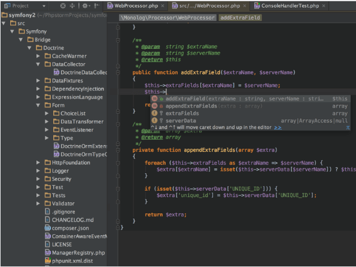
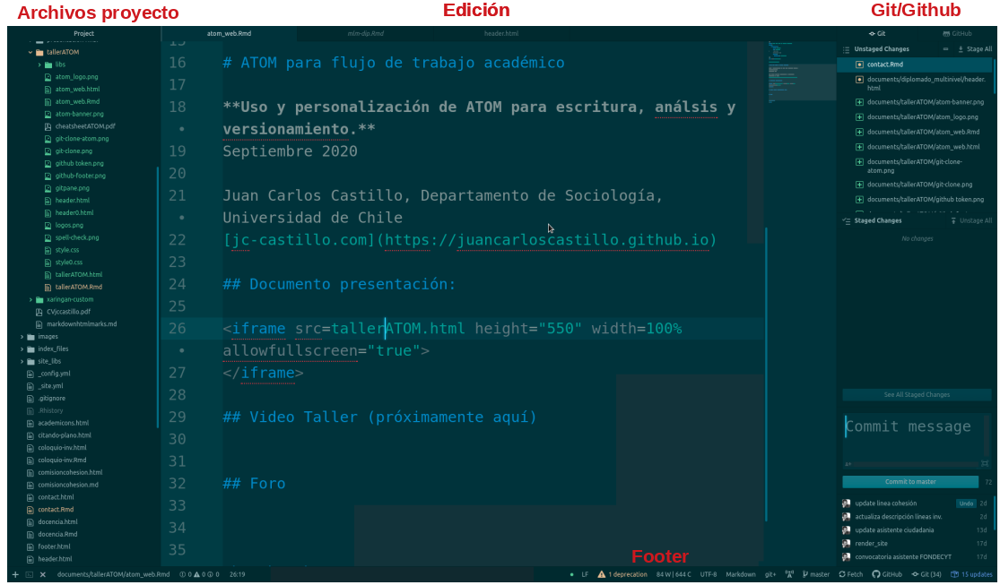
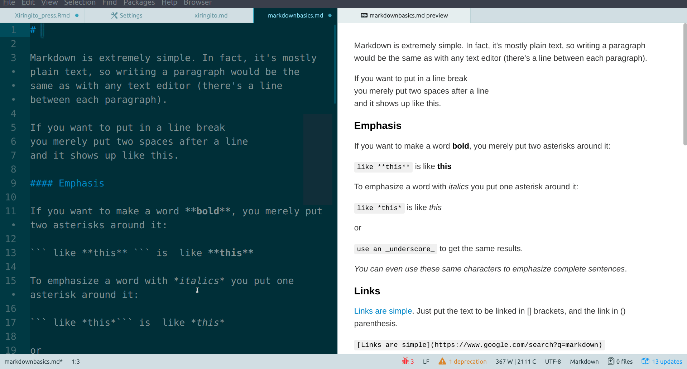

class: front

```{r eval=FALSE, include=FALSE}
# Para que funcione el infinite moon reader:
-  poner root en slides (todos los paths del css hacen referencia a esta estructura)


```

```{r setup, include=FALSE, cache = FALSE}
require("knitr")
options(htmltools.dir.version = FALSE)
pacman::p_load(RefManageR)
# bib <- ReadBib("../../bib/electivomultinivel.bib", check = FALSE)
opts_chunk$set(warning=FALSE,
             message=FALSE,
             echo=TRUE,
             cache = TRUE,fig.width=7, fig.height=5.2)
```

<!---
Para correr en ATOM
- open terminal, abrir R (simplemente, R y enter)
- 

rmarkdown::render('01-textosimple/01_textosimple.Rmd','xaringan::moon_reader')

About macros.js: permite escalar las imágenes como [scale 50%01_](path to image), hay si que grabar ese archivo js en el directorio.
--->


.pull-left[
# Markdown y herramientas de escritura abierta
## [.medium[.black[bit.ly/markdown-herramientas]]]()
----
## [.white[Juan Carlos Castillo]](https://juancarloscastillo.github.io/jc-castillo/)
## .small[Agosto 2021      ]
]


.pull-right[
.right[
<br>
<br>
<br>
<br>
<br>
<br>

]
.right[
## .grey[Sesión 2: *ATOM & Markdown*]
]]

---

layout: true
class: animated, fadeIn

---
class: inverse, bottom, right


# .green[Contenidos]


## 1. Introducción, instalación y entorno
 
## 2. Librerías/customización general

## 3. Librerías y entorno Markdown

---
class: inverse, bottom, right


# .green[Contenidos]


## 1. .yellow[Introducción, instalación y entorno]
 
## 2. Librerías/customización general

## 3. Librerías y entorno Markdown


---
# ¿Por qué usar editores? 

- adecuado en un contexto de apertura y de propiedad de los contenidos (texto plano/simple)

- altamente personalizable

- mismo entorno en caso de realizar análisis que impliquen código

- posee herramientas de apoyo a la escritura (formato, corrección ortografía)

- vínculos con otras herramientas y programas

---
# Editores: Alternativas

.pull-left-wide[

]


.pull-right-narrow[
- Emacs

- Vim

- VCS

- Sublime

- RStudio (?)

- ATOM
]


---
# ATOM: características

.pull-left[


.right[

]
]


.pull-right[
- open source

- personalizable

- multiplataforma

- muy buena integración Git/Github

- integración Markdown
]
---
# Instalación
<br>
<br>
.center[
#.extralarge[[https://atom.io/](https://atom.io/)]
]
---
# Entorno general (1)

- menues superiores

- paneles: archivos (izquierda) y git (derecha)

- pestañas de trabajo / división de pantalla

- footer

---
class: middle center


---
class: inverse

# .green[Atajo más importante: buscador de comandos]

<br>
<br>
<br>
.center[
# .extralarge[.red[ctrl + shift + P]]
]

---
# Settings generales

- settings (Edit>Preferences, o ctrl + ,)

  - Core: básicos
  
  - Editor: tipo letra, distancia entre líneas, etc. 
  
  - Keybindings: atajos de teclado
  
  - Packages: librerías instaladas
  
  - Themes
  
  - Install: agregar librerías

---
# Importantes en settings generales

- **Core**: 
  - file encoding: UTF-8

- **Editor**: activar 
  - soft wrap 
  - zoom font when ctrl scrolling
  
- **Themes**: según gusto personal, probar

---
class: inverse, bottom, right


# .green[Contenidos]


## 1. Introducción, instalación y entorno
 
## 2. .yellow[Librerías/customización general]

## 3. Librerías y entorno Markdown


---
# Librerías / packages

- ATOM viene con algunas librerías básicas pre-instaladas

- El resto es a elección según necesidad y gusto

- Las librerías tienen también distintas opciones a considerar

- En este curso vamos a instalar un set de librerías que se relacionan con escritura y con Markdown 

- Para instalar: Settings (ctrl+,) -> install, buscar

---
# Librerías para escritura general

.pull-left[
## .green[Básicas escritura]

- Wordcount

- Spellcheck
]

.pull-right[
# .green[Opcionales escritura]

- Zen

- Glowing cursor

- Neon selection

- Minimap

- theme switcher
]

---
# Ejemplo Wordcount

.pull-left[

]

.pull-right[

- Install

- revisar settings

]

---
# Spell check

- En settings:

  - en grammars debería aparecer text.md (para que aplique a archivos markdown)
  
  - Check Use Systems y Use Locales (para Linux)
  
  - Ver settings para Windows y Mac en documentación
  
  - En caso de problemas lo que funciona siempre es usar **locales**
      - [bajar/guardar diccionarios](https://www.oxygenxml.com/spell_checking.html) en carpeta local
      - dar ruta donde corresponde (locale paths)

---
class: inverse, bottom, right


# .green[Contenidos]


## 1. Introducción, instalación y entorno
 
## 2. Librerías/customización general

## 3. .yellow[Librerías y entorno Markdown]

---
# Librerías markdown 

.pull-left[

# .green[Básicas Markdown]

- language-markdown

- pandoc-convert
]

.pull-right[

# .green[Opcionales Markdown]

- markdown preview enhanced

- toolbar markdown writer
]

---
# Librerías markdown 

.pull-left[

# .green[Básicas Markdown]

- **language-markdown**

- pandoc-convert
]

.pull-right[
- agrega funciones de edición en archivos markdown (resaltado, listas de items)

- funciona a partir de un "grammar" o identificador de lenguaje (en footer de Atom)

- Se activa automáticamente en archivos con extensión .md (markdown)


]

---
# Librerías markdown 

.pull-left[

# .green[Básicas Markdown]

- language-markdown

- **pandoc-convert**
]

.pull-right[

- usa pandoc para convertir entre distintos formatos

- acceso vía buscador de comandos (ctrl+shift+P), "convert" + formato deseado de salida 

]

---
# Librerías markdown 

.pull-left[

# .green[Opcionales Markdown]

- **markdown preview enhanced**

- toolbar markdown writer

]

.pull-right[
<br>
<br>
.medium[
- previsualización lado-a-lado scroll simultaneo

- renderización de citas Bibtex

- conversión / impresión pdfs

- activación con buscador de comandos
]
]

---



---
# Librerías markdown 

.pull-left[

# .green[Opcionales Markdown]

- markdown preview enhanced

- **toolbar markdown writer**
]

.pull-right[
<br>
<br>
.medium[
- Barra de formato y otras funciones markdown

- Se activa con archivos .md

- En opciones: 

  - Tamaño
  
  - Lugar
]
]

---
# ... y otras librerías útiles

- pdf viewer

- browser plus

- terminal


---
class:inverse, middle, center

# .extralarge[Algunos extras...]

---
# Carpetas de proyecto

- se recomienda trabajar en .red[carpetas de proyecto] donde estén los documentos markdown y los archivos externos asociados como imágenes y archivos de referencias

- para esto:
 - generar carpeta en administrador de archivos
 - en ATOM: File -> Open Folder
 - Aparece en el panel izquierdo con todos los archivos disponibles
 - se pueden tener abiertas varias carpetas a la vez
 
---
# Code Snippets

- permiten automatizar bloques de código/texto recurrentes

- para acceder: buscador de comandos > snippets

- se agregan al final del archivo de snippets

---
# Code Snippets: ejemplo chunk R

```
'.text.md,.source.gfm.rmd':
    'chunk':
      'prefix': 'chu'
      'body':"""

```

````
```{r}`r ''`

```
````

  """

Luego, al escribir "chu" en el editor, se activa la opción


---
# Funciones escritura
 
- ctrl+j: elimina saltos de línea en un bloque (útil al copiar bloques desde pdf)

- cambio de lineas (shift+flecha)

- cursor multiple (ctrl + mouse o alt+shift)

- activar cursor multiple en resultados de búsqueda (Find All, luego shift+Enter)

- ctrl+d selecciona palabra destacada y genera cursor múltiple

---
class: inverse middle center

# .green[Proxima sesión:] 

# .extralarge[.yellow[Gestión de referencias bibliográficas en Markdown/Atom]]


---
class: front
.pull-left[
# Markdown y herramientas de escritura abierta
## [.medium[.black[bit.ly/markdown-herramientas.com]]]()
----
## [.white[Juan Carlos Castillo]](https://juancarloscastillo.github.io/jc-castillo/)
## .small[Agosto 2021]
]


.pull-right[
.right[
<br>
<br>
<br>
<br>
<br>
<br>

]
]