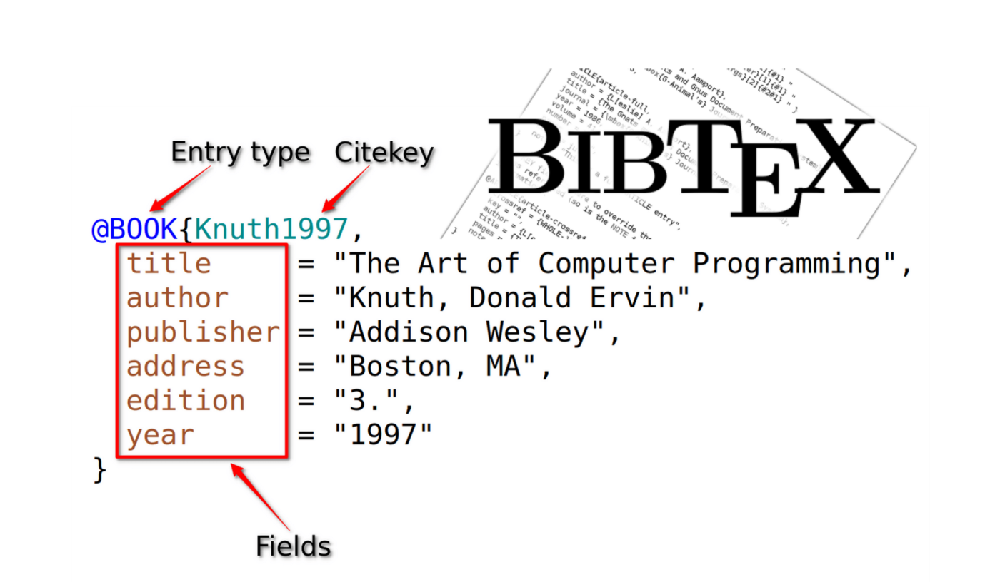
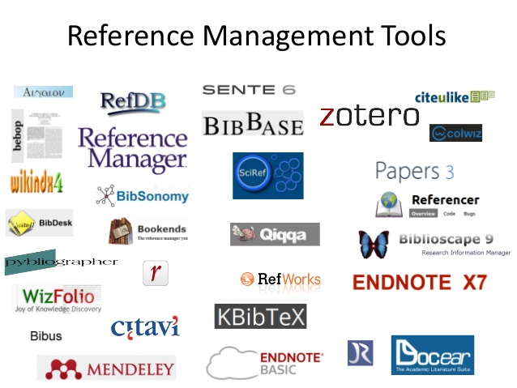
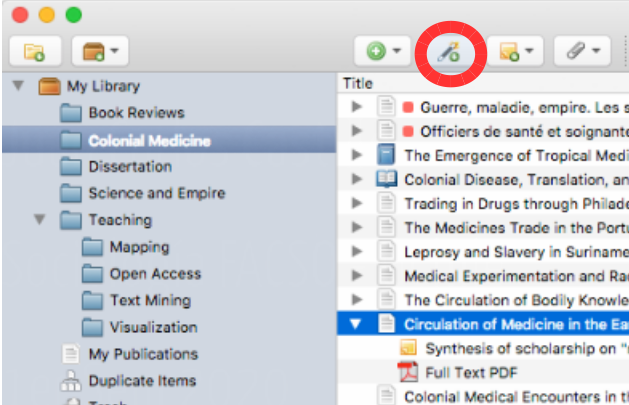
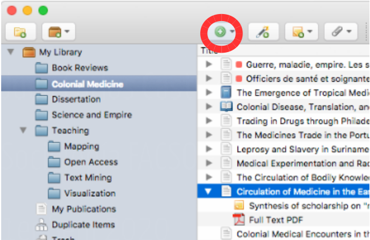
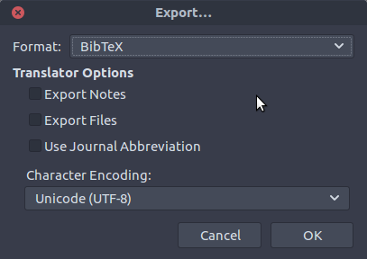
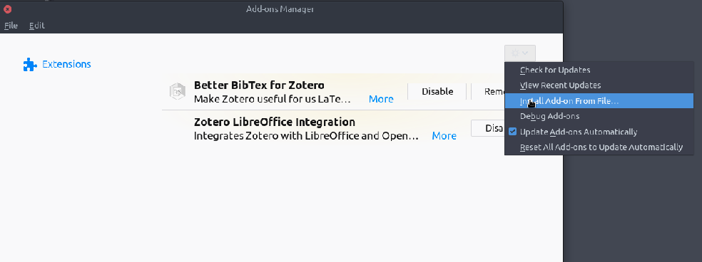
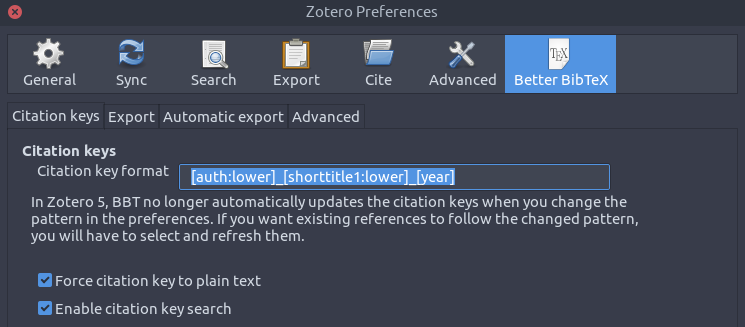
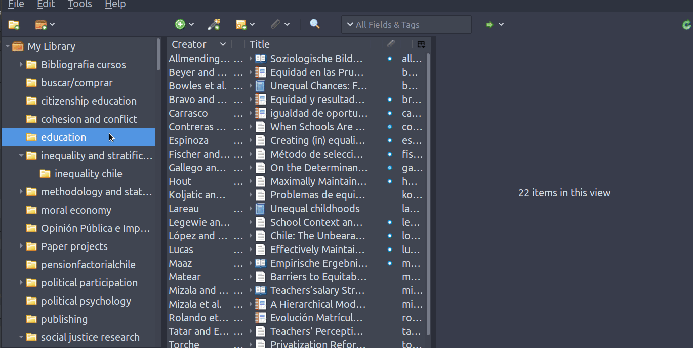
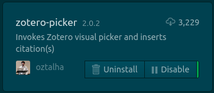

class: front

```{r eval=FALSE, include=FALSE}
# Para que funcione el infinite moon reader:
-  poner root en slides (todos los paths del css hacen referencia a esta estructura)


```

```{r setup, include=FALSE, cache = FALSE}
require("knitr")
options(htmltools.dir.version = FALSE)
pacman::p_load(RefManageR)
# bib <- ReadBib("../../bib/electivomultinivel.bib", check = FALSE)
opts_chunk$set(warning=FALSE,
             message=FALSE,
             echo=TRUE,
             cache = TRUE,fig.width=7, fig.height=5.2)
```

<!---
Para correr en ATOM
- open terminal, abrir R (simplemente, R y enter)
- 

rmarkdown::render('01-textosimple/01_textosimple.Rmd','xaringan::moon_reader')

About macros.js: permite escalar las imágenes como [scale 50%01_](path to image), hay si que grabar ese archivo js en el directorio.
--->


.pull-left[
# Markdown y herramientas de escritura abierta
## [.medium[.black[bit.ly/markdown-herramientas]]](https://bit.ly/markdown-herramientas)
----
## [.white[Juan Carlos Castillo]](https://juancarloscastillo.github.io/jc-castillo/)
## .small[Agosto 2021      ]
]


.pull-right[
.right[
<br>
<br>
<br>
<br>
<br>
<br>

]   
.right[
## .grey[Sesión 3: *Citando en Markdown/Bibtex*]
]]

---

layout: true
class: animated, fadeIn

---
class: inverse, bottom, right


# .green[Contenidos]


## 1. Bibtex / csl
 
## 2. Zotero / BetterBibTex

## 3. Citando en Atom


---
## Citar: Sobre hombros de gigantes
.pull-left[

]

.pull-right[

<br>
- pararse sobre el conocimiento acumulado

- identificar áreas para avanzar

- reconocer trabajo previo

- no reinventar la rueda

]

---
class: inverse middle center

# ¿Cómo trabajar con citas cuando se escribe en texto plano?

---
class: inverse, bottom, right


# .green[Contenidos]


## 1. .yellow[Bibtex / csl]
 
## 2. Zotero / BetterBibTex

## 3. Citando en Atom


---
# Bibtex (.bib)
.pull-left[
<br>
<br>
<br>
]

.pull-right[
- formato de almacenamiento de citas en texto plano (no es un programa)


- Un archivo Bibtex tiene extensión **.bib**, donde deben estar almacenadas todas las referencias citadas en el texto]

---
# Ejemplo referencia en Bibtex 
.center[

]
---
# Archivo Bibtex (.bib)

- un archivo bibtex tiene múltiples referencias una después de la otra, el orden no es relevante.

- cada referencia posee una serie de campos con información necesaria para poder citar

- este formato se puede ingresar manualmente, copiar y pegar de otras fuentes, o automatizar desde software de gestión de referencias (detalles más adelante)

---
# Archivo con definición de estilo (.csl)

- además de las referencias en .bib, necesitamos poder dar el estilo de formato deseado a citas y bibliografía, mediante archivos  **csl** (citation style language) 

- existen múltiples estilos de citación (alrededor de 10.000)

- los más usados: APA, ASA, Chicago

- estos estilos (en archivos csl) se pueden bajar desde repositorios, se recomienda el siguiente: [https://www.zotero.org/styles](https://www.zotero.org/styles)

---
# Claves de citación

La forma de citar es a través de la .green[clave que identifica la referencia], que es la que aparece al principio de cada una, y se agrega una @. Ej:
.small[
```
- Tal como señala [@sabbagh_dimension_2003], los principales resultados ...

```
]

Al renderizar, esto genera:

- **Tal como señala Sabbagh (2003), los principales resultados ...**

Y además, agrega la bibliografía al final del documento.

---
# Opciones de citación

<br>
.medium[
| Se escribe                                         	| Renderiza                     	|
|----------------------------------------------------	|-------------------------------	|
| `Como dice [@sabbagh_dimension_2003]`                	| Como dice Sabbagh (2003)      	|
| `Sabbagh [-@sabbagh_dimension_2003] dice ... `       	| Sabbagh (2020) dice ...       	|
| `Sabbagh [-@sabbagh_dimension_2003, pp.35] dice ...` 	| Sabbagh (2020, p.35) dice ... 	|
]

---
# Utilizando Bibtex en escritura en texto simple

- es claro que tanto la generación manual de registros Bibtex como la  incorporación manual de citas es un gran desincentivo a su uso.

- la simplificación y automatización de esto pasa por dos procesos:

  - Automatizar la generación de un archivo .bib desde un software de gestión de referencias (Zotero - BetterBibTex)
  
  - Automatizar la incorporación de citas al documento (Atom Zotero picker)


---
class: inverse, bottom, right


# .green[Contenidos]


## 1. Bibtex / csl
 
## 2. .yellow[Zotero / BetterBibTex]

## 3. Citando en Atom

  
---
# Software de gestión de referencias

.pull-left-narrow[
<br>

]

.pull-right-wide[
- los software de gestión de referencias bibliográficas permiten almacenar, organizar y luego utilizar las referencias

- diferentes alternativas de software de gestión de referencias bibliográficas: Endnote, Mendeley, Refworks, Zotero

- en adelante vamos a ejemplificar con Zotero, que es un software libre y de código abierto
]
---
## Zotero

.pull-left[
.center[
<br>

]]

.pull-right[
<br>
- instalar  [https://www.zotero.org](zotero.org)

- además del programa, instalar "conector" para el navegador (permite almacenar directamente con 1 click) ]

---
## Zotero: vista general

.center[

]

---
# Zotero: almacenamiento
.pull-left[

a. vía .green[conector] del navegador: cuando hay una referencia presente en la página, ir al botón del conector y se guarda (Zotero debe estar abierto)

.small[
(la referencia se almacena en la carpeta que está activa en Zotero)
]
]


.pull-right[

]
---

.pull-left[
# Zotero: almacenamiento

b)Vía identificador DOI / ISBN / ISSN ]

.pull-right[

<br>
<br>
<br>
]

---
# Zotero: almacenamiento

.pull-left[
c) Manual: llenando los campos
]

.pull-right[

]
---
# Zotero

- más información sobre manejo y capacidades:

[https://www.youtube.com/watch?v=Uxv3aE4XoNY](https://www.youtube.com/watch?v=Uxv3aE4XoNY)

... y tutoriales y guías varios en la red

---
# Zotero-Bibtex

- Zotero permite exportar las referencias en formato Bibtex

- Puede ser toda la colección o una parte (carpeta)

- 2 alternativas: 
  - manual
  - automatizada
  
---
## Zotero-Bibtex: exportación manual
<br>
.pull-left-narrow[

]

.pull-right-wide[
- Carpeta ->  boton derecho -> export -> formato Bibtex

- guardar archivo .bib en carpeta del proyecto
]
---
## Zotero-Better Bibtex: exportación automatizada

<br>

- **BetterBibTex**: Zotero plug-in que permite exportación automática y  sincronizada

- Instalación: 
.medium[
  - bajar archivo desde el sitio del desarrollador: [https://retorque.re/zotero-better-bibtex/installation/](https://retorque.re/zotero-better-bibtex/installation/)

  - en Zotero: Tools -> Adds-on -> ruedita dentada -> install add-on from file
  
  - reiniciar Zotero
  ]
  
---
# Zotero-Better Bibtex


---
# Zotero-Better Bibtex
.center[

]


---
# Zotero-Better Bibtex: Exportando referencias

- puede ser colección completa o carpetas específicas
  
- posicionarse sobre carpeta, botón derecho y `Export collection`
  
      - Formato: Better BibTex
      - Keep updated (sincronización automática)
      - dar ruta hacia carpeta del proyecto
  
- precaución: no caracteres especiales ni espacios en el nombre del archivo .bib


---
# Zotero-Better Bibtex

.center[

]
---
# Zotero-bibtex: consideraciones sobre claves

- multiples formas de organizar las claves Bibtex

- mantener un mismo formato es relevante, sobre todo para trabajo colaborativo

- se generan desde la pestaña Citation Keys de BetterBibTex

- Recomendación: `[auth:lower]_[shorttitle1:lower]_[year]`

---
class: inverse, bottom, right


# .green[Contenidos]


## 1. Bibtex / csl
 
## 2. Zotero / BetterBibTex

## 3. .yellow[Citando en Atom]
---
# Vínculo Markdown-Bibtex en YAML


- se realiza en el **preámbulo** del documento: YAML (Yet Another Markdown Language)

- el YAML es una sección inicial de archivos Markdown donde se especifican distintas opciones del documento, principalmente de formato

- se define como un bloque de texto que va separado por `---`

```
    ---
    bibliography: referencias.bib
    csl: apa.csl
    ---

    Y aquí comienza el documento ...

```


---
# Citando en Atom/Markdown vía  Zotero picker

.pull-left[
<br>

]


.pull-right[
- instalar librería

- se activa luego con **alt+z**, o con el buscador de comandos (ctrl+shift+P)

- se abre la ventana de búsqueda de citas 

- Zotero debe estar abierto


]
---
class: inverse middle center

# .green[Proxima sesión:] 

# .extralarge[.yellow[Versionamiento con Git/Github]]

---
class: front
.pull-left[
# Markdown y herramientas de escritura abierta
## [.medium[.black[bit.ly/markdown-herramientas]]](https://bit.ly/markdown-herramientas)
----
## [.white[Juan Carlos Castillo]](https://juancarloscastillo.github.io/jc-castillo/)
## .small[Agosto 2021]
]


.pull-right[
.right[
<br>
<br>
<br>
<br>
<br>
<br>

]
]