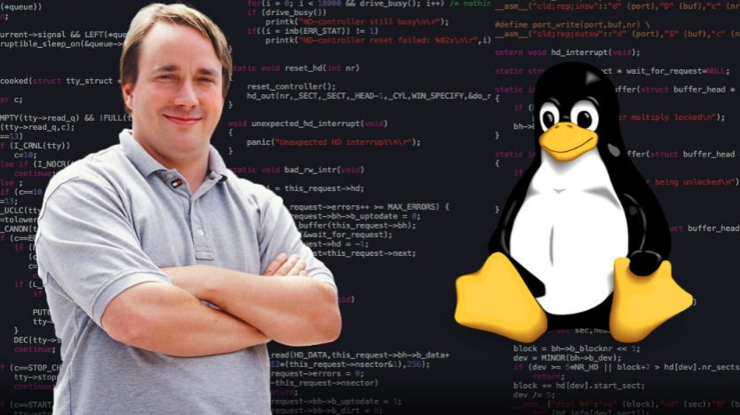
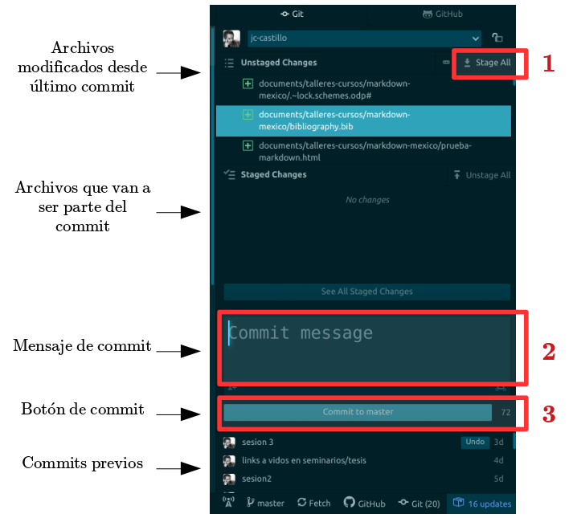

class: front

```{r eval=FALSE, include=FALSE}
# Para que funcione el infinite moon reader:
-  poner root en slides (todos los paths del css hacen referencia a esta estructura)


```

```{r setup, include=FALSE, cache = FALSE}
require("knitr")
options(htmltools.dir.version = FALSE)
pacman::p_load(RefManageR)
# bib <- ReadBib("../../bib/electivomultinivel.bib", check = FALSE)
opts_chunk$set(warning=FALSE,
             message=FALSE,
             echo=TRUE,
             cache = TRUE,fig.width=7, fig.height=5.2)
```

<!---
Para correr en ATOM
- open terminal, abrir R (simplemente, R y enter)
- 

rmarkdown::render('01-textosimple/01_textosimple.Rmd','xaringan::moon_reader')

About macros.js: permite escalar las imágenes como [scale 50%01_](path to image), hay si que grabar ese archivo js en el directorio.
--->


.pull-left[
# Markdown y herramientas de escritura abierta
## [.medium[.black[bit.ly/markdown-herramientas]]](https://bit.ly/markdown-herramientas)
----
## [.black[Juan Carlos Castillo]](https://juancarloscastillo.github.io/jc-castillo/)
## .small[Agosto 2021      ]
]


.pull-right[
.right[
<br>
<br>
<br>
<br>
<br>
<br>

]   
.right[
## .grey[Sesión 4: *Control de versiones y colaboración con Git & Github*]
]]

---

layout: true
class: animated, fadeIn

---
class: inverse, bottom, right


# .green[Contenidos]


## 1. Versionamiento y Git
 
## 2. Git en Atom

## 3. Github y link con Atom

---
class: inverse

.pull-left[
.center[

]
]

.pull-right[
<br>
<br>
<br>
# ¿Cómo registrar de manera eficiente quién hizo qué y cuando en un archivo/documento?
]

---
class: inverse  middle center

# .green[La escritura en texto simple (como Markdown) permite implementar un sistema de control de versiones, además de herramientas de respaldo, colaboración y comunicación]

--

# El sistema de .yellow[control de versiones] proviene del mundo del desarrollo de software

---
class: inverse, bottom, right


# .green[Contenidos]


## 1. .yellow[Versionamiento y Git]
 
## 2. Git en Atom

## 3. Github y link con Atom


---
## El origen: Abriendo un sistema operativo

.pull-left[
<br>

]


.pull-right[
- Linus Torvalds, 1991 (21 años)

- Crea sistema operativo libre (**Linux**) y lo abre a la colaboración. Postea:

  - "I'm doing a (free) operating system (just a hobby, won't be big and professional..."

]
---
## Desarrollo del Linux Kernel


.pull-left[
<br>
<br>

]

.pull-right[
<br>

- version 1: 1994

- version 5: 2019

- Más de 11 mil colaboradores

- mas de 30 millones de líneas de código

- **¿versionamiento?**

]

---
#... más sobre Linux, Torvalds y código abierto 


Linus Torvalds TED Talk 

[https://www.youtube.com/watch?v=o8NPllzkFhE&t=156s](https://www.youtube.com/watch?v=o8NPllzkFhE&t=156s)

---
# Git

.pull-left-narrow[

]

.pull-right-wide[
- Torvalds crea **Git** en 2005 para poder llevar registro y administrar las distintas versiones de Linux

- Git quiere decir *incompetente* / *desagradable*.

- "I'm an egotistical bastard, and I name all my projects after myself. First 'Linux', now 'git'." (Torvalds, 2012)

]


???

Torvalds sarcastically quipped about the name git (which means unpleasant person in British English slang): "I'm an egotistical bastard, and I name all my projects after myself. First 'Linux', now 'git'."[24][25] The man page describes Git as "the stupid content tracker".[26] The read-me file of the source code elaborates further:[27]

The name "git" was given by Linus Torvalds when he wrote the very first version. He described the tool as "the stupid content tracker" and the name as (depending on your way):

random three-letter combination that is pronounceable, and not actually used by any common UNIX command. The fact that it is a mispronunciation of "get" may or may not be relevant.
stupid. contemptible and despicable. simple. Take your pick from the dictionary of slang.
"global information tracker": you're in a good mood, and it actually works for you. Angels sing, and a light suddenly fills the room.
"goddamn idiotic truckload of sh*t": when it breaks

---
# Git: un software de control de versiones

- es una especie de memoria o registro local que guarda información sobre:

  - quién hizo un cambio
  - cuándo lo hizo
  - qué hizo

--

- mantiene la información de todos los cambios en la historia de la carpeta / repositorio local

--

- se puede sincronizar con repositorio remoto (ej. Github)

---
# Git / Github

- actualmente, Git / Github posee más de 100 millones de repositorios

- mayor fuente de código en el mundo

- ha transitado desde el mundo de desarrollo de software hacia distintos ámbitos de trabajo colaborativo y abierto

- entorno de trabajo que favorece la ciencia abierta


---
class: white

.pull-left-narrow[
#.green[ Dos lógicas de versionamiento]

.black[1.Deltas]

<br>
<br>


.black[2.Imágenes (snapshots)]

**-> Git**
]


.pull-right-wide[


]

---
class: inverse middle right center

# .green[Git no es un registro de versiones de archivos específicos, sino de una .yellow[carpeta completa]]

<br>

# Guarda .yellow["fotos"] de momentos específicos de la carpeta, y esta foto se *saca* mediante un .yellow[commit]

---
class: white

.center[

]

---
# Commits

- El **commit** es el procedimiento fundamental del control de versiones

- Git no registra cualquier cambio que se "guarda", sino los que se "comprometen" (commit).

--

- En un **commit**
  - se seleccionan los archivos cuyo cambio se desea registrar (*stage*)
  - se registra lo que se está comprometiendo en el cambio (mensaje de commit)

---
# ¿Cuándo hacer un commit?

- según conveniencia

- sugerencias:

  - que sea un momento que requiera registro (momento de foto)
  
  - no para cambios menores
  
  - no esperar muchos cambios distintos que puedan hacer perder el sentido del commit

---
# Pasos básicos versionamiento Git local

- inicializar la carpeta como repositorio git (solo la primera vez)

- agregar (add) los cambios que se quieran comprometer al escenario de compromiso (stage)

- mensaje de commit

- commit

---
# Uso

- tradicionalmente, el uso de git se realiza con comandos desde el **terminal** (git bash)

- actualmente, existen una serie de programas locales que facilitan el uso de Git, tanto específicos como también editores genéricos

- en este curso, vamos a utilizar las utilidades Git / Github que se ofrecen en el contexto de **Atom**, editor altamente compatible con Git/Github

.center[

]

---
class: inverse, bottom, right


# .green[Contenidos]


## 1. Versionamiento y Git
 
## 2. .yellow[Git en Atom]

## 3. Github y link con Atom

---
# Librerías


- Atom viene con la [librería **Github**](https://github.atom.io/) preinstalada

- Esta librería permite una serie de funciones, tales como:
  - inicializar repositorio
  - registrar commits
  - conexión con repositorio remoto mediante push/pull
  
---
# Inicializando un repositorio local

- en caso de querer versionar un repositorio de manera local, la carpeta de trabajo/proyecto debe ser inicializada

- el comando en este caso es `git init`, se activa en Atom desde el buscador de comandos (ctrl+shift+P) Github Initialize

- se da la ruta a la carpeta que se desea inicializar

- con esto se crea una carpeta oculta .git que contiene toda la información del versionamiento - .red[no modificar]

---
# Trabajando con Git en Atom

- al abrir una carpeta conversionamiento Git, se activa automáticamente el panel de la derecha

  - **Unstaged changes**: archivos con cambios desde el último commit
  
  - **Staged changes**: archivos con cambios que van a pasar por el commit (por lo general, todos)
  
  - **Commit message**: mensage de commit (breve e informativo)
  
  - **Botón  de commit** ("Commit to master")

---
class: white center




---
# Comparando versiones

- distintas opciones alrededor del concepto de **diff**

- si se presiona algún commit previo, se abren los archivos destacando los cambios, pero no es muy fácil de visualizar

- recomendación: **Git Time Machine**, de librería Git Plus

  - genera panel inferior con línea de tiempo, que al ir navegando muestra las diferencias con previos commits

---
class: inverse, bottom, right


# .green[Contenidos]


## 1. Versionamiento y Git
 
## 2. Git en Atom

## 3. .yellow[Github y link con Atom]


---
# Github

- Plataforma de repositorios versionables y vinculados a repositorios locales

- Además del versionamiento permite:

  - respaldo web
  - apertura
  - trabajo colaborativo compartiendo el repositorio 
  - copiar otros repositorios (clonar) y modificarlos
  - sugerir cambios a otros repositorios (mediante fork)
  - publicación web en Github Pages

---
# Github - pasos iniciales

- Crear cuenta en [github.com](https://github.com/)

- Generar nuevo repositorio vacío (Repositories -> new)

- Clonarlo a local


---
# Clonar repo

.pull-left[

]

.pull-right[
- copiar dirección

- en **Atom**: Git clone
  - pegar dirección
  - dar ruta a carpeta vacía

]


---
# Flujo github: pull & push
.center[

]


---
# Flujo Github en Atom

- Desde footer: 

  - **Fetch**: comprueba si hay cambios en repositorio (por ejemplo, de algún colaborador)
  
  - Si hay cambios, se activa la opción **Pull** - ejecutar
  
  - Para subir un commit local, opción **Push**
  
- La primera vez que se utiliza se va a requerir ingresar usuario y clave 


---
# Otras funcionalidades

- agregar colaboradores: settings > manage access

- branches

- pull requests


---
class: inverse middle center

# .green[Proxima sesión:] 

# .extralarge[.yellow[Publicación Web]]

---
class: front
.pull-left[
# Markdown y herramientas de escritura abierta
## [.medium[.black[bit.ly/markdown-herramientas]]](https://bit.ly/markdown-herramientas)
----
## [.black[Juan Carlos Castillo]](https://juancarloscastillo.github.io/jc-castillo/)
## .small[Agosto 2021]
]


.pull-right[
.right[
<br>
<br>
<br>
<br>
<br>
<br>

]
]