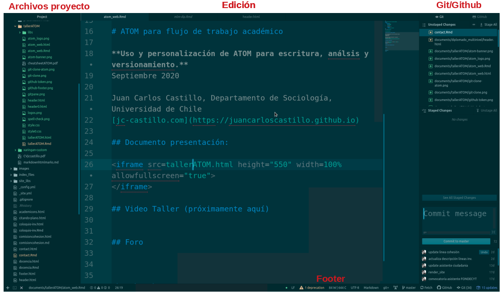
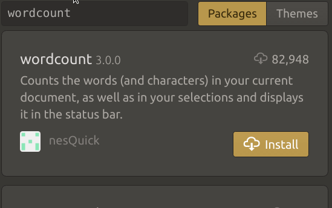
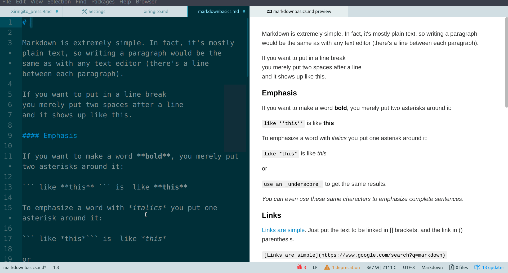
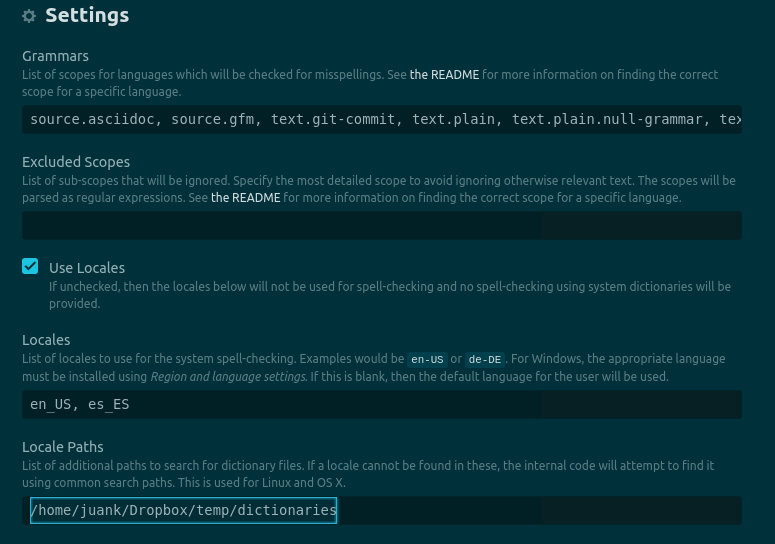
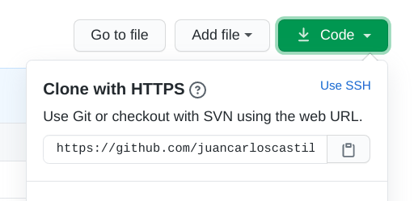
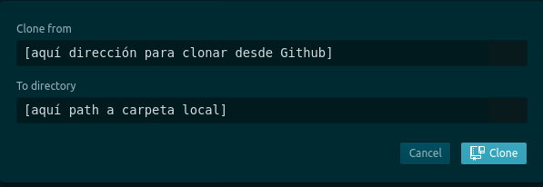
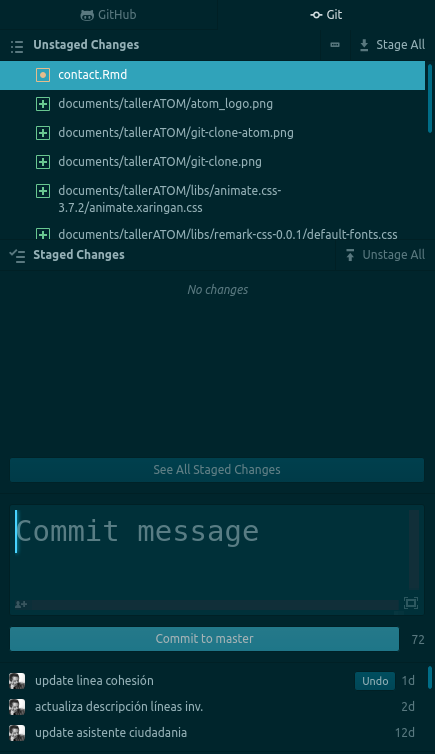
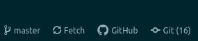
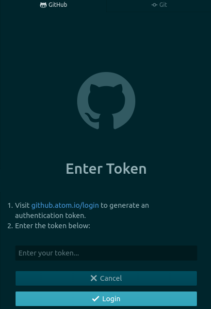

class: inverse, right, bottom

```{r xaringanExtra, echo=FALSE}
xaringanExtra::use_xaringan_extra(c("tile_view", "animate_css", "tachyons"))
```

```{r xaringanExtra-share-again, echo=FALSE}
xaringanExtra::use_share_again()
```

.pull-left[

]
 
.pull-right[
.right[
# Taller introducción a **ATOM**  

<hr>
<br>


Juan Carlos Castillo 
 
Septiembre 2020]
]
---
class: inverse, animated, slideInRight

.right[
# **Contenidos**
]

1- Introducción, instalación y entorno
 
2- Edición general
  - Básicos
  - Adicionales

3- R

4- Git/Github
 

---
class: inverse

.right[
# **Contenidos**
]

**1- Introducción, instalación y entorno**
 
2- Edición general
  - Básicos
  - Adicionales

3- R

4- Git/Github
 

---
# ¿Por qué usar editores? 

- **eficiencia**:

  - mismo entorno para escritura y análisis (código)
  - herramientas de apoyo a la escritura (formato, corrección ortografía)
  - plataforma común desde la cual ejecutar programas y vincularse a otros programas y servicios (eficiencia)

--

- **ética**: propicio en un contexto de apertura y de propiedad de los contenidos (texto plano)

--

- **estética**: altamente personalizable

---
# Editores / IDEs: Alternativas

- Emacs

- Vim

- Sublime

- RStudio (?)

- ATOM

---
# ATOM: características

- open source

- personalizable

- amable

- muy buena integración Git/Github
.center[

]

---
# Instalación

.center[
# [https://atom.io/](https://atom.io/)
]
---
# Entorno general (1)

- menues superiores

- paneles: archivos (izquierda) y git (derecha)

- pestañas de trabajo / división de pantalla

- footer

---



---
# Entorno general (2)

- settings (Edit>Preferences, o ctrl+,)

  - Core: básicos
  
  - Editor: tipo letra, distancia entre líneas, etc. 
  
  - Keybindings: atajos de teclado
  
  - Packages: librerías instaladas
  
  - Themes
  
  - Install: agregar librerías


---
# Instalar librerías



---
class: roja, center, middle

## Atajo más importante: buscador de comandos

.center[
# ctrl + shift + P
]
---
class: inverse, animated, slideInRight

.right[
# **Contenidos**
]

1- Introducción, instalación y entorno
 
**2- Edición general**
  - Básicos
  - Adicionales

3- R

4- Git/Github
 
---
# Grammars

- adaptación del editor al lenguaje del documento

- detección aparece en footer, ahí es posible cambiarla

- opciones pre-instaladas se activan según extensión de archivo (ej:md)

- grammars adicionales se instalan vía librerías adicionales

---
# Grammars

Para adicionales, instalar librerías:

- markdown/Rmarkdown: `language-markdown`

- R: `atom-language-r`

- Latex: `language-latex`

---
# Markdown

- `markdown preview enhanced`:

  - lado-a-lado scroll simultaneo

  - renderización de citas Bibtex

  - conversión / impresión pdfs


---
### Markdown preview enhanced



---
# Spell check

- librería `spell check`

- funciona vía diccionarios instalados en el sistema vía Hunspell ...

- o más directo: obtener archivos de diccionario y dar la ruta en el computador local

---
# Spell check
.pull-left[


- agregar grammar
  - para detectar el nombre oficial del grammar: buscador -> log cursor scope
  
- para bajar diccionarios inglés y español click [aquí](https://www.dropbox.com/sh/ibodcppzcpgwv0y/AAA8F89seryA6CKsfnwRN2XEa?dl=0).
]

.pull-right[
- luego en las opciones de la librería:


]
---
# Code Snippets

- permiten automatizar bloques de código recurrentes

- para acceder: buscador de comandos > snippets

- se agregan al final del archivo de snippets

---
# Code Snippets: ejemplo chunk R

```
'.text.md,.source.gfm.rmd':
    'chunk':
      'prefix': 'chu'
      'body':"""

```

````
```{r}`r ''`

```
````

  """

Luego, al escribir "chu" en el editor, se activa la opción

---
# Varios escritura
 
- ctrl+j: elimina saltos de línea en un bloque (útil al copiar bloques desde pdf)

- cambio de lineas (shift+flecha)

- cursor multiple (ctrl + mouse o alt+shift)

- activar cursor multiple en resultados de búsqueda (Find All, luego shift+Enter)

- ctrl+d selecciona palabra destacada y genera cursor múltiple


---
# Convertidor

- `pandoc-convert`

- activar con buscador general (ctrl+shift+p)

---
# Zotero

- librería  `zotero picker`

- análogo al add-on word / libreoffice

- (zotero debe estar abierto)

---
# Edición: Secundarios

.pull-left[
- theme switcher

- glowing-cursor

- zen

- minimap]

.pull-right[
- wordcount

- browser-plus

- pdf-view

- terminal (platformio-ide-terminal)
]

---
class: inverse, animated, slideInRight

.right[
# **Contenidos**
]

1- Introducción, instalación y entorno
 
2- Edición general
  - Básicos
  - Adicionales

**3- R**

4- Git/Github
 

---
## R vía Hydrogen / Jupyter Notebook
.center[

]

---
# R vía Hydrogen

1-  Instalar Anaconda Python: 
- [https://www.anaconda.com/download ](https://www.anaconda.com/download ) 
  
2 - Activar R kernel desde R:

.medium[
```{r eval=FALSE}
install.packages('IRkernel')
IRkernel::installspec()
IRkernel::installspec(name = 'ir40', displayname = 'R 4.0')
```
]

3 - Instalar librería `Hydrogen` en Atom (y `language-r`) 


---
# R vía Hydrogen

- en Atom, correr línea de código R con ctrl + enter 

- al principio de cada sesión pide seleccionar el kernel (en este caso, R 4.0)

- los resultados aparecen en formato _notebook_, opción también de resultados en pestaña a la derecha (hydrogen toggle output area, desde buscador de comandos)


---
class: inverse, animated, slideInRight

.right[
# **Contenidos**
]

1- Introducción, instalación y entorno
 
2- Edición general
  - Básicos
  - Adicionales

3- R

**4- Git/Github**

---
# Git/github: preparación

- repositorio ejemplo Github: [https://github.com/juancarloscastillo/ejemploclasegithub](https://github.com/juancarloscastillo/ejemploclasegithub)

.pull-left[
- _forkear_ e ir al repositorio propio

- copiar dirección para clonar:]

.pull-right[

]

---
# Git/Github en Atom

- clonar (ctrl+shift+P) : git clone 
.center[
]

---
.pull-left[
# Git en Atom

- al estar en una carpeta versionada con git, se activa el panel git/github de la derecha

- arriba aparecen todos los archivos que han sido cambiados (Unstaged)

- el commit se realiza con los archivos que pasan a Staged Changes
]


.pull-right-narrow[

] 

---
.pull-left[
# Github en Atom

- pestaña Github

- solicita token primera vez

- luego se puede hacer fetch / pull / push desde el footer

.center[

]

]

.pull-right-narrow[


]


---
class: inverse, right, bottom

.pull-left[

]
 
.pull-right[
.right[
# Taller introducción a **ATOM**  

<hr>
<br>


Juan Carlos Castillo 
 
Septiembre 2020]

]
.tiny[Presentación generada con [**Xaringan**](https://github.com/yihui/xaringan) y [**Xaringan-Extra**](https://github.com/gadenbuie/xaringanExtra)]

