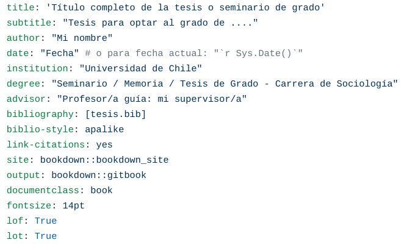

class: front right hide-logo

background-image: url(background.png)
background-size: cover

<br>
<br>
<br>
<br>
<br>

<br>
<br>

.white[Juan Carlos Castillo]

[.black[jc-castillo.com]](https://juancarloscastillo.github.io/jc-castillo/)

.small[Marzo 2021]

???

```{r xaringanExtra, echo=FALSE}

xaringanExtra::use_xaringan_extra(c("tile_view", "animate_css"))
xaringanExtra::use_animate_all("fade")
xaringanExtra::use_share_again()
xaringanExtra::use_scribble()
xaringanExtra::style_share_again(
  share_buttons = c("none")
)

```

---
class: roja middle bottom hide-logo

# 1. Contexto

---
class: middle center


<br>
<br>
# ¿Qué es?

Una plantilla (template) para realizar trabajos finales de investigación/tesis que permite obtener documentos con edición de alta calidad en distintos formatos.

Utiliza `bookdown` (R)

---
# Propósito

- foco en **contenido** por sobre el formato

- facilita
  - edición de secciones, subsecciones
  - referenciación interna (figuras, tablas, bibliografía)
  - generación de documentos publicables (pdf & html)
  - incorporación de resultados de manera reproducible (R)
  
- requiere: escritura en texto plano (markdown), flexibilidad...

---

.pull-left-narrow[
<br>
<br>


]

.pull-right-wide[
<br>
<br>
- librería `R`

- permite generar documentos en html y pdf

- documentos con estructura de capítulos

- base (R)markdown

]

---
# Componentes carpeta bookdown

.medium[

- .blue[`index.Rmd`]: contiene información personalizada del documento (como título, autor, etc.)

- .blue[archivos .yml]: contienen información para generar los documentos pdf y html (no modificar)

- .blue[archivo .Rproj]: permite acceder a RStudio desde la carpeta y activar las funciones necesarias para generar el documento formateado

- .blue[carpetas] con información de formato específico (como templates) y otras (imágenes, etc.)]

---
# Funcionamiento basico .blue[bookdown]

- en general se parte con una .red[plantilla] (template), que es una carpeta con un conjunto de archivos

- luego se reemplaza la información de identificación y el contenido de las secciones en capítulos

- por ejemplo, en el libro/manual de [`bookdown`](https://bookdown.org/yihui/bookdown/) se puede bajar una plantilla simple ([bookdown-demo](https://github.com/rstudio/bookdown-demo) ) y reemplazar ahí por los contenidos propios.


---

# Funcionamiento basico .blue[bookdown] (2)

- escribir (en Markdown) en capítulos ordenados por número, ej:01-intro.Rmd

- para ver el resultado, compilar/renderizar con boton Build Book

.center[

]

- en visor de R aparece en html, y con el ícono pdf en barra superior del html se visualiza el pdf

---
class: roja middle right hide-logo

# 2. Plantilla tesisfacsodown


### [.yellow[juancarloscastillo.github.io/tesisfacsodown/]](https://juancarloscastillo.github.io/jc-castillo/)

---
# Tesisfacsodown

- adaptación de bookdown a formato de trabajo final incluyendo 

  - logo Facso en portada
  - campos específicos (como Profesor Guía)
  - agradecimientos
  - generación de índice general, tablas y figuras

- basado en el proyecto [thesisdown](https://github.com/ismayc/thesisdown)

.small[(esta adaptación se produce mediante la edición de plantillas pandoc-latex y css-html)]

---

.center[

]


---
# 1. Obtener carpeta 
- desde sitio en Github:  [https://github.com/juancarloscastillo/tesisfacsodown](https://github.com/juancarloscastillo/tesisfacsodown)
  
- dos formas:
.medium[

- code > download zip (no requiere cuenta Github)
  
- usar plantilla, botón  (requiere cuenta Github)
chi
    - la opción _template_, este repositorio a la cuentay  propia de Github, permitiendo después clonar, versionar y publicar web  
]
---
# 2. Editar index.Rmd



---
# 3. Generar / editar capítulos

- indicar orden antecediendo número en nombre de archivo (ej: 01-intro.Rmd)

- dentro del archivo comenzar siempre con un título (#), que sirve para identificar en menú html y también en título del pdf

Finalmente, renderizar el libro con Build Book y ver los cambios

---
# Temas adicionales

- referenciación figuras/tablas

- publicación web

- bibliografía

Más información en [tesisfacsodown](https://juancarloscastillo.github.io/tesisfacsodown/)

---
class: front right hide-logo

background-image: url(background.png)
background-size: cover

<br>
<br>
<br>
<br>
<br>

<br>
<br>

.white[Juan Carlos Castillo]

[.purple[jc-castillo.com]](https://juancarloscastillo.github.io/jc-castillo/)

.small[Marzo 2021]

