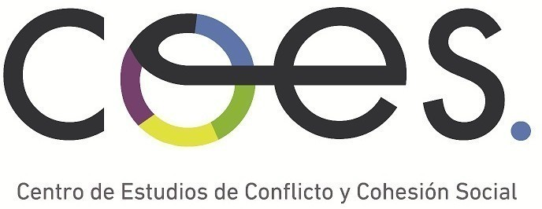

 
 

### PhD Sociology, Humboldt University - Berlin  
### Professor at [Institute of Sociology](http://www.sociologia.uc.cl), Pontificia Universidad Católica de Chile  
### Deputy director [Centre for Social Conflict and Cohesion Studies](http://www.coes.cl)

 
 
 
 
... and proud moderator of  

 
 

---

### _Latest papers & projects_

<input id="collapsible0" class="toggle" type="checkbox"><label for="collapsible0" class="lbl-toggle">
**Desigualdad Económica, Percepción de Meritocracia y Preferencias Redistributivas** (Congreso Chileno de Sociología - Diciembre 2018) [(*link to presentation*)](https://juancarloscastillo.github.io/jc-castillo/documents/presentacion-final/present-panel-alas2018.html#1)

</label>

(a completar)

<input id="collapsible0" class="toggle" type="checkbox"><label for="collapsible0" class="lbl-toggle">
**Meritocracia y redistribución en una sociedad desigual** (Conferencia COES - Noviembre 2018) [(*link to presentation*)](https://juancarloscastillo.github.io/jc-castillo/documents/coes2018/castillo2018meritocracyCOES.html#1)
</label>

Esta presentación desarrolla un marco conceptual y operacional para el estudio de la meritocracia y preferencias redistributivas, y luego analiza estas relaciones con datos de la encuesta comparativa internacional ISSP así como también de un estudio realizado en Colombia

<input id="collapsible1" class="toggle" type="checkbox"><label for="collapsible1" class="lbl-toggle">
**Open academic writing: An Atom-based workflow for social scientists** (SocArxiv 2018 Conference - Maryland)[(*link to presentation*)](https://juancarloscastillo.github.io/jc-castillo/documents/atomworkflow/Xiringito_press.html#1)
</label>

The notion of open science is quickly expanding in terms of access, reproducibility and replication initiatives worldwide. Nevertheless, so far the implications of openness are less discussed regarding a basic academic process: writing. In this presentation I introduce the advantages of academic writing in plain text editors in terms of replication and version control, as suggested by Healey (2018) in "The plain person's guide to plain text social science". Nevertheless, departing from Healey's suggestion of a writing workflow based on the editor Emacs, I propose an alternative workflow using the text editor Atom (also free and open source). Some of the Atom's advantages to be presented are citing directly from Zotero/Bibtex, integration of \LaTeX \, Markdown and R languages, and easy formatting from plain text to pdf, html and/or word via Pandoc.

<input id="collapsible3" class="toggle" type="checkbox"><label for="collapsible3" class="lbl-toggle">
**Meritocracy and economic inequality: Perceptions, preferences and implications** <i class="ai ai-open-access fa-lg" style="font-size:20px"></i>
<a href="https://www.researchgate.net/publication/325225032_Meritocracia_y_desigualdad_economica_Percepciones_preferencias_e_implicancias_Meritocracy_and_Economic_inequality_Perceptions_preferences_and_implications"> <i class="ai ai-researchgate fa-lg" style="font-size:20px;color:green"></i></a>
<a href="https://osf.io/preprints/socarxiv/qkpu4/">
<i class="ai ai-osf fa-lg" style="font-size:20px;color:blue"></i></a>.
</label>

*Castillo, JC. & Torres, A. , Atria, J & Maldonado, L. (2018) Forthcoming in Revista Internacional de Sociología (ISI).*

The idea of meritocracy is related to the distribution of goods and rewards based on individual talent and effort, being a principle that legitimizes the unequal distribution of resources in modern societies. Despite the constant references to meritocracy in inequality and stratification research, there are still few conceptual and empirical attempts to understand to what extent individuals perceive and prefer meritocracy, as well as their consequences. The present research proposes a conceptual and empirical framework for  studying meritocratic perceptions and preferences, which is then related with economic inequality variables. Using data from the Chilean survey “Social justice and citizenship participation”, the analyses suggest that meritocratic perceptions and preferences are different constructs and that those perceiving an adequate functioning of meritocracy also perceive less economic inequality.

---

(see more in [Research](research.html))
